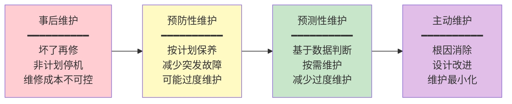
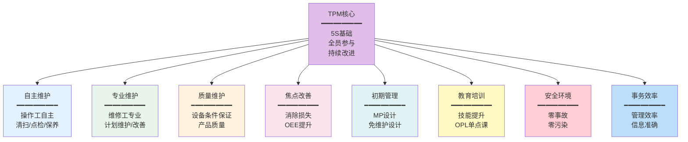
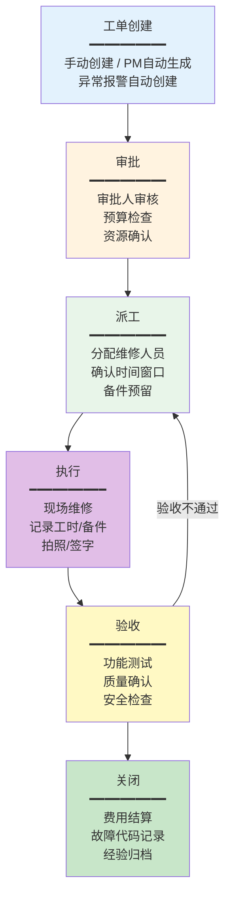
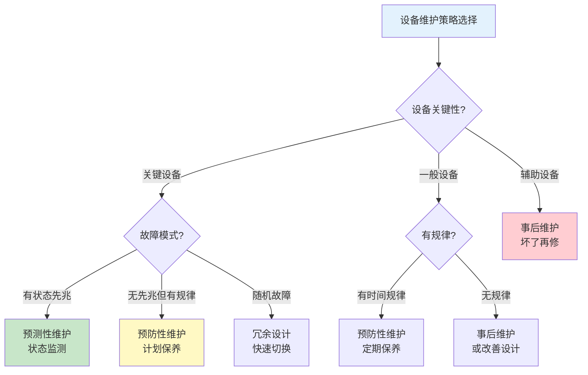

# 预防性维护与TPM

## 维护策略演进

设备维护策略经历了从被动响应到主动优化的四个阶段演进：

| 维护策略 | 英文 | 核心思想 | 适用设备 | 成本特征 |
|---------|------|---------|---------|---------|
| 事后维护 | Corrective/Reactive | 坏了再修 | 非关键、低价值设备 | 维修成本高、停机损失大 |
| 预防性维护 | Preventive (PM) | 按计划周期维护 | 有磨损规律的设备 | 维护成本中等、可能过度维护 |
| 预测性维护 | Predictive (PdM) | 根据状态数据按需维护 | 关键、高价值设备 | 监测成本高、维护精准 |
| 主动维护 | Proactive | 消除故障根因 | 所有设备的持续改进 | 初期投入高、长期收益大 |

### 维护策略选择原则

不同设备应采用不同的维护策略，关键考量因素包括：

| 考量因素 | 倾向事后维护 | 倾向预防性维护 | 倾向预测性维护 |
|---------|------------|-------------|-------------|
| 设备关键性 | 低 | 中 | 高 |
| 故障影响范围 | 小 | 中 | 大 |
| 故障模式 | 随机 | 有时间规律 | 有状态先兆 |
| 设备价值 | 低 | 中 | 高 |
| 维护成本占比 | 低 | 中 | 高（监测投入） |

## PM预防性维护

### 时间触发维护

时间触发是最常用的PM方式，按固定时间间隔执行维护：

| 触发频次 | 适用场景 | 示例 |
|---------|---------|------|
| 每日 | 关键设备日常点检 | 液压油位检查、安全装置检查 |
| 每周 | 常规保养 | 润滑脂加注、滤网清洗 |
| 每月 | 定期检查 | 皮带张紧度检查、电气接线检查 |
| 每季 | 中度保养 | 液压油采样分析、减速箱油更换 |
| 每半年 | 大型保养 | 电机绝缘测试、液压系统全面检查 |
| 每年 | 大修 | 设备全面检修、精度校准 |

### 条件触发维护

条件触发是基于设备运行数据或状态指标触发的维护：

| 触发条件 | 监控指标 | 触发阈值 | 示例 |
|---------|---------|---------|------|
| 运行小时数 | 累计运行小时 | 达到设定值 | 压缩机运行4000小时后更换润滑油 |
| 动作次数 | 累计开关/冲压次数 | 达到设定值 | 冲压机10万次后更换模具 |
| 产量 | 累计生产数量 | 达到设定值 | 包装机生产50万件后更换切刀 |
| 振动值 | 振动幅值 | 超过阈值 | 风机振动超过4.5mm/s时检修 |
| 温度值 | 轴承/绕组温度 | 超过阈值 | 电机轴承温度超过80°C时检查 |

### PM计划编制

PM计划的编制需要考虑设备关键性、法规要求和历史故障数据：

| 步骤 | 活动 | 输出 |
|------|------|------|
| 1. 设备分类 | 按关键性分级（A/B/C） | 设备分类清单 |
| 2. 故障模式分析 | 识别主要故障模式及规律 | FMEA/故障模式清单 |
| 3. 维护策略选择 | 为每种故障模式选择维护策略 | 维护策略矩阵 |
| 4. 维护内容定义 | 确定每项PM的具体工作内容 | PM作业指导书 |
| 5. 频次确定 | 确定PM执行的频次和触发条件 | PM计划表 |
| 6. 资源配置 | 确定所需人员、备件、工具 | 资源需求清单 |
| 7. 排程优化 | 平衡维护负荷与生产计划 | 维护日历 |

## TPM全员生产维护

TPM（Total Productive Maintenance）是日本设备维护协会（JIPM）提出的设备管理哲学，核心思想是"全员参与的生产维护"，通过操作工与维修工的协作，最大化设备综合效率。

### TPM八大支柱

| 支柱 | 目标 | 关键活动 |
|------|------|---------|
| 自主维护 | 操作工掌握设备基本维护能力 | 清扫→清洁→点检→润滑→保养 |
| 专业维护 | 维修工实施专业计划维护 | PM计划执行、预测性维护、故障分析 |
| 质量维护 | 通过设备条件保证产品质量 | 质量缺陷与设备条件的关联分析 |
| 焦点改善 | 系统性消除设备损失 | OEE分析、瓶颈改善、MTBF提升 |
| 初期管理 | 新设备免维护设计 | MP信息反馈、初期流动管理 |
| 教育培训 | 提升全员设备管理技能 | 技能矩阵、OPL单点课、资格认证 |
| 安全环境 | 零事故零污染 | 危险预知、安全标准化、环境管理 |
| 事务效率 | 提升管理效率 | 数据准确、流程优化、信息化 |

### 自主维护7步骤

自主维护是TPM最核心的支柱，操作工从"我只管操作"转变为"我的设备我来护"：

| 步骤 | 名称 | 核心活动 | 目标 |
|------|------|---------|------|
| 步骤1 | 初期清扫 | 全面清扫设备，发现异常 | 发现隐藏缺陷 |
| 步骤2 | 污染源/困难部位对策 | 消除污染源，改善困难部位 | 防止再污染 |
| 步骤3 | 清扫/点检基准制定 | 制定自主维护的标准和基准 | 标准化 |
| 步骤4 | 总点检 | 按标准执行全面点检训练 | 提升点检能力 |
| 步骤5 | 自主点检 | 操作工独立执行日常点检 | 自主管理 |
| 步骤6 | 标准化 | 整理点检/润滑/保养标准化 | 体系化 |
| 步骤7 | 自主管理 | 持续改善，PDCA循环 | 持续改进 |

## 维护计划编制

### 年度维护计划

年度维护计划是企业设备维护工作的纲领性文件：

| 计划内容 | 说明 | 编制依据 |
|---------|------|---------|
| 大修计划 | 年度设备大修安排 | 设备运行年限、精度衰减、故障历史 |
| 中修计划 | 年度设备中修安排 | 维护周期、上次维修时间 |
| 定期检验 | 特种设备法定检验 | 法规要求、检验到期日 |
| PM计划 | 预防性维护任务汇总 | 设备PM计划表 |
| 改善项目 | 设备改善和技改项目 | OEE分析、故障趋势、工艺需求 |

### 月度维护计划

月度维护计划是年度计划的细化执行：

1. 从年度计划中提取当月维护任务
2. 结合生产排程确定维护窗口
3. 确认备件、人员、工具准备情况
4. 生成月度维护日历
5. 发布月度维护计划

### 周维护计划

周维护计划是月度计划的进一步细化，考虑：

- 生产计划的精确排程
- 维护人员的工作负荷平衡
- 备件到货情况
- 紧急维修的预留时间

## 维护工单执行流程

### 工单执行的关键控制点

| 控制点 | 要求 | 常见问题 |
|--------|------|---------|
| 创建及时性 | 设备故障1小时内创建工单 | 故障后迟迟不报修 |
| 审批效率 | 常规工单4小时内审批 | 审批流程过长影响维修 |
| 派工合理性 | 按技能匹配和负荷平衡派工 | 维修工技能不匹配 |
| 执行规范性 | 按作业指导书执行维修 | 凭经验维修，不按标准 |
| 记录完整性 | 故障现象/原因/措施/备件/工时完整 | 记录不完整，无法分析 |
| 验收有效性 | 维修后设备功能恢复正常 | 验收走过场，问题复发 |

## 维护策略决策树

选择合适的维护策略是设备管理的核心决策：

## 真实案例：IBM Maximo预防性维护配置

以下是一个使用IBM Maximo配置预防性维护的实际场景：

### 场景描述

某化工企业需要对3台离心压缩机配置预防性维护计划。压缩机是关键设备，运行连续、故障代价高。

### PM计划配置

| PM编号 | 设备 | 触发条件 | 维护内容 | 频次 |
|--------|------|---------|---------|------|
| PM-CMP-001 | 1#压缩机 | 运行小时数 | 日常巡检（油位/温度/振动） | 每8小时 |
| PM-CMP-002 | 1#压缩机 | 运行小时数 | 润滑油更换和油样分析 | 每4000小时 |
| PM-CMP-003 | 1#压缩机 | 日历时间 | 机械密封检查 | 每6个月 |
| PM-CMP-004 | 1#压缩机 | 日历时间 | 振动分析（专业检测） | 每3个月 |
| PM-CMP-005 | 1#压缩机 | 日历时间 | 全面检修 | 每2年 |

### Maximo配置步骤

1. **创建资产记录**：在Maximo中创建3台压缩机的资产记录，关联位置和备件BOM
2. **创建PM主记录**：为每种维护类型创建PM主记录，设置触发条件和频次
3. **关联作业计划**：为每个PM关联详细的作业计划（工序、人员技能、备件、工具）
4. **设置提前期**：设置工单生成的提前天数（如大修提前30天生成）
5. **配置工单模板**：设置工单类型、优先级、审批路由
6. **激活PM**：激活PM计划，系统按条件自动生成工单

### 运行效果

| 指标 | 实施前 | 实施后 | 改善 |
|------|-------|-------|------|
| 非计划停机时间 | 120小时/年 | 35小时/年 | 71%↓ |
| 维修成本 | 85万/年 | 52万/年 | 39%↓ |
| MTBF | 1800小时 | 4200小时 | 133%↑ |
| 设备可用率 | 92% | 98% | 6%↑ |

## 总结

维护策略从事后维护到主动维护的演进，反映了设备管理理念的持续升级。预防性维护通过时间触发和条件触发减少突发故障，TPM通过全员参与最大化设备综合效率。维护计划的编制需要平衡维护需求与生产排程，工单执行流程的规范性直接影响维修质量和数据分析能力。IBM Maximo等商业EAM系统提供了成熟的PM配置和自动化工单生成能力。下一章将深入预测性维护与IoT技术的应用。
