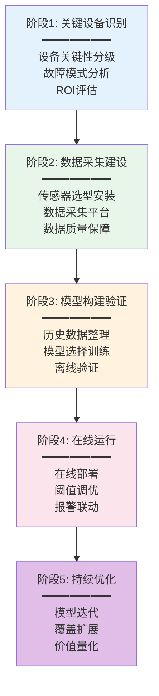
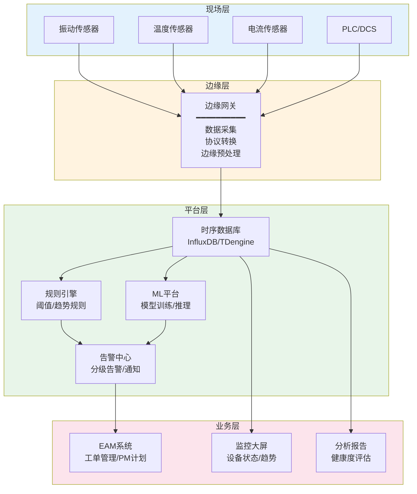

# 预测性维护与IoT

## 预测性维护PdM原理

预测性维护（Predictive Maintenance，PdM）是基于设备实际状态数据而非固定时间间隔来确定维护时机的策略。PdM的核心理念是**"基于数据判断，按需维护"**——只有在数据表明设备需要维护时才执行维护，既避免过度维护，也避免维护不足。

### PdM与PM的本质区别

| 对比维度 | 预防性维护PM | 预测性维护PdM |
|---------|-------------|-------------|
| 维护时机 | 按计划周期 | 按设备实际状态 |
| 判断依据 | 时间/次数/产量 | 振动/温度/油液等状态数据 |
| 维护频率 | 固定 | 动态 |
| 过度维护风险 | 较高 | 极低 |
| 维护不足风险 | 较低（但随机故障无法预防） | 较低（可提前发现退化趋势） |
| 投入成本 | 低（仅人工和备件） | 高（传感器+数据平台+算法） |
| 适用设备 | 有时间规律的故障模式 | 有状态先兆的故障模式 |

### PdM的理论基础

PdM的理论基础是**P-F曲线**（Potential Failure to Functional Failure Curve），描述设备从潜在故障发展到功能失效的过程：

```
│ 正常运行 ────── 潜在故障点P ────── 功能失效点F
│  ←── 不可检测 ──→  ←──── P-F间隔 ────→
│                      可检测到退化
```

| 概念 | 说明 |
|------|------|
| 潜在故障点P | 设备状态开始退化的可检测点 |
| 功能失效点F | 设备无法执行规定功能的失效点 |
| P-F间隔 | 从P到F的时间间隔 |
| PdM目标 | 在P点检测到退化，在F点之前完成维护 |

**PdM的核心价值**：在P-F间隔内安排维护，既避免过早维护（浪费资源），也避免过晚维护（导致功能失效）。

## IoT数据采集

IoT数据采集是实现PdM的基础，不同类型的传感器监测不同维度的设备状态：

### 振动监测

振动监测是旋转设备PdM最核心的手段，能够早期发现轴承、齿轮、不平衡、不对中等问题：

| 振动参数 | 监测内容 | 适用故障 |
|---------|---------|---------|
| 总振动值 | 整体振动水平 | 严重不平衡、松动 |
| 频谱分析 | 各频率分量的振动幅值 | 轴承缺陷、齿轮啮合 |
| 包络分析 | 高频共振解调 | 早期轴承损伤 |
| 时域波形 | 振动时间历程 | 冲击、摩擦 |
| 阶次分析 | 与转速相关的振动 | 不平衡、不对中 |

### 温度监测

| 监测方式 | 适用场景 | 检测能力 |
|---------|---------|---------|
| 点式温度 | 轴承、绕组热点 | 局部过热 |
| 红外热成像 | 电气柜、管道、炉体 | 大面积温度分布 |
| 光纤温度 | 变压器、电机绕组 | 连续温度分布 |

### 电流监测

| 监测参数 | 适用场景 | 检测能力 |
|---------|---------|---------|
| 电流有效值 | 电机负荷变化 | 过载、堵转 |
| 电流频谱 | 电机转子故障 | 转子断条、气隙偏心 |
| 功率因数 | 电机效率 | 电机效率下降 |

### 油液分析

| 分析项目 | 适用场景 | 检测能力 |
|---------|---------|---------|
| 金属元素分析 | 齿轮箱、液压系统 | 磨损类型和部位 |
| 颗粒计数 | 液压系统 | 污染程度 |
| 粘度/酸值 | 润滑油 | 油品老化 |
| 水分含量 | 润滑系统 | 油液乳化 |

## 状态监测技术

### 在线监测 vs 离线监测

| 对比维度 | 在线监测 | 离线监测 |
|---------|---------|---------|
| 传感器安装 | 永久安装 | 便携式 |
| 数据采集 | 连续实时 | 定期巡检 |
| 成本 | 高 | 低 |
| 适用设备 | 关键设备 | 一般设备 |
| 典型方案 | 固定振动传感器+在线系统 | 便携振动仪+红外热像仪 |

### 状态监测技术选型

| 设备类型 | 推荐监测技术 | 传感器类型 |
|---------|-------------|-----------|
| 旋转机械（泵/风机/压缩机） | 振动+温度 | 压电加速度计+PT100 |
| 电机 | 电流+振动+温度 | CT+加速度计+热电阻 |
| 齿轮箱 | 振动+油液 | 加速度计+油液采样 |
| 液压系统 | 压力+温度+油液 | 压力变送器+温度+油液 |
| 电气设备 | 温度+局放 | 红外+局放传感器 |

## 故障预测模型

### 阈值模型

最简单的预测模型，基于固定阈值判断：

| 阈值类型 | 说明 | 示例 |
|---------|------|------|
| 绝对阈值 | 超过固定值报警 | 振动>7.1mm/s报警（ISO 10816） |
| 相对阈值 | 相对基线值的变化 | 振动值比基线增加50%报警 |
| 统计阈值 | 基于历史数据的统计分布 | 超过均值+3σ报警 |

阈值模型简单有效，但无法预测剩余使用寿命（RUL）。

### 趋势模型

基于状态数据的趋势分析，预测达到阈值的时间：

- **线性趋势**：适用于缓慢退化的场景（如磨损）
- **指数趋势**：适用于加速退化的场景（如疲劳裂纹扩展）
- **分段趋势**：不同退化阶段使用不同的趋势模型

趋势模型可以估算剩余使用寿命RUL，但仍基于简单的数学拟合。

### 机器学习模型

基于历史数据训练的ML模型，可以捕捉复杂的退化模式：

| 模型类型 | 适用场景 | 优势 | 劣势 |
|---------|---------|------|------|
| 监督学习（分类） | 故障类型分类 | 精度高 | 需要标注数据 |
| 监督学习（回归） | RUL预测 | 可量化预测 | 需要完整退化数据 |
| 无监督学习（异常检测） | 异常状态检测 | 不需要故障标签 | 误报率较高 |
| 深度学习（LSTM） | 时序退化预测 | 处理长时序依赖 | 训练数据量大 |
| 迁移学习 | 跨设备/跨工厂 | 减少训练数据需求 | 域适应挑战 |

## 振动分析频谱图解读

振动频谱图是旋转设备故障诊断的核心工具，不同故障在频谱上有不同的特征：

| 故障类型 | 频谱特征 | 1×特征频率 | 其他特征 |
|---------|---------|-----------|---------|
| 不平衡 | 1×转速频率占主导 | 幅值大 | 相位稳定 |
| 不对中 | 1×、2×转速频率 | 2×可能大于1× | 轴向振动大 |
| 轴承外圈缺陷 | 高频共振+BPFO边带 | BPFO=外圈故障频率 | 包络谱明显 |
| 轴承内圈缺陷 | 高频共振+BPFI边带 | BPFI=内圈故障频率 | 有1×转速调制 |
| 齿轮啮合 | 齿轮啮合频率及边带 | GMF=齿数×转速 | 边带间距=转速频率 |
| 松动 | 大量谐波 | 多倍频成分 | 不稳定振动 |
| 摩擦 | 随机高频+1/2×成分 | 1/2×转速 | 不规则频谱 |

### ISO 10816振动标准

| 振动速度均方根值 | 评级 | 说明 |
|----------------|------|------|
| 0 - 0.71 mm/s | 良好 | 新交付设备通常在此范围 |
| 0.71 - 1.8 mm/s | 满意 | 可长期运行 |
| 1.8 - 4.5 mm/s | 可接受 | 可运行，需关注趋势 |
| 4.5 - 11.2 mm/s | 告警 | 需要检查，安排维护 |
| > 11.2 mm/s | 危险 | 立即停机检查 |

## PdM实施路径

预测性维护的实施需要循序渐进，不可一蹴而就：



### 各阶段的关键产出

| 阶段 | 关键产出 | 耗时参考 |
|------|---------|---------|
| 阶段1 | 关键设备清单、故障模式清单、ROI分析报告 | 1-2月 |
| 阶段2 | 传感器安装方案、数据采集平台、数据字典 | 2-4月 |
| 阶段3 | 预测模型、验证报告、误报率评估 | 3-6月 |
| 阶段4 | 在线监控系统、报警规则、工单联动配置 | 2-3月 |
| 阶段5 | 模型优化报告、扩展计划、价值评估 | 持续 |

## 预测性维护架构图



## 真实案例：风电行业预测性维护实践

### 背景

某风电运营企业管理200+台风力发电机组，单台风机价值上千万元，且分布偏远、维护成本高。传统定期维护模式存在两大痛点：**过度维护**导致成本居高不下，**突发故障**导致长时间停机和收入损失。

### 实施方案

| 阶段 | 内容 | 产出 |
|------|------|------|
| 阶段1 | 识别关键部件：齿轮箱、主轴承、发电机轴承 | 6个关键监测点 |
| 阶段2 | 每台风机安装振动传感器8个+温度传感器4个 | 在线监测系统上线 |
| 阶段3 | 收集2年历史数据，训练随机森林分类模型 | 故障识别准确率92% |
| 阶段4 | 在线部署，与EAM系统联动自动创建工单 | 自动化工单生成 |
| 阶段5 | 扩展到全风场200+台风机 | 全覆盖预测性维护 |

### 技术方案

| 监测点 | 传感器 | 采样率 | 分析方法 |
|--------|--------|-------|---------|
| 齿轮箱高速轴 | 振动加速度计 | 25.6kHz | 频谱+包络分析 |
| 齿轮箱低速轴 | 振动加速度计 | 25.6kHz | 频谱分析 |
| 主轴承 | 振动速度传感器 | 1kHz | 频谱+冲击脉冲 |
| 发电机前轴承 | 振动加速度计 | 25.6kHz | 包络分析 |
| 发电机后轴承 | 振动加速度计 | 25.6kHz | 包络分析 |
| 齿轮箱油温 | PT100 | 1Hz | 趋势分析 |

### 实施效果

| 指标 | 实施前 | 实施后 | 改善 |
|------|-------|-------|------|
| 年度维护成本 | 2800万 | 1800万 | 36%↓ |
| 非计划停机时间 | 8500小时 | 2200小时 | 74%↓ |
| 故障检出提前量 | — | 平均45天 | — |
| 误报率 | — | 8% | — |
| 设备可用率 | 95.2% | 98.7% | 3.5%↑ |

### 关键经验

1. **数据质量是基础**：前期花费3个月清洗和标注历史数据，数据质量直接决定模型效果
2. **业务闭环是关键**：预测结果必须与EAM工单系统联动，形成"检测→预警→工单→维修→验证"闭环
3. **渐进式推广**：先在5台风机上验证，再扩展到50台，最后全风场推广
4. **人机结合**：AI模型负责初筛，工程师确认诊断，避免完全依赖模型

## 总结

预测性维护是设备管理从"定期维护"到"按需维护"的升级，其核心是利用IoT数据提前发现设备退化趋势。振动分析是旋转设备PdM最重要的手段，频谱特征可以精准定位故障类型。PdM的实施需要循序渐进——从关键设备开始，建立数据采集能力，构建和验证预测模型，最终形成在线运行和持续优化的闭环。风电行业的实践证明，PdM可以显著降低维护成本和非计划停机时间，但数据质量和业务闭环是成功的关键。
