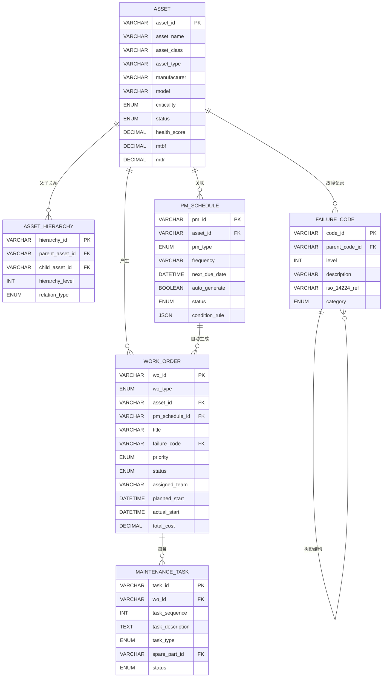
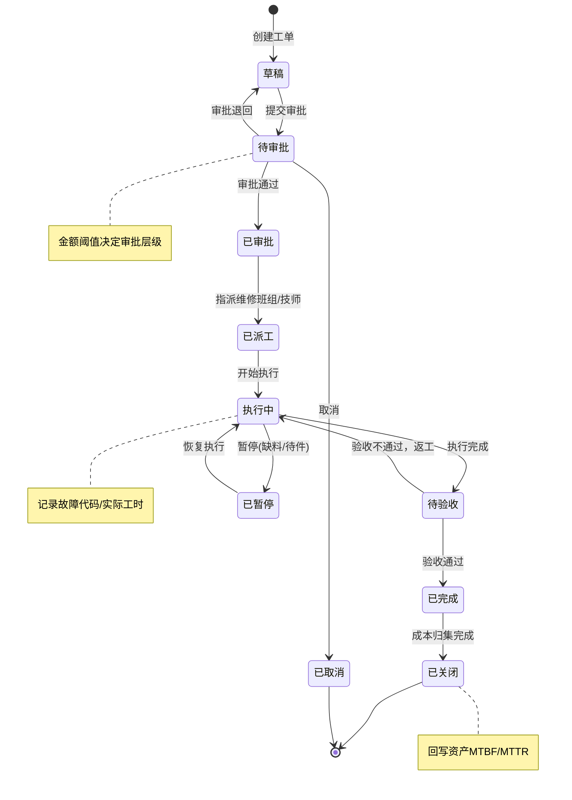
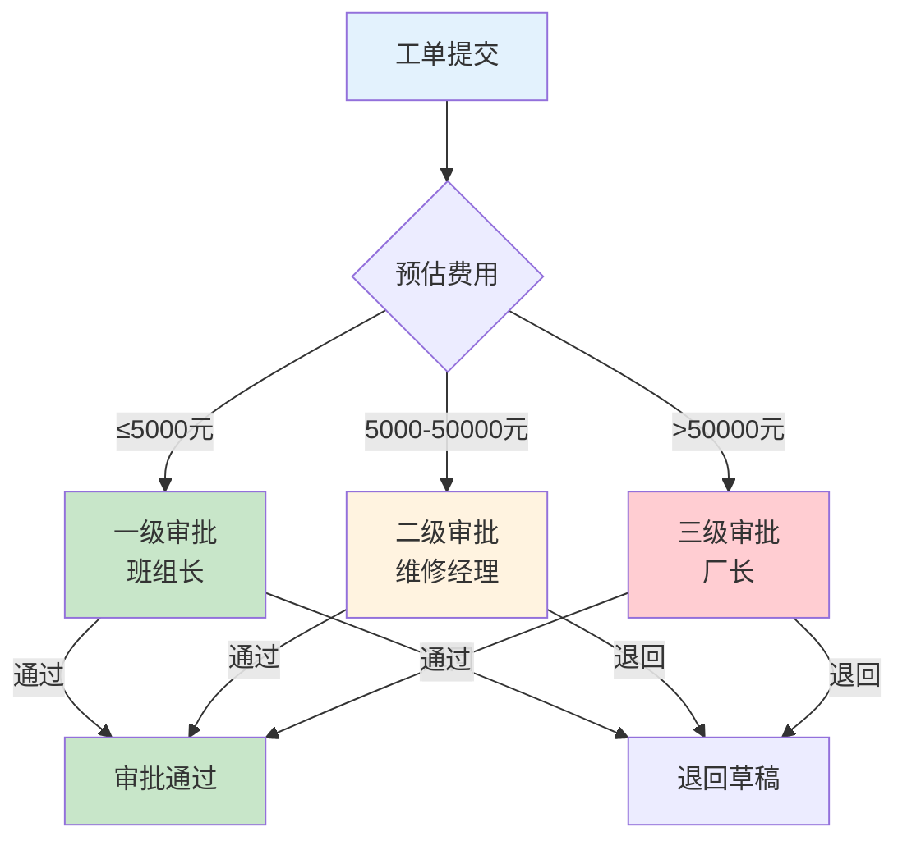

# EAM数据库设计与工单引擎

## 核心表设计

EAM系统的数据模型围绕"资产→工单→维护→成本"的核心链路设计，以下是六张核心表的定义。

### 资产表（ASSET）

| 字段名 | 类型 | 说明 |
|--------|------|------|
| asset_id | VARCHAR(32) | 资产编号，主键 |
| asset_name | VARCHAR(200) | 资产名称 |
| asset_class | VARCHAR(50) | 资产分类（如：生产设备/公用设施/运输设备） |
| asset_type | VARCHAR(50) | 资产类型（如：CNC/注塑机/空压机） |
| manufacturer | VARCHAR(100) | 制造商 |
| model | VARCHAR(100) | 型号 |
| serial_number | VARCHAR(50) | 序列号 |
| parent_asset_id | VARCHAR(32) | 父资产ID（层级结构） |
| location_id | VARCHAR(32) | 位置ID |
| work_center | VARCHAR(32) | 所属工作中心 |
| criticality | ENUM | 关键度：CRITICAL/IMPORTANT/NORMAL |
| status | ENUM | 状态：NEW/ACTIVE/STANDBY/UNDER_MAINT/DOWN/SCRAPPED |
| purchase_date | DATE | 购置日期 |
| warranty_expiry | DATE | 保修到期日 |
| original_value | DECIMAL(14,2) | 原值 |
| current_value | DECIMAL(14,2) | 现值 |
| health_score | DECIMAL(5,2) | 健康度评分(0-100) |
| mtbf | DECIMAL(10,2) | 平均故障间隔时间(小时) |
| mttr | DECIMAL(10,2) | 平均修复时间(小时) |
| total_maintenance_cost | DECIMAL(14,2) | 累计维修成本 |
| last_maintenance_date | DATE | 上次维护日期 |
| created_at | DATETIME | 创建时间 |
| updated_at | DATETIME | 更新时间 |

### 资产层级表（ASSET_HIERARCHY）

| 字段名 | 类型 | 说明 |
|--------|------|------|
| hierarchy_id | VARCHAR(32) | 层级ID，主键 |
| parent_asset_id | VARCHAR(32) | 父资产ID |
| child_asset_id | VARCHAR(32) | 子资产ID |
| hierarchy_level | INT | 层级深度（1=工厂, 2=产线, 3=设备, 4=子系统） |
| relation_type | ENUM | 关系类型：PHYSICAL/FUNCTIONAL/SPARE |
| sort_order | INT | 同级排序 |

### 工单表（WORK_ORDER）

| 字段名 | 类型 | 说明 |
|--------|------|------|
| wo_id | VARCHAR(32) | 工单编号，主键 |
| wo_type | ENUM | 工单类型：CORRECTIVE/PREVENTIVE/PREDICTIVE/EMERGENCY |
| asset_id | VARCHAR(32) | 关联资产ID |
| pm_schedule_id | VARCHAR(32) | 关联PM计划ID（预防性工单） |
| title | VARCHAR(200) | 工单标题 |
| description | TEXT | 故障描述/维护内容 |
| failure_code | VARCHAR(20) | 故障代码（ISO 14224） |
| priority | ENUM | 优先级：URGENT/HIGH/MEDIUM/LOW |
| status | ENUM | 状态：DRAFT/PENDING_APPROVAL/APPROVED/DISPATCHED/IN_PROGRESS/COMPLETED/CLOSED/CANCELLED |
| assigned_team | VARCHAR(32) | 维修班组 |
| assigned_technician | VARCHAR(32) | 指派技师 |
| planned_start | DATETIME | 计划开始时间 |
| planned_end | DATETIME | 计划结束时间 |
| actual_start | DATETIME | 实际开始时间 |
| actual_end | DATETIME | 实际结束时间 |
| estimated_hours | DECIMAL(6,2) | 预计工时 |
| actual_hours | DECIMAL(6,2) | 实际工时 |
| downtime_hours | DECIMAL(6,2) | 停机时间 |
| total_cost | DECIMAL(14,2) | 总成本 |
| approval_level | INT | 当前审批层级 |
| template_id | VARCHAR(32) | 工单模板ID |
| created_by | VARCHAR(32) | 创建人 |
| created_at | DATETIME | 创建时间 |
| closed_at | DATETIME | 关闭时间 |

### PM计划表（PM_SCHEDULE）

| 字段名 | 类型 | 说明 |
|--------|------|------|
| pm_id | VARCHAR(32) | PM计划ID，主键 |
| asset_id | VARCHAR(32) | 关联资产ID |
| template_id | VARCHAR(32) | 工单模板ID |
| pm_type | ENUM | 类型：CALENDAR_BASED/CONDITION_BASED/METER_BASED |
| frequency | VARCHAR(50) | 频次描述（如：DAILY/WEEKLY/MONTHLY/QUARTERLY） |
| frequency_value | INT | 频次值 |
| frequency_unit | ENUM | 频次单位：DAY/WEEK/MONTH/RUNNING_HOUR/CYCLE |
| next_due_date | DATETIME | 下次到期日 |
| last_executed_date | DATETIME | 上次执行日 |
| maintenance_window | INT | 维护窗口（小时） |
| auto_generate | BOOLEAN | 是否自动生成工单 |
| status | ENUM | 状态：ACTIVE/SUSPENDED/TERMINATED |
| condition_rule | JSON | 条件触发规则（条件型PM） |
| meter_threshold | DECIMAL(10,2) | 仪表阈值（仪表型PM） |
| created_at | DATETIME | 创建时间 |

### 故障代码表（FAILURE_CODE）

| 字段名 | 类型 | 说明 |
|--------|------|------|
| code_id | VARCHAR(20) | 故障代码，主键 |
| parent_code_id | VARCHAR(20) | 父代码ID（树形结构） |
| level | INT | 层级（1=问题, 2=原因, 3=补救） |
| description | VARCHAR(200) | 故障描述 |
| iso_14224_ref | VARCHAR(20) | ISO 14224参考代码 |
| category | ENUM | 分类：MECHANICAL/ELECTRICAL/INSTRUMENT/OPERATION |

### 维修任务表（MAINTENANCE_TASK）

| 字段名 | 类型 | 说明 |
|--------|------|------|
| task_id | VARCHAR(32) | 任务ID，主键 |
| wo_id | VARCHAR(32) | 关联工单ID |
| task_sequence | INT | 任务序号 |
| task_description | TEXT | 任务描述 |
| task_type | ENUM | 类型：INSPECT/REPAIR/REPLACE/LUBRICATE/CALIBRATE/ADJUST |
| spare_part_id | VARCHAR(32) | 所需备件ID |
| required_qty | INT | 所需数量 |
| estimated_minutes | INT | 预计耗时(分钟) |
| actual_minutes | INT | 实际耗时(分钟) |
| status | ENUM | 状态：PENDING/IN_PROGRESS/COMPLETED/SKIPPED |
| completed_by | VARCHAR(32) | 完成人 |
| completed_at | DATETIME | 完成时间 |
| remarks | TEXT | 备注 |

## ER图



## 工单状态机

工单是EAM系统的核心实体，其状态流转涉及审批、派工、执行、验收等多个阶段：



### 状态转换规则

```python
class WorkOrderStateMachine:
    """工单状态机"""

    TRANSITIONS = {
        "DRAFT": ["PENDING_APPROVAL", "CANCELLED"],
        "PENDING_APPROVAL": ["APPROVED", "DRAFT", "CANCELLED"],
        "APPROVED": ["DISPATCHED"],
        "DISPATCHED": ["IN_PROGRESS"],
        "IN_PROGRESS": ["PENDING_ACCEPTANCE", "SUSPENDED"],
        "SUSPENDED": ["IN_PROGRESS"],
        "PENDING_ACCEPTANCE": ["COMPLETED", "IN_PROGRESS"],
        "COMPLETED": ["CLOSED"],
        "CLOSED": [],
        "CANCELLED": [],
    }

    # 审批阈值配置
    APPROVAL_THRESHOLDS = [
        {"max_amount": 5000, "level": 1, "role": "TEAM_LEAD"},
        {"max_amount": 50000, "level": 2, "role": "MAINTENANCE_MANAGER"},
        {"max_amount": float('inf'), "level": 3, "role": "PLANT_MANAGER"},
    ]

    def transition(self, wo: WorkOrder, target: str, operator: str, data: dict = None):
        allowed = self.TRANSITIONS.get(wo.status, [])
        if target not in allowed:
            raise InvalidTransitionError(
                f"工单{wo.wo_id}: 不允许 {wo.status} → {target}"
            )

        if target == "PENDING_APPROVAL":
            # 计算所需审批层级
            wo.approval_level = self._get_required_approval_level(wo.estimated_cost)
        elif target == "APPROVED":
            self._verify_approval(wo, operator)
        elif target == "DISPATCHED":
            if not wo.assigned_team and not wo.assigned_technician:
                raise ValidationError("派工前必须指定维修班组或技师")
        elif target == "IN_PROGRESS":
            wo.actual_start = datetime.now()
        elif target == "COMPLETED":
            wo.actual_end = datetime.now()
            wo.actual_hours = self._calculate_actual_hours(wo)
        elif target == "CLOSED":
            self._verify_cost_settlement(wo)

        wo.status = target
        wo.save()

        # 发布事件
        event_bus.publish("work_order.status_changed", {
            "wo_id": wo.wo_id,
            "from_status": wo.status,
            "to_status": target,
            "operator": operator,
        })

    def _get_required_approval_level(self, estimated_cost: float) -> int:
        """根据预估费用确定审批层级"""
        for threshold in self.APPROVAL_THRESHOLDS:
            if estimated_cost <= threshold["max_amount"]:
                return threshold["level"]
        return 3
```

## 审批流设计

工单审批采用金额阈值驱动的分级审批机制，不同预估费用的工单需要不同层级的审批：



**多级审批实现：**

```python
class ApprovalService:
    """工单审批服务"""

    def approve(self, wo_id: str, approver: str, comment: str) -> dict:
        wo = WorkOrder.get(wo_id)
        if wo.status != "PENDING_APPROVAL":
            raise BusinessError("工单非待审批状态")

        required_level = wo.approval_level
        approver_level = self._get_approver_level(approver)

        if approver_level < required_level:
            raise PermissionError(f"当前审批人层级{approver_level}不足，需要层级{required_level}")

        # 记录审批历史
        ApprovalRecord.create(
            wo_id=wo_id,
            approver=approver,
            approver_level=approver_level,
            action="APPROVE",
            comment=comment,
        )

        # 检查是否所有层级都已审批
        approved_levels = ApprovalRecord.filter(
            wo_id=wo_id, action="APPROVE"
        ).values_list("approver_level", flat=True)

        if all(l in approved_levels for l in range(1, required_level + 1)):
            wo.status = "APPROVED"
            wo.save()
            return {"status": "APPROVED", "message": "审批通过"}
        else:
            return {"status": "PENDING_APPROVAL", "message": f"待层级{required_level}审批"}

    def reject(self, wo_id: str, approver: str, comment: str):
        wo = WorkOrder.get(wo_id)
        wo.status = "DRAFT"
        wo.save()

        ApprovalRecord.create(
            wo_id=wo_id,
            approver=approver,
            action="REJECT",
            comment=comment,
        )
```

## PM自动生成机制

PM计划通过三种触发机制自动生成工单：

### 日历触发

最常用的触发方式，按固定时间间隔生成工单：

```python
class CalendarTriggerService:
    """PM日历触发服务"""

    def check_and_generate(self):
        """定时扫描到期的PM计划，生成工单"""
        now = datetime.now()
        due_schedules = PMSchedule.filter(
            pm_type="CALENDAR_BASED",
            status="ACTIVE",
            auto_generate=True,
            next_due_date__lte=now,
        ).all()

        for schedule in due_schedules:
            # 检查是否已存在未完成的同类型工单
            existing = WorkOrder.filter(
                asset_id=schedule.asset_id,
                pm_schedule_id=schedule.pm_id,
                status__in=["PENDING_APPROVAL", "APPROVED", "DISPATCHED", "IN_PROGRESS"],
            ).first()

            if existing:
                continue  # 避免重复生成

            # 从模板生成工单
            wo = self._generate_from_template(schedule)

            # 更新下次到期日
            schedule.last_executed_date = now
            schedule.next_due_date = self._calculate_next_due(schedule)
            schedule.save()

    def _calculate_next_due(self, schedule: PMSchedule) -> datetime:
        """计算下次到期日"""
        delta_map = {
            "DAY": timedelta(days=schedule.frequency_value),
            "WEEK": timedelta(weeks=schedule.frequency_value),
            "MONTH": timedelta(days=30 * schedule.frequency_value),
            "QUARTER": timedelta(days=90 * schedule.frequency_value),
            "YEAR": timedelta(days=365 * schedule.frequency_value),
        }
        return datetime.now() + delta_map.get(schedule.frequency_unit, timedelta(days=30))
```

### 条件触发

基于IoT传感器数据或设备运行参数触发维护：

```python
class ConditionTriggerService:
    """PM条件触发服务"""

    def evaluate_condition(self, asset_id: str, metric_name: str, value: float):
        """评估条件触发规则"""
        schedules = PMSchedule.filter(
            asset_id=asset_id,
            pm_type="CONDITION_BASED",
            status="ACTIVE",
        ).all()

        for schedule in schedules:
            rule = schedule.condition_rule  # JSON格式规则
            if self._evaluate_rule(rule, metric_name, value):
                self._generate_work_order(schedule, trigger_reason=f"{metric_name}={value}")

    def _evaluate_rule(self, rule: dict, metric_name: str, value: float) -> bool:
        """评估条件规则"""
        if rule["metric"] != metric_name:
            return False

        operator = rule["operator"]
        threshold = rule["threshold"]

        if operator == "GT": return value > threshold
        elif operator == "LT": return value < threshold
        elif operator == "GTE": return value >= threshold
        elif operator == "LTE": return value <= threshold
        elif operator == "EQ": return value == threshold
        return False
```

**条件触发规则配置示例：**

```json
{
  "condition_rule": {
    "logic": "OR",
    "rules": [
      {"metric": "vibration_rms", "operator": "GT", "threshold": 7.5, "unit": "mm/s"},
      {"metric": "bearing_temperature", "operator": "GT", "threshold": 85, "unit": "°C"},
      {"metric": "oil_particles", "operator": "GT", "threshold": 100, "unit": "count/ml"}
    ]
  }
}
```

### 工单模板设计

```python
class WorkOrderTemplateService:
    """工单模板服务"""

    def generate_from_template(self, template_id: str, asset_id: str,
                                pm_schedule_id: str = None) -> WorkOrder:
        """从模板生成工单"""
        template = WorkOrderTemplate.get(template_id)
        asset = Asset.get(asset_id)

        # 估算工时和费用
        estimated_hours = template.estimated_hours
        estimated_cost = self._estimate_cost(template, asset)

        # 创建工单
        wo = WorkOrder.create(
            wo_type=template.wo_type,
            asset_id=asset_id,
            pm_schedule_id=pm_schedule_id,
            title=f"[PM] {asset.asset_name} - {template.name}",
            description=template.description,
            priority=template.priority,
            estimated_hours=estimated_hours,
            template_id=template_id,
            status="DRAFT",
        )

        # 从模板创建维修任务清单
        for task_tmpl in template.tasks:
            MaintenanceTask.create(
                wo_id=wo.wo_id,
                task_sequence=task_tmpl.sequence,
                task_description=task_tmpl.description,
                task_type=task_tmpl.task_type,
                spare_part_id=task_tmpl.spare_part_id,
                required_qty=task_tmpl.required_qty,
                estimated_minutes=task_tmpl.estimated_minutes,
                status="PENDING",
            )

        return wo
```

## 故障代码树设计（ISO 14224）

故障代码采用ISO 14224标准的三层结构：问题(Problem)→原因(Cause)→补救(Remedy)：

```
问题层 (Level 1)
├── ME-001 机械故障
│   ├── ME-001-C01 轴承磨损
│   │   ├── ME-001-C01-R01 更换轴承
│   │   └── ME-001-C01-R02 润滑维护
│   ├── ME-001-C02 皮带断裂
│   │   ├── ME-001-C02-R01 更换皮带
│   │   └── ME-001-C02-R02 调整张紧
│   └── ME-001-C03 齿轮损坏
│       └── ME-001-C03-R01 更换齿轮
├── EL-001 电气故障
│   ├── EL-001-C01 电机烧毁
│   │   └── EL-001-C01-R01 更换电机
│   ├── EL-001-C02 传感器失效
│   │   └── EL-001-C02-R01 更换传感器
│   └── EL-001-C03 线路短路
│       └── EL-001-C03-R01 修复线路
└── OP-001 操作异常
    ├── OP-001-C01 操作失误
    │   └── OP-001-C01-R01 培训操作员
    └── OP-001-C02 参数设置错误
        └── OP-001-C02-R01 修正参数
```

```python
class FailureCodeTree:
    """故障代码树 - 支持快速检索和统计分析"""

    def get_problem_causes(self, problem_code: str) -> List[dict]:
        """获取某问题下的所有原因"""
        return FailureCode.filter(
            parent_code_id=problem_code,
            level=2
        ).values("code_id", "description")

    def get_top_failure_codes(self, asset_id: str = None,
                               period: DateRange = None,
                               top_n: int = 10) -> List[dict]:
        """统计Top N故障代码"""
        queryset = WorkOrder.filter(failure_code__isnull=False)
        if asset_id:
            queryset = queryset.filter(asset_id=asset_id)
        if period:
            queryset = queryset.filter(created_at__range=period)

        return queryset.values("failure_code").annotate(
            count=Count("wo_id"),
            avg_mttr=Avg("downtime_hours"),
            avg_cost=Avg("total_cost"),
        ).order_by("-count")[:top_n]
```

## API设计

### 创建工单

```
POST /api/v1/eam/work-orders
```

请求体：

```json
{
  "wo_type": "CORRECTIVE",
  "asset_id": "AST-CNC-001",
  "title": "CNC-001主轴异响",
  "description": "操作员报告CNC-001主轴在高速运转时出现异常响声，伴随振动增大",
  "failure_code": "ME-001-C01",
  "priority": "HIGH",
  "estimated_hours": 4.0,
  "assigned_team": "TEAM-MECH-01"
}
```

响应体：

```json
{
  "code": 200,
  "data": {
    "wo_id": "WO-202403-00234",
    "status": "DRAFT",
    "approval_level": 1,
    "estimated_cost": 3500.00,
    "template_suggested": {
      "template_id": "TPL-ME-BEARING",
      "name": "轴承更换标准流程",
      "tasks_count": 6,
      "required_spares": [
        {"spare_part_id": "SP-6205-2RS", "name": "深沟球轴承6205", "qty": 2}
      ]
    },
    "created_at": "2024-03-15T14:30:00Z"
  }
}
```

### 审批工单

```
POST /api/v1/eam/work-orders/{wo_id}/approve
```

请求体：

```json
{
  "approver": "team_lead_chen",
  "comment": "确认需要维修，优先处理",
  "action": "APPROVE"
}
```

### 派工

```
POST /api/v1/eam/work-orders/{wo_id}/dispatch
```

请求体：

```json
{
  "assigned_team": "TEAM-MECH-01",
  "assigned_technician": "tech_wang",
  "planned_start": "2024-03-15T16:00:00Z",
  "planned_end": "2024-03-15T20:00:00Z"
}
```

### 执行反馈

```
PUT /api/v1/eam/work-orders/{wo_id}/feedback
```

请求体：

```json
{
  "failure_code_confirmed": "ME-001-C01",
  "root_cause": "主轴承内圈磨损，润滑脂干涸导致",
  "actual_hours": 3.5,
  "downtime_hours": 5.0,
  "tasks": [
    {
      "task_id": "TSK-001",
      "status": "COMPLETED",
      "actual_minutes": 45,
      "remarks": "更换6205轴承2只"
    },
    {
      "task_id": "TSK-002",
      "status": "COMPLETED",
      "actual_minutes": 20,
      "remarks": "补充润滑脂"
    }
  ],
  "spare_parts_used": [
    {"spare_part_id": "SP-6205-2RS", "consumed_qty": 2, "unit_price": 85.00},
    {"spare_part_id": "SP-GREASE-002", "consumed_qty": 1, "unit_price": 120.00}
  ]
}
```

### 验收关闭

```
POST /api/v1/eam/work-orders/{wo_id}/close
```

请求体：

```json
{
  "acceptance_result": "PASS",
  "acceptor": "production_sup_li",
  "comment": "试运行2小时无异常，验收通过",
  "verify_hours": 2
}
```

## 开发者实战Tips

1. **工单编号生成器**：使用Redis INCR实现分布式自增流水号，避免数据库序列瓶颈。格式`WO-{yyyyMM}-{5位流水号}`，每月重置。

2. **审批流可配置化**：审批层级和阈值应支持通过管理后台动态配置，不同工厂/部门可能有不同的审批规则。使用规则引擎(Drools/自研)替代硬编码。

3. **故障代码与知识库联动**：选择故障代码后，自动推荐历史同类故障的维修方案和知识库文章，辅助技师快速定位问题。

4. **工单关闭后置任务**：工单关闭后触发一系列后置任务——成本归集、MTBF/MTTR更新、资产健康度重算、PM计划频率优化建议。使用异步任务队列处理，避免阻塞关闭操作。

5. **并发控制**：同一资产同时只能有一个活跃的纠正性工单（可配置），PM工单可并行。在工单创建时加分布式锁检查，避免重复创建。
