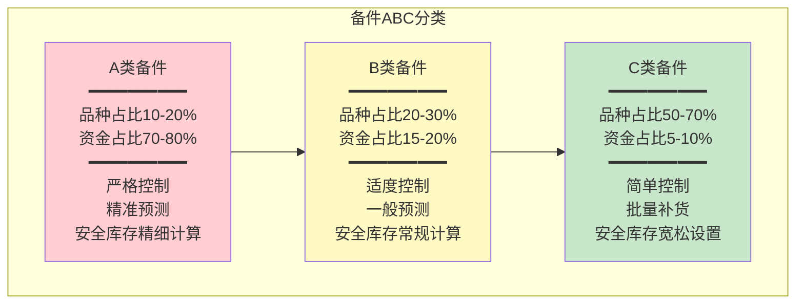
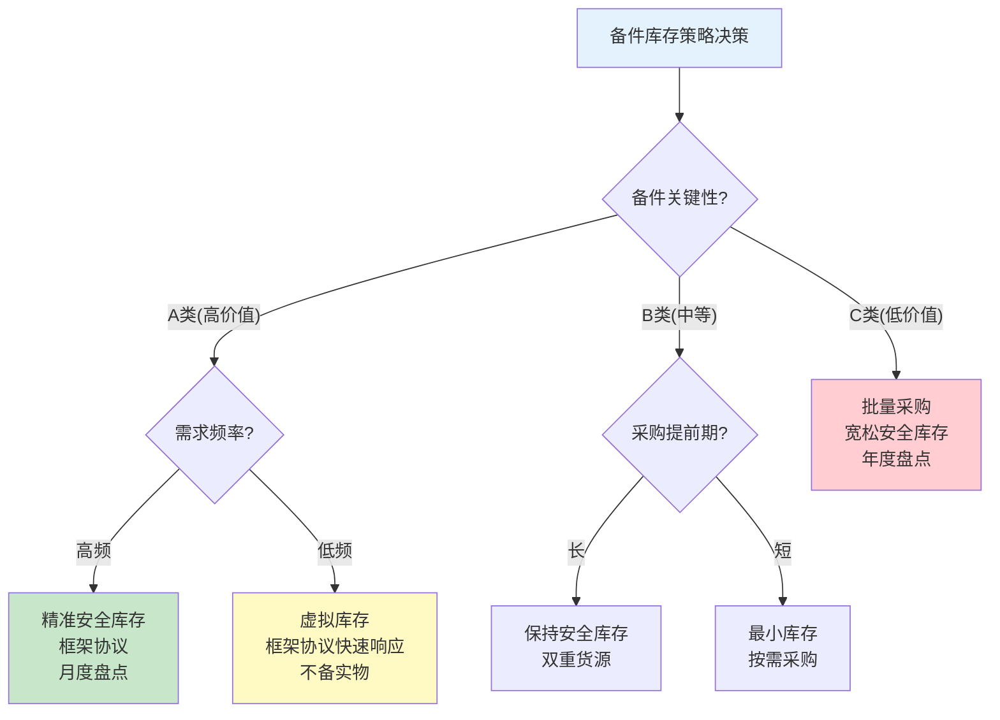

# 备件库存管理

## 备件分类

备件库存管理首先需要对备件进行科学分类，不同类型的备件采用不同的管理策略：

### 按使用特性分类

| 分类 | 定义 | 典型备件 | 库存策略 |
|------|------|---------|---------|
| 消耗品 | 定期更换、用量稳定 | 润滑脂、滤芯、密封圈 | 保持安全库存，定期补货 |
| 周转件 | 有一定故障率、可提前采购 | 轴承、皮带、传感器 | 保持安全库存，按消耗补货 |
| 事故件 | 故障率低但故障影响大 | 电机、减速箱、PLC主板 | 保持少量库存或框架协议 |
| 专用件 | 特定设备专用、采购周期长 | 定制液压缸、非标齿轮 | 按设备数量备1-2套 |

### 按关键性分类

| 分类 | 关键性 | 占库存资金比例 | 占品种比例 | 管理策略 |
|------|--------|-------------|-----------|---------|
| A类 | 高 | 70-80% | 10-20% | 严格管控、精准预测、定期盘点 |
| B类 | 中 | 15-20% | 20-30% | 适度管控、一般预测、循环盘点 |
| C类 | 低 | 5-10% | 50-70% | 简单管控、批量补货、年度盘点 |

## ABC分类法

ABC分类法是备件管理最常用的分类方法，基于帕累托80/20原则：



### ABC分类实施步骤

1. **数据收集**：统计各备件的年消耗金额（单价×年消耗量）
2. **排序**：按年消耗金额从高到低排序
3. **累计计算**：计算累计品种比例和累计金额比例
4. **分类划线**：累计金额70-80%为A类，70-90%为B类，其余为C类
5. **策略制定**：为各类别制定差异化的管理策略

### ABC分类管理策略对比

| 管理维度 | A类备件 | B类备件 | C类备件 |
|---------|---------|---------|---------|
| 库存检查频次 | 每月 | 每季 | 每年 |
| 安全库存精度 | 精细计算 | 常规公式 | 经验值 |
| 采购方式 | 按需+安全库存 | 批量采购 | 大批量采购 |
| 供应商管理 | 深度合作、框架协议 | 多家比价 | 简单询价 |
| 盘点频次 | 月度循环盘点 | 季度循环盘点 | 年度全面盘点 |
| 库存周转目标 | ≥4次/年 | ≥3次/年 | ≥2次/年 |

## 备件库存策略

### 安全库存策略

安全库存是为应对需求波动和供应延迟而设置的缓冲库存：

| 计算方法 | 公式 | 适用条件 |
|---------|------|---------|
| 简单安全库存 | SS = 日均消耗 × 安全天数 | 需求稳定 |
| 统计安全库存 | SS = Z × σ_d × √L | 需求正态分布 |
| 服务水平安全库存 | SS = (Z_d × σ_d + Z_L × σ_L) × √(L+R) | 考虑需求和提前期波动 |

其中：Z=服务水平对应的标准正态分位数，σ_d=需求标准差，L=提前期，R=盘点周期

### 最小-最大库存策略

| 参数 | 说明 | 设定方法 |
|------|------|---------|
| 最小库存量（Min） | 触发采购的库存量 | Min = 日均消耗 × 采购提前期 + 安全库存 |
| 最大库存量（Max） | 库存上限 | Max = Min + 经济订货量(EOQ) |
| 订货量 | 每次采购的数量 | 订货量 = Max - 当前库存 |

### 再订货点策略

| 参数 | 说明 | 设定方法 |
|------|------|---------|
| 再订货点（ROP） | 触发采购的库存水位 | ROP = 日均消耗 × 采购提前期 + 安全库存 |
| 经济订货量（EOQ） | 最优订货数量 | EOQ = √(2×年需求×订货成本/持有成本) |

### 库存策略选择

| 备件特征 | 推荐策略 | 理由 |
|---------|---------|------|
| 高价值、需求稳定 | 安全库存+按需采购 | 控制库存资金占用 |
| 中等价值、需求波动 | 最小-最大 | 平衡库存与缺货风险 |
| 低价值、需求频繁 | 再订货点+批量采购 | 减少采购次数，降低管理成本 |
| 极高价值、需求极低 | 框架协议/虚拟库存 | 不备实物库存，按协议快速交付 |
| 关键备件、缺货损失大 | 双重安全库存 | 在两个地点分别存放 |

## 备件与设备BOM关联

备件与设备的BOM（Bill of Materials）关联是EAM备件管理的核心能力，确保维修时能快速找到所需备件：

```
设备：800T伺服冲压机（EQ-CP-001）
├── 主电机（SUB-MOT-001）
│   ├── 电机轴承SKF 6312（PART-BRG-001）×2
│   ├── 电机风扇（PART-FAN-001）×1
│   └── 电机碳刷（PART-BRS-001）×4
├── 液压系统（SUB-HYD-001）
│   ├── 主泵（PART-PMP-001）×1
│   ├── 液压缸密封件套（PART-SEL-001）×1
│   ├── 溢流阀（PART-RLV-001）×2
│   └── 液压滤芯（PART-FLT-001）×3
└── 控制系统（SUB-CTL-001）
    ├── PLC主板（PART-PLC-001）×1
    ├── 伺服驱动器（PART-SVD-001）×1
    └── 编码器（PART-ENC-001）×1
```

### BOM关联的价值

| 价值 | 说明 |
|------|------|
| 快速找件 | 维修时根据设备直接查到所需备件 |
| 库存预留 | 工单创建时自动预留备件库存 |
| 消耗统计 | 按设备统计备件消耗，分析维修成本 |
| 采购预测 | 根据PM计划和设备BOM预测备件需求 |
| 替代查询 | 查找备件替代方案 |

## 备件替代与通用件

### 替代件管理

| 替代类型 | 说明 | 审批要求 |
|---------|------|---------|
| 等同替代 | 同品牌同型号，不同供应商 | 采购审批 |
| 功能替代 | 不同品牌/型号，功能等效 | 技术评审+采购审批 |
| 降级替代 | 性能略低但可满足使用 | 技术评审+使用部门确认 |
| 通用件替代 | 多设备通用的标准件 | 采购审批 |

### 通用件管理

通用件是多种设备共同使用的标准备件，管理得当可以显著降低库存：

| 管理要点 | 说明 |
|---------|------|
| 通用件识别 | 通过BOM分析识别多设备共用的备件 |
| 需求合并 | 将多设备的需求合并计算安全库存 |
| 集中采购 | 通用件集中采购，争取批量折扣 |
| 集中存放 | 通用件集中存放在中心仓库 |

## 备件采购

### 常规采购

| 步骤 | 活动 | 说明 |
|------|------|------|
| 1 | 采购申请 | EAM根据库存低于安全值自动生成，或手动创建 |
| 2 | 审批 | 按金额和备件类别分级审批 |
| 3 | 询价比价 | 向合格供应商询价，至少3家比价（A类备件） |
| 4 | 下达订单 | 选定供应商，下达采购订单 |
| 5 | 到货验收 | 核对规格、数量、质量证明 |
| 6 | 入库上架 | 验收合格后入库，更新库存和财务 |

### 紧急采购

紧急采购是为应对设备突发故障的快速采购机制：

| 环节 | 要求 | 说明 |
|------|------|------|
| 申请 | 故障后即时申请 | 免常规审批，事后补审 |
| 采购 | 框架协议供应商优先 | 从已签框架协议的供应商处快速采购 |
| 交付 | 最短时间交付 | 可接受加急费用 |
| 验收 | 到货即验收 | 简化流程，保障维修进度 |
| 记录 | 必须记录紧急采购原因 | 分析紧急采购频率，优化备件库存 |

## 备件消耗统计与成本归集

### 消耗统计维度

| 统计维度 | 分析目的 | 典型报表 |
|---------|---------|---------|
| 按设备 | 分析单台设备维修成本 | 设备维修成本明细表 |
| 按备件类别 | 分析备件消耗结构 | 备件类别消耗汇总表 |
| 按车间 | 分析各车间维修成本 | 车间维修成本对比表 |
| 按时间 | 分析消耗趋势 | 备件消耗月度趋势图 |
| 按供应商 | 分析供应商交货表现 | 供应商准时率/合格率 |

### 成本归集

| 成本要素 | 归集方式 | 说明 |
|---------|---------|------|
| 备件成本 | 按工单领料单归集 | 领料单关联工单和设备 |
| 人工成本 | 按工单工时记录归集 | 维修工时×人工费率 |
| 外协成本 | 按外协工单归集 | 外部维修服务费用 |
| 停机损失 | 按工单停机时间估算 | 停机小时×单位产出价值 |

## 库存策略决策表



## 真实案例：SAP PM备件管理流程

某汽车零部件企业使用SAP PM+MM模块管理备件，以下是其备件管理流程：

### 备件主数据管理

| 步骤 | SAP操作 | 说明 |
|------|---------|------|
| 1 | 创建物料主数据（MM01） | 录入备件基本信息、采购信息、库存信息 |
| 2 | 建立设备BOM（CS01） | 将备件与设备关联 |
| 3 | 设置库存参数 | MRP类型、再订货点、安全库存 |
| 4 | 维护供应商信息（MK01） | 建立合格供应商清单 |

### 备件领料流程

| 步骤 | SAP操作 | 说明 |
|------|---------|------|
| 1 | 维修工单创建（IW31） | 创建维修工单 |
| 2 | 工单添加备件（IW32） | 在工单中添加所需备件 |
| 3 | 备件预留自动生成 | 系统自动生成预留（Reservation） |
| 4 | 仓库发料（MIGO） | 按预留单发料，自动更新库存和工单成本 |
| 5 | 工单关闭时结算 | 工单关闭时，备件成本自动归集到成本中心 |

### 库存自动补货

| 步骤 | SAP操作 | 说明 |
|------|---------|------|
| 1 | MRP运行（MD01） | 定期运行MRP，检查库存低于再订货点的备件 |
| 2 | 自动生成采购申请 | MRP自动生成采购申请（PR） |
| 3 | 转换为采购订单（ME21N） | 采购员将PR转换为PO |
| 4 | 收货入库（MIGO） | 供应商交货后收货入库 |
| 5 | 发票校验（MIRO） | 财务校验发票，完成付款流程 |

### 运行效果

| 指标 | 实施前 | 实施后 | 改善 |
|------|-------|-------|------|
| 备件缺料率 | 12% | 3% | 75%↓ |
| 备件库存周转率 | 2.1次/年 | 3.8次/年 | 81%↑ |
| 备件库存金额 | 680万 | 450万 | 34%↓ |
| 紧急采购比例 | 25% | 8% | 68%↓ |
| 库存准确率 | 85% | 98% | 15%↑ |

## 总结

备件库存管理是设备维修的物资保障，ABC分类法是备件分类管理的核心方法。不同类型的备件应采用差异化的库存策略——A类精准管控，B类适度管理，C类批量采购。备件与设备BOM的关联确保维修时快速找到所需备件，替代件和通用件管理可以有效降低库存成本。SAP PM+MM的集成方案提供了从备件主数据到领料出库到自动补货的完整流程。
