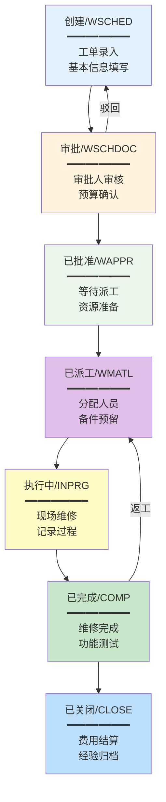
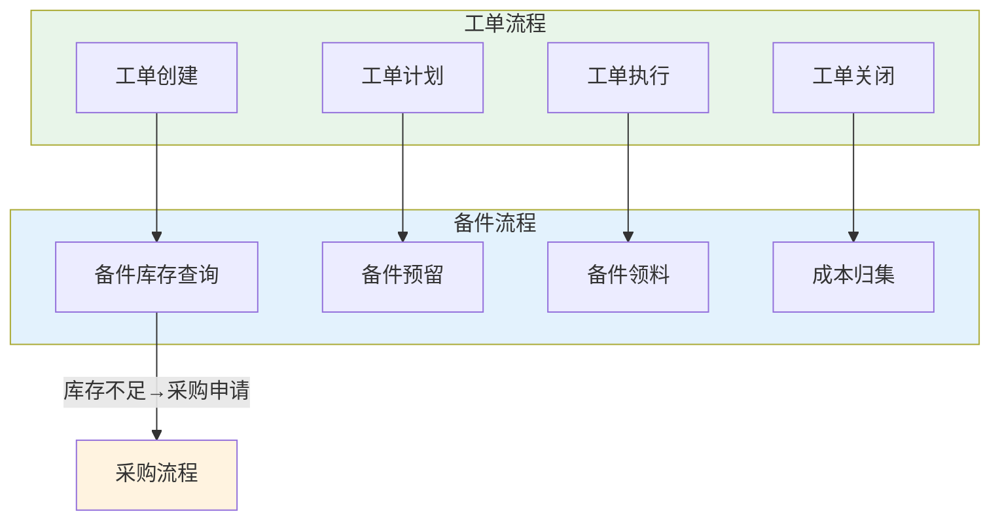
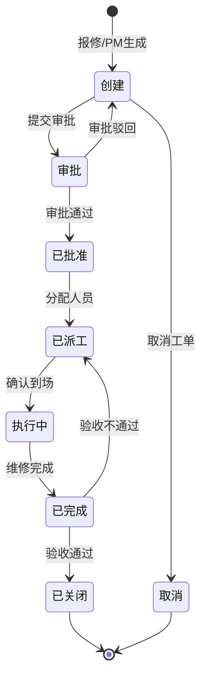

# 工单全生命周期管理

## 工单类型

工单（Work Order）是EAM系统中维修活动的载体，记录了从问题发现到维修完成的全过程信息。不同类型的工单服务于不同的维护场景：

| 工单类型 | 英文 | 触发方式 | 典型场景 |
|---------|------|---------|---------|
| 纠正性工单 | Corrective | 故障报告/异常报警 | 设备突发故障紧急维修 |
| 预防性工单 | Preventive | PM计划自动生成 | 定期保养、计划检修 |
| 检测工单 | Inspection | 检测计划自动生成 | 点检、巡检、安全检查 |
| 紧急工单 | Emergency | 紧急报修 | 安全风险、生产中断 |
| 改善工单 | Improvement | 改善提案 | 设备改造、技术升级 |
| 项目工单 | Project | 项目计划 | 大修项目、安装调试 |

### 工单类型的优先级体系

| 优先级 | 定义 | 响应时间 | 完成时间 | 示例 |
|--------|------|---------|---------|------|
| 紧急 | 安全风险或全厂停产 | 15分钟内响应 | 4小时内 | 安全阀泄漏、全厂断电 |
| 高 | 关键设备停产 | 1小时内响应 | 24小时内 | 主生产线故障 |
| 中 | 部分产能受影响 | 4小时内响应 | 72小时内 | 辅助设备故障 |
| 低 | 不影响生产 | 24小时内响应 | 7天内 | 外观修复、改善提案 |

## 工单状态机

工单的状态流转是工单管理的核心，确保每个工单都有明确的进度跟踪和闭环管理：

### 状态说明

| 状态 | 状态码 | 说明 | 停留时间目标 |
|------|--------|------|------------|
| 创建 | WSCHED | 工单已创建，等待提交审批 | ≤2小时 |
| 审批 | WSCHDOC | 审批人审核中 | ≤4小时（常规）/ ≤30分钟（紧急） |
| 已批准 | WAPPR | 审批通过，等待派工 | ≤4小时 |
| 已派工 | WMATL | 已分配人员，备件已预留 | ≤8小时 |
| 执行中 | INPRG | 维修人员正在现场执行 | 按工单类型 |
| 已完成 | COMP | 维修完成，待验收关闭 | ≤24小时 |
| 已关闭 | CLOSE | 验收通过，费用结算完成 | — |
| 取消 | CAN | 工单被取消 | — |

### 状态转换规则

| 转换 | 条件 | 权限 |
|------|------|------|
| 创建→审批 | 必填字段完整 | 工单创建人 |
| 审批→已批准 | 审批通过 | 审批人 |
| 审批→创建 | 审批驳回（附理由） | 审批人 |
| 已批准→已派工 | 分配维修人员 | 派工调度员 |
| 已派工→执行中 | 维修人员确认到场 | 维修人员 |
| 执行中→已完成 | 维修完成，填写维修记录 | 维修人员 |
| 已完成→已关闭 | 验收通过，费用结算 | 设备主管 |
| 已完成→已派工 | 验收不通过，需要返工 | 验收人 |

## 工单字段

一个完整的工单应包含以下核心信息：

### 基本信息

| 字段 | 说明 | 是否必填 |
|------|------|---------|
| 工单号 | 系统自动生成 | 自动 |
| 工单类型 | 纠正性/预防性/检测/紧急 | 是 |
| 优先级 | 紧急/高/中/低 | 是 |
| 创建日期 | 工单创建时间 | 自动 |
| 目标完成日期 | 期望完成时间 | 是 |

### 设备信息

| 字段 | 说明 | 是否必填 |
|------|------|---------|
| 设备编号 | 关联的资产编号 | 是 |
| 设备名称 | 自动从资产带出 | 自动 |
| 设备位置 | 自动从资产带出 | 自动 |
| 故障代码 | 标准化故障描述 | 是（纠正性工单） |

### 维修信息

| 字段 | 说明 | 是否必填 |
|------|------|---------|
| 故障描述 | 详细的故障现象描述 | 是 |
| 维修方案 | 维修方法和步骤 | 是 |
| 维修结果 | 维修完成后的状态描述 | 是 |
| 故障原因 | 根本原因分析 | 建议填写 |
| 预防建议 | 防止再次发生的建议 | 建议填写 |

### 资源信息

| 字段 | 说明 | 是否必填 |
|------|------|---------|
| 维修人员 | 分配的维修工程师 | 是 |
| 维修工时 | 实际维修时间 | 是 |
| 备件清单 | 消耗的备件列表 | 是 |
| 维修费用 | 人工+备件+外协费用 | 自动计算 |

### 时间信息

| 字段 | 说明 | 用途 |
|------|------|------|
| 创建时间 | 工单创建时刻 | 响应时间计算起点 |
| 响应时间 | 维修人员到场时刻 | 响应时间=响应-创建 |
| 开始时间 | 维修开始时刻 | 维修时间计算起点 |
| 完成时间 | 维修完成时刻 | 维修时间=完成-开始 |
| 验收时间 | 验收通过时刻 | 闭环时间=验收-创建 |
| 关闭时间 | 工单关闭时刻 | 统计分析 |

## 工单审批流程

### 按金额分级审批

| 工单预估费用 | 审批层级 | 审批人 |
|-------------|---------|--------|
| < 5000元 | 一级审批 | 班组长 |
| 5000-20000元 | 二级审批 | 班组长→车间主任 |
| 20000-100000元 | 三级审批 | 班组长→车间主任→设备经理 |
| > 100000元 | 四级审批 | 班组长→车间主任→设备经理→厂长 |

### 按类型差异化审批

| 工单类型 | 审批要求 | 说明 |
|---------|---------|------|
| 紧急工单 | 先执行后审批 | 安全天数内补审 |
| PM工单 | 计划内免审批 | PM计划已审批，工单免审 |
| 外协工单 | 额外审批 | 需采购部门参与审批 |
| 停产工单 | 生产部门会签 | 需生产部门确认停产时间 |

## 工单与备件联动

工单与备件的联动是EAM的核心集成点，确保维修时备件可用性和成本可追溯：

### 联动流程

| 步骤 | 工单操作 | 备件操作 | 系统行为 |
|------|---------|---------|---------|
| 1 | 创建工单 | 查询备件库存 | 根据设备BOM自动推荐备件清单 |
| 2 | 计划工单 | 预留备件 | 系统将备件标记为"预留"状态 |
| 3 | 执行工单 | 领料出库 | 实际领料数量记录到工单 |
| 4 | 关闭工单 | 成本归集 | 备件成本自动归集到工单和成本中心 |

### 备件预留与释放

| 操作 | 说明 | 触发条件 |
|------|------|---------|
| 预留 | 将库存备件标记为某工单专用 | 工单审批通过时自动预留 |
| 部分领料 | 按实际用量从预留中扣减 | 维修执行时领料 |
| 释放 | 取消未使用的预留 | 工单关闭时释放未用预留 |
| 过期释放 | 预留超期未领料自动释放 | 预留超过N天未执行 |

## 维修工时统计

工时统计是维修效率分析和成本归集的基础：

### 工时类型

| 工时类型 | 说明 | 计费方式 |
|---------|------|---------|
| 诊断工时 | 故障诊断和定位时间 | 按技术等级费率 |
| 修理工时 | 实际维修操作时间 | 按技术等级费率 |
| 等待工时 | 等待备件/许可/协调的时间 | 不计费或低费率 |
| 旅行工时 | 赶赴现场的时间 | 按约定费率 |
| 加班工时 | 非正常工作时间的维修 | 按加班费率 |

### 工时统计指标

| 指标 | 计算方式 | 目标 |
|------|---------|------|
| 平均修复时间MTTR | 总修理工时 / 修理次数 | ≤4小时（关键设备） |
| 工时利用率 | 实际修理工时 / 总出勤工时 | ≥70% |
| 单次维修工时 | 各工单的修理工时 | 按设备类型基准 |
| 预防/纠正工时比 | PM工时 / CM工时 | ≥3:1 |

## 工单状态流转图

以下是完整的工单状态流转图，包含所有可能的状态转换：

## 真实案例：Maximo工单管理最佳实践

某大型石化企业使用IBM Maximo管理全厂3000+台设备的维修工单，以下是其工单管理最佳实践：

### 工单分类体系

| 工单大类 | 工单子类 | 占比 | 说明 |
|---------|---------|------|------|
| 纠正性维修(CM) | 紧急维修 | 5% | 安全风险、生产中断 |
| 纠正性维修(CM) | 一般维修 | 20% | 非紧急故障 |
| 预防性维修(PM) | 定期保养 | 45% | PM计划自动生成 |
| 预防性维修(PM) | 定期检测 | 15% | 法定检验、安全检查 |
| 改善维修(IM) | 设备改造 | 10% | 技改项目 |
| 改善维修(IM) | 根因消除 | 5% | 重复故障根因消除 |

### 工单SLA管理

| 工单类型 | 响应SLA | 完成SLA | 超时升级 |
|---------|---------|---------|---------|
| 紧急工单 | 15分钟 | 4小时 | 超时自动通知设备经理 |
| 高优先级 | 1小时 | 24小时 | 超时自动通知班组长 |
| 中优先级 | 4小时 | 72小时 | 超时自动提醒 |
| 低优先级 | 24小时 | 7天 | 周报汇总 |

### 移动端工单执行

| 移动端功能 | 使用场景 | 效果 |
|-----------|---------|------|
| 扫码报修 | 现场发现设备故障 | 1分钟内创建工单 |
| 工单接收 | 维修人员接收派工 | 实时推送，零延迟 |
| 现场拍照 | 记录故障和维修过程 | 证据留存，远程支持 |
| 电子签名 | 验收确认 | 无纸化，即时确认 |
| 离线操作 | 无网络区域 | 支持离线记录，联网后同步 |

### 关键KPI

| 指标 | 目标值 | 实际值 | 评价 |
|------|--------|-------|------|
| 工单按时完成率 | ≥95% | 96.2% | 达标 |
| PM/CM工时比 | ≥3:1 | 3.5:1 | 优秀 |
| 工单一次修复率 | ≥85% | 87.5% | 良好 |
| 平均修复时间MTTR | ≤6小时 | 5.2小时 | 达标 |
| 工单记录完整率 | ≥90% | 93% | 良好 |

## 总结

工单是EAM维修管理的流程载体，工单类型、优先级和状态机的设计直接影响维修效率和数据分析质量。工单与备件的联动确保维修时备件可用、成本可追溯。工单审批流程需要平衡效率和管控——紧急工单先执行后审批，PM工单免审批。移动端工单执行是现代EAM的必要能力，支撑维修工程师的现场作业。Maximo的工单管理最佳实践表明，通过SLA管理、移动端执行和KPI监控，可以实现工单管理的规范化和高效化。
