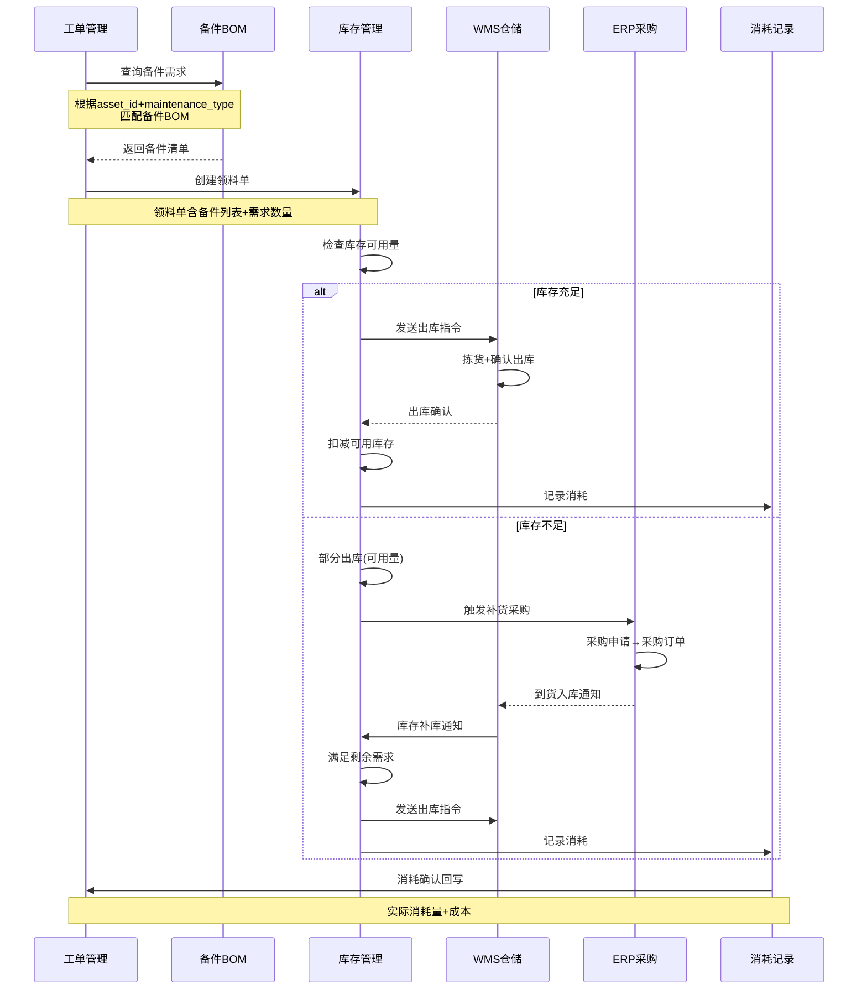
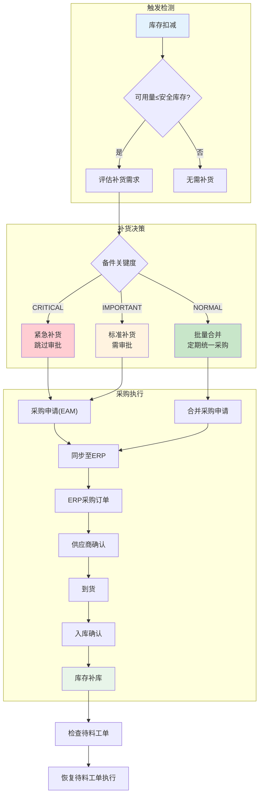
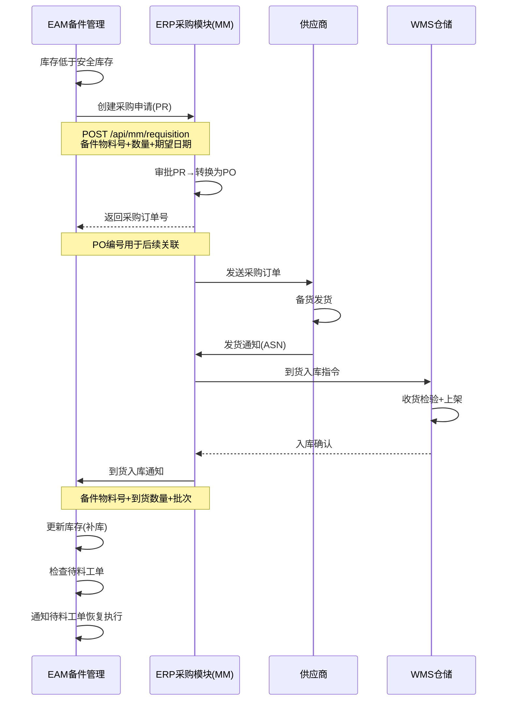
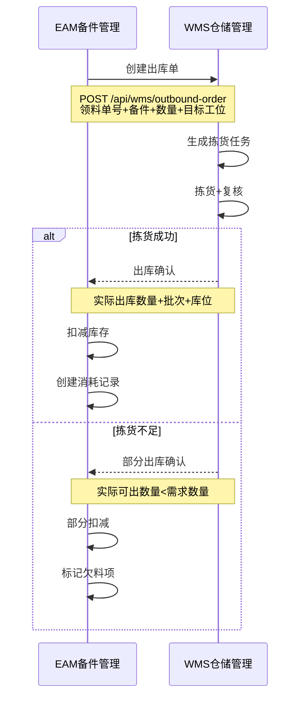

# 备件联动与采购集成

## 工单领料全流程

备件与工单的联动是EAM系统中数据流最密集的环节。从工单发起领料需求到备件消耗记录，涉及EAM内部模块协作和跨系统(EAM↔ERP↔WMS)集成：



## 工单领料流程设计

### 领料单数据结构

```python
from dataclasses import dataclass, field
from typing import List, Optional
from datetime import datetime

@dataclass
class MaterialRequisition:
    """领料单"""
    requisition_id: str           # 领料单号
    work_order_id: str            # 关联工单号
    asset_id: str                 # 关联资产
    requisition_type: str         # 类型：PLANNED(计划领料)/EMERGENCY(紧急领料)
    status: str                   # 状态：PENDING/CONFIRMED/PARTIAL_ISSUED/FULLY_ISSUED/CANCELLED
    items: List['RequisitionItem'] = field(default_factory=list)
    requested_by: str             # 申请人
    requested_at: datetime        # 申请时间

@dataclass
class RequisitionItem:
    """领料单项"""
    item_id: str
    spare_part_id: str            # 备件ID
    spare_part_name: str          # 备件名称
    requested_qty: int            # 需求数量
    available_qty: int            # 可用库存
    issued_qty: int               # 已出库数量
    pending_qty: int              # 待出库数量
    unit: str                     # 单位
    unit_price: float             # 单价
    status: str                   # PENDING/PARTIAL/FULLY_ISSUED/BACKORDERED
    wms_pick_list_id: str = None  # WMS拣货单号
```

### 领料流程实现

```python
class MaterialRequisitionService:
    """领料流程服务"""

    def create_from_work_order(self, wo_id: str) -> MaterialRequisition:
        """从工单创建领料单"""
        wo = WorkOrder.get(wo_id)
        asset = Asset.get(wo.asset_id)

        # 查询备件BOM
        bom_items = SparePartsBOM.filter(
            asset_type=asset.asset_type,
            maintenance_type=wo.wo_type
        ).all()

        requisition = MaterialRequisition(
            requisition_id=self._generate_id(),
            work_order_id=wo_id,
            asset_id=wo.asset_id,
            requisition_type="EMERGENCY" if wo.priority == "URGENT" else "PLANNED",
            status="PENDING",
            requested_by=wo.assigned_technician,
            requested_at=datetime.now(),
        )

        for bom_item in bom_items:
            inventory = SparePartsInventory.get(bom_item.spare_part_id)
            req_item = RequisitionItem(
                item_id=f"{requisition.requisition_id}-{bom_item.spare_part_id}",
                spare_part_id=bom_item.spare_part_id,
                spare_part_name=bom_item.spare_part_name,
                requested_qty=bom_item.required_qty,
                available_qty=inventory.available_qty,
                issued_qty=0,
                pending_qty=bom_item.required_qty,
                unit=bom_item.unit,
                unit_price=inventory.average_unit_price,
                status="PENDING",
            )
            requisition.items.append(req_item)

        requisition.save()
        return requisition

    def issue_materials(self, requisition_id: str) -> dict:
        """执行领料出库"""
        req = MaterialRequisition.get(requisition_id)
        issued_items = []
        backordered_items = []

        for item in req.items:
            if item.available_qty >= item.pending_qty:
                # 库存充足 - 全额出库
                self._issue_to_wms(item, item.pending_qty)
                item.issued_qty += item.pending_qty
                item.pending_qty = 0
                item.status = "FULLY_ISSUED"
                issued_items.append(item)
            elif item.available_qty > 0:
                # 部分出库
                self._issue_to_wms(item, item.available_qty)
                item.issued_qty += item.available_qty
                item.pending_qty -= item.available_qty
                item.status = "PARTIAL"
                backordered_items.append(item)
            else:
                # 无库存
                item.status = "BACKORDERED"
                backordered_items.append(item)

        # 更新领料单状态
        if all(i.status == "FULLY_ISSUED" for i in req.items):
            req.status = "FULLY_ISSUED"
        elif any(i.status in ("FULLY_ISSUED", "PARTIAL") for i in req.items):
            req.status = "PARTIAL_ISSUED"

        req.save()

        # 欠料项自动触发补货
        for item in backordered_items:
            self._trigger_reorder(item, req.work_order_id)

        return {
            "requisition_id": requisition_id,
            "status": req.status,
            "issued_items": len(issued_items),
            "backordered_items": len(backordered_items),
        }
```

## 备件不足自动触发采购

当备件库存低于安全库存时，系统自动触发补货流程。补货请求从EAM发起，经ERP采购模块生成采购订单：



### 自动补货实现

```python
class AutoReorderService:
    """备件自动补货服务"""

    def check_and_reorder(self, spare_part_id: str, trigger_reason: str = ""):
        """检查并触发补货"""
        inventory = SparePartsInventory.get(spare_part_id)
        part = SparePart.get(spare_part_id)

        if inventory.available_qty > inventory.safety_stock:
            return  # 无需补货

        # 计算补货量：补至最高库存水平
        reorder_qty = inventory.max_stock - inventory.available_qty

        # 关键备件加量补货
        if part.criticality == "CRITICAL":
            reorder_qty = max(reorder_qty, inventory.safety_stock * 2)

        # 检查是否已有未完成的补货请求
        existing = ReorderRequest.filter(
            spare_part_id=spare_part_id,
            status__in=["PENDING", "APPROVED", "ORDERED"]
        ).first()

        if existing:
            # 合并补货量
            existing.requested_qty = max(existing.requested_qty, reorder_qty)
            existing.save()
            return

        # 创建补货请求
        request = ReorderRequest.create(
            spare_part_id=spare_part_id,
            spare_part_name=part.name,
            current_qty=inventory.available_qty,
            safety_stock=inventory.safety_stock,
            requested_qty=reorder_qty,
            trigger_reason=trigger_reason or f"库存{inventory.available_qty}≤安全库存{inventory.safety_stock}",
            urgency=self._determine_urgency(part, inventory),
            auto_created=True,
        )

        # 根据紧急度和关键度决定是否自动审批
        if part.criticality == "CRITICAL" and request.urgency == "URGENT":
            request.status = "APPROVED"
            request.save()
            self._sync_to_erp(request)
        elif part.auto_reorder_enabled:
            request.status = "PENDING_APPROVAL"
            request.save()
            self._notify_approver(request)
        else:
            request.status = "PENDING_APPROVAL"
            request.save()
```

## 备件BOM设计

备件BOM(Bill of Material)定义了设备维护所需的标准备件清单，是工单领料的依据：

```python
@dataclass
class SparePartsBOM:
    """备件BOM - 设备维护所需备件清单"""
    bom_id: str                   # BOM ID
    asset_type: str               # 资产类型（按类型匹配，非单台设备）
    maintenance_type: str         # 维护类型：CORRECTIVE/PREVENTIVE/OVERHAUL
    items: List['BOMItem']        # 备件清单

@dataclass
class BOMItem:
    """BOM项"""
    spare_part_id: str            # 备件ID
    spare_part_name: str          # 备件名称
    required_qty: int             # 标准需求数量
    unit: str                     # 单位
    is_mandatory: bool            # 是否必换件
    substitute_parts: List[str]   # 可替代备件ID列表
    estimated_life_hours: float   # 预计寿命(运行小时)
```

### 备件替代关系链

当首选备件缺货时，系统自动查找替代备件：

```python
class SparePartSubstitutionService:
    """备件替代查找服务"""

    def find_substitute(self, spare_part_id: str, required_qty: int) -> List[dict]:
        """查找可替代备件"""
        # 从BOM中获取替代关系
        bom_item = SparePartsBOM.find_item(spare_part_id)
        substitutes = []

        for sub_id in bom_item.substitute_parts:
            sub_part = SparePart.get(sub_id)
            inventory = SparePartsInventory.get(sub_id)

            substitutes.append({
                "spare_part_id": sub_id,
                "name": sub_part.name,
                "available_qty": inventory.available_qty,
                "compatibility": self._check_compatibility(spare_part_id, sub_id),
                "unit_price": inventory.average_unit_price,
                "price_difference": inventory.average_unit_price - self._get_original_price(spare_part_id),
            })

        # 按兼容度+库存排序
        substitutes.sort(key=lambda x: (x["compatibility"], x["available_qty"]), reverse=True)
        return substitutes

    def _check_compatibility(self, original_id: str, substitute_id: str) -> str:
        """检查兼容性等级"""
        orig = SparePart.get(original_id)
        sub = SparePart.get(substitute_id)

        if sub.oem_number == orig.oem_number:
            return "FULL"      # 完全兼容（同一OEM件）
        elif sub.spec_match_score(orig) >= 0.9:
            return "HIGH"      # 高度兼容（规格参数接近）
        elif sub.spec_match_score(orig) >= 0.7:
            return "MEDIUM"    # 中度兼容（部分参数匹配）
        else:
            return "LOW"       # 低兼容（需验证）
```

**替代关系链示例：**

```
首选备件: SKF-6205-2RS (SKF深沟球轴承)
├── 替代1: NSK-6205DDU (NSK同型号) — 兼容度: FULL
├── 替代2: FAG-6205-C-2RS (FAG同型号) — 兼容度: FULL
└── 替代3: GENERIC-6205-2RS (国标通用件) — 兼容度: HIGH
```

## EAM与ERP采购集成

EAM与ERP采购模块的集成覆盖采购申请、采购订单、到货通知和入库确认四个关键环节：



### EAM→ERP采购申请接口

```python
class ERPProcurementIntegration:
    """EAM↔ERP采购集成"""

    def create_purchase_requisition(self, reorder: ReorderRequest) -> dict:
        """在ERP中创建采购申请"""
        part = SparePart.get(reorder.spare_part_id)

        payload = {
            "requisition_type": "NB",
            "plant": part.plant_code,
            "purchasing_group": part.purchasing_group,
            "items": [{
                "material_number": part.erp_material_number,
                "short_text": part.name,
                "quantity": reorder.requested_qty,
                "unit": part.unit,
                "desired_date": self._calculate_desired_date(part.lead_time_days),
                "price": part.last_purchase_price,
                "account_assignment": {
                    "category": "K",
                    "cost_center": part.cost_center,
                },
                "source_requisition": reorder.request_id,
            }]
        }

        response = erp_client.post("/api/mm/purchase-requisition", json=payload)

        # 记录ERP单据号
        reorder.erp_pr_number = response.json()["pr_number"]
        reorder.status = "ORDERED"
        reorder.save()

        return response.json()

    def on_goods_receipt_notification(self, notification: dict):
        """ERP到货入库通知 - EAM侧处理"""
        erp_material = notification["material_number"]
        received_qty = notification["received_qty"]
        batch_number = notification.get("batch_number", "")

        # 查找EAM中对应的备件
        part = SparePart.filter(erp_material_number=erp_material).first()
        if not part:
            return

        # 更新EAM库存
        inventory = SparePartsInventory.get(part.id)
        inventory.available_qty += received_qty
        inventory.in_transit_qty -= min(received_qty, inventory.in_transit_qty)
        if notification.get("unit_price"):
            inventory.average_unit_price = self._update_avg_price(
                inventory, received_qty, notification["unit_price"]
            )
        inventory.save()

        # 检查待料工单
        pending_wos = self._find_pending_work_orders(part.id)
        for wo_id in pending_wos:
            self._resume_work_order(wo_id, part.id, received_qty)
```

### 接口数据映射

| EAM字段 | ERP字段 | 说明 |
|---------|---------|------|
| spare_part.erp_material_number | EBAN.MATNR | 物料编号 |
| spare_part.plant_code | EBAN.WERKS | 工厂 |
| spare_part.purchasing_group | EBAN.EKGRP | 采购组 |
| reorder.requested_qty | EBAN.MENGE | 数量 |
| spare_part.unit | EBAN.MEINS | 单位 |
| spare_part.cost_center | EBAN.KOSTL | 成本中心 |
| reorder.request_id | EBAN.AFNAM | 申请者(用于追溯) |

## EAM与WMS集成

EAM与WMS的集成实现领料出库和消耗记录的闭环管理：



### WMS集成接口设计

```python
class WMSIntegration:
    """EAM↔WMS集成"""

    def create_outbound_order(self, requisition: MaterialRequisition) -> str:
        """向WMS创建出库单"""
        payload = {
            "order_type": "MATERIAL_REQUISITION",
            "source_order": requisition.requisition_id,
            "destination": {
                "work_center": Asset.get(requisition.asset_id).work_center,
                "type": "PRODUCTION_LINE",
            },
            "items": [
                {
                    "material_code": item.spare_part_id,
                    "material_name": item.spare_part_name,
                    "requested_qty": item.pending_qty,
                    "unit": item.unit,
                    "priority": "URGENT" if requisition.requisition_type == "EMERGENCY" else "NORMAL",
                }
                for item in requisition.items
                if item.status in ("PENDING", "PARTIAL")
            ]
        }

        response = wms_client.post("/api/outbound/orders", json=payload)
        return response.json()["outbound_order_id"]

    def on_outbound_confirmed(self, confirmation: dict):
        """WMS出库确认回调"""
        requisition_id = confirmation["source_order"]

        for item_conf in confirmation["items"]:
            # 更新领料单项
            req_item = RequisitionItem.filter(
                requisition_id=requisition_id,
                spare_part_id=item_conf["material_code"]
            ).first()

            actual_qty = item_conf["actual_qty"]
            req_item.issued_qty += actual_qty
            req_item.pending_qty -= actual_qty

            if req_item.pending_qty <= 0:
                req_item.status = "FULLY_ISSUED"
            else:
                req_item.status = "PARTIAL"

            req_item.save()

            # 创建消耗记录
            MaterialConsumption.create(
                work_order_id=req_item.work_order_id,
                spare_part_id=req_item.spare_part_id,
                consumed_qty=actual_qty,
                unit_price=req_item.unit_price,
                batch_number=item_conf.get("batch_number"),
                warehouse_location=item_conf.get("location_code"),
                consumed_at=datetime.now(),
            )
```

### 消耗记录表设计

| 字段名 | 类型 | 说明 |
|--------|------|------|
| consumption_id | VARCHAR(32) | 消耗记录ID，主键 |
| work_order_id | VARCHAR(32) | 关联工单ID |
| spare_part_id | VARCHAR(32) | 备件ID |
| spare_part_name | VARCHAR(200) | 备件名称 |
| consumed_qty | INT | 消耗数量 |
| unit | VARCHAR(10) | 单位 |
| unit_price | DECIMAL(10,2) | 单价 |
| total_cost | DECIMAL(12,2) | 总成本 |
| batch_number | VARCHAR(50) | 批次号 |
| warehouse_location | VARCHAR(20) | 出库库位 |
| consumed_at | DATETIME | 消耗时间 |
| confirmed_by | VARCHAR(32) | 确认人 |

## 库存联动触发器设计

库存联动触发器是备件管理的核心机制，确保库存变化能够及时驱动下游业务：

```python
class InventoryTriggerManager:
    """库存联动触发器管理"""

    # 触发器注册表
    TRIGGERS = {
        "STOCK_BELOW_SAFETY": "on_stock_below_safety",
        "STOCK_ZERO": "on_stock_zero",
        "STOCK_REPLENISHED": "on_stock_replenished",
        "STOCK_EXPIRED": "on_stock_expired",
    }

    def on_stock_deducted(self, spare_part_id: str, deducted_qty: int):
        """库存扣减后的联动检查"""
        inventory = SparePartsInventory.get(spare_part_id)
        part = SparePart.get(spare_part_id)

        # 触发器1: 库存为零
        if inventory.available_qty == 0:
            self._fire_trigger("STOCK_ZERO", spare_part_id, {
                "action": "URGENT_REORDER",
                "notify": ["maintenance_manager", "warehouse_supervisor"],
                "check_pending_wos": True,
            })

        # 触发器2: 库存低于安全库存
        elif inventory.available_qty <= inventory.safety_stock:
            self._fire_trigger("STOCK_BELOW_SAFETY", spare_part_id, {
                "action": "AUTO_REORDER",
                "reorder_qty": inventory.max_stock - inventory.available_qty,
            })

        # 触发器3: 关键备件库存低于2倍安全库存（提前预警）
        if (part.criticality == "CRITICAL" and
            inventory.available_qty <= inventory.safety_stock * 2):
            self._fire_trigger("CRITICAL_SPARE_WARNING", spare_part_id, {
                "action": "EARLY_WARNING",
                "message": f"关键备件{part.name}库存即将降至安全库存以下",
            })

    def on_stock_replenished(self, spare_part_id: str, replenished_qty: int):
        """库存补库后的联动检查"""
        # 触发器: 库存恢复 - 检查待料工单
        pending_wos = WorkOrder.filter(
            status="SUSPENDED",
            suspension_reason="MATERIAL_SHORTAGE",
            spare_parts_required__contains=spare_part_id,
        ).all()

        for wo in pending_wos:
            # 检查该工单所有备件是否已齐套
            if self._check_material_ready(wo):
                wo.status = "DISPATCHED"
                wo.suspension_reason = None
                wo.save()
                self._notify_team(wo.assigned_team, f"工单{wo.wo_id}备件已齐套，可恢复执行")

    def _fire_trigger(self, trigger_name: str, spare_part_id: str, payload: dict):
        """触发联动动作"""
        event_bus.publish(f"inventory.{trigger_name.lower()}", {
            "spare_part_id": spare_part_id,
            "trigger": trigger_name,
            "payload": payload,
            "fired_at": datetime.now(),
        })
```

**触发器矩阵：**

| 触发条件 | 触发器名称 | 联动动作 | 通知对象 |
|----------|-----------|----------|----------|
| 库存=0 | STOCK_ZERO | 紧急补货+工单挂起 | 维修经理、仓库主管 |
| 库存≤安全库存 | STOCK_BELOW_SAFETY | 自动补货 | 采购员 |
| 库存补库 | STOCK_REPLENISHED | 恢复待料工单 | 维修班组 |
| 关键备件≤2×安全库存 | CRITICAL_SPARE_WARNING | 提前预警 | 仓库主管 |
| 备件过期 | STOCK_EXPIRED | 隔离+补货 | 仓库主管、质量工程师 |

## 开发者实战Tips

1. **领料原子性**：领料操作涉及库存扣减和消耗记录创建，必须保证事务原子性。使用数据库事务+补偿机制：先扣库存再写记录，记录写入失败则回滚库存。

2. **备件齐套性检查**：工单恢复执行前必须检查所有备件是否齐套，不能只检查触发了补货的那一项。实现`check_material_ready()`方法扫描工单全部备件需求。

3. **ERP集成幂等键**：使用`EAM领料单号`作为ERP采购申请的幂等键，避免网络重试创建重复采购单。ERP侧也需做相同的幂等校验。

4. **批量合并采购**：普通备件(LOW关键度)的补货请求不应立即发起采购，而是积攒到一定数量或定时（如每周二、周五）合并为一张采购申请，减少采购订单量。

5. **库存快照**：每日定时保存库存快照，用于月度库存报表和库存周转率分析。快照表只存`spare_part_id + date + qty`，数据量可控。
