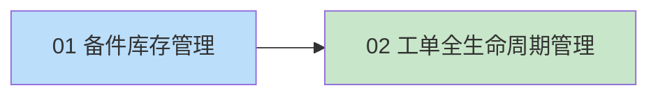

# 备件与工单管理

本章节深入解析EAM中备件库存管理和工单全生命周期管理两大核心模块。备件管理是设备维修的物资保障，工单管理是维修活动的流程载体，两者紧密联动确保维修活动高效执行。

```mermaid
graph LR
    A[01 备件库存管理] --> B[02 工单全生命周期管理]
    style A fill:#bbdefb
    style B fill:#c8e6c9
```
