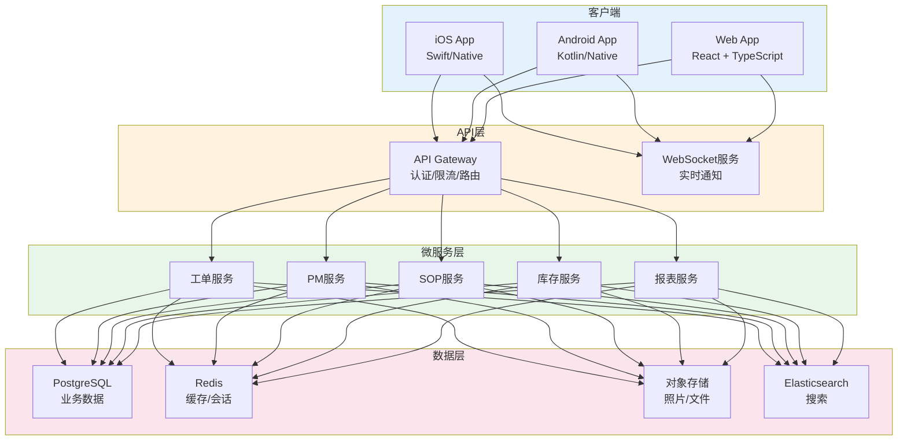

# MaintainX深度解析

## 项目介绍

MaintainX是一款面向中小企业和现场服务团队的现代EAM/CMMS平台，以"移动端优先"为设计理念，专注于SOP标准作业程序、检查单、工单管理和预防性维护。MaintainX在G2和Capterra等软件评价平台上长期位居CMMS类别前列，用户超过10万家企业。

| 项目信息 | 详情 |
|---------|------|
| 产品名称 | MaintainX |
| 产品类型 | SaaS（提供免费版和付费版） |
| 核心定位 | 移动端优先的工单和预防性维护管理 |
| 典型用户 | 中小制造企业、设施管理、现场服务团队 |
| 支持平台 | iOS / Android / Web |
| 官网 | maintainx.com |

## 功能模块

### SOP标准作业程序

| 功能 | 说明 |
|------|------|
| SOP模板库 | 预置行业SOP模板（制造业/食品/能源等） |
| 自定义SOP | 拖拽式SOP编辑器，支持文本/图片/视频 |
| SOP版本管理 | SOP版本控制和变更历史 |
| SOP执行 | 按步骤执行，支持勾选/数值/照片记录 |
| SOP关联 | SOP与设备/工单/PM计划关联 |

### 检查单管理

| 功能 | 说明 |
|------|------|
| 检查单模板 | 预置和自定义检查单模板 |
| 多种题型 | 勾选/数值/下拉/照片/签名/条码扫描 |
| 条件逻辑 | 根据检查结果动态显示后续项 |
| 不合格标记 | 检查不合格自动触发工单 |
| 签名确认 | 检查完成后的电子签名 |

### 工单管理

| 功能 | 说明 |
|------|------|
| 工单创建 | 手动创建或从检查单/PM自动生成 |
| 工单分类 | 纠正性/预防性/检测/改善 |
| 优先级管理 | 紧急/高/中/低四级优先级 |
| 派工调度 | 按技能和可用性分配维修人员 |
| 实时通知 | 工单状态变更即时推送 |
| 照片记录 | 工单执行过程拍照记录 |
| 费用追踪 | 工时和备件成本记录 |

### 预防性维护

| 功能 | 说明 |
|------|------|
| PM计划 | 按日/周/月/年设置维护计划 |
| 条件触发 | 基于运行小时/次数等条件触发 |
| 自动工单 | PM计划自动生成工单 |
| PM日历 | 可视化维护日历 |
| PM完成率 | 跟踪PM计划执行情况 |

### 报表与仪表板

| 功能 | 说明 |
|------|------|
| 工单仪表板 | 工单状态分布、趋势分析 |
| 维护KPI | MTTR/MTBF/完成率等指标 |
| 备件消耗 | 备件消耗统计和趋势 |
| 合规报告 | 检查执行率和合规率 |
| 自定义报表 | 按需配置报表维度和指标 |

## 技术架构

MaintainX作为SaaS产品，其技术架构的核心特点是移动端优先和实时协同：

### 技术特点

| 技术特点 | 说明 |
|---------|------|
| 移动端原生 | iOS和Android原生App，体验流畅 |
| 实时协同 | WebSocket实时推送工单状态变更 |
| 离线支持 | 无网络时仍可执行工单，联网后自动同步 |
| 拍照集成 | 直接调用手机摄像头，拍照即关联 |
| 条码扫描 | 手机摄像头扫码快速定位设备 |
| 消息推送 | iOS/Android推送通知，不遗漏工单 |

## 移动端支持

移动端是MaintainX的核心差异化优势，以下场景均通过移动端完成：

| 移动端场景 | 操作流程 | 价值 |
|-----------|---------|------|
| 扫码报修 | 扫描设备二维码→选择故障→提交工单 | 1分钟内报修 |
| 执行工单 | 接收通知→查看工单→执行维修→拍照记录→提交 | 全流程无纸化 |
| 执行检查单 | 打开检查单→逐项检查→拍照→签名→提交 | 标准化检查 |
| 执行SOP | 选择SOP→按步骤操作→拍照确认→提交 | 操作标准化 |
| 查看PM日历 | 查看今日/本周PM任务→逐项执行 | 维护计划可视化 |
| 备件查询 | 扫码或搜索→查看库存→领料出库 | 快速找件 |

## 部署实践

MaintainX是纯SaaS产品，无需企业自行部署基础设施：

| 部署选项 | 说明 | 适用场景 |
|---------|------|---------|
| 免费版 | 基础工单管理，有限功能 | 小团队试用 |
| 基础版 | 工单+PM+检查单，标准功能 | 中小企业 |
| 专业版 | 全功能+高级报表+集成 | 成长型企业 |
| 企业版 | 高级安全+SSO+自定义+API | 中大型企业 |

### 与企业现有系统集成

| 集成方式 | 说明 |
|---------|------|
| REST API | 开放API与ERP/MES等系统集成 |
| Zapier | 无代码集成5000+应用 |
| Webhook | 事件驱动的实时集成 |
| CSV导入导出 | 批量数据交换 |
| SSO | SAML/OIDC单点登录（企业版） |

## 与商业EAM对比

| 对比维度 | MaintainX | IBM Maximo | SAP PM |
|---------|-----------|------------|--------|
| 定位 | 中小企业/移动优先 | 大型企业/资产密集 | SAP用户/ERP集成 |
| 许可成本 | 低（$33-199/用户/月） | 高（百万级） | 高（SAP许可） |
| 部署周期 | 1-3天 | 6-12个月 | 3-6个月 |
| 移动端 | 原生App，核心优势 | 有App，功能完整 | Fiori App |
| SOP/检查单 | 核心功能 | 需额外模块 | 需额外方案 |
| 预测性维护 | 不支持 | Watson IoT+AI | SAP Predictive Analytics |
| 多工厂 | 支持 | 深度支持 | 原生支持 |
| 自定义 | 有限 | 深度自定义 | ABAP开发 |
| API集成 | REST API+Zapier | 丰富API+中间件 | SAP标准接口 |
| 资产规模 | 百-千级 | 万-十万级 | 万-十万级 |
| 离线操作 | 支持 | 部分支持 | 有限支持 |
| 技术支持 | 在线+邮件 | 专属客户经理 | SAP合作伙伴 |

### MaintainX的独特优势

1. **移动端体验**：原生App+离线支持，现场人员使用体验最佳
2. **快速上手**：1天即可配置完成，1周内全员使用
3. **SOP/检查单**：这是很多传统EAM不具备的能力，对标准化操作管理非常实用
4. **低成本起步**：免费版即可体验核心功能，付费版按用户/月计费

### MaintainX的局限性

1. **无预测性维护**：不支持IoT数据接入和AI分析
2. **备件管理基础**：无ABC分类、无自动补货、无与ERP深度集成
3. **报表能力有限**：无法满足大型企业的复杂报表需求
4. **多工厂管理**：支持但不如Maximo/SAP PM深度
5. **合规性**：不支持严格的审计追踪和合规管理

## 适用场景

### 最适合的场景

- 中小制造企业（50-500人），设备百-千台
- 食品/饮料行业，SOP和检查单管理是核心需求
- 设施管理公司，移动端报修和执行是主要场景
- 作为EAM数字化转型的第一步，快速上线验证价值
- 非关键设备的维护管理

### 不适合的场景

- 大型资产密集型企业（能源/化工/交通）
- 需要IoT预测性维护的场景
- 需要与SAP/Oracle ERP深度集成的企业
- 合规要求严格的行业（核能/制药）
- 资产规模超过1万台的场景

## 总结

MaintainX以移动端优先的设计理念和SOP/检查单的特色功能，在中小企业EAM市场中建立了独特的竞争优势。其SaaS模式降低了使用门槛，1天即可上线，适合作为企业EAM数字化转型的起点。但对于需要预测性维护、深度ERP集成和严格合规管理的场景，仍然需要选择IBM Maximo或SAP PM等企业级方案。
