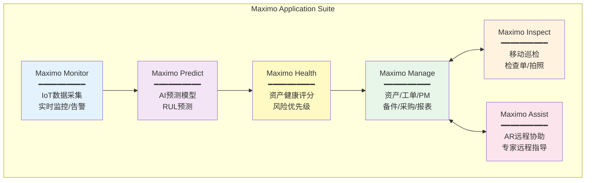
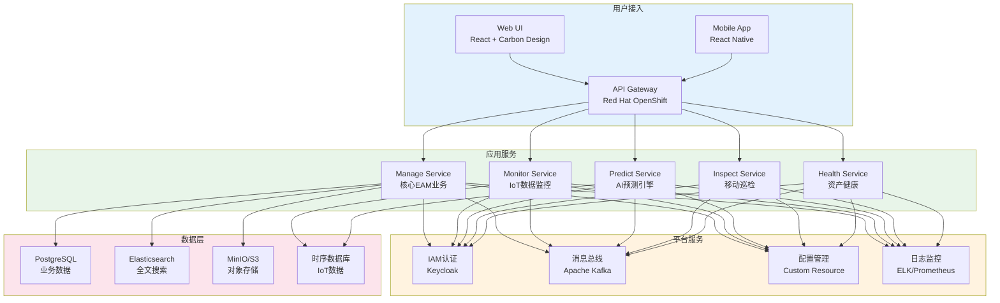
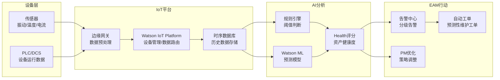

# IBM Maximo架构解析

## IBM Maximo产品家族

IBM Maximo是全球EAM市场的领导者，Gartner魔力象限连续多年位居领导者象限。近年来IBM对Maximo产品线进行了云原生重构，形成Maximo Application Suite（MAS）产品家族：

| 产品 | 全称 | 核心定位 | 包含在MAS中 |
|------|------|---------|------------|
| Maximo Manage | Maximo Application Suite - Manage | 核心EAM功能 | 是 |
| Maximo Monitor | Maximo Application Suite - Monitor | IoT数据监控 | 是 |
| Maximo Predict | Maximo Application Suite - Predict | AI预测性维护 | 是 |
| Maximo Inspect | Maximo Application Suite - Inspect | 移动端巡检 | 是 |
| Maximo Assist | Maximo Application Suite - Assist | AR远程协助 | 是 |
| Maximo Health | Maximo Application Suite - Health | 资产健康度评估 | 是 |



### MAS各模块的协同关系

| 协同场景 | 涉及模块 | 数据流 |
|---------|---------|--------|
| 预测性维护 | Monitor → Predict → Health → Manage | 传感器数据→AI预测→健康评分→自动工单 |
| 移动巡检 | Manage → Inspect | PM计划→巡检任务→检查结果→工单 |
| AR远程维修 | Manage → Assist | 工单→AR远程协助→维修指导→完成记录 |
| 资产优化 | Health → Manage | 健康评分→维护策略优化→PM计划调整 |

## 核心架构

IBM Maximo的传统架构（7.6.x）采用Java EE分层架构，MAS 7.x/8.x则重构为云原生微服务架构：

### 传统架构（Maximo 7.6.x）

```
┌─────────────────────────────────────────────────┐
│                  展示层                          │
│    Maximo UI（JSP/Dojo） │ Maximo Mobile        │
├─────────────────────────────────────────────────┤
│                  应用层                          │
│    Maximo Business Objects (MBO)                │
│    ─── 资产/工单/PM/备件/采购/报表 ───           │
├─────────────────────────────────────────────────┤
│                  框架层                          │
│    Maximo Framework                             │
│    ─── 工作流/安全/集成/报表/审计 ───            │
├─────────────────────────────────────────────────┤
│                  数据层                          │
│    Oracle / SQL Server / DB2                    │
└─────────────────────────────────────────────────┘
```

| 架构层 | 技术 | 说明 |
|--------|------|------|
| 展示层 | JSP + Dojo Toolkit | 传统Web UI，Maximo Mobile为独立App |
| 应用层 | MBO（Maximo Business Objects） | 核心业务逻辑，Java编写 |
| 框架层 | Maximo Framework | 工作流引擎、安全框架、集成框架 |
| 数据层 | Oracle/SQL Server/DB2 | 企业级关系数据库 |

### MAS 7.x云原生架构



### 云原生架构的核心变化

| 维度 | 传统架构（7.6.x） | 云原生架构（MAS 7.x） |
|------|------------------|---------------------|
| 部署方式 | WAS/WebLogic应用服务器 | Red Hat OpenShift容器平台 |
| 前端技术 | JSP + Dojo | React + Carbon Design System |
| 后端技术 | MBO单体 | 微服务（每个MAS应用独立服务） |
| 数据库 | Oracle/SQL Server/DB2 | PostgreSQL |
| 消息队列 | JMS | Apache Kafka |
| 认证 | Maximo内置 | Keycloak（OpenID Connect） |
| 配置管理 | maxconfig配置文件 | Kubernetes Custom Resource |
| 扩展方式 | Java自定义类 | 微服务扩展+API |
| CI/CD | 手动部署 | GitOps自动化部署 |

## MAS 7.x云原生架构详解

### 容器化部署

MAS 7.x基于Red Hat OpenShift容器平台部署，每个MAS应用打包为容器镜像：

| MAS组件 | 容器 | 资源需求 |
|---------|------|---------|
| Manage | maximo-manage | 8CPU/16GB RAM |
| Monitor | maximo-monitor | 4CPU/8GB RAM |
| Predict | maximo-predict | 4CPU/8GB RAM + GPU |
| Health | maximo-health | 4CPU/8GB RAM |
| IoT | maximo-iot | 4CPU/8GB RAM |

### 配置即代码

MAS使用Kubernetes Custom Resource Definition（CRD）管理配置：

| 配置对象 | 说明 | 示例 |
|---------|------|------|
| Suite | MAS套件实例 | 版本、许可、全局配置 |
| Workspace | 工作空间 | 组织隔离、数据分区 |
| Application | 应用实例 | Manage/Monitor/Predict配置 |
| Scenario | 业务场景 | 行业模板、预置配置 |

## 与Watson IoT集成

Watson IoT（现IBM Watson IoT Platform）是Maximo实现预测性维护的核心能力：

### IoT数据流



### AI预测模型

| 模型类型 | 功能 | 适用场景 |
|---------|------|---------|
| 异常检测 | 识别偏离正常模式的数据 | 未知故障模式探索 |
| RUL预测 | 预测剩余使用寿命 | 关键设备维护时机优化 |
| 故障分类 | 自动识别故障类型 | 已知故障模式快速诊断 |
| 健康评分 | 综合评估资产健康状态 | 资产优先级排序 |

## Maximo与SAP集成

Maximo与SAP ERP的集成是大型企业的常见需求，IBM提供多种集成方案：

| 集成方案 | 说明 | 适用场景 |
|---------|------|---------|
| Maximo SAP Adapter | IBM官方适配器，预置集成映射 | 标准集成场景 |
| MIF（Maximo Integration Framework） | Maximo的通用集成框架 | 自定义集成 |
| SAP PI/PO | SAP中间件 | SAP端主导集成 |
| API集成 | REST API直接对接 | 云端集成 |

### 常见集成场景

| 集成场景 | 数据流向 | 频率 |
|---------|---------|------|
| 工单成本过账 | Maximo → SAP FI/CO | 实时 |
| 备件采购 | Maximo → SAP MM | 实时 |
| 备件收货入库 | SAP MM → Maximo | 实时 |
| 固定资产主数据 | SAP FI-AA → Maximo | 批量 |
| 供应商主数据 | SAP MM → Maximo | 批量 |
| 人员组织数据 | SAP HR → Maximo | 批量 |
| 设备停机通知 | Maximo → SAP PP | 准实时 |

## 大规模部署

IBM Maximo在大规模资产部署方面具有丰富经验：

### 典型规模

| 规模 | 资产数量 | 部署架构 | 参考客户 |
|------|---------|---------|---------|
| 小型 | < 5,000 | 单节点 | 中型制造企业 |
| 中型 | 5,000-50,000 | 集群 | 大型制造企业 |
| 大型 | 50,000-200,000 | 多集群+分片 | 能源/交通企业 |
| 超大型 | > 200,000 | 多区域分布式 | 国家电网/石油公司 |

### 大规模部署的关键设计

| 设计要点 | 说明 | 推荐方案 |
|---------|------|---------|
| 数据库分片 | 按业务域或组织拆分数据库 | PostgreSQL分区表+读写分离 |
| 缓存策略 | 减少数据库压力 | Redis多级缓存 |
| 异步处理 | 削峰填谷 | Kafka消息队列 |
| 搜索优化 | 全文检索性能 | Elasticsearch集群 |
| 报表优化 | 批量报表不影响在线 | 独立报表服务器+数据仓库 |
| 高可用 | 消除单点故障 | OpenShift多副本+自动故障转移 |

## 行业解决方案

### 能源行业

| 解决方案 | 核心功能 | 价值 |
|---------|---------|------|
| 输变电设备管理 | 线路巡检、变压器监测、GIS集成 | 减少停电时间、延长设备寿命 |
| 风电场管理 | 风机健康监测、预测性维护 | 降低运维成本、提高发电量 |
| 油气管道管理 | 管道腐蚀监测、合规管理 | 安全合规、泄漏预防 |

### 交通运输

| 解决方案 | 核心功能 | 价值 |
|---------|---------|------|
| 铁路车辆维护 | 车辆检修计划、配件管理 | 准点率提升、安全运营 |
| 港口设备管理 | 起重机/装卸设备维护 | 作业效率提升 |
| 航空MRO | 飞机维修管理、适航合规 | 安全合规、周转效率 |

### 制造业

| 解决方案 | 核心功能 | 价值 |
|---------|---------|------|
| 工厂设备管理 | 生产线设备维护、备件管理 | OEE提升、维护成本降低 |
| 精密设备管理 | CMM/量具校准管理 | 测量精度保证、合规达标 |
| 供应链设备 | 多地点设备统一管理 | 标准统一、成本可控 |

## 总结

IBM Maximo从传统的Java EE单体架构演化为云原生微服务架构（MAS），通过Maximo Application Suite将核心EAM功能与IoT监控、AI预测、移动巡检、AR远程协助和资产健康评估整合为统一平台。Watson IoT+AI的深度集成是Maximo最核心的差异化优势，使其在预测性维护领域处于领先地位。与SAP ERP的成熟集成方案和大规模部署能力，确保了Maximo在大型资产密集型企业中的市场地位。对于10万+资产规模的企业，Maximo仍然是最具竞争力的EAM选择。
