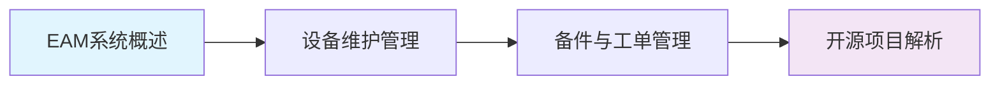

# EAM设备资产

EAM（Enterprise Asset Management，企业资产管理）是以设备资产全生命周期管理为核心，覆盖资产登记、工单管理、预防性维护、备件管理、采购协同与报表分析的企业级管理系统。本课程从EAM基础概念出发，系统阐述设备维护管理、备件与工单管理，并结合开源项目与商业产品进行深度解析。

## 学习路线

## 参考产品

| 产品名称 | 类型 | 特点 | 适用行业 |
|---------|------|------|---------|
| IBM Maximo | 商业 | 资产密集型行业标杆、AI预测性维护、10万+资产规模 | 能源、交通、制造 |
| SAP PM | 商业 | 与SAP ERP深度集成、财务资产一体化 | 流程行业、大型制造 |
| Infor EAM | 商业 | 中端市场定位、行业解决方案丰富 | 制造、公共事业 |
| MaintainX | 开源/SaaS | 移动端优先、SOP/检查单/工单管理 | 中小企业、现场服务 |
| Trac | 开源 | 轻量级工单管理、可定制性强 | 小型团队 |

## 章节目录

| 章节 | 内容概要 |
|------|---------|
| [01_EAM系统概述](./01_EAM系统概述/) | EAM定义、核心概念与数据模型、整体架构 |
| [02_设备维护管理](./02_设备维护管理/) | 预防性维护与TPM、预测性维护与IoT |
| [03_备件与工单管理](./03_备件与工单管理/) | 备件库存管理、工单全生命周期管理 |
| [04_开源项目解析](./04_开源项目解析/) | MaintainX深度解析、IBM Maximo架构解析 |
