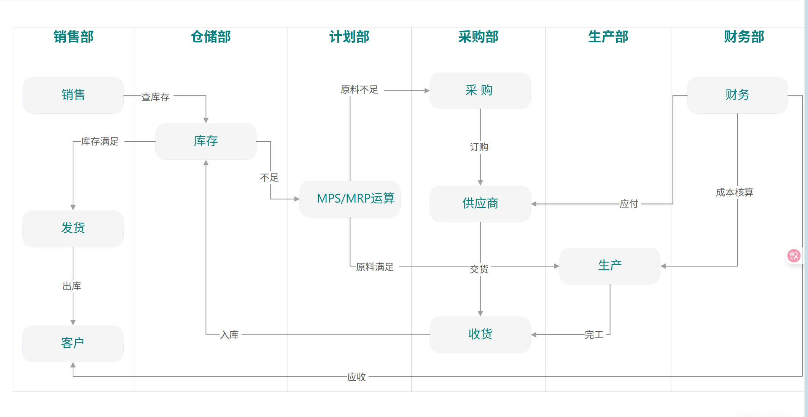

# ERP 系统总览

## 系统定位

ERP（Enterprise Resource Planning，企业资源计划）系统是企业核心业务的数字化中枢，整合采购、销售、生产、MRP、财务五大核心模块，实现业务流、物流、资金流的三流合一。

## 模块架构



## 模块间数据流

```
采购流程:
  采购申请 → 01-采购模块 → 收货入库 → 采购发票 → 应付账款(AP) → 付款 → 总账(GL)

销售流程:
  报价单 → 06-销售模块 → 发货出库 → 销售发票 → 应收账款(AR) → 回款 → 总账(GL)

生产流程:
  生产计划 → 03-生产模块 → 领料出库 → 报工 → 完工入库 → 成本归集 → 总账(GL)

MRP 流程:
  销售预测 → 07-MRP模块 → MRP运算 → 计划订单 → 采购申请/生产工单
```

## 技术架构

| 层 | 技术 | 说明 |
|----|------|------|
| 前端 | Vue 3 / React | SPA 应用 |
| API | ASP.NET Core 8.0 | RESTful API |
| 认证 | OpenIddict (SSO) | OAuth2 + OIDC |
| ORM | Entity Framework Core 8.0 | Code First |
| 数据库 | PostgreSQL | 总数据库 |
| 缓存 | Redis | 会话、热数据 |
| 消息 | RabbitMQ / Kafka | 模块间异步通信 |
| 搜集 | Elasticsearch | 全文检索 |
| 基础架构 | MokFramework | DDD 基类、审计、多租户 |

## DDD 分层（每个模块统一）

```
ModuleName/
├── ModuleName.Domain/              # 领域层：实体、聚合根、领域服务
│   ├── Entities/
│   ├── ValueObjects/
│   ├── DomainServices/
│   └── Events/
├── ModuleName.Domain.Shared/       # 共享层：枚举、常量、Options
├── ModuleName.Application/         # 应用层：AppService、业务编排
│   └── Services/
├── ModuleName.Application.Contracts/ # 契约层：DTO、接口
├── ModuleName.EntityframeworkCore/ # 持久化层：DbContext、Repository
├── ModuleName.Infrastructure/      # 基础设施层：外部集成
└── ModuleName.Web/                 # 表现层：Controller
```

## 全局约定

### 编码规则

| 实体 | 编码格式 | 示例 |
|------|---------|------|
| 供应商 | SUP-{YYYYMM}-{SEQ} | SUP-202401-0001 |
| 客户 | CUS-{YYYYMM}-{SEQ} | CUS-202401-0001 |
| 采购订单 | PO-{YYYYMMDD}-{SEQ} | PO-20240115-0001 |
| 销售订单 | SO-{YYYYMMDD}-{SEQ} | SO-20240115-0001 |
| 生产工单 | WO-{YYYYMMDD}-{SEQ} | WO-20240115-0001 |
| 会计凭证 | PZ-{YYYY}-{MM}-{SEQ} | PZ-2024-01-0001 |

### 狀态机通用模式

```
Draft → Submitted → Approved → InProgress → Completed
                  ↘ Rejected → Draft (可修改后重新提交)
```

### 金额与数量

- 金额：`decimal(18,2)`，精确到分
- 數量：`decimal(18,4)`，支持小数计量
- 汇率：`decimal(18,6)`
- 百分比：`decimal(5,2)`

### 多租户

所有实体实现 `IMultiTenant`，自动按 `TenantId` 隔离数据。

## 文档导航

| 模块 | 文档 |
|------|------|
| [产品研发模块](01-产品研发模块/01-产品研发模块总览.md) | 产品管理、物料管理、BOM、ECN |
| [采购模块](02-采购模块/01-采购模块总览.md) | 供应商、采购订单、收货、发票 |
| [生产模块](03-生产模块/01-生产模块总览.md) | BOM、工单、报工、成本归集 |
| [委外加工模块](04-委外加工模块/01-委外加工模块总览.md) | 委外工单、加工商、委外收货 |
| [库存模块](05-库存模块/01-库存模块总览.md) | 入库、出库、盘点、批次追溯 |
| [销售模块](06-销售模块/01-销售模块总览.md) | 客户、销售订单、发货、回款 |
| [MRP模块](07-MRP模块/01-MRP模块总览.md) | MPS、MRP运算、库存、CRP |
| [财务模块](08-财务模块/01-财务模块总览.md) | 总账、应收、应付、固资、报表 |