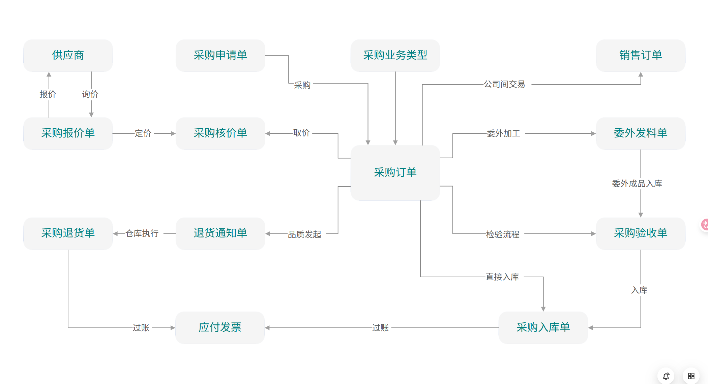

# 采购模块总览

## 模块定位

采购模块管理企业从供应商获取物资和服务的完整流程，涵盖供应商管理、采购申请、采购订单、收货入库、质检和采购发票对账。它是企业供应链的起点，与 MRP（物料需求）、财务（应付账款）、库存（入库）模块紧密集成。

## 模块架构



## 核心实体总览

| 实体 | 编码规则 | 说明 |
|------|---------|------|
| Supplier | SUP-{YYYYMM}-{SEQ} | 供应商主数据 |
| PurchaseRequisition | PR-{YYYYMMDD}-{SEQ} | 采购申请 |
| PurchaseOrder | PO-{YYYYMMDD}-{SEQ} | 采购订单 |
| GoodsReceipt | GRN-{YYYYMMDD}-{SEQ} | 收货单 |
| PurchaseInvoice | PI-{YYYYMMDD}-{SEQ} | 采购发票 |
| PurchaseReturn | PRN-{YYYYMMDD}-{SEQ} | 采购退货 |

## 业务流程概览

```
完整采购流程:

MRP 计划建议 ──┐
              ├──▶ 采购申请(PR) ──审批──▶ 询价/比价 ──▶ 采购订单(PO) ──审批──▶
手工申请 ──────┘                                                           │
                                                                           ▼
                                                                    发送给供应商
                                                                           │
  ┌────────────────────────────────────────────────────────────────────────┘
  │
  ▼
收货入库(GRN) ──质检──▶ 合格入库 ──▶ 采购发票(PI) ──三单匹配──▶ 应付账款(AP)
                  │
                  ▼
              不合格退货(PRN)
```

## 与其他模块的集成

| 集成模块 | 数据流向 | 说明 |
|---------|---------|------|
| MRP → 采购 | 计划订单 → 采购申请 | MRP 运算生成采购建议 |
| 采购 → 库存 | 收货单 → 入库 | 收货确认后更新库存 |
| 采购 → 财务 | 发票 → 应付账款 | 发票登记生成应付 |
| 采购 → 财务 | 收货 → 暂估入账 | 收货时暂估入库 |
| 采购 → 质量 | 收货 → 来料检验 | 收货时触发质检 |

## API 路由前缀

```
/api/purchase/suppliers          供应商管理
/api/purchase/requisitions       采购申请
/api/purchase/orders             采购订单
/api/purchase/goods-receipts     收货管理
/api/purchase/invoices           采购发票
/api/purchase/returns            采购退货
```

## 文档导航

| 义档 | 内容 |
|------|------|
| [供应商管理](02-供应商管理.md) | 供应商主数据、评估、分类 |
| [采购申请与订单](03-采购申请与订单.md) | PR→PO 完整流程、审批 |
| [采购收货与质检](04-采购收货与质检.md) | GRN、质检、退货 |
| [采购发票与对账](05-采购发票与对账.md) | 三单匹配、差异处理 |