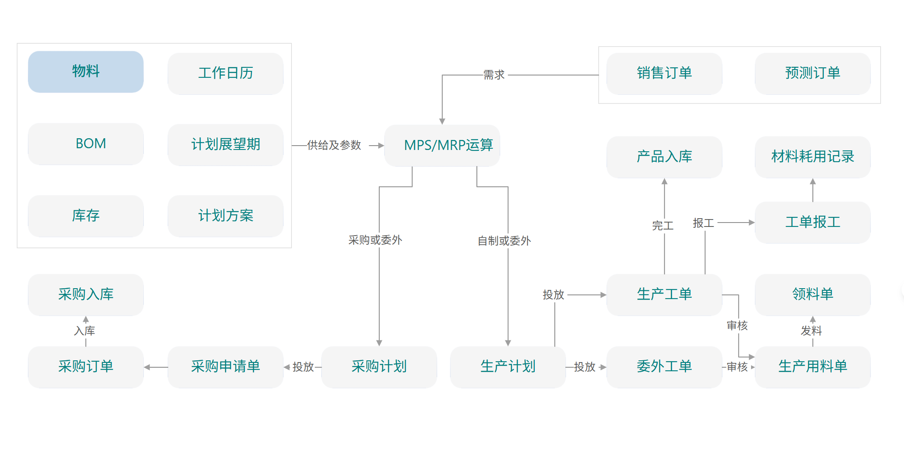

# 生产模块总览

## 模块定位

生产模块管理企业从生产计划到产品完工的完整制造流程，涵盖 BOM（物料清单）管理、工艺路线定义、生产工单执行、车间报工和生产成本归集。它连接 MRP（物料需求）、库存（领料/入库）和财务（成本核算）模块。

## 模块架构



```
┌────────────────────────────────────────────────────────────┐
│                        生产模块                              │
│                                                            │
│  ┌──────────────┐  ┌──────────────┐  ┌──────────────┐    │
│  │  BOM管理      │  │  工艺路线     │  │  工作中心     │    │
│  │              │  │              │  │              │    │
│  │ 物料清单     │  │ 工序定义     │  │ 机台/产线     │    │
│  │ BOM版本      │  │ 工时定额     │  │ 产能定义     │    │
│  │ 替代料       │  │ 工艺流程     │  │ 班次管理     │    │
│  └──────┬───────┘  └──────┬───────┘  └──────┬───────┘    │
│         │                 │                 │             │
│         ▼                 ▼                 ▼             │
│  ┌────────────────────────────────────────────────────┐   │
│  │               生产工单管理 (WO)                      │   │
│  │  创建 → 审批 → 下达 → 领料 → 报工 → 完工入库      │   │
│  └──────────────────────┬─────────────────────────────┘   │
│                         │                                  │
│         ┌───────────────┼───────────────┐                  │
│         ▼               ▼               ▼                  │
│  ┌────────────┐  ┌────────────┐  ┌────────────┐          │
│  │  领料管理   │  │  报工管理   │  │  完工入库   │          │
│  │            │  │            │  │            │          │
│  │ 领料单     │  │ 报工记录   │  │ 完工数量    │          │
│  │ 退料       │  │ 工时       │  │ 成本归集    │          │
│  └────────────┘  └────────────┘  └────────────┘          │
│                                                            │
└────────────────────────────────────────────────────────────┘
```

## 核心实体总览

| 实体 | 编码规则 | 说明 |
|------|---------|------|
| BOM | BOM-{ProductCode}-V{N} | 物料清单 |
| Routing | RT-{ProductCode}-V{N} | 工艺路线 |
| WorkCenter | WC-{SEQ} | 工作中心 |
| WorkOrder | WO-{YYYYMMDD}-{SEQ} | 生产工单 |
| MaterialIssue | MI-{YYYYMMDD}-{SEQ} | 领料单 |
| WorkReport | WR-{YYYYMMDD}-{SEQ} | 报工记录 |

## 业务流程概览

```
MRP/销售订单 → 生产计划 → 创建工单(WO) → 审批下达
                                              │
    ┌─────────────────────────────────────────┘
    │
    ▼
领料出库(MI) → 车间生产 → 工序报工(WR) → 质检 → 完工入库
    │                         │                      │
    ▼                         ▼                      ▼
更新库存                 记录工时/产量          更新库存
材料成本归集              人工成本归集          成本结转
```

## 与其他模块的集成

| 集成模块 | 数据流向 | 说明 |
|---------|---------|------|
| MRP → 生产 | 计划订单 → 工单 | MRP 转化为生产指令 |
| 销售 → 生产 | 销售订单 → 工单 | MTO（按单生产） |
| 生产 → 库存 | 领料单 → 出库 | 原材料出库 |
| 生产 → 库存 | 完工入库 → 入库 | 产成品入库 |
| 生产 → 财务 | 领料 → 材料成本 | 直接材料归集 |
| 生产 → 财务 | 报工 → 人工成本 | 直接人工归集 |
| 生产 → 财务 | 完工 → 产成品成本 | 在制品→产成品 |

## API 路由前缀

```
/api/production/boms               BOM管理
/api/production/routings           工艺路线
/api/production/work-centers       工作中心
/api/production/work-orders        生产工单
/api/production/material-issues    领料管理
/api/production/work-reports       报工管理
```

## 文档导航

| 文档 | 内容 |
|------|------|
| [BOM与工艺路线](02-BOM与工艺路线.md) | 物料清单、工序、工时 |
| [生产工单](03-生产工单.md) | 工单生命周期、排产 |
| [车间执行与报工](04-车间执行与报工.md) | 领料、报工、在制品 |
| [生产成本归集](05-生产成本归集.md) | 料工费归集、完工入库 |
