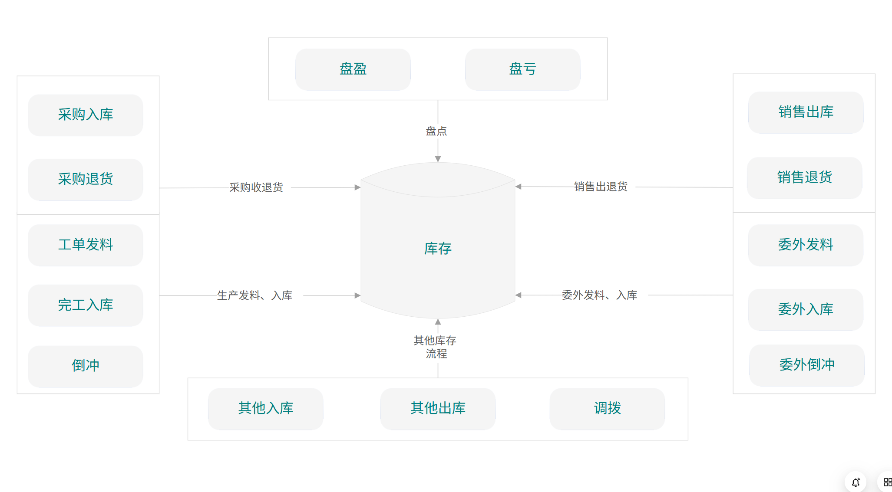

# 库存模块总览

## 模块定位

库存模块是 ERP 系统的物流中枢，管理企业所有物料的存储、流转、追溯和计量。它连接采购（入库）、销售（出库）、生产（领料/完工）三大业务流，为 MRP 提供实时可用量数据，为财务提供存货变动和计价依据。

> **与 MRP 模块的关系**: MRP 模块中的 [库存管理](../04-MRP模块/04-库存管理.md) 文档从计划视角描述库存接口，
> 本模块是库存管理的权威、完整设计，涵盖仓储、出入库、核算、追溯、盘点和报表全流程。

## 一、子系统架构



```
┌─────────────────────────────────────────────────────────────────┐
│                          库存模块                                │
│                                                                 │
│  ┌────────────┐  ┌────────────┐  ┌────────────┐               │
│  │  仓库管理   │  │  入库管理   │  │  出库管理   │               │
│  │            │  │            │  │            │               │
│  │ 仓库/库区   │  │ 采购入库   │  │ 销售出库   │               │
│  │ 库位/货架   │  │ 完工入库   │  │ 生产领料   │               │
│  │ 上架策略   │  │ 退货入库   │  │ 拣货/装箱   │               │
│  │ 条码/RFID  │  │ 质检/上架   │  │ 调拨/报废   │               │
│  └─────┬──────┘  └─────┬──────┘  └─────┬──────┘               │
│        │               │               │                       │
│        └───────────────┼───────────────┘                       │
│                        ▼                                        │
│  ┌──────────────────────────────────────────────────────────┐  │
│  │                  库存核心 (InventoryItem)                  │  │
│  │     在库量 │ 预留量 │ 可用量 │ 在途量 │ 待检量              │  │
│  └──────────────────────┬───────────────────────────────────┘  │
│                         │                                       │
│        ┌────────────────┼────────────────┐                     │
│        ▼                ▼                ▼                     │
│  ┌────────────┐  ┌────────────┐  ┌────────────┐               │
│  │  库存核算   │  │  批次追溯   │  │  盘点调整   │               │
│  │            │  │            │  │            │               │
│  │ 计价方法   │  │ 批次管理   │  │ 全盘/循环   │               │
│  │ 成本层     │  │ 序列号     │  │ 差异处理   │               │
│  │ 到岸成本   │  │ 保质期     │  │ 冻结/解冻   │               │
│  │ ABC分类    │  │ 全链路追溯  │  │ 审批工作流  │               │
│  └────────────┘  └────────────┘  └────────────┘               │
│                         │                                       │
│                         ▼                                       │
│  ┌──────────────────────────────────────────────────────────┐  │
│  │                    库存报表与分析                          │  │
│  │  收发存 │ 库龄 │ 周转 │ 呆滞 │ 利用率 │ KPI仪表板         │  │
│  └──────────────────────────────────────────────────────────┘  │
└─────────────────────────────────────────────────────────────────┘
```

## 二、核心实体总览

| 实体 | 编码规则 | 说明 | 所属文档 |
|------|---------|------|---------|
| Warehouse | - | 仓库 | 02-仓库与库位管理 |
| Zone | - | 库区 | 02 |
| Location | - | 库位 | 02 |
| PutawayStrategy | - | 上架策略 | 02 |
| ReceiptOrder | RO-{YYYYMMDD}-{SEQ} | 入库单 | 03-入库管理 |
| QualityInspection | QI-{YYYYMMDD}-{SEQ} | 质检单 | 03 |
| PutawayTask | (自动) | 上架任务 | 03 |
| IssueOrder | IO-{YYYYMMDD}-{SEQ} | 出库单 | 04-出库管理 |
| PickingTask | (自动) | 拣货任务 | 04 |
| PackingList | PK-{YYYYMMDD}-{SEQ} | 装箱单 | 04 |
| TransferOrder | TO-{YYYYMMDD}-{SEQ} | 调拨单 | 04 |
| InventoryItem | - | 库存物料 | (核心实体) |
| InventoryTransaction | TXN-{YYYYMMDD}-{SEQ} | 库存事务 | (核心实体) |
| InventoryValuation | (期间) | 库存估值 | 05-库存核算 |
| CostLayer | (自动) | 成本层 | 05 |
| LandedCost | LC-{YYYYMMDD}-{SEQ} | 到岸成本 | 05 |
| UOMConversion | - | 计量单位换算 | 05 |
| InventoryRevaluation | RV-{YYYYMMDD}-{SEQ} | 库存重估 | 05 |
| ItemClassification | - | ABC/XYZ分类 | 05 |
| Batch | (用户/自动) | 批次 | 06-批次追溯 |
| SerialNumber | (用户/自动) | 序列号 | 06 |
| ShelfLifeRule | - | 保质期规则 | 06 |
| TraceabilityLink | (自动) | 追溯链接 | 06 |
| RecallOrder | RC-{YYYYMMDD}-{SEQ} | 召回单 | 06 |
| StockCountPlan | (自动) | 盘点计划 | 07-盘点调整 |
| StockCount | SC-{YYYYMMDD}-{SEQ} | 盘点单 | 07 |
| InventoryAdjustment | IA-{YYYYMMDD}-{SEQ} | 库存调整 | 07 |

## 三、核心实体定义

### 3.1 库存物料

```
InventoryItem (库存物料)
├── Id: Guid
├── TenantId: Guid
├── ItemId: Guid                       # 物料主数据ID
├── ItemCode: string(50)
├── ItemName: string(200)
├── WarehouseId: Guid
├── LocationId: Guid?
├── BatchNo: string(50)?              # 批次号
├── SerialNo: string(50)?             # 序列号
├── UnitOfMeasure: string(20)         # 库存基本单位
│
├── OnHandQuantity: decimal(18,4)     # 在库数量
├── ReservedQuantity: decimal(18,4)   # 预留数量
├── AvailableQuantity: decimal(18,4)  # 可用数量 = OnHand - Reserved
├── InTransitQuantity: decimal(18,4)  # 在途数量
├── InspectionQuantity: decimal(18,4) # 待检数量
│
├── UnitCost: decimal(18,6)           # 单位成本
├── TotalCost: decimal(18,2)          # 库存总成本
│
├── LastReceiptDate: DateTime?
├── LastIssueDate: DateTime?
├── ExpiryDate: DateTime?
└── Status: InventoryStatus

枚举:
  InventoryStatus: Available=1, Reserved=2, Inspection=3,
                   Blocked=4, Expired=5
```

### 3.2 库存事务

```
InventoryTransaction (库存事务)
├── Id: Guid
├── TenantId: Guid
├── TransactionNo: string(30)
├── TransactionDate: DateTime
├── TransactionType: InvTransType
├── Direction: Direction               # In=1, Out=2
│
├── ItemId: Guid
├── ItemCode: string(50)
├── WarehouseId: Guid
├── LocationId: Guid?
├── BatchNo: string(50)?
├── SerialNo: string(50)?
│
├── Quantity: decimal(18,4)
├── UnitCost: decimal(18,6)
├── TotalCost: decimal(18,2)
├── UnitOfMeasure: string(20)
│
├── SourceDocumentType: string(20)     # RO/IO/TO/SC/...
├── SourceDocumentId: Guid?
├── SourceDocumentNo: string(50)?
│
├── CounterpartWarehouseId: Guid?      # 调拨对方仓库
├── VoucherId: Guid?                   # 财务凭证
├── OperatorId: Guid
└── Remark: string(200)

枚举:
  InvTransType:
    PurchaseReceipt=1, SalesIssue=2, ProductionIssue=3,
    ProductionReceipt=4, Transfer=5, Adjustment=6,
    Return=7, Scrap=8, InitialStock=9, Other=10
```

## 四、业务流程概览

```
                    ┌─────────────────────────────┐
                    │        入库 (Inbound)        │
                    │  采购│完工│退货│调拨│期初     │
                    └────────────┬────────────────┘
                                 │
                                 ▼
┌──────────┐    ┌────────────────────────────────┐    ┌──────────┐
│  质检     │◀──│          库存核心               │──▶│  盘点     │
│ 合格/退回 │──▶│  在库量 │ 预留 │ 可用 │ 在途    │   │ 差异调整  │
└──────────┘    └────────────────┬───────────────┘    └──────────┘
                                 │
                                 ▼
                    ┌─────────────────────────────┐
                    │        出库 (Outbound)       │
                    │  销售│领料│退货│调拨│报废     │
                    └─────────────────────────────┘
                                 │
                    ┌────────────┼────────────────┐
                    ▼            ▼                ▼
              ┌──────────┐ ┌──────────┐    ┌──────────┐
              │ 库存核算  │ │ 批次追溯  │    │ 库存报表  │
              │ 计价/成本 │ │ 正向/反向 │    │ KPI/分析  │
              └──────────┘ └──────────┘    └──────────┘
```

## 五、与其他模块的集成

| 集成模块 | 数据流向 | 触发事件 | 说明 |
|---------|---------|---------|------|
| 采购 → 库存 | PO/GRN → 入库单 | 采购收货确认 | 创建入库单，触发质检和上架 |
| 销售 → 库存 | SO → 出库单 | 销售发货确认 | 创建出库单，触发拣货和装箱 |
| 生产 → 库存 | WO → 出库/入库 | 领料/完工 | 领料创建出库单，完工创建入库单 |
| MRP → 库存 | 读取可用量 | MRP 运算 | MRP 读取库存计算净需求 |
| 库存 → 财务 | 库存事务 → 凭证 | 出入库确认 | 自动生成财务凭证 |
| 库存 → 财务 | 盘点差异 → 凭证 | 盘点审批 | 盘盈/盘亏生成调整凭证 |
| 库存 → 财务 | 期末估值 → GL | 月末结转 | 存货科目余额同步 |

## 六、API 路由前缀

```
/api/inventory/
├── warehouses/              仓库管理
├── zones/                   库区管理
├── locations/               库位管理
├── putaway-strategies/      上架策略
├── receipt-orders/          入库管理
├── quality-inspections/     质检管理
├── putaway-tasks/           上架任务
├── issue-orders/            出库管理
├── picking-tasks/           拣货任务
├── packing-lists/           装箱管理
├── transfer-orders/         调拨管理
├── items/                   库存查询
├── transactions/            事务查询
├── batches/                 批次管理
├── serial-numbers/          序列号管理
├── traceability/            追溯查询
├── recall-orders/           召回管理
├── shelf-life-rules/        保质期规则
├── valuation/               库存估值
├── cost-layers/             成本层
├── landed-costs/            到岸成本
├── uom-conversions/         计量单位
├── revaluations/            库存重估
├── classifications/         ABC/XYZ分类
├── stock-count-plans/       盘点计划
├── stock-counts/            盘点执行
├── adjustments/             库存调整
├── reserve/                 库存预留
├── unreserve/               取消预留
└── reports/                 库存报表
```

## 七、权限设计

```
inventory
├── warehouse                # 仓库管理
│   ├── view
│   ├── create
│   ├── edit
│   └── delete
├── receipt                  # 入库管理
│   ├── view
│   ├── create
│   ├── confirm
│   └── cancel
├── issue                    # 出库管理
│   ├── view
│   ├── create
│   ├── confirm
│   └── cancel
├── transfer                 # 调拨
│   ├── view
│   ├── create
│   ├── approve
│   └── confirm
├── inspection               # 质检
│   ├── view
│   ├── execute
│   └── disposition
├── batch                    # 批次管理
│   ├── view
│   ├── hold
│   └── release
├── count                    # 盘点
│   ├── view
│   ├── create
│   ├── execute
│   └── approve
├── adjustment               # 库存调整
│   ├── view
│   ├── create
│   └── approve
├── valuation                # 库存核算
│   ├── view
│   ├── revalue
│   └── close_period
├── recall                   # 召回
│   ├── view
│   ├── create
│   └── close
└── report                   # 报表
    ├── operational
    ├── analytical
    └── management
```

## 八、文档导航

| 文档 | 内容 |
|------|------|
| [仓库与库位管理](02-仓库与库位管理.md) | 仓库层级、库区、库位、上架策略、条码 |
| [入库管理](03-入库管理.md) | 采购/完工/退货入库、质检、上架 |
| [出库管理](04-出库管理.md) | 销售/领料出库、拣货策略、装箱、调拨 |
| [库存核算与计量](05-库存核算与计量.md) | 计价方法、成本层、到岸成本、多UOM |
| [批次与序列号追溯](06-批次与序列号追溯.md) | 批次、序列号、保质期、追溯、召回 |
| [盘点与库存调整](07-盘点与库存调整.md) | 全盘/循环盘/抽盘、差异处理、审批 |
| [库存报表与分析](08-库存报表与分析.md) | 收发存、库龄、周转、呆滞、KPI |
