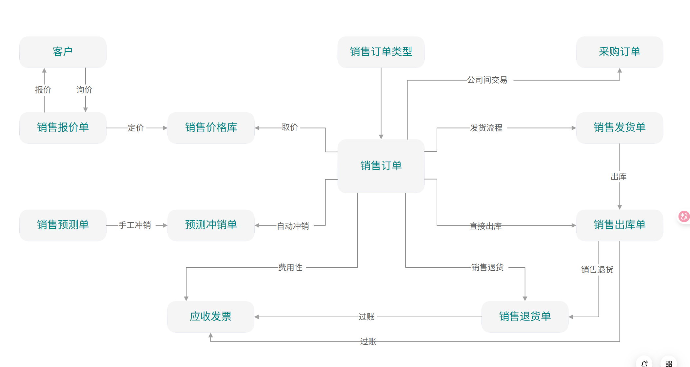

# 销售模块总览

## 模块定位

销售模块管理企业从客户接触到回款的完整销售流程，涵盖客户管理、报价、销售订单、发货、开票和回款。它是企业营收的核心驱动模块，与财务（应收账款）、库存（出库）、生产（按单生产）模块紧密集成。

## 模块架构



```
┌────────────────────────────────────────────────────────────┐
│                        销售模块                              │
│                                                            │
│  ┌──────────────┐  ┌──────────────┐  ┌──────────────┐    │
│  │  客户管理     │  │  报价管理     │  │  价格策略     │    │
│  │              │  │              │  │              │    │
│  │ 客户主数据   │  │ 报价单       │  │ 价目表       │    │
│  │ 信用管理     │  │ 报价审批     │  │ 折扣规则     │    │
│  │ 客户分类     │  │ 报价跟踪     │  │ 促销活动     │    │
│  └──────┬───────┘  └──────┬───────┘  └──────┬───────┘    │
│         │                 │                 │             │
│         ▼                 ▼                 ▼             │
│  ┌────────────────────────────────────────────────────┐   │
│  │               销售订单管理 (SO)                      │   │
│  │  创建 → 审批 → 信用检查 → 备货 → 发货 → 开票      │   │
│  └──────────────────────┬─────────────────────────────┘   │
│                         │                                  │
│         ┌───────────────┼───────────────┐                  │
│         ▼               ▼               ▼                  │
│  ┌────────────┐  ┌────────────┐  ┌────────────┐          │
│  │  发货管理   │  │  开票管理   │  │  退货管理   │          │
│  │            │  │            │  │            │          │
│  │ 发货单DN   │  │ 销售发票    │  │ 退货申请    │          │
│  │ 物流跟踪   │  │ 开票确认   │  │ 退款处理    │          │
│  └────────────┘  └────────────┘  └────────────┘          │
│                                                            │
└────────────────────────────────────────────────────────────┘
```

## 核心实体总览

| 实体 | 编码规则 | 说明 |
|------|---------|------|
| Customer | CUS-{YYYYMM}-{SEQ} | 客户主数据 |
| Quotation | QT-{YYYYMMDD}-{SEQ} | 报价单 |
| SalesOrder | SO-{YYYYMMDD}-{SEQ} | 销售订单 |
| DeliveryNote | DN-{YYYYMMDD}-{SEQ} | 发货单 |
| SalesInvoice | SI-{YYYYMMDD}-{SEQ} | 销售发票 |
| SalesReturn | SR-{YYYYMMDD}-{SEQ} | 销售退货 |

## 业务流程概览

```
完整销售流程:

客户询价 ──▶ 报价单(QT) ──审批──▶ 客户确认 ──▶ 销售订单(SO) ──审批──▶
                                                                      │
  ┌───────────────────────────────────────────────────────────────────┘
  │
  ▼
信用检查 ──▶ 库存检查/备货 ──▶ 拣货/包装 ──▶ 发货(DN) ──▶ 物流跟踪
                                                              │
                                                              ▼
                                              销售发票(SI) ──▶ 应收账款(AR) ──▶ 回款
```

## 与其他模块的集成

| 集成模块 | 数据流向 | 说明 |
|---------|---------|------|
| 销售 → 库存 | 发货单 → 出库 | 发货确认后扣减库存 |
| 销售 → 财务 | 发票 → 应收账款 | 开票后生成应收 |
| 销售 → 财务 | 出库 → 成本结转 | 出库时结转销售成本 |
| 销售 → 生产 | 订单 → 生产工单 | 按单生产 (MTO) |
| 销售 → MRP | 订单 → 需求预测 | 作为需求输入 |
| 财务 → 销售 | 信用额度 → 信用检查 | 下单/发货前检查 |

## API 路由前缀

```
/api/sales/customers              客户管理
/api/sales/quotations             报价管理
/api/sales/orders                 销售订单
/api/sales/delivery-notes         发货管理
/api/sales/invoices               销售发票
/api/sales/returns                销售退货
```

## 文档导航

| 文档 | 内容 |
|------|------|
| [客户管理](02-客户管理.md) | 客户主数据、信用管理 |
| [报价与销售订单](03-报价与销售订单.md) | 报价→SO、价格策略 |
| [发货与物流](04-发货与物流.md) | 出库、发货单、物流跟踪 |
| [销售发票与回款](05-销售发票与回款.md) | 开票、回款、账龄 |
