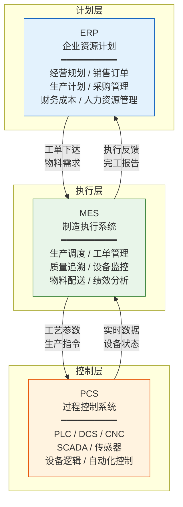
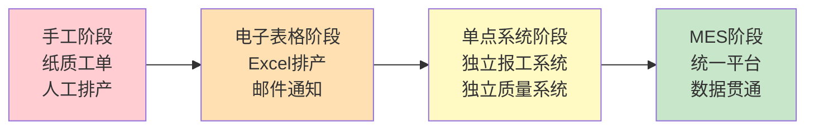

# MES是什么

## MES的定义

MES（Manufacturing Execution System，制造执行系统）是面向车间层的生产信息化管理系统，MESA国际组织将其定义为："MES系统通过信息传递，对从订单下达到产品完成的整个生产过程进行优化管理"。MES不是简单的数据采集系统，而是一个集计划执行、资源调度、质量管控、数据采集于一体的综合管理平台。

## MES在三层架构中的位置

制造业信息化经典的三层架构为：**ERP（计划层）→ MES（执行层）→ PCS（控制层）**。MES处于承上启下的关键位置，是连接企业经营管理和车间生产控制的桥梁。

## MES与ERP的核心区别

MES与ERP虽然都是制造企业的核心信息系统，但两者在管理目标、管理范围、功能定位等方面存在本质差异：

| 对比维度 | ERP | MES |
|---------|-----|-----|
| 管理目标 | 优化企业经营资源 | 优化生产执行过程 |
| 管理范围 | 企业级资源协调 | 车间级生产管控 |
| 管理功能 | 计划、采购、财务、HR | 调度、执行、质量、设备 |
| 实现方式 | 业务流程驱动 | 实时事件驱动 |
| 时间周期 | 天/周/月 | 秒/分钟/小时 |
| 技术要求 | 关系数据库、批处理 | 实时数据库、事件响应 |

## MES填补的"信息黑洞"

在MES出现之前，ERP与PCS之间存在巨大的信息断层——ERP下达工单后，无法实时获知车间执行状态；PCS采集的设备数据，也无法有效反馈到管理层。这个信息断层被称为**"信息黑洞"**，导致以下问题：

- **生产进度不可见**：ERP只能看到工单是否关闭，无法获知工序级执行进度
- **质量数据断链**：来料检验与过程检验数据散落在不同系统，无法形成完整的质量档案
- **设备状态不透明**：管理层无法实时了解设备开动率与故障情况
- **物料流转不可控**：在制品数量靠人工盘点，滞后且不准确

MES的核心价值就在于填补这一信息黑洞，实现从工单下达到产品完工的全过程透明化管理。

## 从手工排产到MES的演进

制造业生产管理方式经历了从手工管理到信息化管理的逐步演进：

1. **手工阶段**：纸质工单、人工排产、口头传达，信息滞后严重
2. **电子表格阶段**：Excel排产、邮件通知，数据分散难以共享
3. **单点系统阶段**：独立的报工系统、质量系统，数据孤岛
4. **MES阶段**：统一平台、数据贯通、实时管控、智能决策

## MES的4P交换功能

根据MESA的定义，MES在企业和供应链间提供4种核心信息交换功能：

| 4P功能 | 英文 | 说明 |
|--------|------|------|
| 生产能力交换 | Production Capability | 向ERP报告可用产能、设备状态、人员配置 |
| 产品交换 | Product | 定义产品如何制造（工艺路线、BOM） |
| 调度交换 | Production Schedule | 接收ERP计划并分解为可执行的工序任务 |
| 绩效交换 | Production Performance | 向ERP反馈生产实绩、质量数据、资源消耗 |

## 总结

MES是制造业数字化转型的核心系统，它在上接ERP、下连PCS的三层架构中承担着关键的执行管控角色。理解MES的定义、定位和核心功能，是深入学习MES各功能模块的基础。下一章将深入MES的核心业务概念与数据模型设计。
