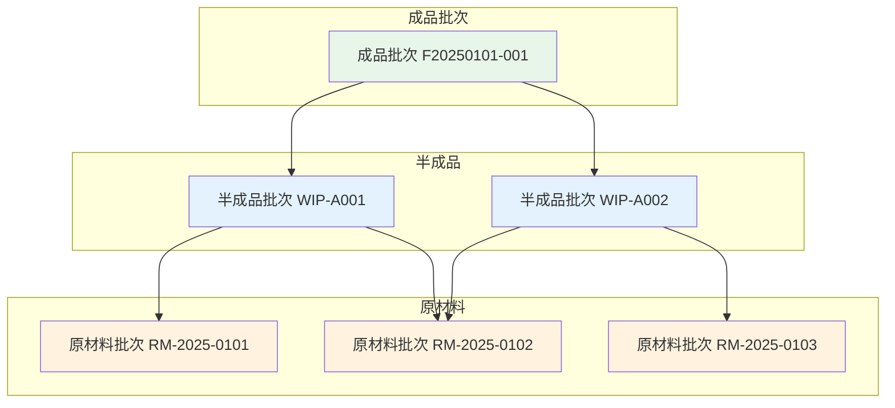
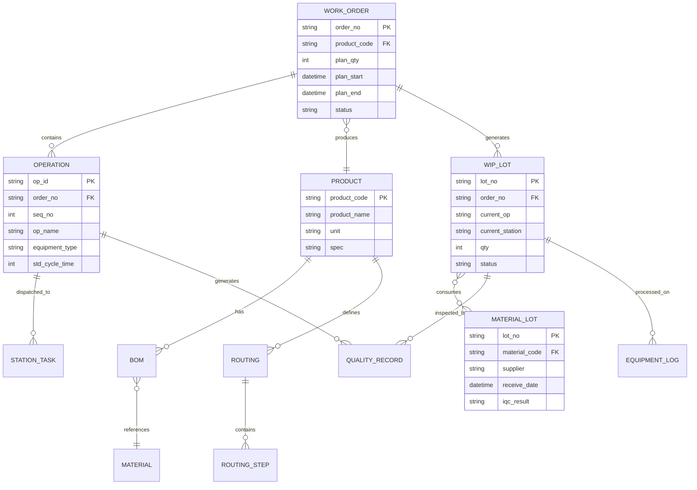

# MES核心概念与数据模型

## 四种核心资源

MES管理的一切业务活动，本质上都是围绕四种核心资源的调度与协调展开的：

### 1. 人力资源

人是生产活动中最具灵活性的资源，也是最难以量化的资源。MES对人力资源的管理包括：

- **人员技能矩阵**：记录每位操作工掌握的工序技能与熟练度等级
- **班次与排班**：管理白班/夜班/三班倒等排班模式
- **资质认证**：关键工序需持证上岗，系统自动校验操作资质
- **绩效统计**：产量、质量、效率等多维度人员绩效评估

### 2. 设备资源

设备是生产能力的物质基础，MES关注设备的可用性与效能：

- **设备台账**：设备基本信息、规格参数、维保记录
- **状态监控**：运行/待机/故障/保养四态实时监控
- **能力日历**：设备可用时间段、保养计划与停机排程
- **产能定义**：设备标准产能（UPH/节拍时间）

### 3. 物料与能源

物料是产品的物质构成，能源是生产过程的驱动力：

- **物料主数据**：物料编码、规格、单位、安全库存
- **BOM（物料清单）**：产品用料结构，驱动配料与领料
- **批次管理**：每批物料的唯一标识，支撑正反向追溯
- **能源计量**：水、电、气等能源消耗的采集与分摊

### 4. 工艺过程链

工艺过程链定义了产品"如何制造"：

- **工艺路线**：工序序列与工序间流转关系
- **工序参数**：每个工序的工艺参数标准与公差范围
- **检验标准**：工序首检/巡检/完工检的检验规范
- **资源绑定**：工序与设备、人员、工装模具的对应关系

## WIP（在制品）引擎概念

WIP（Work In Process，在制品）引擎是MES的核心运行机制。它管理着从原材料投入开始，到成品完工入库为止，所有在制物料的状态、位置与流转。

WIP引擎的核心职责包括：

- **状态追踪**：每件在制品当前处于哪个工序、哪个工位、什么状态
- **流转控制**：根据工艺路线控制物料在工序间的流转方向
- **数量管理**：各工序投入数、产出数、报废数、在制数的精确统计
- **异常处理**：工序中断、返工、报废等异常状态的处理与记录

WIP引擎可以类比为MES的"操作系统内核"——所有业务模块（计划、质量、设备）都通过WIP引擎获取在制品信息并执行相应操作。

## 工单→工序→工位三级模型

MES的生产执行管理遵循三级结构模型：

```
工单（Work Order）
  └── 工序（Operation）
        └── 工位（Station）
```

| 层级 | 说明 | 关键属性 |
|------|------|---------|
| 工单 | 一次生产任务的最小计划单位 | 工单号、产品、计划数量、计划开完工时间 |
| 工序 | 工艺路线中的一个加工步骤 | 工序号、工序名称、标准工时、设备要求 |
| 工位 | 工序在车间物理位置上的执行点 | 工位编号、所属产线、绑定设备、当前作业员 |

## 产品谱系与批次追踪

产品谱系（Genealogy）记录了产品的完整"家谱"——用了哪些批次的物料、经过了哪些工序、由谁在什么时候操作、各工序的工艺参数是多少。这是质量追溯的基础。



## 数据模型ER图

以下为MES核心数据模型的实体关系图：



## MES数据特点

MES系统处理的业务数据具有鲜明的技术特征，理解这些特征对于技术选型至关重要：

### 实时性

MES需要秒级甚至毫秒级的数据采集与响应。设备状态变化、产量计数、报警信号等都需要实时处理。这要求MES具备事件驱动的架构能力，而非传统的请求-响应模式。

### 大量性

一条产线每秒可能产生数百个传感器数据点，一个工厂数十条产线每天产生的数据量可达TB级。MES需要处理海量的时序数据和业务数据。

### 多源性

MES数据来源包括：PLC/传感器实时数据、人工终端输入、ERP系统同步、质量检测设备、AGV物流系统等。不同数据源的采集频率、数据格式、可靠性要求各不相同。

## 实时数据库 vs 关系数据库选型

| 对比维度 | 实时数据库 | 关系数据库 |
|---------|-----------|-----------|
| 典型产品 | InfluxDB、TimescaleDB、PI System | MySQL、PostgreSQL、Oracle |
| 数据模型 | 时序数据（时间戳+值+标签） | 关系表（行+列+约束） |
| 写入性能 | 百万点/秒级 | 万条/秒级 |
| 查询特点 | 时间范围聚合查询 | 关联查询、事务查询 |
| 存储压缩 | 极高压缩比（列存+delta编码） | 常规压缩 |
| 适用场景 | 设备采集数据、工艺参数曲线 | 业务数据、工单/物料/人员 |
| 推荐方案 | 设备数据层使用实时数据库 | 业务数据层使用关系数据库 |

实际项目中，通常采用**混合架构**：实时数据库存储设备采集的高频时序数据，关系数据库存储工单、物料、质量等业务数据，两层之间通过数据同步机制进行关联。

## 总结

MES的核心概念围绕四种资源（人力、设备、物料、工艺）展开，WIP引擎驱动在制品的流转与追踪。工单→工序→工位三级模型是生产执行的基本组织结构，产品谱系支撑完整的质量追溯链。在技术选型上，需要根据MES数据的实时性、大量性、多源性特点，合理选择实时数据库与关系数据库的混合方案。
