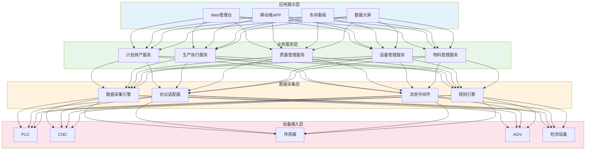
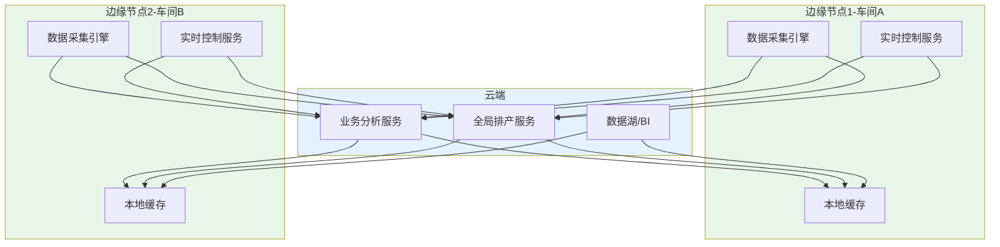

# MES整体架构

## 功能架构（AMR 11功能模块）

AMR Research（现Gartner）提出的MES 11功能模型是业界最广泛认可的MES功能框架：

| 序号 | 功能模块 | 英文 | 核心职责 |
|------|---------|------|---------|
| 1 | 资源分配与状态 | Resource Allocation & Status | 管理设备、人员、物料等资源的可用性与分配 |
| 2 | 操作/详细调度 | Operations/Detail Scheduling | 基于优先级、属性和约束的工序级排产 |
| 3 | 生产单元调度 | Dispatching Production Units | 管理以工作单元或产线为单位的作业流转 |
| 4 | 文档管理 | Document Management | 管理工艺文件、SOP、检验标准等文档 |
| 5 | 数据采集 | Data Acquisition | 采集设备参数、生产计数、质量数据 |
| 6 | 人力管理 | Labor Management | 人员排班、技能资质、出勤与绩效 |
| 7 | 质量管理 | Quality Management | 过程检验、SPC、缺陷分析与追溯 |
| 8 | 过程管理 | Process Management | 监控生产过程，纠正偏差与异常 |
| 9 | 维护管理 | Maintenance Management | 设备保养计划、故障维修、备件管理 |
| 10 | 产品跟踪与谱系 | Product Tracking & Genealogy | 在制品跟踪、批次追溯、产品谱系 |
| 11 | 性能分析 | Performance Analysis | 提供OEE、产量、质量的实时分析 |

不同行业、不同规模的MES实施，并非需要全部11个模块，而是根据实际需求裁剪和组合。

## 技术架构分层

MES技术架构通常采用分层设计，自下而上分为四层：

### 各层职责说明

**设备接入层**：负责与车间现场设备的物理连接，采集设备的运行数据和状态信号。

**数据采集层**：对采集的原始数据进行清洗、转换、聚合，并通过规则引擎实现实时告警和业务规则校验。

**业务服务层**：MES核心业务逻辑的实现层，包含计划、执行、质量、设备、物料等业务微服务。

**应用展示层**：面向不同角色的用户界面，包括管理人员使用的Web管理台、操作工使用的移动端、车间现场的看板和大屏。

## 设备通讯协议

MES与车间设备的通讯是整个系统的数据源头，常见的工业通讯协议包括：

| 协议 | 全称 | 适用场景 | 特点 |
|------|------|---------|------|
| OPC UA | Open Platform Communications Unified Architecture | 通用工业设备互联 | 跨平台、面向服务、安全可靠 |
| Modbus | Modbus Protocol | PLC、仪表 | 简单、成熟、低成本 |
| SECS/GEM | Semi Equipment Communications Standard / Generic Equipment Model | 半导体设备 | 行业标准、事件驱动 |
| MQTT | Message Queuing Telemetry Transport | IoT设备 | 轻量、发布订阅、适合大量终端 |
| MTConnect | Manufacturing Technology Connectivity | 数控机床 | 开放标准、XML数据模型 |

### OPC UA 详解

OPC UA是当前最推荐的工业互联协议，其核心优势：

- **平台无关**：不依赖Windows COM/DCOM，支持Linux/macOS/嵌入式
- **信息模型**：统一的数据模型，支持复杂对象的标准化描述
- **安全机制**：内置加密、认证、授权，满足工业安全要求
- **订阅机制**：支持数据变化通知，减少轮询开销

## 数据采集模式

| 模式 | 原理 | 优点 | 缺点 |
|------|------|------|------|
| 推式（Event-driven） | 设备主动上报数据变化 | 实时性高、网络负载低 | 设备需支持事件推送 |
| 拉式（On-demand） | MES按需查询设备数据 | 灵活、可按需获取 | 非实时、有延迟 |
| 轮询（Polling） | MES定时读取设备寄存器 | 实现简单、兼容性好 | 网络负载高、实时性受轮询周期限制 |

实际项目中通常混合使用：关键参数使用推式实时采集，辅助参数使用轮询低频采集，人工补录数据使用拉式按需获取。

## 部署架构

### 集中式部署

所有MES服务部署在中心机房，各车间通过内网访问。适合工厂规模较小、网络条件好的场景。

- 优点：运维简单、数据集中
- 缺点：中心故障全局影响、网络依赖性强

### 分布式部署

各车间部署独立的MES节点，中心进行统一管理。适合大型集团、多工厂场景。

- 优点：局部故障不影响全局、就近采集降低延迟
- 缺点：运维复杂、数据一致性挑战

### 云边协同部署

边缘节点部署数据采集与实时控制功能，云端部署业务分析与决策功能。这是当前最具前瞻性的部署模式。

## 高可用与容灾设计

MES作为生产核心系统，其可用性直接关系到车间能否正常生产。高可用设计要点：

| 设计维度 | 方案 | 目标 |
|---------|------|------|
| 应用层 | 微服务+容器化+多副本 | 单服务故障不影响其他服务 |
| 数据库层 | 主从复制+读写分离 | 数据库单节点故障可自动切换 |
| 消息中间件 | 集群部署+持久化 | 消息不丢失，服务可恢复 |
| 数据采集层 | 边缘缓存+断点续传 | 网络中断时本地缓存，恢复后补传 |
| 灾备 | 异地备份+定期演练 | RPO<1小时，RTO<4小时 |

核心原则：**生产不因MES故障而停线**。即MES宕机时，车间应能通过纸质SOP和手动操作维持基本生产，MES恢复后进行数据补录。

## 总结

MES的功能架构以AMR 11功能模型为行业参考，技术架构采用四层分层设计。设备通讯以OPC UA为推荐标准，数据采集采用推式/拉式/轮询混合模式。部署架构根据企业规模选择集中式、分布式或云边协同方案。高可用设计确保MES故障不会导致产线停工。
