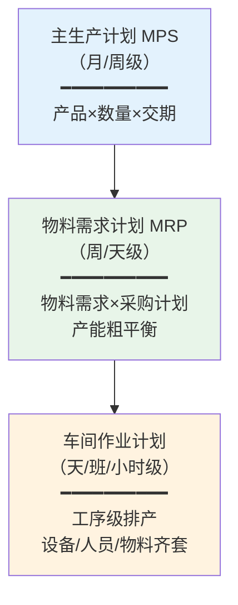
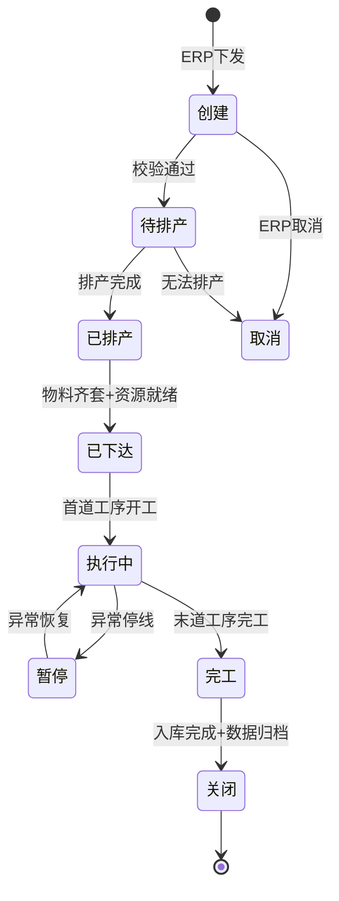
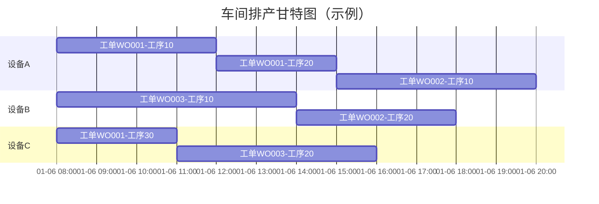

# 生产计划管理

## 生产计划层级

制造业的生产计划通常分为三个层级，从上到下逐步细化和具体化：

| 计划层级 | 缩写 | 计划周期 | 核心内容 | 所属系统 |
|---------|------|---------|---------|---------|
| 主生产计划 | MPS | 月/周 | 确定各产品的生产数量与交期 | ERP |
| 物料需求计划 | MRP | 周/天 | 根据BOM展开物料需求，驱动采购与备料 | ERP |
| 车间作业计划 | - | 天/班/小时 | 工序级排产，确定每台设备做什么 | MES |

三个层级的逻辑关系如下：

## MES接收ERP工单后的分解逻辑

ERP向MES下达工单后，MES需要进行一系列分解操作才能生成可执行的工序任务：

1. **工单接收与校验**：接收ERP工单，校验产品编码、数量、交期等关键字段
2. **工艺路线匹配**：根据产品编码匹配对应的工艺路线（Routing）
3. **工序展开**：将工艺路线中的各工序展开为工序任务
4. **资源匹配**：为每道工序匹配可用的设备、人员、工装
5. **物料齐套检查**：检查工序所需物料是否齐套
6. **排产计算**：根据约束条件计算各工序的计划开始与结束时间
7. **工单下达**：将排产结果下达至车间执行

## 工单状态机

工单从创建到关闭经历多个状态，每个状态之间的转换受业务规则约束：

| 状态 | 说明 | 触发条件 |
|------|------|---------|
| 创建 | 工单刚从ERP下发，待校验 | ERP推送 |
| 待排产 | 校验通过，等待排产 | 校验规则全部通过 |
| 已排产 | 排产完成，等待资源就绪 | 排产引擎计算完成 |
| 已下达 | 资源齐套，可以开工 | 物料+设备+人员全部就绪 |
| 执行中 | 正在生产中 | 首道工序报工开工 |
| 暂停 | 生产暂停 | 设备故障/缺料/质量异常 |
| 完工 | 全部工序完工 | 末道工序报工完工 |
| 关闭 | 工单结束，数据归档 | 入库完成+质量确认 |

## 有限产能 vs 无限产能排产

### 无限产能排产

假设设备产能无限，仅按工艺路线和提前期计算工序计划时间。这是ERP中MRP计算的默认方式。

- **优点**：计算简单，快速得出理论计划
- **缺点**：忽略产能约束，计划往往不可执行
- **适用场景**：产能充裕、产品结构简单的场景

### 有限产能排产

考虑设备、人员、模具等资源的实际可用产能，在约束条件下进行排产。这是MES排产的基本方式。

- **优点**：排产结果可执行性强
- **缺点**：计算复杂，约束建模困难
- **适用场景**：产能紧张、多品种小批量的离散制造

| 对比维度 | 无限产能 | 有限产能 |
|---------|---------|---------|
| 产能假设 | 无限 | 受限 |
| 计算复杂度 | 低 | 高 |
| 计划可执行性 | 弱 | 强 |
| 适用系统 | ERP/MRP | MES/APS |
| 延迟识别 | 计划执行时才发现 | 排产时即可识别 |

## 排产约束条件

MES排产需要同时满足以下约束条件，这些约束条件构成了排产问题的"可行解空间"：

### 设备约束

- 设备只能同时执行一个工序任务
- 设备需具备工序要求的加工能力
- 设备需在排产时间段内处于可用状态（非保养/非故障）

### 人员约束

- 操作工需具备对应工序的技能资质
- 人员在排产时间段内需在岗
- 一人可能同时操作多台设备（看管定额）

### 物料约束

- 工序开工前所需物料必须齐套
- 物料需在工位或线边仓可用
- 替代料需经过审批

### 模具约束

- 模具同一时间只能安装在一台设备上
- 模具有使用寿命限制（模次/时间）
- 换模时间需计入排产

## 计划变更响应机制

生产过程中计划变更是常态，MES需要建立完善的变更响应机制：

| 变更类型 | 触发场景 | 响应策略 |
|---------|---------|---------|
| 急单插单 | 客户紧急订单 | 评估产能→调整优先级→重排产→通知受影响工单 |
| 订单取消 | 客户取消订单 | 冻结未开工工序→释放资源→重排后续计划 |
| 交期变更 | 客户调整交期 | 评估可行性→调整排产优先级 |
| 工程变更 | BOM/工艺变更 | 影响分析→冻结在制→切换新版本 |
| 设备故障 | 设备突发故障 | 转移工序任务→重排产→调整后续计划 |

## 排产结果展示

排产结果通常以**甘特图**的形式直观展示：

甘特图的核心信息包括：每台设备上的任务序列、任务起止时间、设备空闲时段、任务间依赖关系。排产人员可以通过拖拽交互进行手动调整。

## 总结

生产计划管理是MES从"接收计划"到"执行计划"的关键转换环节。MES将ERP的粗粒度工单分解为可执行的工序任务，在有限产能约束下进行排产，并通过工单状态机管控工单的全生命周期。下一章将深入智能排产的核心算法——APS高级计划排程。
