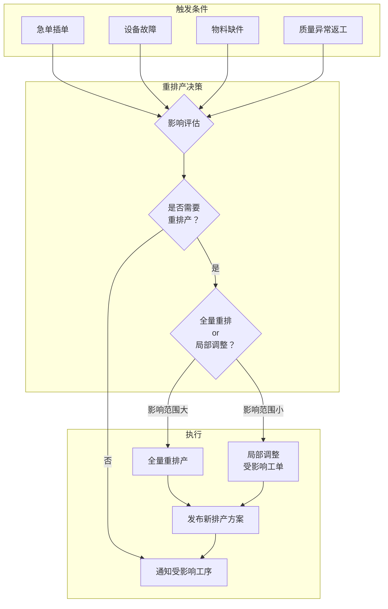
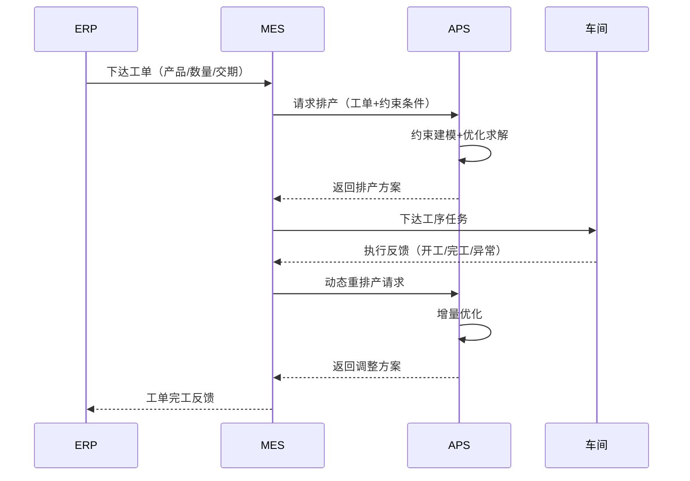

# 智能排产与APS

## APS概述

APS（Advanced Planning and Scheduling，高级计划排程）是MES中排产优化的核心引擎。与传统的手动排产或简单规则排产不同，APS通过数学优化算法和约束建模，在满足多种约束条件的前提下，自动生成近似最优的生产排程方案。

APS解决的核心问题是：**在有限资源（设备、人员、物料、模具）约束下，如何安排生产任务序列，使得一个或多个优化目标达到最优。**

## 核心算法

### 1. 遗传算法（Genetic Algorithm）

遗传算法模拟自然进化过程，通过选择、交叉、变异操作在解空间中搜索最优解。

| 操作 | 说明 | 排产中的映射 |
|------|------|------------|
| 编码 | 将解表示为染色体 | 工序任务序列编码 |
| 选择 | 优胜劣汰 | 保留适应度高的排产方案 |
| 交叉 | 两个体交换部分基因 | 两个排产方案交叉组合 |
| 变异 | 随机改变基因 | 随机调整任务顺序 |
| 适应度 | 评价个体优劣 | 排产目标的综合评分 |

**优点**：全局搜索能力强，适合大规模问题
**缺点**：收敛速度慢，参数调优依赖经验

### 2. 模拟退火算法（Simulated Annealing）

模拟退火算法模拟金属退火过程，以一定概率接受较差的解，避免陷入局部最优。

- **温度参数T**：控制接受劣解的概率，T越高越容易接受
- **降温策略**：T逐渐降低，搜索过程从"探索"转向"利用"
- **Metropolis准则**：以概率 exp(-ΔE/T) 接受劣解

**优点**：可跳出局部最优，实现简单
**缺点**：收敛速度依赖于降温策略，对初始解敏感

### 3. 约束满足算法（Constraint Satisfaction）

约束满足算法直接建模排产问题的约束条件，通过约束传播和回溯搜索找到可行解。

- **约束传播**：当一个变量取值确定后，根据约束削减其他变量的取值范围
- **回溯搜索**：按变量顺序赋值，遇到约束冲突时回溯到上一个决策点
- **变量排序启发式**：优先选择取值范围最小的变量（失败优先策略）

**优点**：天然处理约束，解的可行性有保证
**缺点**：大规模问题搜索空间爆炸，需要大量剪枝

| 算法 | 求解质量 | 求解速度 | 约束处理 | 适用规模 |
|------|---------|---------|---------|---------|
| 遗传算法 | 较好 | 中等 | 需编码到适应度函数 | 大规模 |
| 模拟退火 | 较好 | 中等 | 需编码到目标函数 | 中大规模 |
| 约束满足 | 可行解 | 较慢 | 天然支持 | 中小规模 |

## 排产优化目标

APS的优化目标可以是单目标的，也可以是多目标的（加权组合）：

| 优化目标 | 数学表达 | 业务含义 |
|---------|---------|---------|
| 最小化完工时间 | min C_max | 缩短总生产周期 |
| 最小化换型时间 | min Σ S_ij | 减少设备换型调整 |
| 最大化设备利用率 | max Σ U_k | 提高设备开动率 |
| 最小化交期延迟 | min Σ T_i | 满足客户交期 |
| 最小化在制品库存 | min Σ WIP | 减少在制积压 |
| 最大化产出 | max Σ Q | 提高产量 |

实际项目中通常采用加权多目标：

$$F = w_1 \cdot f_1(\text{交期满足率}) + w_2 \cdot f_2(\text{设备利用率}) + w_3 \cdot f_3(\text{换型时间})$$

权重 $w_i$ 根据企业当前的核心关注点动态调整。

## 排产约束建模

排产问题的约束建模是APS成功的关键。以下为常见约束的形式化描述：

### 时序约束

工序之间存在前后序关系，前序完工后才能开始后序：

$$S_j \geq C_i + T_{transport}, \quad \forall (i,j) \in Precedence$$

其中 $S_j$ 为工序j的开始时间，$C_i$ 为工序i的完工时间，$T_{transport}$ 为工序间转运时间。

### 资源约束

同一设备同一时间只能执行一个工序：

$$S_i + P_i \leq S_j \quad \text{or} \quad S_j + P_j \leq S_i, \quad \forall i,j \text{ on same machine}$$

### 交期约束

所有工序必须在交期前完成：

$$C_{last} \leq D_i, \quad \forall i \in Orders$$

### 物料约束

工序开工前物料必须齐套：

$$S_i \geq T_{material\_ready}, \quad \forall i \in Operations$$

## 动态重排产

生产现场充满不确定性，APS需要支持动态重排产以应对以下突发情况：

### 急单插单处理

1. 评估急单所需资源与现有排产的冲突
2. 计算插入急单后受影响工单的延迟情况
3. 根据优先级规则决定是否插入
4. 重排受影响的工单序列

### 设备故障处理

1. 标记故障设备上的所有待执行工序
2. 寻找可替代设备进行工序转移
3. 若无替代设备，将受影响工序推迟到设备修复后
4. 重排受影响工单的后续工序

### 物料缺件处理

1. 标记缺料工序，暂停其排产
2. 调整后续工序的排产时间
3. 释放受影响设备的产能给其他工单
4. 物料到位后重新排产

## 排产结果评估指标

排产方案生成后，需要通过以下指标评估方案质量：

| 指标 | 计算方式 | 目标 |
|------|---------|------|
| 交期满足率 | 按时交货工单数 / 总工单数 × 100% | ≥ 95% |
| 设备利用率 | 实际加工时间 / 可用时间 × 100% | ≥ 85% |
| 排产可行性 | 可执行工序列数 / 总排产工序列数 × 100% | 100% |
| 平均延迟时间 | 延迟工单延迟时长之和 / 延迟工单数 | 尽量小 |
| 换型次数 | 排产方案中的换型总次数 | 尽量少 |
| 在制品数量 | 各工序在制品数量之和 | 尽量少 |

## APS与ERP/MES协同

APS不是独立运行的，它需要与ERP和MES紧密协同：

### 协同要点

1. **数据同步**：ERP的产品、BOM、工艺路线变更需实时同步到MES/APS
2. **反馈闭环**：车间执行偏差需及时反馈到APS进行重排产
3. **权限边界**：ERP负责中长期计划，APS负责短期排产，车间调度负责实时调整
4. **性能要求**：APS重排产计算时间应在5分钟内完成，否则影响车间响应速度

## 总结

APS是MES智能排产的核心引擎，通过遗传算法、模拟退火、约束满足等优化算法，在多重约束条件下生成近优排产方案。动态重排产能力使APS能够应对急单、故障、缺件等突发情况。排产结果的评估需要综合交期满足率、设备利用率、排产可行性等多维指标。APS与ERP、MES的紧密协同是实现从计划到执行闭环管理的关键。
