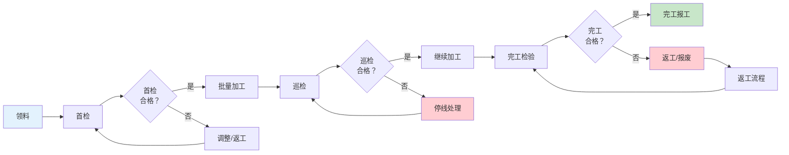
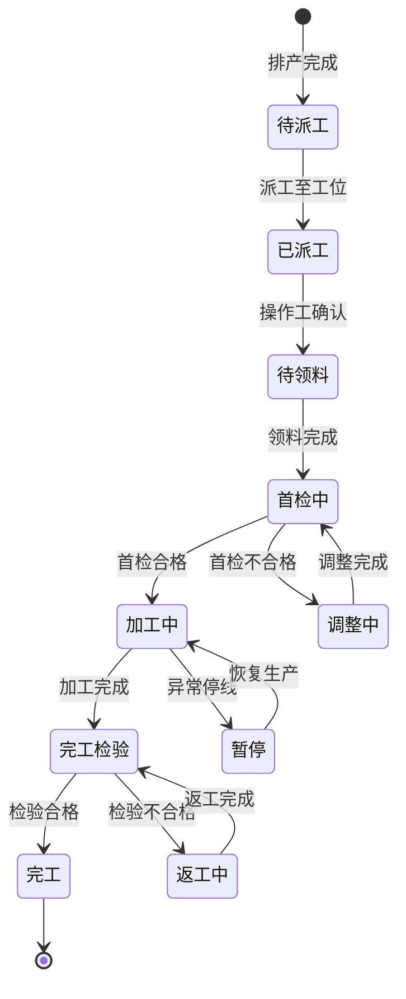

# 工单执行与调度

## 工单下达与派工

工单排产完成后，需要将工序任务派发到具体工位和人员。派工方式分为两种：

### 推式派工（Push Dispatching）

由计划员/系统根据排产结果，主动将工序任务推送到工位和人员。

- **特点**：计划驱动，提前安排
- **适用场景**：产品工艺稳定、节拍均衡的流水线生产
- **风险**：若现场出现异常（设备故障/物料短缺），推式派工的任务可能无法执行，造成等待浪费

### 拉式拉动（Pull System）

由下道工序根据实际需求，向上道工序请求物料或半成品。

- **特点**：需求驱动，按需生产
- **适用场景**：多品种小批量、需求波动大的离散制造
- **优势**：减少在制品积压，快速响应变化

| 对比维度 | 推式派工 | 拉式拉动 |
|---------|---------|---------|
| 驱动方式 | 计划驱动 | 需求驱动 |
| 信息流向 | 前序→后序 | 后序→前序 |
| 在制品量 | 较多 | 较少 |
| 响应灵活性 | 较差 | 较好 |
| 管理复杂度 | 较低 | 较高 |

## 工序任务执行流程

一道工序从开始到完工，通常经历以下标准步骤：

### 各步骤详解

| 步骤 | 执行内容 | 系统操作 |
|------|---------|---------|
| 领料 | 从线边仓领取本工序所需物料 | MES校验物料批次与BOM一致性，记录领料信息 |
| 首检 | 生产首件/首组产品进行质量检验 | MES触发首检任务，记录检验数据，首检合格后方可批量生产 |
| 加工 | 按工艺参数进行批量加工 | MES监控工艺参数，超差时自动报警 |
| 巡检 | 加工过程中按频次抽检 | MES按巡检计划自动触发巡检任务 |
| 完工检验 | 工序完工后全检或抽检 | MES记录检验结果，判定合格/不合格 |
| 完工报工 | 报告工序完工数量与状态 | MES更新WIP状态，推进至下道工序 |

## 车间调度策略

当多道工序竞争同一设备时，需要调度策略决定执行顺序：

### SPT（Shortest Processing Time）- 最短加工时间优先

优先安排加工时间最短的任务。

- **优点**：最大化完成工序数量，减少平均等待时间
- **缺点**：长工序可能长期等待（饥饿问题）
- **适用**：追求产出最大化的场景

### EDD（Earliest Due Date）- 最早交期优先

优先安排交期最近的任务。

- **优点**：最小化最大延迟，满足交期
- **缺点**：可能导致短任务等待过久
- **适用**：交期严格、延迟成本高的场景

### FCFS（First Come First Serve）- 先到先服务

按工序到达设备的先后顺序执行。

- **优点**：简单公平，无需额外信息
- **缺点**：不考虑加工时间和交期，效率不高
- **适用**：信息不充分时的默认策略

### CR（Critical Ratio）- 紧迫系数优先

紧迫系数 = 剩余交期时间 / 剩余加工时间，优先安排CR最小的任务。

- CR < 1：已经落后于计划，需优先处理
- CR = 1：恰好按计划进行
- CR > 1：有充裕时间

| 策略 | 优化目标 | 适用场景 | 可能问题 |
|------|---------|---------|---------|
| SPT | 最大化产出 | 产能紧张 | 长工序饥饿 |
| EDD | 满足交期 | 交期严格 | 短任务延迟 |
| FCFS | 公平简单 | 默认方案 | 效率不高 |
| CR | 综合平衡 | 多目标 | 计算复杂 |

## 生产异常处理

生产现场不可避免地会出现各类异常，MES需要建立规范的异常处理流程：

### 设备故障

1. 操作工通过终端或扫码报修
2. MES自动暂停该设备上所有待执行工序
3. 维修人员接收工单，进行故障诊断与维修
4. 维修完成后，MES恢复设备状态，重新排产受影响工序

### 质量异常

1. 检验发现不合格品，MES记录缺陷信息
2. 判定异常等级：一般异常/重大异常/批量异常
3. 重大异常触发停线，启动8D分析
4. 返工品进入返工流程，报废品进入报废审批流程

### 缺料停线

1. 线边仓物料低于安全库存，MES触发缺料预警
2. 通知物料配送人员补料
3. 若物料暂不可用，MES调整排产，将设备切换至其他可执行的工单
4. 物料到位后恢复原排产

## 工单执行状态流转

## 报工方式

报工是MES采集生产执行数据的关键环节，报工方式的选择直接影响数据的实时性和准确性：

| 报工方式 | 原理 | 实时性 | 准确性 | 适用场景 |
|---------|------|--------|-------|---------|
| 终端报工 | 工位PC/触摸屏上报工 | 高 | 高 | 固定工位、信息化程度高 |
| PDA扫码 | 扫描工单条码/二维码 | 高 | 高 | 移动作业、仓储物流 |
| 设备自动采集 | PLC/传感器自动采集产量 | 最高 | 最高 | 自动化产线、无人值守 |
| 纸质补录 | 纸质记录后统一录入 | 低 | 低 | 过渡期、系统故障时 |

### 报工数据项

一次完整的报工应包含以下数据：

- **基础信息**：工单号、工序号、工位号、操作工
- **产量信息**：投入数、合格数、不合格数、报废数
- **时间信息**：开工时间、完工时间、停机时间
- **质量信息**：首检结果、巡检结果、缺陷代码
- **物料信息**：消耗物料批次、用量
- **设备信息**：使用设备、设备状态、异常记录

### 设备自动采集方案

对于自动化程度较高的产线，MES可通过以下方式实现自动报工：

1. **产量计数**：通过PLC输出点或光电传感器，自动计数产出数量
2. **时间戳**：设备启动/停止信号触发开工/完工时间记录
3. **工艺参数**：实时采集温度、压力、转速等关键工艺参数
4. **设备状态**：运行/待机/故障状态自动同步

设备自动采集的报工数据，经过MES规则引擎校验后，自动更新WIP状态，无需人工干预。

## 总结

工单执行与调度是MES将排产方案转化为生产实绩的关键环节。推式派工与拉式拉动各有适用场景，工序执行遵循"领料→首检→加工→巡检→完工"的标准流程。车间调度策略（SPT/EDD/FCFS/CR）的选择需根据优化目标确定。生产异常的规范处理保证了执行过程的稳定性。报工方式的选择直接影响MES数据的实时性和准确性，自动化采集是未来的发展方向。
