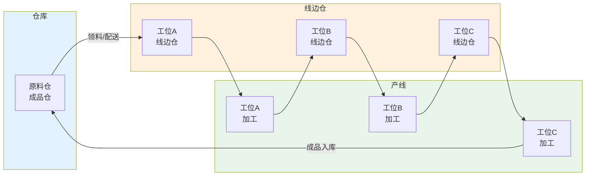
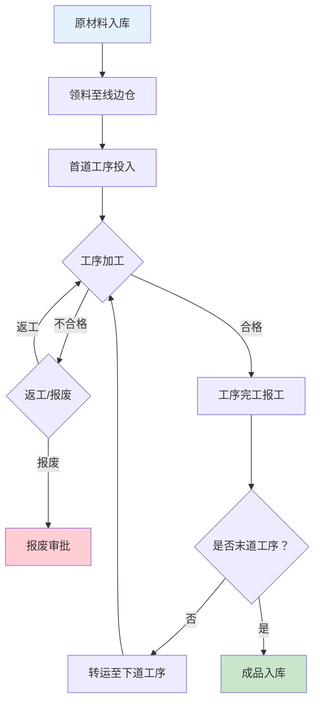

# 在制品WIP管理

## WIP定义与重要性

WIP（Work In Process，在制品）是指从原材料投入生产开始，到成品完工入库为止，处于各工序加工、检验、转运过程中的所有物料和半成品。

在制品是制造过程中不可避免的"中间态"，但过量的WIP会带来严重问题：

| 问题 | 说明 | 影响 |
|------|------|------|
| 占用资金 | 在制品占用物料成本和加工成本 | 降低资金周转率 |
| 隐藏质量风险 | 大量在制品掩盖了质量问题的暴露速度 | 不良品批量产生后才被发现 |
| 延长交期 | 在制品积压导致工序间等待 | 增加生产周期 |
| 占用空间 | 在制品需要存储空间 | 增加车间面积需求 |
| 掩盖管理问题 | WIP像"缓冲器"掩盖了产能不平衡 | 问题得不到根本解决 |

**库存是万恶之源，WIP是最大的库存。** —— 精益生产核心信条

## WIP管控策略

### 看板拉动（Kanban）

看板是精益生产中最经典的WIP控制工具，其核心思想是：**后工序在需要的时候，向前工序领取所需数量的物料。**

看板的运行规则：

1. 后工序携带取料看板到前工序领取物料
2. 前工序只生产被取走数量的物料
3. 没有看板不生产、不搬运
4. 看板数量 = （日需求量 × 生产周期 + 安全库存）/ 单箱数量

### CONWIP（Constant Work In Process）

CONWIP是一种简化的拉动系统，它控制整个生产系统的在制品总量，而非每道工序的在制品量。

- **核心规则**：当一个成品完工离开系统时，才允许一个新的原材料投入系统
- **与看板的区别**：看板控制工序间在制品，CONWIP控制系统总在制品
- **优点**：实现简单，特别适合多品种混线生产

| 对比维度 | 看板（Kanban） | CONWIP |
|---------|--------------|--------|
| 控制粒度 | 每对工序之间 | 整个生产系统 |
| 看板数量 | 多对（每对工序一组） | 一组（系统级） |
| 适用场景 | 重复性生产、产品稳定 | 多品种小批量 |
| 实现复杂度 | 较高 | 较低 |
| WIP分布控制 | 精确控制每道工序 | 只控制系统总量 |

## WIP数量统计与可视化

MES对WIP的管理需要实现精确的实时统计和直观的可视化展示：

### WIP统计维度

| 统计维度 | 说明 | 计算方式 |
|---------|------|---------|
| 按工单 | 每个工单的在制品数量 | 投入数 - 完工数 - 报废数 |
| 按工序 | 每道工序的在制品数量 | 本工序投入数 - 本工序产出数 |
| 按工位 | 每个工位的在制品数量 | 工位当前存留物料数量 |
| 按产品 | 每种产品的在制品数量 | 各工单同产品WIP求和 |
| 按时间 | 各时段在制品数量变化 | 时序统计与趋势分析 |

### 可视化展示

MES通常提供以下WIP可视化工具：

- **车间WIP地图**：以产线平面图为底图，实时标注各工位WIP数量
- **WIP趋势图**：展示WIP数量随时间的变化趋势
- **WIP热力图**：以颜色深浅表示各区域WIP积压程度
- **WIP看板**：在车间大屏上实时展示关键WIP指标

## 线边仓与WIP的关系

线边仓（Line-side Buffer）是生产线的物料暂存区域，位于产线旁边，用于暂存待加工的物料和工序间流转的半成品。

线边仓与WIP的关系：

- 线边仓是WIP的"存放地"，WIP是线边仓的"内容物"
- 线边仓的容量直接影响WIP的上限
- 合理设置线边仓容量 = 控制WIP总量的物理手段

## WIP超时预警

当在制品在某道工序间停留时间超过预设阈值时，MES自动触发超时预警。WIP超时可能意味着：

- 下道工序产能瓶颈
- 设备故障导致后序停工
- 质量问题导致物料滞留
- 物料配送不及时

### 预警机制设计

| 预警等级 | 停留时间 | 响应动作 |
|---------|---------|---------|
| 关注 | 标准流转时间的1.5倍 | 系统提示，记录日志 |
| 预警 | 标准流转时间的2倍 | 通知班组长，排查原因 |
| 报警 | 标准流转时间的3倍 | 通知生产主管，启动异常处理 |

## WIP盘点方法

### 动态盘点

MES基于工单投入、报工完工、报废等事务实时计算WIP，无需人工盘点。

- **优点**：实时、无中断
- **缺点**：依赖报工数据的准确性，累计误差可能偏移

### 循环盘点

按计划定期对部分工位/工序的WIP进行实物盘点，与系统数据核对。

- **优点**：分散进行，不影响生产
- **缺点**：无法一次获得全局WIP快照

### 全量盘点

停产状态下对所有工位进行全面实物盘点。

- **优点**：数据最准确
- **缺点**：需要停产，影响产能

| 盘点方式 | 实时性 | 准确性 | 生产影响 | 适用频率 |
|---------|--------|-------|---------|---------|
| 动态盘点 | 实时 | 依赖报工 | 无 | 持续 |
| 循环盘点 | 周期性 | 较高 | 小 | 每日/每周 |
| 全量盘点 | 时刻点 | 最高 | 大 | 每月/每季 |

## WIP流程图

## 减少WIP的精益生产方法

减少WIP是精益生产的核心目标之一，以下为常用的减少方法：

### 1. 均衡化生产（Heijunka）

通过均衡化排产，避免某道工序集中生产导致下游WIP积压。均衡化要求：

- 每天的生产量尽量均衡
- 混线生产不同产品，避免大批量切换
- 节拍时间标准化

### 2. 单件流（One-Piece Flow）

将传统的批量生产改为单件流转，每完成一件立即传到下道工序。

- 批量生产：100件全部完成A工序 → 100件全部完成B工序 → ...
- 单件流：第1件完成A工序 → 立即进入B工序 → 第2件开始A工序 → ...

| 对比维度 | 批量生产 | 单件流 |
|---------|---------|--------|
| 生产周期 | 长 | 短 |
| 在制品量 | 多 | 少 |
| 质量反馈 | 延迟（批量不良） | 及时（单件不良） |
| 换型要求 | 低 | 高（需快速换模） |

### 3. 快速换模（SMED）

通过内作业转外作业、标准化操作等方法，将换模时间从小时级压缩到分钟级，从而支持小批量多频次生产，减少WIP。

### 4. 缩短生产周期

生产周期 = 加工时间 + 等待时间 + 搬运时间 + 检验时间

减少WIP的关键是压缩等待时间（等待时间是WIP的最大组成部分）：

- 减少工序间等待 → 看板拉动
- 减少设备换型等待 → SMED快速换模
- 减少检验等待 → 首检/巡检即时判定
- 减少搬运等待 → 产线布局优化

## 总结

WIP管理是MES执行层的核心功能，过量的在制品会占用资金、隐藏质量风险、延长交期。看板拉动和CONWIP是两种经典的WIP管控策略，MES通过实时统计与可视化展示WIP状态。线边仓是WIP的物理载体，WIP超时预警帮助及时发现生产瓶颈。减少WIP的根本方法在于精益生产理念——均衡化生产、单件流、快速换模、缩短生产周期。
