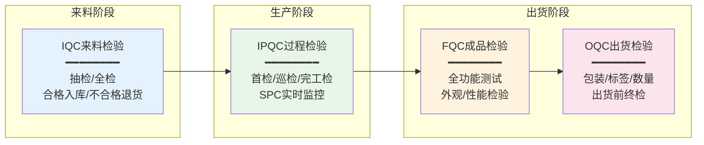
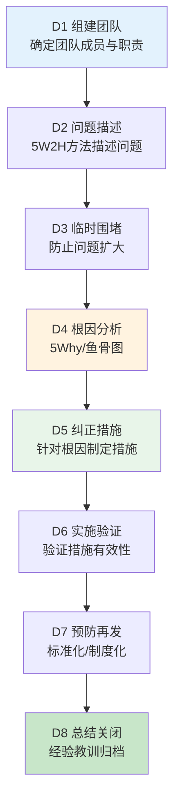
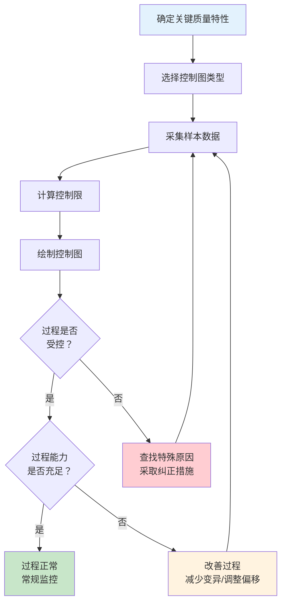

# 质量检验与SPC

## 质检类型

MES中的质量检验贯穿生产全过程，不同阶段的检验有不同的目的和方法：

| 质检类型 | 英文 | 检验时机 | 检验对象 | 目的 |
|---------|------|---------|---------|------|
| 来料检验 | IQC (Incoming Quality Control) | 物料入库前 | 供应商来料 | 防止不合格物料流入生产 |
| 过程检验 | IPQC (In-Process Quality Control) | 生产过程中 | 在制品/半成品 | 监控过程稳定性，及时发现异常 |
| 成品检验 | FQC (Final Quality Control) | 全部工序完工后 | 成品 | 确认成品是否符合出货标准 |
| 出货检验 | OQC (Outgoing Quality Control) | 出货前 | 待出货成品 | 确保交付客户的产品合格 |

### 各类型检验在MES中的实现

## SPC统计过程控制原理

SPC（Statistical Process Control，统计过程控制）是利用统计学方法对生产过程进行监控与控制的工具。其核心思想是：**区分过程的随机波动与异常波动，通过控制图实时监控过程状态，在产生不合格品之前进行预防性调整。**

### 波动的两类原因

| 波动类型 | 原因 | 特征 | 处理方式 |
|---------|------|------|---------|
| 随机波动（普通原因） | 设备微小振动、材料微小差异、环境微小变化 | 不可避免、幅度小、统计可预测 | 接受，不需调整 |
| 异常波动（特殊原因） | 设备故障、原材料批次差异、操作失误 | 可避免、幅度大、统计异常 | 查明原因，消除异常 |

SPC的目标就是及时发现异常波动并消除其影响。

## 控制图类型

控制图是SPC的核心工具，根据数据类型的不同，选用不同的控制图：

### 计量值控制图（连续数据）

| 控制图 | 适用场景 | 样本量 | 特点 |
|--------|---------|--------|------|
| Xbar-R（均值-极差） | 过程监控首选 | 2~9 | 最常用，检出力好 |
| Xbar-S（均值-标准差） | 样本量较大时 | ≥10 | 标准差比极差更精确 |

### 计数值控制图（离散数据）

| 控制图 | 适用场景 | 数据类型 | 特点 |
|--------|---------|---------|------|
| P图（不合格率） | 监控过程不合格率 | 不合格品数/样本量 | 样本量可变 |
| C图（缺陷数） | 监控单位产品缺陷数 | 缺陷数 | 样本量固定 |

### 控制图的判异规则

以下8种情况表示过程出现异常（以Western Electric规则为基础）：

1. 一个点落在A区以外（超出控制限）
2. 连续9个点落在中心线同一侧
3. 连续6个点递增或递减
4. 连续14个点交替上下
5. 连续3个点中有2个点落在中心线同一侧B区以外
6. 连续5个点中有4个点落在中心线同一侧C区以外
7. 连续15个点落在中心线两侧C区内
8. 连续8个点落在中心线两侧且无一在C区内

MES的SPC模块会自动检测以上判异规则并触发预警。

## 过程能力指数Cp/Cpk

过程能力指数衡量过程满足规格要求的能力，是SPC分析的核心指标。

### Cp（过程能力指数）

$$Cp = \frac{USL - LSL}{6\sigma}$$

Cp只衡量过程的"潜在能力"，不考虑过程均值是否偏离规格中心。

### Cpk（修正过程能力指数）

$$Cpk = \min\left(\frac{USL - \mu}{3\sigma}, \frac{\mu - LSL}{3\sigma}\right)$$

Cpk同时考虑过程的变异和偏移，是实际的过程能力指标。

### Cp/Cpk解读

| Cpk值 | 等级 | 过程评价 | 建议措施 |
|-------|------|---------|---------|
| Cpk < 1.0 | 不合格 | 过程能力不足 | 必须改进，100%全检 |
| 1.0 ≤ Cpk < 1.33 | 勉强 | 过程能力勉强 | 需要改进，加强监控 |
| 1.33 ≤ Cpk < 1.67 | 良好 | 过程能力充足 | 维持现状，常规监控 |
| Cpk ≥ 1.67 | 优秀 | 过程能力充分 | 可考虑降低检验频次 |

> 注：汽车行业通常要求关键特性Cpk ≥ 1.67，一般特性Cpk ≥ 1.33。

## 质量异常处理流程（8D报告）

当MES检测到质量异常时，通常采用8D（Eight Disciplines）方法进行系统性分析：

## 质量数据采集与自动判定

MES的质量管理模块需要实现检验数据的电子化采集和自动判定：

### 数据采集方式

| 采集方式 | 说明 | 适用场景 |
|---------|------|---------|
| 人工录入 | 检验员在终端输入检验数据 | 目视检验、手感判断 |
| 仪器直连 | 检测设备通过接口自动传输数据 | CMM三坐标、光谱仪 |
| 在线检测 | 生产过程中实时采集检测数据 | 视觉检测、称重、测厚 |

### 自动判定逻辑

MES根据检验标准自动判定合格/不合格：

1. **计量值判定**：测量值是否在规格上下限内
2. **计数值判定**：缺陷数是否超过允收数（AQL抽样标准）
3. **SPC判定**：控制图是否出现异常模式
4. **综合判定**：所有检验项合格则整体合格，任一项不合格则整体不合格

## SPC应用流程图

### SPC实施步骤

1. **识别关键特性**：根据FMEA（失效模式与影响分析）识别对产品质量影响最大的关键特性
2. **制定采样方案**：确定采样频率、样本量、采样方法
3. **建立控制图**：采集25~30组数据，计算初始控制限
4. **过程监控**：持续采集数据，绘制控制图，判异预警
5. **过程改善**：针对异常进行根因分析和改善
6. **能力评估**：定期评估Cpk，确保过程能力满足要求

## 零缺陷管理理念

零缺陷（Zero Defects）由Philip Crosby提出，其核心观点是**"质量是免费的"**——第一次就把事情做对的成本最低。

零缺陷管理的四项基本原则：

1. **质量定义**：质量就是符合要求，不是"好"或"优秀"
2. **质量系统**：预防产生质量，而非检验产生质量
3. **质量标准**：零缺陷是唯一可接受的工作标准
4. **质量度量**：用不符合要求的代价（POC）来衡量质量

在MES中，零缺陷理念的落地体现为：

- **防错设计**：通过系统强制校验，防止错误操作
- **强制检验**：关键工序必须完成检验后才能流转
- **实时预警**：SPC异常即时报警，而非事后发现
- **根因分析**：每次异常都进行8D分析，消除根本原因

## 总结

质量检验贯穿来料（IQC）、过程（IPQC）、成品（FQC）、出货（OQC）四个阶段。SPC通过控制图区分随机波动与异常波动，实现对过程的预防性控制。Cp/Cpk是评估过程能力的核心指标，汽车行业要求Cpk≥1.33~1.67。质量异常处理采用8D方法论进行系统分析。MES实现检验数据电子化采集与自动判定，支撑零缺陷管理理念的落地。
