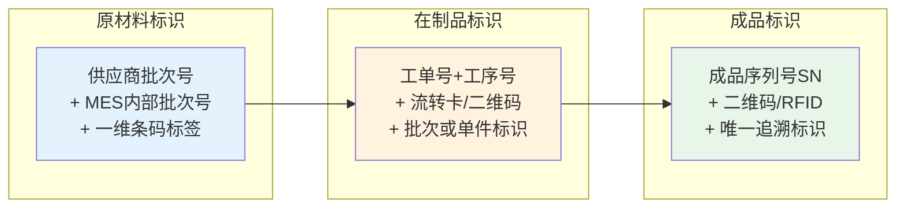
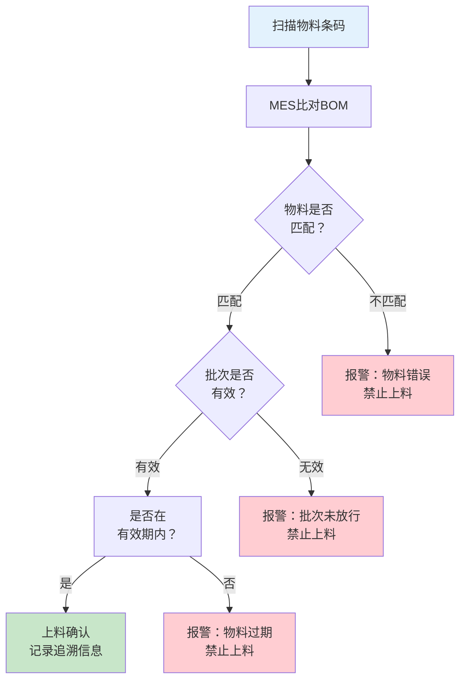
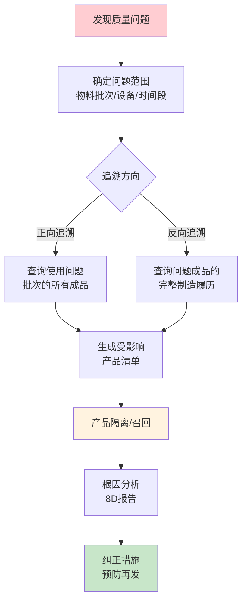
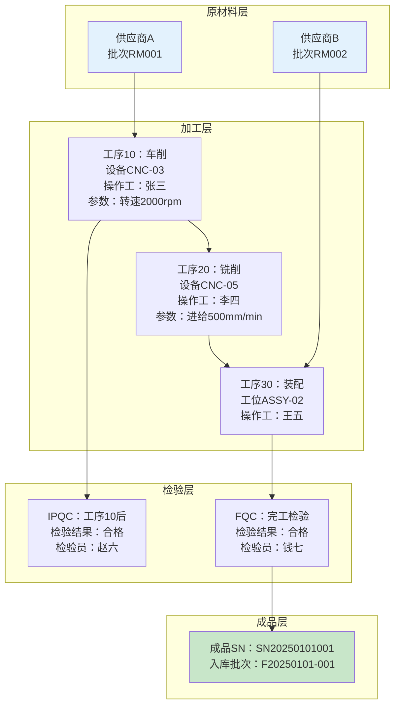

# 产品追溯与防错

## 追溯体系概述

产品追溯（Traceability）是指通过记录和标识，追踪产品从原材料到成品的全过程信息的能力。MES的追溯体系支持两个方向：

### 正向追溯：物料 → 产品

从原材料批次出发，追踪该批物料被用在了哪些产品中。

**应用场景**：当某批次原材料发现质量问题时，快速定位使用了该批次物料的所有成品，进行隔离和召回。

```
原材料批次 RM-2025-0101 → 半成品 WIP-A001, WIP-A003 → 成品 F20250101-001, F20250101-005
```

### 反向追溯：产品 → 物料

从成品出发，追踪该产品使用了哪些批次的物料、经过了哪些工序、由谁操作。

**应用场景**：当客户投诉产品缺陷时，快速定位可能的原因（某批次物料、某台设备、某位操作工）。

```
成品 F20250101-001 → 半成品 WIP-A001 → 原材料 RM-2025-0101, RM-2025-0102
                    → 操作工 张三 / 设备 CNC-03 / 工序 车削
```

| 追溯方向 | 起点 | 终点 | 主要用途 |
|---------|------|------|---------|
| 正向追溯 | 原材料批次 | 受影响的成品 | 物料问题导致的产品召回 |
| 反向追溯 | 问题成品 | 可能的根因 | 客户投诉的根因分析 |

## 条码/二维码/RFID在追溯中的应用

### 标识技术对比

| 技术 | 存储容量 | 读取方式 | 可靠性 | 成本 | 适用场景 |
|------|---------|---------|-------|------|---------|
| 一维条码 | ~20字符 | 激光/红光扫描 | 中 | 低 | 物料标签、工单标识 |
| 二维码 | ~2000字符 | 图像扫描 | 中高 | 低 | 追溯标签、检验记录 |
| RFID | 数KB~数MB | 射频读取 | 高 | 较高 | 批量盘点、快速识别 |

### 追溯标识方案

MES的追溯标识通常采用"批次+唯一码"的组合方案：

1. **原材料**：以供应商批次号为主键，入库时MES分配内部批次号并贴标
2. **在制品**：按工单+工序生成流转标识，支持单件追溯或批次追溯
3. **成品**：每件成品分配唯一序列号（SN），实现单件级追溯



## 上料防错

上料防错是MES防错体系中最关键的环节，防止错误物料被使用到产品中。

### 防错流程



### 防错校验规则

| 校验规则 | 说明 | 错误后果 |
|---------|------|---------|
| 物料编码校验 | 扫描物料编码与BOM要求的物料编码比对 | 用错物料 |
| 批次状态校验 | 检查物料批次是否通过IQC放行 | 使用未检验物料 |
| 有效期校验 | 检查物料是否在有效期内 | 使用过期物料 |
| 用量校验 | 检查已消耗量是否超出BOM用量 | 用量异常 |
| 替代料校验 | 替代料需经过ECN审批 | 未经审批使用替代料 |

## 关键工序强制采集

对于影响产品质量的关键工序，MES实施强制采集策略——操作工必须完成规定的数据采集后，才能将产品流转到下道工序。

### 强制采集内容

| 采集类型 | 说明 | 采集方式 |
|---------|------|---------|
| 物料批次 | 本工序消耗的物料批次号 | 扫码 |
| 操作人员 | 本工序的操作工 | 刷卡/扫码 |
| 设备编号 | 本工序使用的设备 | 自动关联/扫码 |
| 工艺参数 | 本工序的关键工艺参数 | 自动采集/人工录入 |
| 检验数据 | 本工序的检验结果 | 仪器直连/人工录入 |
| 环境数据 | 温湿度等环境参数 | 传感器自动采集 |

### 强制采集规则

1. **不采集不流转**：未完成强制采集项的工序，MES禁止流转到下道工序
2. **不合格不流转**：检验不合格的工序，MES禁止流转（除非走返工流程）
3. **超时预警**：关键工序停留超时自动预警

## 召回场景模拟

当发现产品质量问题时，MES支持快速定位受影响产品并执行召回：



### 召回响应时间要求

| 行业 | 正向追溯 | 反向追溯 | 法规依据 |
|------|---------|---------|---------|
| 汽车 | ≤24小时 | ≤4小时 | IATF 16949 |
| 医疗器械 | ≤72小时 | ≤24小时 | FDA 21 CFR 820 |
| 食品 | ≤4小时 | ≤2小时 | 食品安全法 |
| 电子 | ≤48小时 | ≤8小时 | 客户要求 |

## 追溯链路图

MES的完整追溯链路如下：



## 防错等级

防错体系按防护强度分为三个等级：

| 防错等级 | 英文 | 原理 | 举例 |
|---------|------|------|------|
| 预防级 | Prevention | 使错误不可能发生 | 不对称接口设计，反方向无法插入 |
| 检测级 | Detection | 错误发生后立即检测 | MES扫码校验物料编码，错误时报警拦截 |
| 警告级 | Warning | 错误发生后给出提示 | 颜色标识区分，操作工自行辨别 |

**防错原则：预防 > 检测 > 警告**，应尽可能设计预防级防错，其次才是检测级，最后才依赖警告级。

## 防呆设计（Poka-Yoke）

Poka-Yoke（防呆/防错）由日本工程师新乡重夫提出，其核心思想是**通过设计使错误不可能发生或一旦发生立即被发现**。

### MES中的防呆设计实践

| 防呆场景 | 防呆设计 | 防错等级 |
|---------|---------|---------|
| 上错料 | 扫码+MES比对BOM，不匹配禁止上料 | 检测级 |
| 用错设备 | MES校验设备与工序绑定关系，不匹配禁止开工 | 检测级 |
| 未检验流转 | MES强制检验完成才能流转到下道工序 | 检测级 |
| 工序遗漏 | MES按工艺路线校验，跳过工序时禁止流转 | 检测级 |
| 操作工无资质 | MES校验操作工技能矩阵，无资质禁止操作 | 检测级 |
| 物理防呆 | 不对称连接器、颜色编码、定位销 | 预防级 |

### 防呆设计原则

1. **消除**：尽量通过设计消除出错的可能性（如取消手工操作，改为自动化）
2. **替代**：用更可靠的方式替代容易出错的方式（如扫码替代人工输入）
3. **简化**：简化操作步骤，减少出错机会（如一键操作替代多步操作）
4. **检测**：无法消除的，通过检测及时发现（如MES校验）
5. **缓和**：错误发生时降低影响（如报废流程替代直接流入下道工序）

## 总结

产品追溯与防错是MES质量管理的两大支柱。追溯体系支持正向追溯（物料→产品）和反向追溯（产品→物料），条码/二维码/RFID是实现追溯的标识技术。上料防错是防错体系的关键环节，通过BOM校验、批次校验、有效期校验等规则防止错误物料使用。关键工序强制采集确保追溯数据的完整性。防错等级遵循"预防>检测>警告"原则，Poka-Yoke防呆设计是制造业质量保障的重要方法论。
