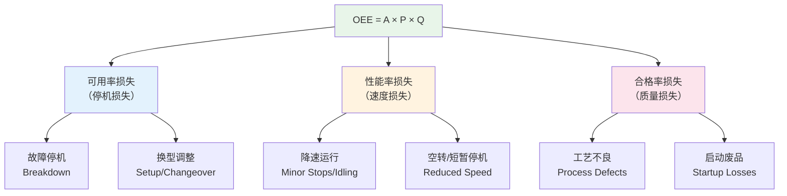
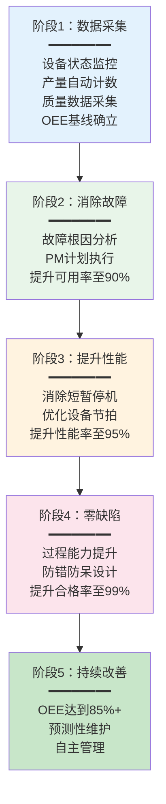

# 设备管理与OEE

## OEE（设备综合效率）概述

OEE（Overall Equipment Effectiveness，设备综合效率）是衡量设备实际产出与理论产出比值的综合指标，由三个独立因子相乘得出：

$$OEE = 可用率(A) \times 性能率(P) \times 合格率(Q)$$

| 因子 | 英文 | 计算公式 | 衡量内容 |
|------|------|---------|---------|
| 可用率 | Availability | 实际运行时间 / 计划生产时间 | 设备是否在应该运行的时候运行了 |
| 性能率 | Performance | 实际产出数 / 理论产出数 | 设备运行时是否达到了应有的速度 |
| 合格率 | Quality | 合格品数 / 实际产出数 | 设备产出的产品是否合格 |

### OEE计算示例

假设一台设备：计划生产8小时（480分钟），其中故障停机60分钟、换型30分钟、待料20分钟，实际运行370分钟。设备理论产能100件/小时，实际产出800件，其中不合格品40件。

- **可用率** = 370 / 480 = 77.1%
- **性能率** = 800 / (370/60 × 100) = 800 / 616.7 = 129.7%（性能率超过100%说明实际节拍快于标准节拍，需校准标准）
- 修正：若实际运行时间370分钟内理论产出 = 370/60 × 100 = 616.7件，实际产出800件
- 重新设定标准产能为130件/小时：性能率 = 800 / (370/60 × 130) = 800/801.7 = 99.8%
- **合格率** = (800-40) / 800 = 95.0%
- **OEE** = 77.1% × 99.8% × 95.0% = 73.2%

### 世界级OEE标准

| 指标 | 世界级标准 | 行业平均 |
|------|-----------|---------|
| 可用率 | ≥ 90% | ~75% |
| 性能率 | ≥ 95% | ~80% |
| 合格率 | ≥ 99% | ~95% |
| OEE | ≥ 85% | ~60% |

> 注：OEE达到85%被视为世界级水平。不同行业的OEE基准差异较大，半导体行业OEE普遍低于离散制造行业。

## 六大损失

OEE的三个因子分别对应六大损失（Six Big Losses），这些损失是降低OEE的根本原因：

| 损失类别 | 损失项目 | 影响因子 | 典型原因 | 改善对策 |
|---------|---------|---------|---------|---------|
| 停机损失 | 故障停机 | 可用率 | 设备老化、缺乏保养 | TPM预防性维护 |
| 停机损失 | 换型调整 | 可用率 | 换模/换料/参数调整 | SMED快速换模 |
| 速度损失 | 降速运行 | 性能率 | 设备磨损、物料不匹配 | 设备保养、参数优化 |
| 速度损失 | 空转/短暂停机 | 性能率 | 堵料、传感器误触发 | 根因分析、传感器优化 |
| 质量损失 | 工艺不良 | 合格率 | 参数偏差、操作失误 | SPC监控、防错设计 |
| 质量损失 | 启动废品 | 合格率 | 换型后首件不稳定 | 首检制度、参数预调 |

## 设备状态监控

MES实时监控设备的运行状态，状态分类如下：

| 设备状态 | 说明 | 对OEE的影响 |
|---------|------|------------|
| 运行（Running） | 设备正在加工产品 | 正常——计入可用时间 |
| 待机（Idle） | 设备可运行但无任务 | 损失——待料/待工/待指令 |
| 故障（Down） | 设备故障无法运行 | 损失——非计划停机 |
| 保养（Maintenance） | 设备处于计划保养中 | 视情况——计划保养可从OEE中扣除 |
| 调试（Setup） | 设备正在换型/调试 | 损失——换型调整时间 |

### 状态监控数据采集

| 采集方式 | 原理 | 实时性 | 适用设备 |
|---------|------|--------|---------|
| PLC信号采集 | 读取设备运行/停止信号 | 秒级 | 自动化设备 |
| 传感器监测 | 振动/温度/电流传感器 | 毫秒级 | 关键设备 |
| 操作工手动切换 | 终端选择设备状态 | 分钟级 | 手动设备 |
| 程序运行监测 | 检测CNC程序执行状态 | 秒级 | 数控设备 |

## 预防性维护PM计划

预防性维护（Preventive Maintenance，PM）是通过定期保养和检查，预防设备故障的发生。

### PM计划制定

| 维护类型 | 频率 | 内容 | 触发方式 |
|---------|------|------|---------|
| 日常点检 | 每班 | 清洁、润滑、紧固、目视检查 | 按班次触发 |
| 一级保养 | 每周 | 润滑油添加、过滤器检查 | 按时间周期触发 |
| 二级保养 | 每月 | 部件更换、精度校准 | 按时间周期触发 |
| 三级保养 | 每季/半年 | 大修、精度恢复 | 按时间周期触发 |
| 预测性维护 | 按需 | 基于设备状态数据的维护 | 按设备状态触发 |

### MES中的PM管理

1. **保养计划生成**：根据设备类型和保养规则自动生成保养计划
2. **保养提醒**：保养到期前自动提醒相关人员
3. **保养执行**：保养人员在MES中记录保养内容和结果
4. **保养分析**：统计保养完成率、设备故障率趋势，评估保养效果

## TPM全员生产维护

TPM（Total Productive Maintenance，全员生产维护）是以追求设备综合效率最高为目标，通过全员参与的生产维护体系。

### TPM八大支柱

| 支柱 | 内容 | 与MES的关系 |
|------|------|------------|
| 自主保全 | 操作工自主进行日常点检和简单维护 | MES点检任务管理 |
| 专业保全 | 专业维修人员进行定期保养和预防性维护 | MES保养计划与执行管理 |
| 个别改善 | 针对OEE损失进行专项改善 | MES OEE数据分析与改善追踪 |
| 品质保全 | 通过设备管理提升产品质量 | MES质量数据关联分析 |
| 初期管理 | 新设备导入时的保全规划 | MES设备台账与参数管理 |
| 事务改善 | 间接部门的效率改善 | MES流程优化 |
| 环境安全 | 创造安全、环保的工作环境 | MES安全巡检管理 |
| 人才培育 | 培养具备设备管理能力的人才 | MES培训与资质管理 |

## OEE提升路径

OEE的提升是一个系统性工程，需要循序渐进：

### 各阶段的关键指标

| 阶段 | 关键行动 | 目标OEE | 预期周期 |
|------|---------|--------|---------|
| 数据采集 | 建立监控、确立基线 | 40%~60% | 1~3个月 |
| 消除故障 | PM计划、自主保全 | 60%~70% | 3~6个月 |
| 提升性能 | 消除短暂停机、优化节拍 | 70%~80% | 6~12个月 |
| 零缺陷 | SPC、防错、过程能力提升 | 80%~85% | 12~18个月 |
| 持续改善 | 预测性维护、自主管理 | 85%+ | 持续 |

## 设备数据采集

### PLC数据采集

PLC（可编程逻辑控制器）是车间最常见的设备控制器，MES通过以下方式采集PLC数据：

| 采集方法 | 协议 | 说明 | 适用场景 |
|---------|------|------|---------|
| OPC UA | OPC UA | 工业标准协议，安全可靠 | 新型PLC |
| Modbus TCP | Modbus | 简单可靠，广泛支持 | 中小型PLC |
| Siemens S7 | S7 Protocol | 西门子专用协议 | Siemens S7系列 |
| Mitsubishi MC | MC Protocol | 三菱专用协议 | 三菱FX/Q系列 |

### 采集数据类型

| 数据类型 | 说明 | 采集频率 | 存储方式 |
|---------|------|---------|---------|
| 设备状态 | 运行/待机/故障 | 1~5秒 | 实时数据库 |
| 产量计数 | 产出件数 | 事件触发 | 业务数据库 |
| 工艺参数 | 温度/压力/转速 | 1~10秒 | 实时数据库 |
| 报警信息 | 设备报警代码 | 事件触发 | 业务数据库 |
| 能耗数据 | 电/气/水消耗 | 1~60秒 | 实时数据库 |

## 总结

OEE是衡量设备综合效率的核心指标，由可用率、性能率、合格率三因子相乘得出。六大损失是OEE降低的根本原因，MES通过设备状态监控、PM预防性维护、TPM全员生产维护等手段持续提升OEE。设备数据采集是OEE计算的基础，PLC/传感器是主要的数据源。OEE提升需循序渐进，从数据采集到持续改善，逐步达到85%的世界级水平。
