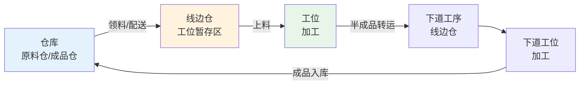
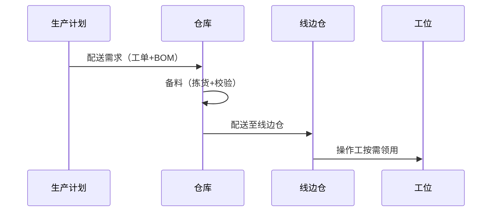
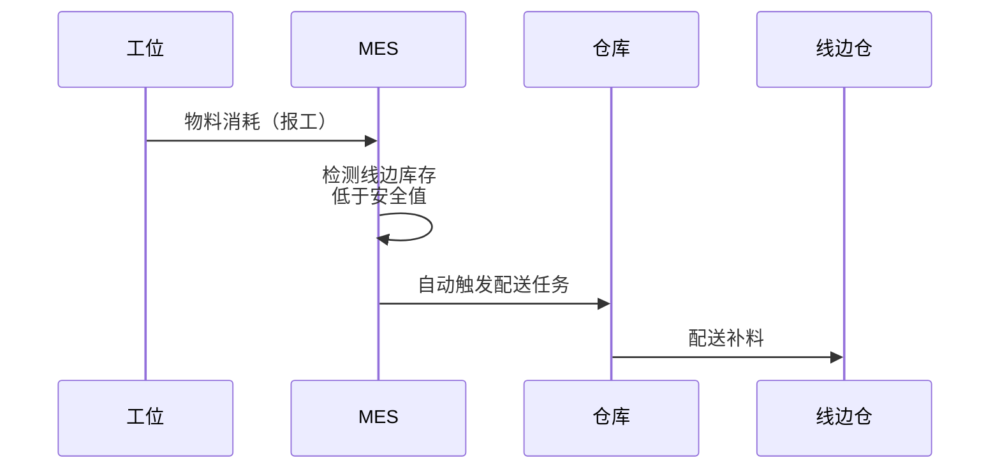
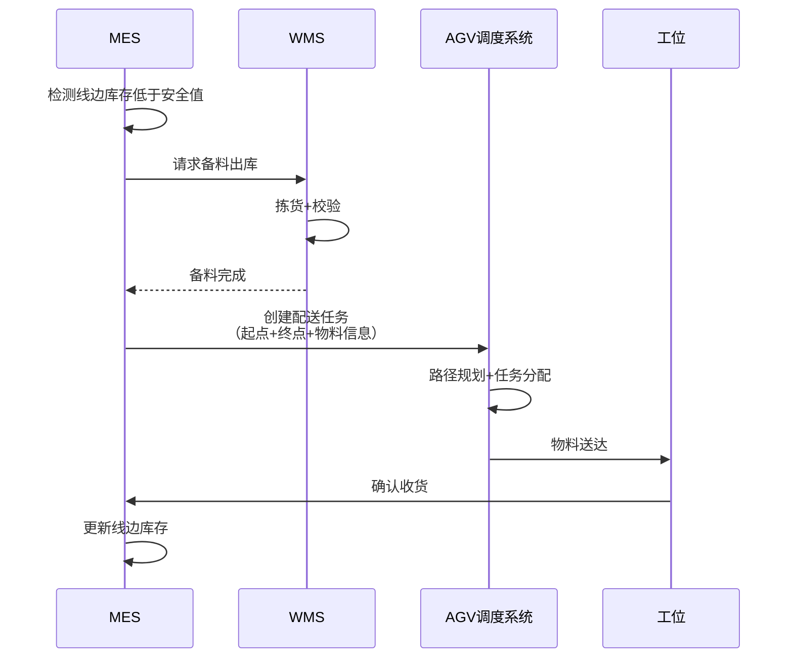
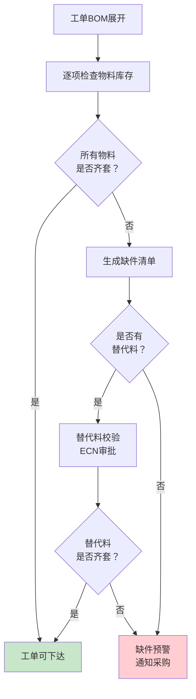
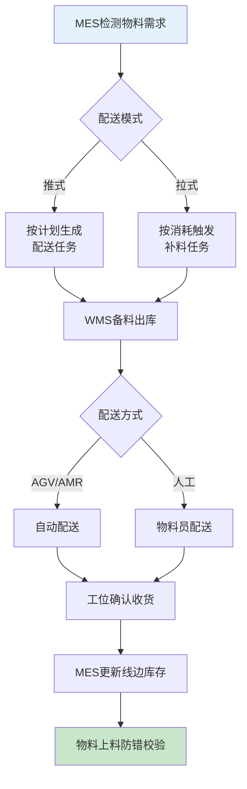

# 物料控制与配送

## 车间物料流转

车间物料从入库到成品，经历以下流转环节：

### 各环节的MES管理要点

| 环节 | MES管理内容 | 关键数据 |
|------|------------|---------|
| 仓库 | 物料接收、IQC检验、上架、库存管理 | 物料批次、库存数量、库位 |
| 线边仓 | 物料暂存、齐套检查、先进先出管理 | 线边库存、安全库存、齐套率 |
| 工位 | 上料防错、用量记录、消耗统计 | 上料批次、实际用量、废料量 |
| 转运 | 物料流转、转运路径、转运时效 | 转运单、转运时间、在途数量 |

## 物料配送模式

### 推式配送

由仓库根据生产计划主动向线边仓配送物料。

- **特点**：计划驱动，提前备料
- **优点**：物料准备充分，不会缺料
- **缺点**：线边仓物料积压，物料品种变更时需清理

### 拉式JIT配送

由工位根据实际消耗触发物料配送需求。

- **特点**：消耗驱动，按需配送
- **优点**：减少线边仓积压，物料流转快
- **缺点**：对配送时效要求高，配送延迟会导致缺料停线

| 对比维度 | 推式配送 | 拉式JIT配送 |
|---------|---------|------------|
| 驱动方式 | 计划驱动 | 消耗驱动 |
| 线边库存 | 较多 | 较少 |
| 缺料风险 | 较低 | 较高（依赖配送时效） |
| 灵活性 | 较低 | 较高 |
| 适用场景 | 产品稳定、大批量 | 多品种、小批量 |

## AGV/AMR配送调度

在现代智能工厂中，物料配送越来越多地采用AGV（自动导引车）或AMR（自主移动机器人）实现自动化配送。

### AGV与AMR的区别

| 对比维度 | AGV | AMR |
|---------|-----|-----|
| 导航方式 | 磁条/二维码/激光反射 | 激光SLAM/视觉SLAM |
| 路径灵活性 | 固定路线 | 动态规划路线 |
| 避障能力 | 简单停止 | 智能绕行 |
| 部署成本 | 较高（需改造地面） | 较低 |
| 适用场景 | 固定路线、高频次 | 动态路线、多场景 |

### MES与AGV协同流程

## 物料齐套性检查

物料齐套性检查是工单下达前的重要校验环节，确保所有所需物料齐备后方可开工。

### 齐套检查逻辑

### 齐套率计算

$$齐套率 = \frac{已齐套物料项数}{BOM总物料项数} \times 100\%$$

| 齐套率等级 | 评价 | 措施 |
|-----------|------|------|
| 100% | 完全齐套 | 可以下达工单 |
| 80%~99% | 基本齐套 | 缺项物料需确认到货时间，可部分下达 |
| <80% | 严重缺料 | 不可下达，需采购催料 |

## 缺件预警与替代料管理

### 缺件预警

MES根据BOM和库存数据，自动计算齐套情况并触发缺件预警：

| 预警类型 | 触发条件 | 通知对象 | 响应时效 |
|---------|---------|---------|---------|
| 缺料预警 | 某项物料库存低于安全库存 | 物料员、采购 | 4小时内确认 |
| 齐套预警 | 工单齐套率<100% | 计划员、物料员 | 2小时内处理 |
| 停线预警 | 工位物料耗尽，即将停线 | 班组长、物料员 | 30分钟内配送 |

### 替代料管理

当原物料不可用时，可使用经审批的替代料：

1. **替代料定义**：在物料主数据中预先定义可替代的物料编码
2. **审批流程**：替代料使用需经过ECN（工程变更通知）审批
3. **MES校验**：MES校验替代料是否经过审批，未审批的禁止使用
4. **追溯记录**：替代料使用信息记入追溯档案

## 车间废料与边角料管理

### 废料分类

| 类型 | 来源 | 处理方式 | MES记录 |
|------|------|---------|---------|
| 不良品 | 质量不合格 | 返工/报废审批 | 缺陷代码+数量 |
| 边角料 | 冲压/切割余料 | 称重回收 | 重量+回收批次 |
| 损耗料 | 正常加工损耗 | 定额核销 | 定额/实际损耗量 |
| 过期料 | 超过有效期 | 报废审批 | 批次+报废原因 |

### 废料处理流程

1. 操作工在MES中记录不良/废料数量和原因代码
2. MES自动计算损耗率是否超出定额
3. 超定额损耗触发异常审批
4. 废料经审批后从WIP中扣除，进入废料回收流程
5. 废料数据汇总到成本系统进行核算

## 物料配送流程图

## 与WMS的协同接口设计

MES与WMS（仓储管理系统）的协同是物料配送顺畅运行的基础，两者之间需要建立标准化的接口：

### 核心接口

| 接口名称 | 方向 | 触发条件 | 数据内容 | 响应方式 |
|---------|------|---------|---------|---------|
| 领料请求 | MES→WMS | 工单下达/物料消耗 | 工单号、物料编码、需求数量、需求时间 | 同步返回备料状态 |
| 备料出库 | WMS→MES | 备料完成 | 出库单号、物料批次、出库数量 | 异步通知 |
| 配送确认 | MES→WMS | 工位收货确认 | 配送单号、实收数量 | 同步确认 |
| 库存查询 | MES→WMS | 齐套检查/库存查询 | 物料编码、仓库 | 同步返回库存 |
| 成品入库 | MES→WMS | 成品完工入库 | 工单号、成品批次、入库数量 | 同步返回入库单号 |

### 数据同步策略

| 同步场景 | 同步方式 | 一致性要求 | 冲突处理 |
|---------|---------|-----------|---------|
| 库存数据 | 定时同步+事件触发 | 最终一致 | 以WMS为准 |
| 出入库事务 | 实时同步 | 强一致 | 事务回滚重试 |
| 物料主数据 | 定时同步 | 最终一致 | 以ERP为准 |
| 批次状态 | 事件驱动 | 强一致 | 人工介入 |

### 异常恢复机制

1. **接口超时**：重试3次，间隔5秒
2. **数据不一致**：定时对账任务，发现差异自动告警
3. **WMS不可用**：MES启用本地库存缓存，允许限额内的紧急领料
4. **网络中断**：MES缓存配送请求，网络恢复后批量同步

## 总结

车间物料流转遵循"仓库→线边仓→工位→成品"的路径，推式配送和拉式JIT配送各有适用场景。AGV/AMR配送调度实现物料配送自动化，MES与AGV系统通过任务协同实现闭环管理。物料齐套性检查是工单下达的前提条件，缺件预警和替代料管理保障生产连续性。MES与WMS的协同接口设计需要考虑数据同步策略和异常恢复机制，确保物料数据的一致性和配送的可靠性。
