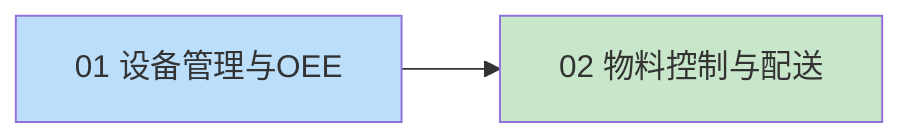

# 设备与物料管理

设备与物料是生产的两大物质基础。设备决定了产能上限，物料决定了生产能否启动。本章节从设备综合效率OEE和物料配送控制两个维度，讲解MES如何管理生产资源。

```mermaid
graph LR
    A[01 设备管理与OEE] --> B[02 物料控制与配送]
    style A fill:#bbdefb
    style B fill:#c8e6c9
```
