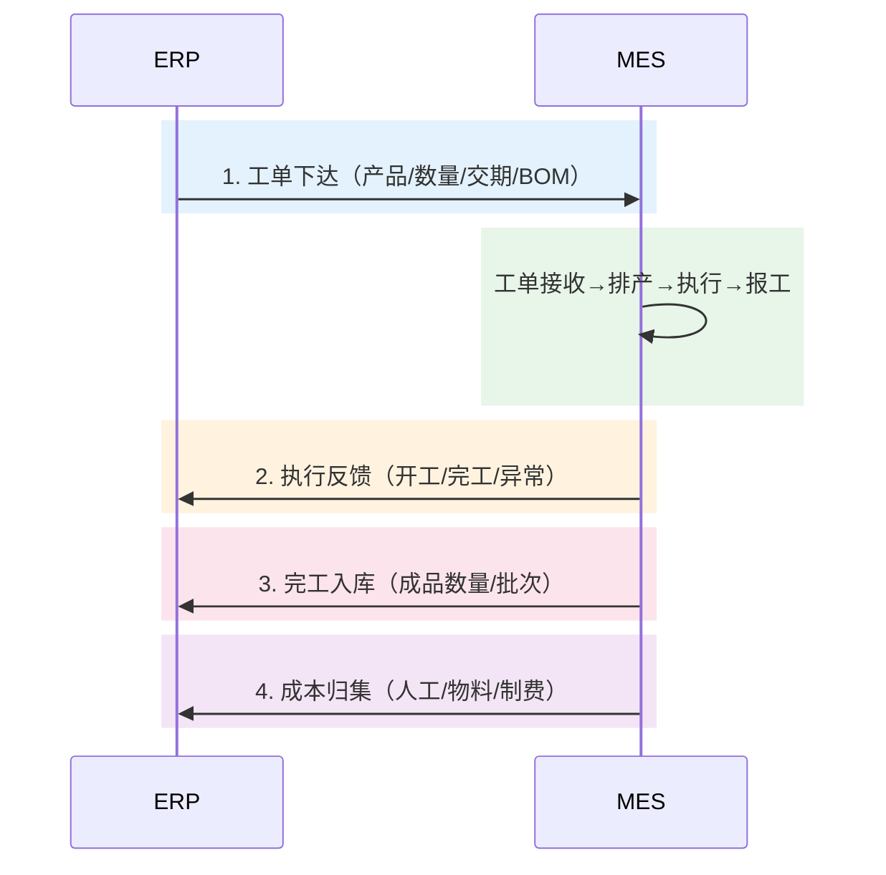
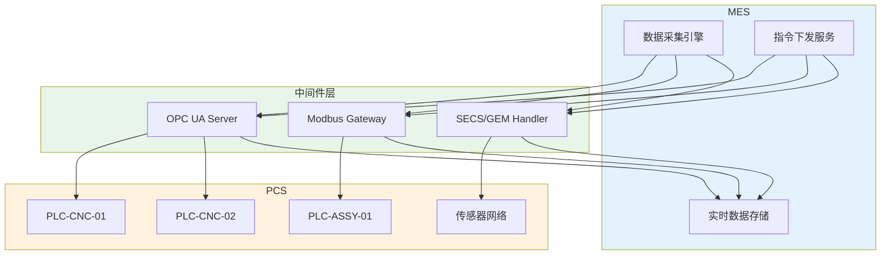
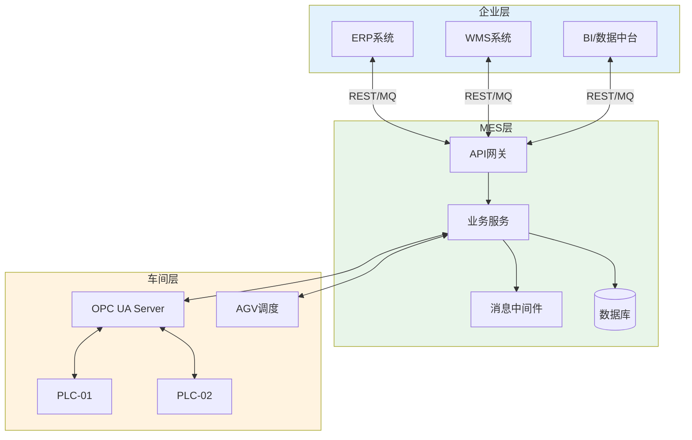

# MES与ERP-WMS集成

## MES与ERP集成

MES与ERP的集成是制造业信息化的"主动脉"，实现计划层与执行层的数据贯通。

### 核心集成业务



### 集成数据流详解

| 业务场景 | 数据流向 | 核心字段 | 频率 |
|---------|---------|---------|------|
| 工单下达 | ERP→MES | 工单号、产品编码、计划数量、BOM版本、交期 | 事件驱动 |
| 物料主数据同步 | ERP→MES | 物料编码、规格、单位、安全库存 | 定时同步 |
| BOM/工艺同步 | ERP→MES | BOM结构、工艺路线、标准工时 | 变更触发 |
| 生产进度反馈 | MES→ERP | 工单号、工序号、投入数、产出数、状态 | 实时/定时 |
| 完工入库 | MES→ERP | 工单号、成品批次、入库数量、仓库 | 事件驱动 |
| 不良品报告 | MES→ERP | 工单号、缺陷代码、不良数量、原因分析 | 事件驱动 |
| 成本数据 | MES→ERP | 工单号、人工工时、物料消耗、制费分摊 | 定时汇总 |

### 工单下达→执行反馈→完工入库→成本归集

这四个环节构成了MES与ERP集成的核心闭环：

1. **工单下达**：ERP根据MPS/MRP计算结果，向MES下达生产工单。MES校验工单有效性后创建本地工单。

2. **执行反馈**：MES实时反馈工单执行进度，包括工序开工/完工时间、投入产出数量、设备状态、质量情况。ERP据此更新工单状态和预计完工时间。

3. **完工入库**：MES在末道工序完工后，生成完工报告并触发成品入库流程。ERP接收入库数据，更新库存和工单状态。

4. **成本归集**：MES汇总工单的人工工时、物料消耗、设备使用时长等数据，传递给ERP的成本模块进行核算。

## MES与WMS集成

MES与WMS的集成实现物料从仓库到车间的精准配送。

### 核心集成业务

| 业务场景 | 数据流向 | 核心字段 | 频率 |
|---------|---------|---------|------|
| 领料请求 | MES→WMS | 工单号、物料编码、需求数量、需求时间 | 事件驱动 |
| 备料出库 | WMS→MES | 出库单号、物料批次、出库数量 | 事件驱动 |
| 配送确认 | MES→WMS | 配送单号、实收数量、差异 | 事件驱动 |
| 库存查询 | MES→WMS | 物料编码、仓库 | 按需 |
| 成品入库 | MES→WMS | 成品批次、入库数量、目标库位 | 事件驱动 |

## MES与PCS集成

MES与PCS（过程控制系统）的集成实现设备数据的实时采集和生产指令的下发。

### 集成架构



### 数据采集→指令下发

| 方向 | 内容 | 典型场景 |
|------|------|---------|
| PCS→MES | 设备状态、产量计数、工艺参数、报警信息 | 实时监控生产过程 |
| MES→PCS | 工艺参数设定值、配方下载、启停指令 | 参数化生产、远程控制 |

## 接口设计

### OPC UA接口

OPC UA是工业互联的首选协议，适用于MES与设备层的数据交互。

| 特性 | 说明 |
|------|------|
| 通信模式 | Client/Server + Pub/Sub |
| 数据模型 | 节点（Node）+ 引用（Reference） |
| 安全机制 | 加密传输、证书认证、权限控制 |
| 服务发现 | 零配置发现局域网内的OPC UA Server |

### REST接口

RESTful API适用于MES与ERP/WMS等IT系统的集成。

```json
// 工单下达接口示例
POST /api/v1/work-orders
{
  "orderNo": "WO20250101001",
  "productCode": "P-1001",
  "planQty": 1000,
  "planStartDate": "2025-01-06T08:00:00",
  "planEndDate": "2025-01-10T18:00:00",
  "bomVersion": "V2.1",
  "priority": "HIGH"
}

// 响应
{
  "code": 200,
  "message": "工单接收成功",
  "data": {
    "orderNo": "WO20250101001",
    "status": "RECEIVED",
    "estimatedStartTime": "2025-01-06T08:00:00"
  }
}
```

### MQTT接口

MQTT适用于IoT设备与MES之间的轻量级消息通信。

| 特性 | 说明 |
|------|------|
| 协议模式 | 发布/订阅（Pub/Sub） |
| 主题设计 | `mes/{factory}/{line}/{station}/{datatype}` |
| QoS等级 | 0（至多一次）/ 1（至少一次）/ 2（恰好一次） |
| 适用场景 | 大量IoT设备、网络带宽有限、实时性要求高 |

### 接口选型对比

| 对比维度 | OPC UA | REST | MQTT |
|---------|--------|------|------|
| 适用场景 | 设备层数据采集 | IT系统间业务交互 | IoT消息通信 |
| 实时性 | 毫秒级 | 秒级 | 毫秒级 |
| 数据模型 | 结构化节点 | JSON | 主题+载荷 |
| 安全性 | 高（内置安全机制） | 中（HTTPS+Token） | 中（TLS+用户名密码） |
| 复杂度 | 高 | 低 | 中 |

## 数据同步策略

| 同步策略 | 适用场景 | 一致性 | 性能 | 复杂度 |
|---------|---------|--------|------|--------|
| 实时同步 | 关键业务数据（工单/库存） | 强一致 | 较低 | 高 |
| 定时批量 | 非关键数据（物料主数据/基础数据） | 最终一致 | 较高 | 低 |
| 事件驱动 | 状态变更通知（工单状态/库存预警） | 最终一致 | 高 | 中 |
| 混合模式 | 综合场景 | 按需 | 均衡 | 中高 |

### 关键业务数据的同步方案

| 数据 | 同步方式 | 频率 | 一致性 | 冲突处理 |
|------|---------|------|--------|---------|
| 工单数据 | 事件驱动 | 实时 | 强一致 | 以ERP为准 |
| 物料主数据 | 定时同步 | 每小时 | 最终一致 | 以ERP为准 |
| 库存数据 | 事件驱动 | 实时 | 强一致 | 以WMS为准 |
| 生产进度 | 定时上报 | 每5分钟 | 最终一致 | 以MES为准 |
| 设备状态 | 实时推送 | 秒级 | 最终一致 | 以设备为准 |

## 异常恢复

### 接口异常处理

| 异常类型 | 检测方式 | 恢复策略 | 超时阈值 |
|---------|---------|---------|---------|
| 接口超时 | 响应时间监控 | 重试3次，间隔递增（5s/10s/30s） | 30秒 |
| 数据格式错误 | Schema校验 | 记录错误日志，通知运维 | - |
| 业务校验失败 | 规则引擎校验 | 返回错误码，由调用方处理 | - |
| 系统不可用 | 健康检查 | 降级为本地缓存，恢复后补传 | 3分钟 |

### 数据补偿机制

1. **消息持久化**：所有集成消息写入持久化队列，确保不丢失
2. **幂等处理**：接口设计支持重复调用不会产生副作用
3. **对账机制**：每日定时对账，发现差异自动生成差异报告
4. **补传机制**：网络中断期间的本地缓存数据，恢复后按时间顺序补传

## 集成架构图



## 总结

MES与ERP的集成实现"工单下达→执行反馈→完工入库→成本归集"的核心闭环。MES与WMS的集成实现物料配送的精准管理。MES与PCS的集成实现设备数据的实时采集与指令下发。接口设计根据场景选择OPC UA（设备层）、REST（IT系统层）或MQTT（IoT层）。数据同步策略需要根据业务重要性选择实时同步、定时批量或事件驱动模式。异常恢复机制确保集成的高可用性。
