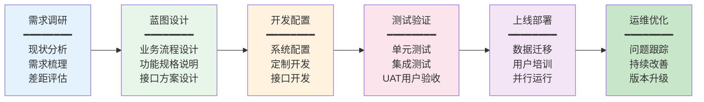
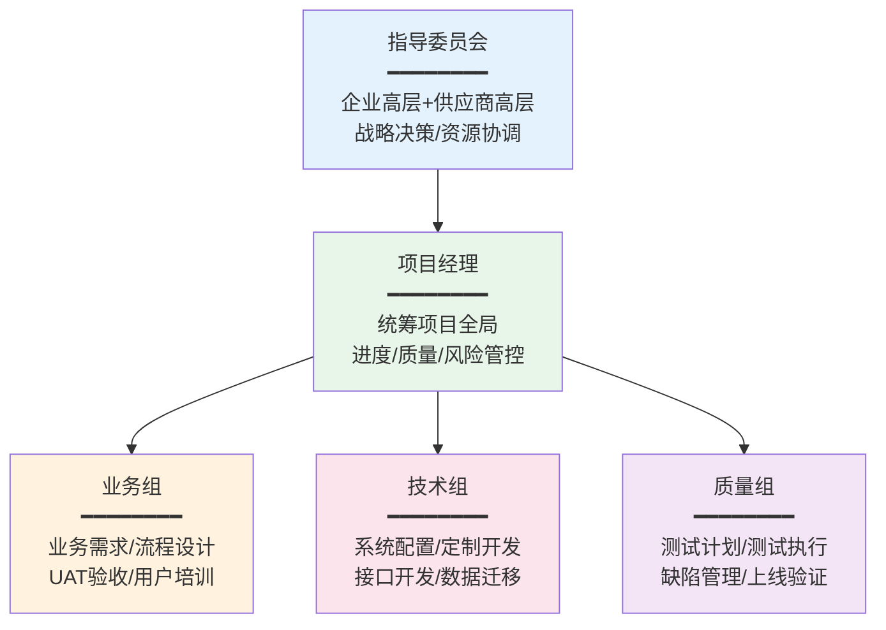
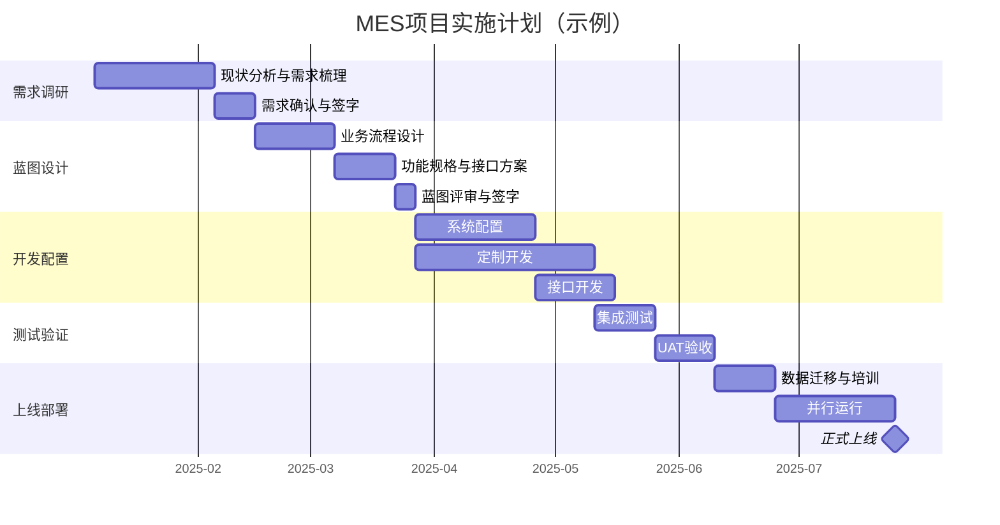

# 生产级落地指南

## MES选型评估框架

MES选型是项目成功的第一步，错误的选型会导致项目延期、超预算甚至失败。以下为六个维度的选型评估框架：

### 评估维度

| 维度 | 权重 | 评估要点 | 评分标准 |
|------|------|---------|---------|
| 行业适配性 | 25% | 是否有同行业成功案例？行业特性功能是否覆盖？ | 5分制 |
| 功能覆盖率 | 25% | 11大功能模块的覆盖度？与需求匹配度？ | 5分制 |
| 技术架构 | 20% | 是否支持微服务？是否支持高可用？扩展性如何？ | 5分制 |
| 扩展性 | 15% | 二次开发难度？API开放度？插件化程度？ | 5分制 |
| 供应商实力 | 10% | 公司规模？客户数量？服务团队？ | 5分制 |
| 总体拥有成本 | 5% | 许可费+实施费+运维费+升级费 | 5分制 |

### 选型决策矩阵

| 候选方案 | 行业适配 | 功能覆盖 | 技术架构 | 扩展性 | 供应商 | TCO | 加权总分 |
|---------|---------|---------|---------|--------|--------|-----|---------|
| 方案A | 4 | 5 | 4 | 4 | 4 | 3 | 4.20 |
| 方案B | 5 | 4 | 3 | 3 | 3 | 4 | 3.80 |
| 方案C | 3 | 4 | 5 | 5 | 3 | 3 | 4.00 |

> 加权总分 = Σ(各维度评分 × 权重)

## 实施方法论

MES项目实施通常分为六个阶段：

### 各阶段要点

| 阶段 | 周期 | 关键交付物 | 风险点 |
|------|------|-----------|--------|
| 需求调研 | 4~8周 | 需求规格说明书、现状分析报告 | 需求不完整、范围蔓延 |
| 蓝图设计 | 4~6周 | 业务蓝图、功能规格、接口方案 | 流程设计脱离实际 |
| 开发配置 | 8~16周 | 配置文档、源代码、接口程序 | 需求变更频繁 |
| 测试验证 | 4~8周 | 测试报告、问题清单、UAT签字 | 测试覆盖不全 |
| 上线部署 | 2~4周 | 培训记录、数据迁移报告、上线确认 | 数据迁移问题 |
| 运维优化 | 持续 | 运维报告、改善建议、版本更新 | 用户抵触使用 |

## 制造能力成熟度评估

在MES实施前，建议先评估企业当前的制造信息化成熟度，避免"大跃进"式推进：

| 等级 | 名称 | 特征 | MES实施建议 |
|------|------|------|------------|
| L1 | 手工管理 | 纸质记录、人工排产、口头传达 | 先做数据采集和报工 |
| L2 | 单点信息化 | 独立的报工系统、质量系统 | 整合系统，建立统一平台 |
| L3 | 流程贯通 | MES覆盖核心流程，数据基本贯通 | 深化功能，完善追溯 |
| L4 | 数据驱动 | 全流程数据化，SPC/APS有效运行 | 高级排产、预测性维护 |
| L5 | 智能制造 | AI辅助决策、数字孪生、自适应优化 | 持续优化，探索智能应用 |

### 成熟度跃迁原则

- **一次只跳一级**：从L1直接跳到L4大概率失败
- **每级稳定6个月以上**：确保基础扎实后再升级
- **数据质量先行**：没有准确的数据，高级功能只是摆设

## 关键成功因素

### 高层支持

MES项目是"一把手工程"，高层管理者的支持至关重要：

- **资源保障**：确保项目预算、人力、时间到位
- **变革推动**：推动流程变革和组织调整
- **矛盾协调**：协调部门间利益冲突
- **使用示范**：带头使用系统，树立标杆

### 数据基础

MES是数据驱动的系统，数据质量直接决定MES的成败：

| 数据类型 | 质量要求 | 常见问题 | 改善措施 |
|---------|---------|---------|---------|
| 物料主数据 | 编码唯一、规格准确 | 一物多码、规格不全 | 数据清洗、编码规范 |
| BOM数据 | 结构完整、用量准确 | BOM缺失、用量错误 | BOM审核、与设计同步 |
| 工艺路线 | 工序完整、工时准确 | 工序遗漏、工时不准 | 现场验证、持续校准 |
| 设备台账 | 参数完整、状态准确 | 台账缺失、参数过时 | 定期盘点、变更同步 |

### 流程标准化

MES固化的是流程，如果流程本身是混乱的，MES只会放大混乱：

1. **先固化再优化**：先将现有流程标准化，再通过MES固化
2. **例外管理**：对无法标准化的场景定义例外处理流程
3. **持续改善**：MES上线后通过数据分析持续优化流程

## 实施风险与应对

| 风险 | 概率 | 影响 | 应对措施 |
|------|------|------|---------|
| 需求频繁变更 | 高 | 高 | 严格变更管理，设立需求冻结点 |
| 数据质量差 | 高 | 高 | 提前数据清洗，分批迁移验证 |
| 用户抵触使用 | 中 | 高 | 充分培训，选择试点标杆，逐步推广 |
| 集成接口问题 | 中 | 中 | 提前进行接口联调，预留缓冲时间 |
| 项目超期超预算 | 高 | 中 | 分期实施，设置里程碑，定期评估 |
| 供应商交付能力不足 | 低 | 高 | 合同约束，阶段性验收，备选方案 |

## 项目组织架构

## MES实施里程碑

## ROI评估

MES项目的投资回报需要从多个维度评估：

### 直接效益

| 效益项 | 计算方式 | 典型改善幅度 |
|--------|---------|------------|
| 在制品减少 | WIP减少量 × 单件成本 × 资金占用率 | 20%~40% |
| 不良率降低 | 不良减少量 × 单件成本 + 返工成本 | 15%~30% |
| 设备OEE提升 | OEE提升 × 产值 | 5%~15% |
| 人工效率提升 | 减少的统计/报表/流转工时 | 20%~40% |
| 库存周转提升 | 库存减少量 × 仓储成本 | 10%~25% |

### 间接效益

- **交期缩短**：提升客户满意度，增加订单
- **追溯能力**：减少召回成本和响应时间
- **数据决策**：减少经验决策失误
- **合规保障**：满足行业法规要求（汽车IATF 16949、医疗器械FDA 21 CFR 820）

### ROI计算示例

假设某企业MES项目总投资300万元，每年产生的直接效益：

- 在制品减少：100万元
- 不良率降低：80万元
- 设备OEE提升：60万元
- 人工效率提升：50万元
- 合计：290万元/年

投资回收期 = 300 / 290 ≈ 1.03年

> 注：以上数据为示例，实际ROI因企业规模、行业、现状不同差异很大。

## 总结

MES选型需从行业适配、功能覆盖、技术架构、扩展性、供应商实力、TCO六个维度综合评估。实施方法论采用"需求→蓝图→开发→测试→上线→优化"六阶段推进。制造能力成熟度评估帮助企业找准起点，避免"大跃进"。高层支持、数据基础、流程标准化是项目成功的三大关键因素。实施风险需要提前识别并制定应对措施。ROI评估需综合考虑直接效益和间接效益，典型投资回收期在1~2年。
