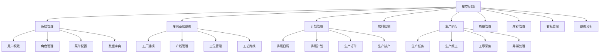
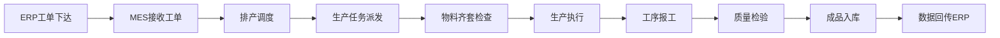
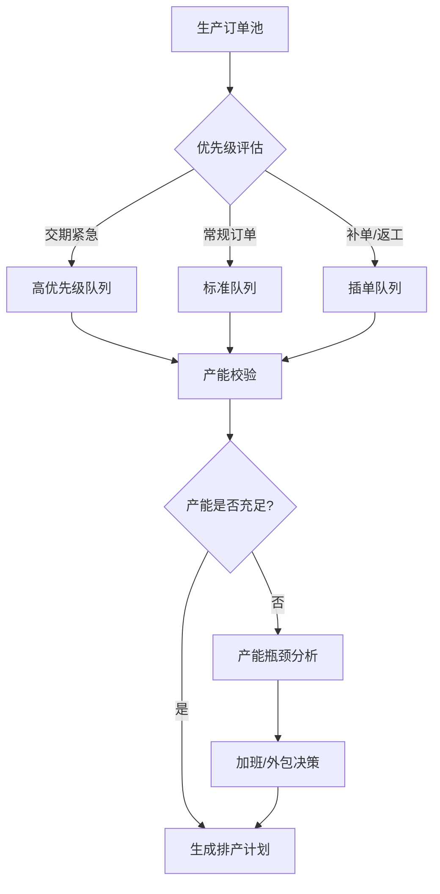

# 星空MES深度解析

> 星空开源MES是万界星空科技推出的专业、通用、开源的制造执行系统——SpringBoot2 + Vue3 + MySQL8 + Redis + Minio 技术栈，覆盖计划排产、生产执行、质量管理、设备管理、看板管理等核心模块，是目前国内最活跃的开源MES项目之一。

## 一、项目概况

| 维度 | 信息 |
|------|------|
| 项目地址 | [gitee.com/metaxk/xingkong-mes](https://gitee.com/metaxk/xingkong-mes) |
| 开源协议 | 开源可商用（二次开发需保留版权声明） |
| 技术栈（单体版） | SpringBoot 2 + Vue 3 + MySQL 8 + Redis + Minio |
| 技术栈（微服务版） | SpringCloud Alibaba + Vue 3 + MySQL 8 + Redis + Minio |
| 部署方式 | Docker / Docker Compose / K8s |
| 推荐环境 | Ubuntu Server 22.04 |

## 二、功能架构

### 2.1 功能模块总览



### 2.2 核心业务流程



## 三、技术架构详解

### 3.1 分层架构

```
┌─────────────────────────────────┐
│         Vue 3 前端              │
│   Element Plus + Vite + TS     │
├─────────────────────────────────┤
│       SpringBoot 2 后端        │
│  Controller → Service → Mapper  │
├─────────────────────────────────┤
│  MySQL 8    Redis    Minio      │
│  (业务数据)  (缓存)  (文件存储) │
└─────────────────────────────────┘
```

### 3.2 后端项目结构

```
xingkong-mes/
├── mes-admin/          # 后台管理入口
├── mes-framework/      # 框架核心（安全/日志/异常）
├── mes-system/         # 系统管理模块
├── mes-quartz/         # 定时任务模块
├── mes-generator/      # 代码生成器
├── mes-common/         # 公共工具类
└── mes-business/       # MES业务模块
    ├── plan/           # 计划排产
    ├── execute/        # 生产执行
    ├── quality/        # 质量管理
    ├── equipment/      # 设备管理
    ├── material/       # 物料管理
    └── report/         # 报表看板
```

### 3.3 关键技术选型

| 组件 | 选型 | 选型理由 |
|------|------|---------|
| 前端框架 | Vue 3 + Element Plus | 国内生态完善，学习成本低 |
| 状态管理 | Pinia | Vue 3 官方推荐 |
| 后端框架 | SpringBoot 2.7 | 企业级稳定性，社区资源丰富 |
| ORM | MyBatis Plus | 灵活SQL，适合复杂查询 |
| 权限 | Sa-Token | 轻量级，API简洁 |
| 缓存 | Redis 7 | 高性能，支持分布式锁 |
| 对象存储 | Minio | 兼容S3协议，私有化部署 |
| 报表 | JimuReport | 积木报表，可视化拖拽 |

## 四、核心功能解析

### 4.1 排产功能

星空MES的排产功能是其核心亮点：

| 功能 | 说明 |
|------|------|
| 排班日历 | 配置车间工作日历，支持三班倒/两班倒/白班 |
| 排班计划 | 按产线/工位排班，关联人员技能 |
| 生产订单 | 接收ERP工单，支持手动创建 |
| 生产排产 | 甘特图式排产，拖拽调整顺序 |
| 生产任务 | 排产自动生成任务，派发到工位 |

**排产决策流程**：



### 4.2 生产报工

| 报工方式 | 终端 | 适用场景 |
|---------|------|---------|
| PC端报工 | 电脑浏览器 | 办公室调度员 |
| PDA扫码报工 | 手持终端 | 车间操作工 |
| 大屏看板 | 车间电视 | 班组长实时监控 |

### 4.3 数据大屏

项目内置两个数据大屏：
- **生产大屏**：实时产量、OEE、设备状态、订单进度
- **质量大屏**：良率趋势、不良品分布、SPC控制图

## 五、Docker部署实践

### 5.1 环境要求

| 组件 | 最低配置 | 推荐配置 |
|------|---------|---------|
| CPU | 2 核 | 4 核+ |
| 内存 | 4 GB | 8 GB+ |
| 磁盘 | 40 GB | 100 GB+ SSD |
| Docker | 20.10+ | 24.0+ |
| Docker Compose | 2.0+ | 2.20+ |

### 5.2 一键部署

```bash
# 克隆项目
git clone https://gitee.com/metaxk/xingkong-mes.git
cd xingkong-mes

# Docker Compose 一键启动
docker-compose up -d

# 查看服务状态
docker-compose ps
```

### 5.3 服务清单

| 服务 | 端口 | 说明 |
|------|------|------|
| mes-backend | 8080 | SpringBoot 后端 |
| mes-frontend | 80 | Vue3 前端 (Nginx) |
| mysql | 3306 | MySQL 8 数据库 |
| redis | 6379 | Redis 缓存 |
| minio | 9000/9001 | Minio 对象存储 |

## 六、开源版 vs 商业版

| 维度 | 开源版 | 商业版 |
|------|--------|--------|
| 技术架构 | SpringBoot 单体 | SpringCloud 微服务 |
| 功能完整度 | 核心功能 | 核心功能 + 扩展模块 |
| 技术支持 | 社区/自行解决 | 官方技术支持 |
| 演示环境 | 不提供 | 提供在线演示 |
| 适用场景 | 学习/中小工厂 | 生产级部署 |

## 七、二次开发指南

### 7.1 开发环境搭建

```bash
# 后端
JDK 11+
Maven 3.6+
IDEA (推荐安装 Lombok/MyBatisX 插件)

# 前端
Node.js 16+
pnpm 8+
VS Code (推荐安装 Volar 插件)
```

### 7.2 自定义扩展点

- **新增业务模块**：使用 mes-generator 代码生成器，根据数据库表自动生成 CRUD 代码
- **扩展报表**：集成 JimuReport，可视化拖拽设计报表
- **接口对接**：RESTful API 标准，易于与 ERP/WMS 集成
- **设备对接**：扩展设备采集驱动（需自行开发 OPC UA/Modbus 适配器）

### 7.3 注意事项

- 开源版不提供演示环境和技术支持，需自行编译运行
- 商业版与开源版架构完全不同，升级路径需评估
- 建议先在开发环境完整跑通，再考虑生产部署
