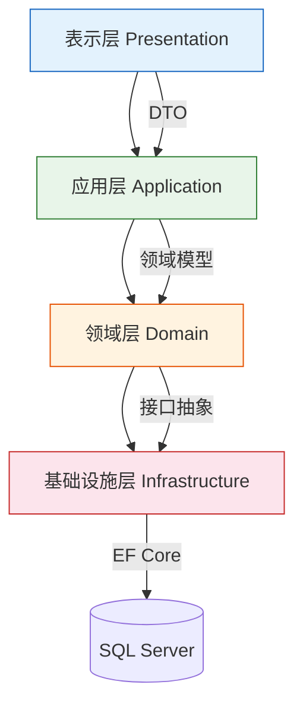
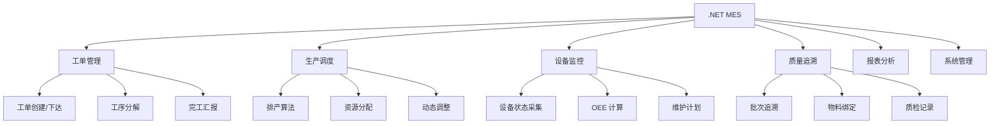
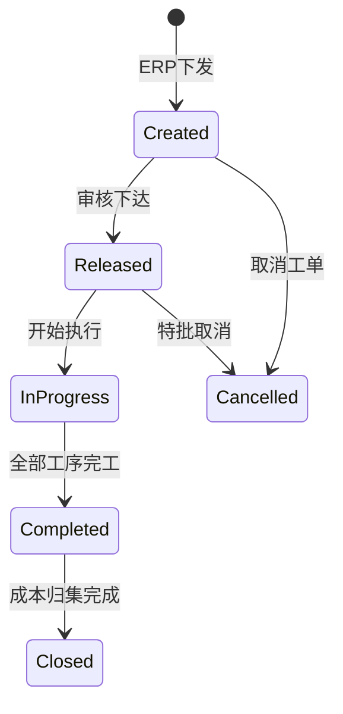

# .NET 开源 MES 项目解析

> .NET 生态下也涌现出一批优质的开源 MES 项目，它们在架构设计上往往更偏向"干净架构"理念——Repository Pattern、依赖注入、模块化分层，与企业级 .NET 开发范式高度契合。

## 一、项目概况

GitHub 上 `manufacturing-execution-system` 主题下，基于 .NET 的 MES 项目是活跃度较高的品类。代表性项目特征：

| 维度 | 典型特征 |
|------|---------|
| 后端框架 | .NET 6/7/8 + ASP.NET Core MVC/Web API |
| ORM | Entity Framework Core |
| 前端 | Vue 2/3 或 Blazor |
| 数据库 | SQL Server / PostgreSQL |
| 架构模式 | Repository Pattern + DI + 分层架构 |
| 部署 | Docker / IIS / Kestrel |

## 二、架构设计

### 2.1 典型分层架构



| 层 | 职责 | 关键组件 |
|----|------|---------|
| Presentation | API 控制器、视图模型 | Controllers、DTOs、ViewModels |
| Application | 业务用例、编排逻辑 | Services、Validators、Mappings |
| Domain | 核心业务规则 | Entities、Value Objects、Domain Events |
| Infrastructure | 数据持久化、外部集成 | Repositories、DbContext、External Services |

### 2.2 Repository Pattern

```csharp
// 仓储接口定义
public interface IRepository<T> where T : class, IEntity
{
    Task<T> GetByIdAsync(Guid id);
    Task<IReadOnlyList<T>> ListAsync(ISpecification<T> spec);
    Task<T> AddAsync(T entity);
    Task UpdateAsync(T entity);
    Task DeleteAsync(T entity);
}

// 仓储实现
public class EfRepository<T> : IRepository<T> where T : class, IEntity
{
    private readonly AppDbContext _context;
    private readonly DbSet<T> _dbSet;

    public EfRepository(AppDbContext context)
    {
        _context = context;
        _dbSet = context.Set<T>();
    }

    public async Task<T> GetByIdAsync(Guid id)
        => await _dbSet.FindAsync(id);

    public async Task<IReadOnlyList<T>> ListAsync(ISpecification<T> spec)
        => await _dbSet.ApplySpecification(spec).ToListAsync();
}
```

### 2.3 依赖注入

```csharp
// Program.cs 注册服务
builder.Services.AddScoped<IWorkOrderService, WorkOrderService>();
builder.Services.AddScoped<IProductionService, ProductionService>();
builder.Services.AddScoped(typeof(IRepository<>), typeof(EfRepository<>));
builder.Services.AddDbContext<AppDbContext>(options =>
    options.UseSqlServer(connectionString));
```

## 三、核心功能模块

### 3.1 功能架构图



### 3.2 关键实体模型

| 实体 | 关键字段 | 说明 |
|------|---------|------|
| WorkOrder | OrderNo, ProductId, Qty, Status | 生产工单 |
| Operation | WorkOrderId, Seq, StationId, Status | 工序任务 |
| ProductionLog | OperationId, OperatorId, StartTime, EndTime, Qty | 生产日志 |
| QualityRecord | ProductionLogId, InspectResult, Inspector | 质检记录 |
| Equipment | Code, Name, Status, LastMaintenance | 设备信息 |
| MaterialLot | LotNo, MaterialId, Qty, LocationId | 批次物料 |

### 3.3 工单状态机



## 四、与星空MES的架构对比

| 维度 | 星空MES（Java） | .NET MES |
|------|----------------|----------|
| 语言 | Java / Kotlin | C# |
| 后端框架 | SpringBoot 2 | ASP.NET Core 6/7/8 |
| ORM | MyBatis Plus | Entity Framework Core |
| 权限 | Sa-Token | ASP.NET Identity / 自定义 |
| 缓存 | Redis (Spring Data) | Redis (StackExchange) |
| API风格 | RESTful | RESTful + Minimal API |
| 前端 | Vue 3 + Element Plus | Vue 3 / Blazor |
| 微服务 | SpringCloud Alibaba | 可选：Duende / YARP |
| 数据库 | MySQL 8 | SQL Server / PostgreSQL |
| 部署 | Docker + Ubuntu | Docker / IIS / Kestrel |

### 技术选型考量

| 场景 | 推荐选择 | 理由 |
|------|---------|------|
| 团队以 Java 为主 | 星空MES | 技术栈匹配，二次开发成本低 |
| 团队以 .NET 为主 | .NET MES | C# 生态天然契合 |
| 需要微服务架构 | 星空MES SpringCloud版 | 成熟微服务方案 |
| 追求代码整洁度 | .NET MES | DDD/Repository Pattern 更规范 |
| 快速验证 POC | 星空MES | Docker 一键部署更便捷 |
| 企业级 SQL Server 环境 | .NET MES | EF Core + SQL Server 深度优化 |

## 五、部署方案

### 5.1 Docker 部署

```dockerfile
# Dockerfile
FROM mcr.microsoft.com/dotnet/aspnet:8.0 AS base
WORKDIR /app
EXPOSE 8080

FROM mcr.microsoft.com/dotnet/sdk:8.0 AS build
WORKDIR /src
COPY ["Mes.Api/Mes.Api.csproj", "Mes.Api/"]
RUN dotnet restore "Mes.Api/Mes.Api.csproj"
COPY . .
RUN dotnet publish "Mes.Api/Mes.Api.csproj" -c Release -o /app/publish

FROM base AS final
WORKDIR /app
COPY --from=build /app/publish .
ENTRYPOINT ["dotnet", "Mes.Api.dll"]
```

```yaml
# docker-compose.yml
version: '3.8'
services:
  mes-api:
    build: .
    ports:
      - "8080:8080"
    environment:
      - ConnectionStrings__Default=Server=sqlserver;Database=MesDb;User=sa;Password=YourPassword
      - Redis__Host=redis
    depends_on:
      - sqlserver
      - redis

  sqlserver:
    image: mcr.microsoft.com/mssql/server:2022-latest
    environment:
      - ACCEPT_EULA=Y
      - SA_PASSWORD=YourPassword123
    ports:
      - "1433:1433"

  redis:
    image: redis:7-alpine
    ports:
      - "6379:6379"
```

### 5.2 IIS 部署

1. 发布项目：`dotnet publish -c Release -o ./publish`
2. IIS 创建站点，指向 `publish` 目录
3. 安装 .NET Hosting Bundle
4. 配置应用程序池为"无托管代码"

## 六、二次开发要点

### 6.1 新增业务模块

```
1. Domain 层：定义实体 + 值对象 + 领域事件
2. Application 层：定义 DTO + Service + Validator + Mapping
3. Infrastructure 层：实现 Repository + 数据库迁移
4. Presentation 层：添加 Controller + API 端点
5. 前端：添加页面 + 路由 + API 调用
```

### 6.2 设备对接扩展

- **OPC UA**：使用 `OPCFoundation.NetStandard.OpcUa` NuGet 包
- **Modbus**：使用 `NModbus` 库，支持 TCP/RTU
- **SECS/GEM**：参考 `SECSTools` 开源库

### 6.3 注意事项

- .NET MES 项目普遍比 Java 项目更新，社区活跃度稍低
- 部分项目仅提供后端 API，前端需自行搭建
- SQL Server 许可证成本需纳入评估（可用 PostgreSQL 替代）
- 建议在 Windows 开发环境下调试，Linux/Docker 环境下生产部署
