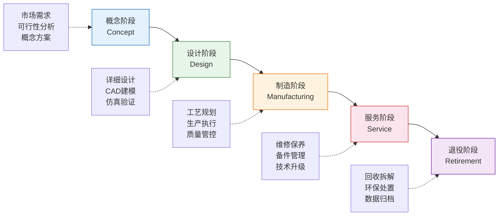
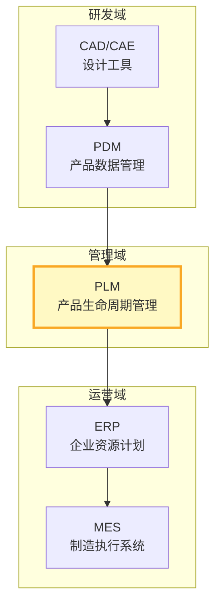
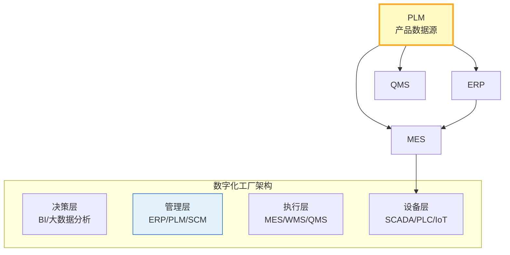

# PLM是什么

PLM（Product Lifecycle Management，产品生命周期管理）是制造业数字化转型的核心系统之一。它并非单一软件，而是一套覆盖产品从概念到退役全生命周期的数据管理、流程协同与决策支撑体系。本文从定义、价值、行业需求三个维度全面解析PLM。

## 1. PLM定义

**Product Lifecycle Management** 是一种战略性的业务方法，它应用一致的一套业务解决方案来协同管理产品全生命周期——从概念创意、设计制造到服务退役——的所有产品数据和流程。

PLM的三个关键特征：

| 特征 | 说明 |
|------|------|
| **全生命周期** | 覆盖概念→设计→制造→服务→退役五大阶段 |
| **单一数据源** | 所有产品数据统一管理，消除信息孤岛 |
| **流程协同** | 跨部门、跨企业、跨地域的流程协作 |

## 2. 产品生命周期五阶段

每个阶段的核心活动与PLM支撑：

| 阶段 | 核心活动 | PLM支撑 |
|------|----------|---------|
| 概念 | 需求分析、可行性研究、概念方案 | 需求管理、项目立项、方案评审 |
| 设计 | CAD建模、仿真验证、工程BOM | 文档管理、BOM管理、CAD集成、协同设计 |
| 制造 | 工艺规划、工装设计、生产准备 | 工艺路线、MBOM转化、变更管理 |
| 服务 | 安装调试、维修保养、技术升级 | 技术文档、备件BOM、现场问题反馈 |
| 退役 | 回收拆解、环保处置、数据归档 | 合规追溯、数据保留策略 |

## 3. PLM与PDM/CAD/ERP的关系

制造业信息化体系中，PLM处于承上启下的关键位置：

| 系统 | 职责边界 | 与PLM的关系 |
|------|----------|-------------|
| **CAD/CAE** | 产品设计与仿真 | PLM管理CAD产生的图纸与模型文件 |
| **PDM** | 产品数据管理 | PDM是PLM的核心子集，PLM = PDM + 流程协同 |
| **ERP** | 企业资源计划 | PLM传递BOM与工艺数据给ERP，ERP反馈成本与供应信息 |
| **MES** | 制造执行 | PLM提供MBOM与工艺路线，MES反馈生产实绩 |

## 4. PLM的三层价值

PLM的价值可以从数据、流程、决策三个层次递进理解：

### 第一层：数据管理

- **单一数据源（SSOT）**：所有产品数据统一存储，避免版本混乱
- **全生命周期追溯**：从设计到服务的数据完整可追溯
- **数据安全与合规**：权限控制、审计日志、法规遵从

### 第二层：流程协同

- **跨部门协同**：研发、工艺、制造、采购在同一平台协作
- **标准化流程**：签审流程、变更流程、发布流程标准化
- **供应链协同**：与供应商共享设计数据，协同开发

### 第三层：决策支撑

- **产品组合管理**：产品线规划与投资决策
- **质量分析**：基于全生命周期数据的质量追溯与改进
- **成本优化**：设计阶段即可预估制造成本

## 5. 制造业为何需要PLM

### 产品复杂度激增

现代产品复杂度呈指数级增长：一辆汽车包含超过3万个零件，一架飞机超过600万个零件。传统文件共享和邮件协作已完全无法应对。

### 合规要求趋严

- 汽车行业：IATF 16949、功能安全ISO 26262
- 航空行业：AS9100、适航认证
- 医疗行业：FDA 21 CFR Part 11
- 所有行业都要求完整的设计与变更追溯

### 协同范围扩大

- 全球化研发团队需要24小时协作
- 供应商深度参与设计（供应商早期介入ESI）
- 客户定制化需求要求快速响应

## 6. 三大商业产品对比

| 维度 | Siemens Teamcenter | PTC Windchill | Dassault ENOVIA |
|------|-------------------|---------------|-----------------|
| **核心定位** | 企业级PLM平台 | 产品开发平台 | 3D体验平台 |
| **原生CAD** | NX/Solid Edge | Creo | CATIA/SolidWorks |
| **优势行业** | 汽车、航空航天 | 离散制造、高科技 | 航空航天、汽车 |
| **BOM管理** | 多视图BOM、配置管理 | 多视图BOM | BOM管理+3D关联 |
| **变更管理** | 成熟的变更流程 | 变更与问题管理 | 变更协同 |
| **工艺管理** | MPP/Manufacturing | MPMLink | DELMIA工艺 |
| **部署模式** | 本地/云/SaaS | 本地/云 | 云优先（3DEXPERIENCE） |
| **集成能力** | SAP/Oracle深度集成 | SAP/Oracle集成 | SAP集成 |
| **规模能力** | 10万+用户 | 5万+用户 | 5万+用户 |
| **学习曲线** | 陡峭 | 中等 | 中等 |

## 7. PLM在数字化工厂中的定位

PLM作为数字化工厂的**产品数据源头**，向下为MES提供工艺路线和制造BOM，为ERP提供物料主数据和BOM结构，为QMS提供检验标准与规范。没有PLM，数字化工厂就如同没有蓝图的建筑工地——数据标准不统一、流程断点频发、追溯困难重重。

## 小结

- PLM是产品全生命周期数据管理与流程协同的战略性平台
- PLM = PDM + 流程协同 + 决策支撑，其价值从数据管理向决策智能递进
- 在数字化工厂中，PLM是产品数据的唯一权威来源（SSOT）
- 三大商业PLM各有所长，选型需结合行业特征、CAD生态和规模需求
