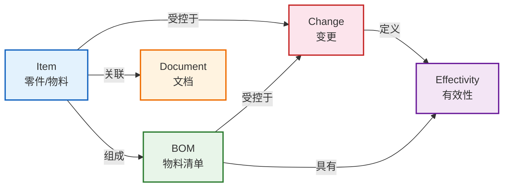
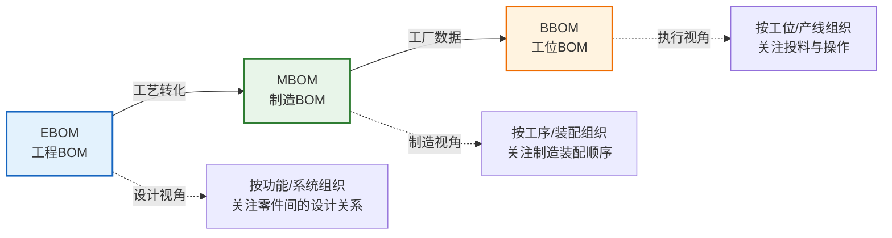
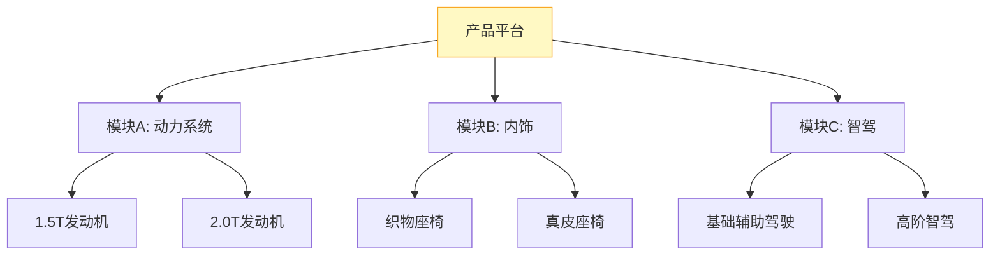
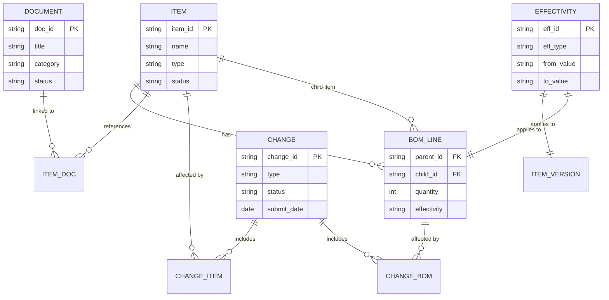
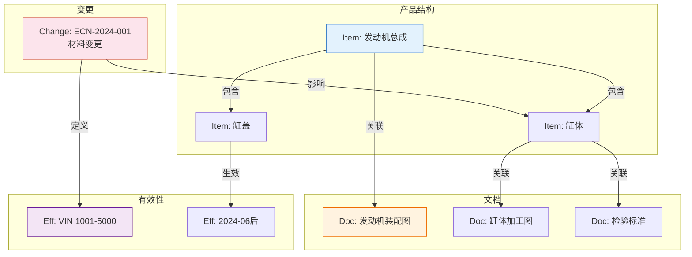

# 核心概念与数据模型

PLM系统的核心是围绕"产品"建立的一套数据模型和对象关系。理解Item、BOM、Document、Change、Effectivity这五大核心对象及其关系，是掌握PLM系统的基础。本文深入解析PLM的核心概念、数据模型及对象关系。

## 1. 核心对象

PLM系统围绕以下五大核心对象构建数据模型：

| 对象 | 英文名 | 说明 | 示例 |
|------|--------|------|------|
| **Item** | 零件/物料 | 最基本的产品数据单元，代表一个物理或逻辑实体 | 螺栓M8x30、发动机总成 |
| **BOM** | 物料清单 | 描述产品的组成结构，定义父子装配关系 | 发动机BOM、整车BOM |
| **Document** | 文档 | 关联到Item或BOM的技术文件 | CAD图纸、检验标准、作业指导书 |
| **Change** | 变更 | 对已发布数据的修改控制对象 | ECN工程变更、ECO变更令 |
| **Effectivity** | 有效性 | 定义某个版本在什么条件下生效 | 序列号1001-2000生效、2024-01后生效 |

### 对象之间的关系



## 2. BOM演进：EBOM→MBOM→BBOM

BOM是PLM最核心的数据对象，它在产品生命周期中经历多次演进：



| BOM类型 | 创建者 | 组织方式 | 核心关注点 | 下游系统 |
|---------|--------|----------|------------|----------|
| **EBOM** | 设计工程师 | 按功能/系统 | 设计意图、零件间的功能关系 | PLM |
| **MBOM** | 工艺工程师 | 按工序/装配 | 制造过程、装配顺序、资源分配 | ERP/MES |
| **BBOM** | 生产工程师 | 按工位/产线 | 投料顺序、操作步骤、工装夹具 | MES |

### EBOM到MBOM的典型转化

1. **结构重组**：按装配工序重新组织BOM层级
2. **虚拟件拆分**：设计虚拟件（如线束组件）拆分为实际制造件
3. **工艺件添加**：增加工艺需要的辅料（胶水、焊接材料等）
4. **替代料设置**：为采购风险件设置替代物料
5. **选配逻辑**：为配置型产品设置选配条件和可选件

## 3. 产品结构树

产品结构树是BOM的可视化表示，以树形结构展示产品的组成关系：

```
汽车（整车）
├── 发动机总成
│   ├── 缸体
│   ├── 缸盖
│   ├── 曲轴
│   └── 活塞组件
│       ├── 活塞
│       ├── 活塞环
│       └── 活塞销
├── 底盘总成
│   ├── 前悬架
│   ├── 后悬架
│   └── 制动系统
└── 电气系统
    ├── 蓄电池
    ├── 发电机
    └── 线束总成
```

PLM系统支持产品结构树的多视图切换：
- **设计视图**：按功能系统组织（EBOM视图）
- **制造视图**：按装配工序组织（MBOM视图）
- **服务视图**：按维修单元组织（SBOM视图）

## 4. 零件族与配置管理

### 零件族（Part Family）

零件族是一组具有相似几何特征但参数不同的零件集合。通过零件族管理可以有效减少零件数量：

| 概念 | 说明 | 示例 |
|------|------|------|
| **通用件** | 不同产品间共享的标准零件 | M8螺栓、O型密封圈 |
| **变型件** | 基于同一设计通过参数变化产生的零件 | 不同长度的同一截面型材 |
| **模块** | 可配置的功能单元，通过选配组合成不同产品 | 发动机高功率版/低功率版 |

### 配置管理

配置管理定义了产品的可变部分及组合规则：



配置管理的核心规则：
- **互斥规则**：同一模块只能选择一个变型
- **依赖规则**：选择2.0T发动机必须搭配高功率变速箱
- **默认值**：未指定时使用默认配置

## 5. 版本与修订

PLM中版本（Version）和修订（Revision）是两个不同层级的变更控制：

```
A.1 → A.2 → A.3  （修订：小改动，设计意图不变）
                  ↓
A.3 → B.1        （版本：大改动，设计意图变更）
      ↓
B.1 → B.2 → B.3  （新一轮修订）
```

| 维度 | 版本（Version） | 修订（Revision/Iteration） |
|------|----------------|---------------------------|
| **语义** | 设计意图发生变更 | 设计意图不变的小修改 |
| **触发** | 重大设计变更 | 签审退回修改、小缺陷修正 |
| **影响** | 可能影响互换性 | 不影响互换性 |
| **审批** | 需要完整的变更流程 | 通常自动递增 |
| **示例** | A→B：材料从钢改为铝 | A.1→A.2：修改倒角尺寸 |

## 6. 数据模型ER图



## 7. 对象关系图

PLM系统中各核心对象的关系网络：



## 8. 主数据治理原则

PLM中主数据的质量直接决定下游系统的数据质量，必须遵循以下治理原则：

### 编码规范

| 主数据类型 | 编码原则 | 示例 |
|-----------|----------|------|
| 物料编码 | 分类码+流水号，唯一不重复 | 101-02034（10=金属件,1=钢材,0=棒材,2=圆钢,034=流水号） |
| 文档编码 | 文档类型+项目号+流水号 | DWG-VEH-0015 |
| 变更编码 | 变更类型+年+流水号 | ECN-2024-0156 |

### 治理原则

1. **唯一性**：同一物料在系统中只能有一个编码，不允许一物多码
2. **完整性**：物料属性必须填写完整，关键属性不允许为空
3. **一致性**：PLM与ERP的物料主数据必须保持一致
4. **可追溯性**：所有数据变更必须留有审计日志
5. **标准化**：统一分类标准（如UNSPSC或企业自定义分类体系）

### 数据质量检查

PLM系统通常内置数据质量检查规则，在数据发布前强制校验：

- 必填字段检查：关键属性是否填写
- BOM完整性：是否有遗漏子件
- 文档关联检查：图纸是否已关联到对应零件
- 编码规范检查：是否符合编码规则
- 重复性检查：是否已存在相同规格的物料

## 小结

- PLM五大核心对象：Item、BOM、Document、Change、Effectivity构成了完整的产品数据模型
- BOM演进（EBOM→MBOM→BBOM）是PLM数据流的核心脉络
- 版本与修订是两层变更控制机制：版本表示设计意图变更，修订表示小修改
- 配置管理支持产品平台化和模块化设计
- 主数据治理是PLM成功的基石，编码规范和数据质量检查缺一不可
