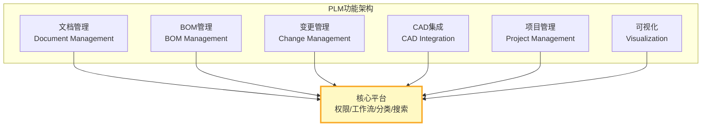
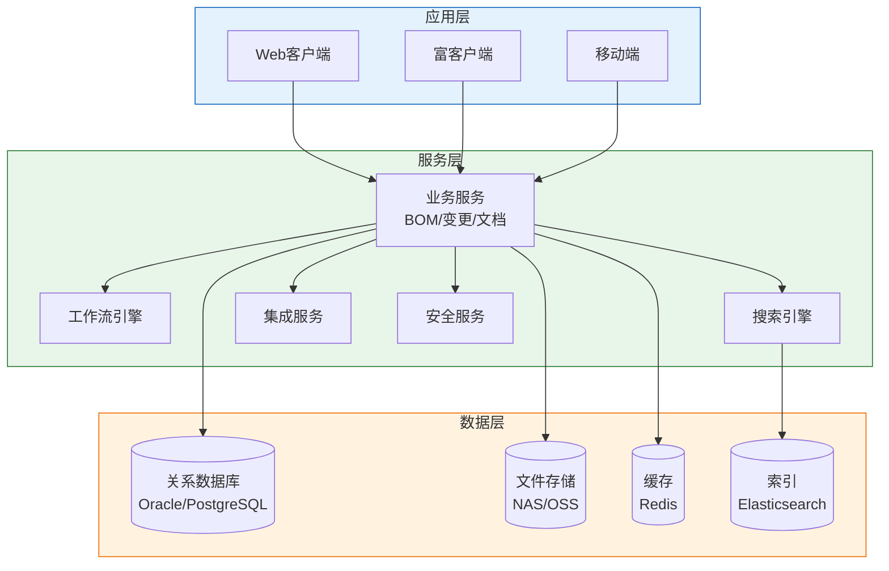
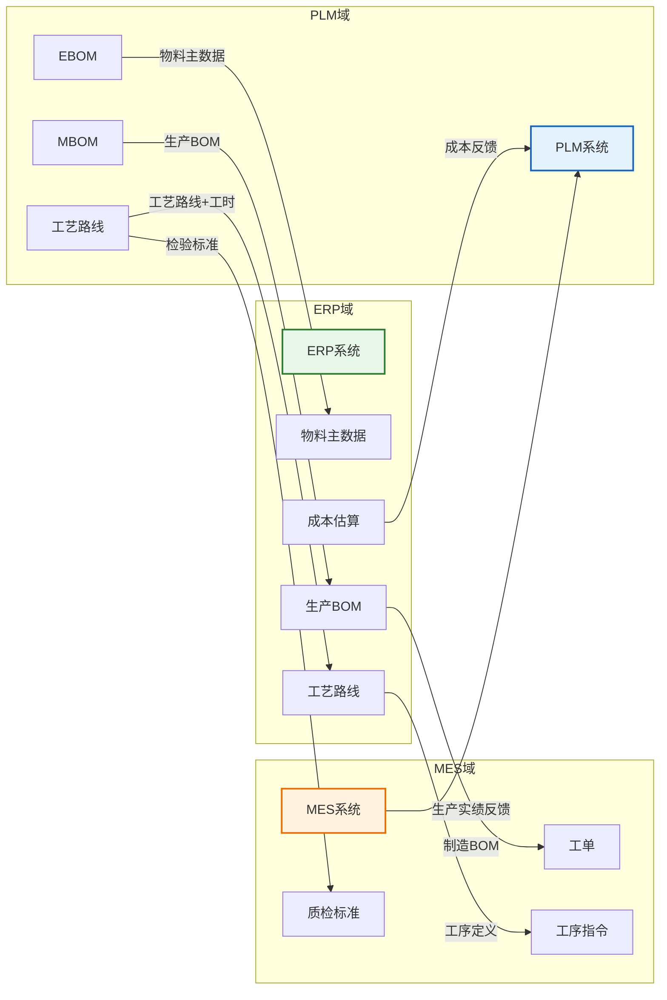

# PLM整体架构

PLM系统是一个复杂的企业级平台，其架构设计直接决定了系统的扩展性、性能和集成能力。本文从功能架构、技术架构、CAD集成、多站点协同、部署模式五个维度全面解析PLM系统架构。

## 1. 功能架构

PLM的功能架构可以划分为六大核心模块：



| 功能模块 | 核心能力 | 关键特性 |
|---------|----------|---------|
| **文档管理** | 文档创建、签审、发布、归档 | 生命周期、版本控制、权限管理 |
| **BOM管理** | EBOM/MBOM/BBOM创建与维护 | 多视图、比较、配置管理 |
| **变更管理** | ECN/ECO流程管控 | 影响分析、闭环验证 |
| **CAD集成** | 与CAD工具双向交互 | 嵌入式、服务端转换、轻量化 |
| **项目管理** | 项目计划、任务分配、进度跟踪 | 甘特图、资源分配、里程碑 |
| **可视化** | 3D模型查看、批注、测量 | 轻量化渲染、多格式支持 |

## 2. 技术架构分层

现代PLM系统采用分层架构设计，从底层数据存储到上层应用呈现清晰分离：



### 各层职责

| 层次 | 核心组件 | 职责 |
|------|---------|------|
| **应用层** | Web/富客户端/移动端 | 用户交互、数据展示、操作入口 |
| **服务层** | 业务服务/工作流/搜索/集成/安全 | 业务逻辑处理、流程编排、对外集成 |
| **数据层** | 关系DB/文件存储/缓存/索引 | 数据持久化、文件管理、性能加速 |

## 3. CAD集成方式

PLM与CAD的集成是制造业最核心的集成场景，主要有三种模式：

### 模式一：本地嵌入式集成

CAD软件内嵌PLM操作界面，设计师无需离开CAD环境即可完成PLM操作。

```
┌─────────────────────────────┐
│         CAD 软件             │
│  ┌───────┐  ┌──────────────┐│
│  │CAD功能│  │PLM嵌入式面板  ││
│  │       │  │ 保存/检出/   ││
│  │       │  │ 属性填写/    ││
│  │       │  │ BOM查看      ││
│  └───────┘  └──────────────┘│
└─────────────────────────────┘
```

**优势**：用户体验好，数据实时同步
**劣势**：需要为每种CAD开发专用插件

### 模式二：服务端格式转换

CAD文件上传到PLM服务端后，自动进行格式转换。

| 转换类型 | 源格式 | 目标格式 | 用途 |
|---------|--------|---------|------|
| 轻量化 | CATPart/NX/PRTC | JT | 3D查看与协同 |
| 2D发布 | CATDrawing/Draft | PDF/DWG | 图纸分发与打印 |
| 中间格式 | 各CAD原生格式 | STEP/IGES | 跨CAD数据交换 |

### 模式三：轻量化查看

通过轻量化查看器在浏览器中查看3D模型，无需安装CAD软件：

| 查看器 | 支持格式 | 特性 |
|--------|---------|------|
| JT2Go | JT | 西门子免费查看器 |
| 3D Play | 多种3D格式 | 达索云端查看器 |
| Creo View | 多种3D/2D格式 | PTC企业级查看器 |

## 4. 多站点协同架构

大型制造企业通常在全球多个地点设有研发中心，PLM需要支持多站点协同：

### 集中式架构

```
┌──────────────────┐
│   中心服务器       │
│   (全量数据)       │
└────────┬─────────┘
         │
    ┌────┼────┐
    ↓    ↓    ↓
  站点A  站点B  站点C
 (缓存)  (缓存)  (缓存)
```

- **优势**：数据一致性强、管理简单
- **劣势**：网络依赖高、远程访问延迟大
- **适用**：站点间网络带宽充足的企业

### 联邦式架构

```
┌────────┐     ┌────────┐
│ 站点A   │←───→│ 站点B   │
│ (全量)  │ 同步 │ (全量)  │
└────────┘     └────────┘
     ↑              ↑
     └──────┬───────┘
            ↓
     ┌────────────┐
     │  全局目录    │
     │  (索引)     │
     └────────────┘
```

- **优势**：本地访问快、网络中断不影响本地工作
- **劣势**：数据同步复杂、一致性保证困难
- **适用**：跨国企业、网络质量不稳定

## 5. 部署模式

| 部署模式 | 说明 | 优势 | 劣势 | 适用场景 |
|---------|------|------|------|---------|
| **本地部署** | 企业自建机房部署 | 数据完全可控、可深度定制 | 初期投入大、运维成本高 | 大型制造企业、数据敏感行业 |
| **云部署** | 公有云IaaS上部署 | 弹性伸缩、按需付费 | 数据在云端、需评估合规 | 中型企业、快速上线 |
| **SaaS** | 供应商托管的多租户服务 | 零运维、快速上线 | 定制性有限、数据隔离风险 | 中小企业、非核心产品线 |

## 6. 与ERP/MES集成拓扑

PLM作为产品数据源头，需要与ERP和MES进行深度集成：



### 关键集成接口

| 接口方向 | 传递数据 | 传递方式 | 频率 |
|---------|---------|---------|------|
| PLM→ERP | 物料主数据 | 接口/中间表 | 实时/定时 |
| PLM→ERP | BOM数据 | 接口/中间表 | 发布时触发 |
| PLM→ERP | 工艺路线+工时 | 接口/中间表 | 发布时触发 |
| ERP→PLM | 成本信息 | 接口 | 变更评估时 |
| ERP→MES | 工单+工序 | 接口/MQ | 工单下达时 |
| PLM→MES | 检验标准 | 接口 | 发布时触发 |
| MES→PLM | 生产实绩/质量问题 | 接口 | 事件触发 |

## 小结

- PLM功能架构涵盖文档、BOM、变更、CAD集成、项目管理和可视化六大模块
- 技术架构采用应用层→服务层→数据层的分层设计，支持水平扩展
- CAD集成有嵌入式、服务端转换、轻量化查看三种模式，根据场景组合使用
- 多站点协同有集中式和联邦式两种架构，各有适用场景
- PLM与ERP/MES的集成是制造业数字化的关键数据链路
