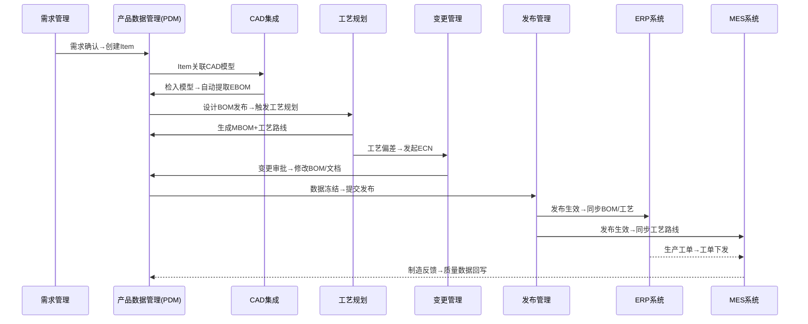
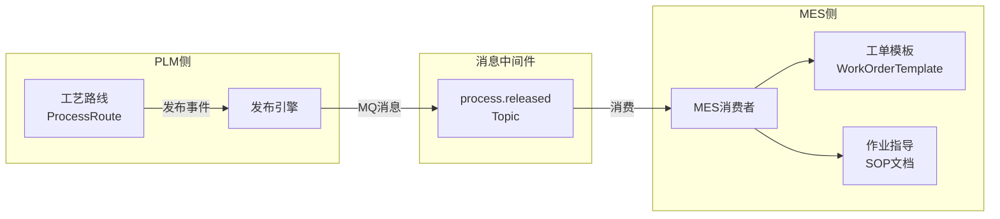
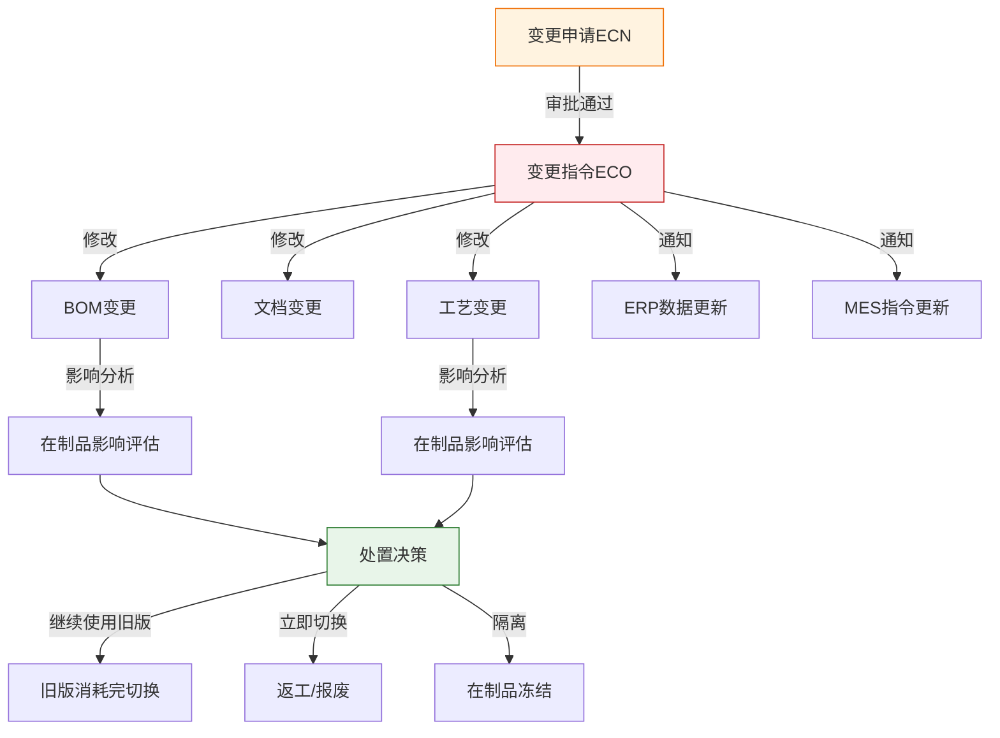
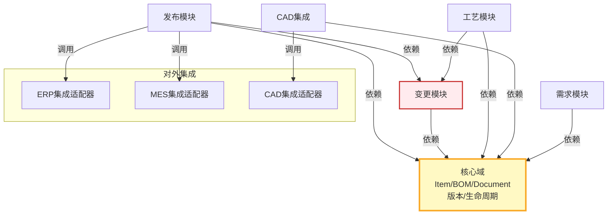

# PLM模块联动与数据流

PLM系统的核心价值不仅在于单个模块的功能完整性，更在于模块之间的联动与数据流转。从需求创建到MES/ERP同步，数据在PLM内部及外部系统之间的流动构成了产品生命周期管理的血脉。本文从开发者视角深入剖析PLM各模块的联动机制与端到端数据流。

## 1. 端到端数据流全景

PLM系统覆盖从需求到制造的完整链路，数据在各模块间流转、转化、增值：



### 数据流关键节点说明

| 阶段 | 输入 | 输出 | 触发条件 | 数据载体 |
|------|------|------|---------|---------|
| 需求→设计 | 需求规格书 | Item + 规格属性 | 需求评审通过 | Item Master |
| 设计→BOM | CAD模型文件 | EBOM结构 | CAD检入/手动创建 | BOM + BOM_LINE |
| BOM→工艺 | 设计BOM | MBOM + 工艺路线 | BOM状态=Released | Process Route |
| 工艺→变更 | 工艺偏差/改进需求 | ECN/ECO | 问题发现/主动优化 | Change Order |
| 变更→发布 | 变更后数据 | 发布包 | 变更审批完成 | Release Package |
| 发布→ERP | BOM+工艺 | 物料主数据+BOM | 发布生效 | Interface Message |
| 发布→MES | 工艺路线 | 工艺指令 | 发布生效 | Interface Message |

## 2. 模块间接口矩阵

以下是PLM内部及对外集成的核心接口定义：

| 源模块 | 目标模块 | 接口名称 | 传输数据 | 触发时机 | 同步方式 |
|--------|---------|---------|---------|---------|---------|
| 需求管理 | PDM | `req.to.item.create` | 需求ID、名称、规格 | 需求评审通过 | 同步API |
| CAD集成 | PDM | `cad.bom.extract` | EBOM结构、属性 | CAD检入时 | 事件驱动 |
| PDM | 工艺规划 | `pdm.bom.release` | 设计BOM、版本号 | BOM状态→Released | 异步MQ |
| 工艺规划 | PDM | `process.mbom.save` | MBOM、工艺路线 | 工艺完成提交 | 同步API |
| 工艺规划 | 变更管理 | `process.deviation.report` | 偏差描述、影响范围 | 工艺验证不通过 | 异步MQ |
| 变更管理 | PDM | `change.data.apply` | 修改后的BOM/文档 | 变更审批通过 | 事务内同步 |
| 发布管理 | ERP | `release.erp.sync` | 物料+BOM+工艺 | 发布生效事件 | 异步MQ |
| 发布管理 | MES | `release.mes.sync` | 工艺路线+SOP | 发布生效事件 | 异步MQ |
| MES | PDM | `mes.quality.feedback` | 质量数据、良率 | 工单完成 | 定时批量 |

## 3. 设计BOM→工艺路线→MES工单的联动链

这是PLM中最核心的联动链条，理解它就理解了PLM数据流的主干。

### 3.1 设计BOM触发工艺路线生成

当设计BOM状态变更为`Released`时，系统自动触发工艺规划流程：

```java
// BOM发布事件监听器
@EventListener
public void onBomReleased(BomReleasedEvent event) {
    String bomId = event.getBomId();
    String bomVersion = event.getVersion();

    // 1. 查询BOM完整结构
    BomStructure bom = bomService.getBomTree(bomId, bomVersion);

    // 2. 创建工艺规划任务
    ProcessTask task = new ProcessTask();
    task.setSourceBomId(bomId);
    task.setSourceBomVersion(bomVersion);
    task.setStatus(ProcessTaskStatus.PENDING);
    processTaskRepository.save(task);

    // 3. 通知工艺工程师
    notificationService.notifyProcessEngineer(task);

    // 4. 自动预生成工艺路线骨架（基于规则引擎）
    ProcessRoute route = processRouteGenerator.generateSkeleton(bom);
    route.setTaskId(task.getId());
    route.setStatus(RouteStatus.DRAFT);
    processRouteRepository.save(route);
}
```

### 3.2 工艺路线触发MES工单

工艺路线发布后，数据同步至MES形成可执行的工单模板：



MES工单创建的消费者逻辑：

```java
@KafkaListener(topics = "process.released")
public void onProcessReleased(ConsumerRecord<String, String> record) {
    ProcessReleasedPayload payload = JsonUtils.fromJson(record.value(), ProcessReleasedPayload.class);

    // 幂等检查：避免重复创建
    if (workOrderTemplateRepo.existsByProcessRouteId(payload.getRouteId())) {
        log.info("工单模板已存在，跳过: routeId={}", payload.getRouteId());
        return;
    }

    // 创建工单模板
    WorkOrderTemplate template = new WorkOrderTemplate();
    template.setProcessRouteId(payload.getRouteId());
    template.setMaterialCode(payload.getMaterialCode());
    template.setOperations(convertOperations(payload.getSteps()));
    template.setStatus(TemplateStatus.ACTIVE);
    workOrderTemplateRepo.save(template);
}
```

## 4. 变更传播机制

变更是PLM中最复杂的数据流场景，一次变更可能同时影响BOM、文档、工艺、在制品等多个维度。

### 4.1 变更传播路径



### 4.2 变更影响评估算法

变更影响评估需要递归查找所有受影响的对象：

```java
public ChangeImpactResult assessImpact(String changeId) {
    ChangeOrder eco = changeOrderRepo.findById(changeId);

    // 1. 查找BOM引用：哪些上层BOM使用了被变更的物料
    List<BomReference> bomRefs = bomLineRepo.findParentBomsRecursive(
        eco.getAffectedItems()  // 受影响的物料ID列表
    );

    // 2. 查找工艺引用：哪些工艺路线使用了被变更的BOM
    List<ProcessReference> procRefs = processRouteRepo.findByBomIn(
        bomRefs.stream().map(BomReference::getBomId).collect(toList())
    );

    // 3. 查找在制品影响：哪些工单正在生产被变更的产品
    List<WipImpact> wipImpacts = mesClient.queryActiveWorkOrders(
        eco.getAffectedItems()
    );

    return ChangeImpactResult.builder()
        .bomReferences(bomRefs)
        .processReferences(procRefs)
        .wipImpacts(wipImpacts)
        .severity(calculateSeverity(bomRefs, procRefs, wipImpacts))
        .build();
}
```

BOM递归查找的SQL实现（CTE递归）：

```sql
-- 递归查找所有使用指定物料的上层BOM
WITH RECURSIVE bom_ancestors AS (
    -- 基础查询：直接引用被变更物料的BOM行
    SELECT bl.bom_id, bl.parent_item_id, bl.child_item_id, 1 AS level
    FROM bom_line bl
    WHERE bl.child_item_id IN (:affectedItemIds)

    UNION ALL

    -- 递归查询：向上查找父级BOM
    SELECT bl.bom_id, bl.parent_item_id, bl.child_item_id, ba.level + 1
    FROM bom_line bl
    INNER JOIN bom_ancestors ba ON bl.child_item_id = ba.parent_item_id
    WHERE ba.level < 10  -- 防止无限递归
)
SELECT DISTINCT bom_id, parent_item_id, level
FROM bom_ancestors
ORDER BY level;
```

## 5. 数据一致性保障机制

跨模块、跨系统的数据一致性是PLM数据流中最关键的工程挑战。

### 5.1 一致性保障策略对比

| 策略 | 适用场景 | 实现方式 | 优点 | 缺点 |
|------|---------|---------|------|------|
| **本地事务** | 单模块内操作 | Spring @Transactional | 强一致，实现简单 | 不适用跨系统 |
| **事件驱动+最终一致** | 跨模块异步 | MQ + 幂等消费 | 解耦，性能好 | 有延迟窗口 |
| **Saga补偿事务** | 跨系统长事务 | 正向操作+补偿操作 | 灵活，可回滚 | 实现复杂 |
| **两阶段提交(2PC)** | 强一致跨库 | XA协议 | 强一致 | 性能差，不推荐 |

### 5.2 发布流程的Saga实现示例

发布流程涉及PLM→ERP和PLM→MES两个外部调用，采用Saga模式保障一致性：

```java
public ReleaseResult executeRelease(ReleaseRequest request) {
    String sagaId = UUID.randomUUID().toString();

    try {
        // Step 1: PLM内部数据冻结
        releaseService.freezeData(request.getBomId());

        // Step 2: 同步至ERP
        ErpSyncResult erpResult = erpClient.syncBomAndProcess(request);
        if (!erpResult.isSuccess()) {
            throw new ErpSyncException(erpResult.getMessage());
        }

        // Step 3: 同步至MES
        MesSyncResult mesResult = mesClient.syncProcessRoute(request);
        if (!mesResult.isSuccess()) {
            // 补偿：回滚ERP同步
            erpClient.rollbackSync(erpResult.getSyncId());
            throw new MesSyncException(mesResult.getMessage());
        }

        // Step 4: 更新发布状态
        releaseService.confirmRelease(request.getReleaseId());
        return ReleaseResult.success();

    } catch (ErpSyncException e) {
        // 补偿：解冻PLM数据
        releaseService.unfreezeData(request.getBomId());
        return ReleaseResult.fail("ERP同步失败: " + e.getMessage());
    } catch (MesSyncException e) {
        // ERP已回滚，解冻PLM数据
        releaseService.unfreezeData(request.getBomId());
        return ReleaseResult.fail("MES同步失败: " + e.getMessage());
    }
}
```

## 6. 开发者视角的模块依赖图

从代码层面理解模块间的依赖关系，有助于合理划分子域和微服务边界：



### 模块依赖关键原则

1. **核心域独立**：Item/BOM/Document是基础数据，不依赖上层业务模块
2. **变更模块枢纽**：变更管理是数据修改的统一入口，其他模块通过变更模块修改已发布数据
3. **集成适配器隔离**：外部系统交互通过适配器层隔离，适配器实现可替换
4. **单向依赖**：下游模块不反向依赖上游模块，通过事件解耦

## 7. 开发者实战Tips

1. **事件命名规范**：采用`模块.动作.对象`格式（如`pdm.release.bom`），便于路由和监控
2. **消息幂等设计**：所有跨模块消费者必须实现幂等，推荐使用唯一业务ID + 状态机判重
3. **BOM递归查询优化**：对于层级深的BOM（10层以上），考虑物化路径（Materialized Path）或嵌套集（Nested Set）替代CTE递归
4. **变更传播限流**：大规模变更（如基础件变更影响上千个BOM）需要批量异步处理，避免消息风暴
5. **数据同步监控**：建立数据同步健康度看板，监控各接口延迟、成功率、堆积量
6. **补偿事务自动化**：使用编排引擎（如Camunda/Zeebe）管理Saga流程，避免硬编码补偿逻辑
7. **灰度发布策略**：BOM/工艺发布到MES时支持灰度推送，先推送至试点产线验证后再全量推送
