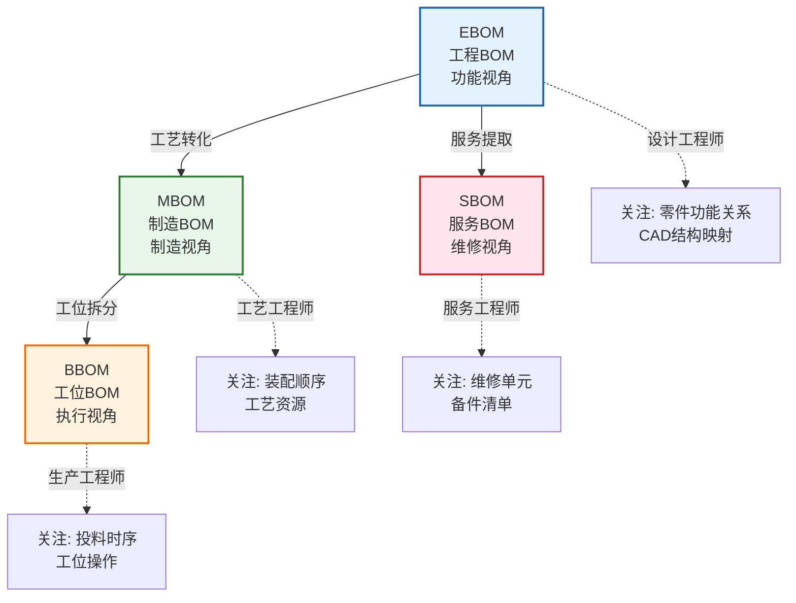
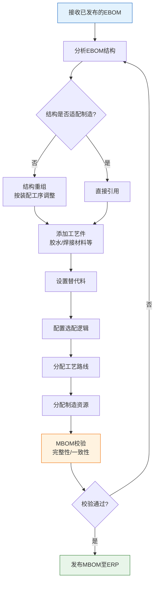

# BOM管理详解

BOM（Bill of Materials，物料清单）是PLM系统中最核心的数据对象，它定义了产品的组成结构。一个产品从设计到制造，BOM经历多次演进和转化，理解BOM的类型、演进逻辑和管理方法是掌握PLM的关键。

## 1. BOM类型全景

在产品全生命周期中，存在多种类型的BOM，每种BOM服务于不同的业务场景：

| BOM类型 | 全称 | 创建者 | 组织方式 | 服务阶段 | 下游系统 |
|---------|------|--------|---------|---------|---------|
| **EBOM** | Engineering BOM | 设计工程师 | 按功能/系统 | 设计阶段 | PLM |
| **MBOM** | Manufacturing BOM | 工艺工程师 | 按装配工序 | 制造准备 | ERP/MES |
| **BBOM** | Bill of Bill | 生产工程师 | 按工位/产线 | 生产执行 | MES |
| **SBOM** | Service BOM | 服务工程师 | 按维修单元 | 售后服务 | 售后系统 |

### 各类型BOM的关系



## 2. EBOM→MBOM转化流程

EBOM到MBOM的转化是PLM数据流中最关键的一环，涉及结构重组、工艺件添加、替代料设置等复杂操作：



### 转化关键步骤详解

**步骤1：结构重组**

EBOM按功能组织，MBOM按制造工序组织。例如：

| EBOM结构 | MBOM结构 |
|---------|---------|
| 电气系统 → 线束总成 | 装配工序1 → 仪表盘线束安装 |
| 电气系统 → 传感器组 | 装配工序2 → 发动机线束安装 |
| 电气系统 → 控制器 | 装配工序3 → 底盘线束安装 |

**步骤2：添加工艺件**

| 类型 | 说明 | 示例 |
|------|------|------|
| 辅料 | 制造过程中消耗但不构成产品的材料 | 胶水、润滑油、焊接气体 |
| 工装件 | 制造过程需要的辅助工具 | 夹具、定位销、模具 |
| 包装件 | 产品包装所需的物料 | 包装盒、防震材料、标签 |

## 3. BOM多视图管理

PLM系统通过多视图技术，让不同角色的用户看到同一产品数据的不同侧面：

```
                    ┌─────────────┐
                    │  产品主数据  │
                    │  (SSOT)      │
                    └──────┬──────┘
                           │
              ┌────────────┼────────────┐
              ↓            ↓            ↓
        ┌──────────┐ ┌──────────┐ ┌──────────┐
        │ 设计视图  │ │ 制造视图  │ │ 服务视图  │
        │ (EBOM)   │ │ (MBOM)   │ │ (SBOM)   │
        └──────────┘ └──────────┘ └──────────┘
         设计师看      工艺师看     服务师看
```

多视图管理的核心原则：
- **数据同源**：所有视图基于同一产品主数据
- **视图独立**：不同视图的结构可独立调整
- **关联追溯**：任何视图的修改都可追溯到主数据
- **变更同步**：主数据变更时通知所有受影响视图

## 4. BOM比较与差异分析

BOM比较是PLM的重要功能，用于分析不同版本或不同视图BOM之间的差异：

| 比较场景 | 说明 | 用途 |
|---------|------|------|
| 版本比较 | 同一BOM不同版本的差异 | 变更影响分析 |
| 视图比较 | EBOM与MBOM的结构差异 | 转化完整性检查 |
| 配置比较 | 不同配置的BOM差异 | 选配方案对比 |
| 车型比较 | 不同车型BOM的差异 | 平台化分析 |

典型的BOM差异报告：

| 变更类型 | 父件 | 子件 | 旧值 | 新值 |
|---------|------|------|------|------|
| 新增 | 发动机总成 | 涡轮增压器 | - | 1 EA |
| 删除 | 发动机总成 | 机械增压器 | 1 EA | - |
| 修改 | 发动机总成 | 中冷器 | 1 EA(旧版) | 1 EA(新版) |
| 数量变更 | 底盘总成 | 减震器 | 2 EA | 4 EA |

## 5. 替代料与选配BOM

### 替代料管理

| 替代类型 | 说明 | 示例 |
|---------|------|------|
| **完全替代** | A和B可互换，不影响功能 | M8螺栓品牌A ↔ 品牌B |
| **条件替代** | 在特定条件下可替代 | 铝合金件替代钢件（非高温场景） |
| **临时替代** | 临时替代，需限期恢复 | 缺料时临时替代，到货后恢复 |

### 选配BOM

选配BOM用于配置型产品，通过选择不同的选配项组合出不同规格的产品：

| 选配项 | 选项 | 约束条件 |
|--------|------|---------|
| 动力系统 | 1.5T / 2.0T | 选2.0T必须选运动版变速箱 |
| 座椅 | 织物 / 真皮 | 真皮座椅需搭配座椅加热 |
| 天窗 | 无 / 小天窗 / 全景 | 全景天窗不可选1.5T |

## 6. BOM校验规则

BOM发布前必须通过校验，确保数据质量：

| 校验规则 | 说明 | 严重级别 |
|---------|------|---------|
| 结构完整性 | 所有子件必须已发布 | 错误（阻断） |
| 数量合理性 | 子件数量>0且在合理范围 | 错误（阻断） |
| 单位一致性 | 同一BOM中单位使用合理 | 警告 |
| 替代料检查 | 替代料必须已发布 | 错误（阻断） |
| 循环引用 | 不允许A包含B，B又包含A | 错误（阻断） |
| 层级深度 | BOM层级不超过设定最大值 | 警告 |
| 未关联文档 | 零件未关联任何图纸 | 警告 |

## 7. 虚拟件与幽灵BOM

### 虚拟件（Phantom Part）

虚拟件是BOM中的逻辑分组，不对应实际物料，在MRP运算时会被展开跳过：

| 特征 | 说明 |
|------|------|
| 库存管理 | 不做库存管理，无库存记录 |
| 采购管理 | 不单独采购，随父件一起生产 |
| MRP展开 | 在MRP运算时被展开，其子件直接挂在父件下 |
| 用途 | 用于BOM的逻辑分组和工艺过程管理 |

### 幽灵BOM

幽灵BOM是一种特殊的虚拟件处理方式：

```
正常BOM展开：
总成A → 虚拟件B → 子件B1
                   子件B2

幽灵展开后（MRP看到的）：
总成A → 子件B1
        子件B2
```

## 8. 真实案例：汽车BOM从设计到制造的转化

以下是一辆汽车的转向系统从EBOM到MBOM的转化流程：

### 设计阶段的EBOM

| 层级 | 物料编码 | 物料名称 | 数量 | 单位 |
|------|---------|---------|------|------|
| L1 | ASSY-STEER-001 | 转向系统总成 | 1 | EA |
| L2 | ASSY-STEER-COL | 转向柱总成 | 1 | EA |
| L3 | PRT-STEER-SHAFT | 转向轴 | 1 | EA |
| L3 | PRT-STEER-JOINT | 万向节 | 2 | EA |
| L2 | ASSY-STEER-RACK | 转向器总成 | 1 | EA |
| L3 | PRT-STEER-RACK-B | 齿条壳体 | 1 | EA |
| L3 | PRT-STEER-PINION | 小齿轮 | 1 | EA |

### 制造阶段的MBOM

| 层级 | 物料编码 | 物料名称 | 数量 | 工序 | 工位 |
|------|---------|---------|------|------|------|
| L1 | ASSY-STEER-001 | 转向系统总成 | 1 | OP10 | W-01 |
| L2 | ASSY-STEER-RACK | 转向器总成 | 1 | OP10 | W-01 |
| L3 | PRT-STEER-RACK-B | 齿条壳体 | 1 | OP10 | W-01 |
| L3 | PRT-STEER-PINION | 小齿轮 | 1 | OP10 | W-01 |
| L3 | MAT-GREASE-001 | 润滑脂 | 50 | g | W-01 |
| L2 | ASSY-STEER-COL | 转向柱总成 | 1 | OP20 | W-02 |
| L3 | PRT-STEER-SHAFT | 转向轴 | 1 | OP20 | W-02 |
| L3 | PRT-STEER-JOINT | 万向节 | 2 | OP20 | W-02 |

**关键差异**：
- MBOM按装配工序（OP10→OP20）重新排列了装配顺序
- 添加了工艺辅料（润滑脂）
- 增加了工序和工位信息
- 转向器总成优先装配，因为它是其他工序的基础

## 小结

- BOM是PLM最核心的数据对象，EBOM/MBOM/BBOM/SBOM四种类型服务于不同业务场景
- EBOM→MBOM转化涉及结构重组、工艺件添加、替代料设置等关键步骤
- 多视图管理让不同角色看到同一产品的不同侧面，数据同源是核心原则
- 替代料和选配BOM是处理产品多样性的关键能力
- BOM校验规则是保证数据质量的最后一道防线
