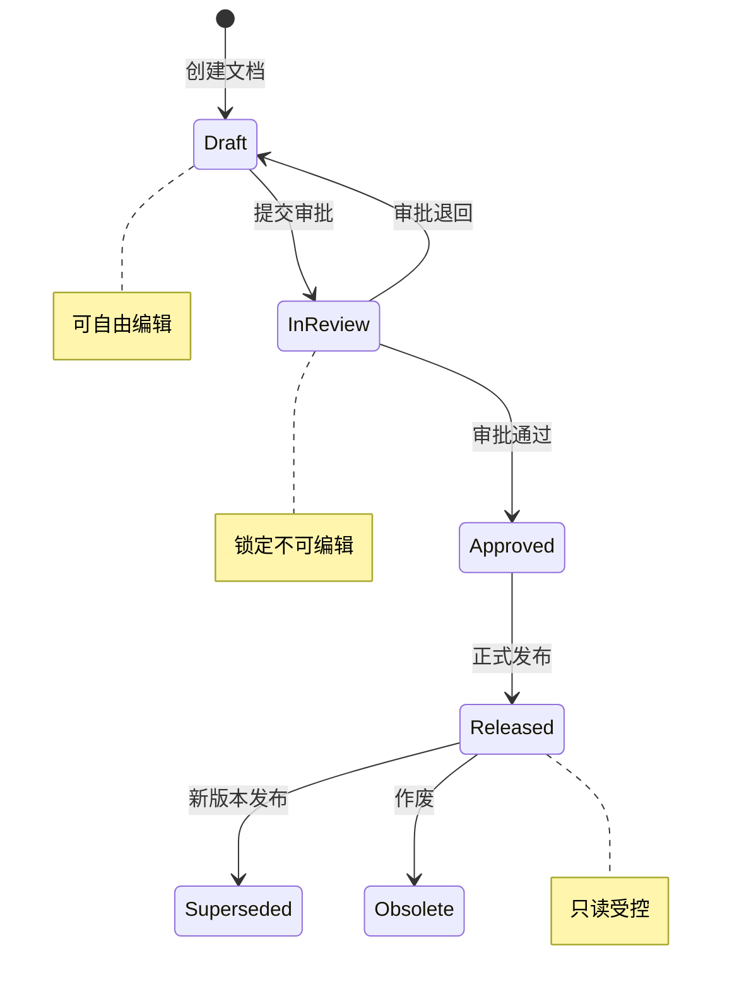
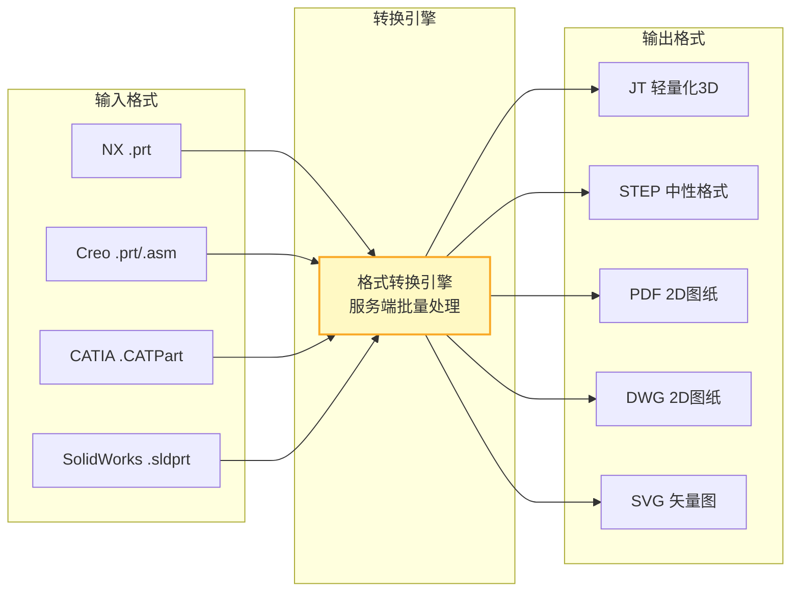

# 文档与图纸管理

文档与图纸是产品知识的载体，PLM中文档管理的核心目标是确保"正确的人，在正确的时间，看到正确版本的文档"。本文深入解析文档分类、签审流程、版本管理、CAD文件管理及文档安全控制。

## 1. 文档分类

PLM中的文档按用途可分为以下几类：

| 文档类别 | 说明 | 典型格式 | 生命周期 |
|---------|------|---------|---------|
| **设计图纸** | 产品设计与工程图纸 | CATPart/NX/PRTC/DWG | 随零件版本管理 |
| **工艺文件** | 制造工艺相关文档 | PDF/DOC/XLS | 随工艺版本管理 |
| **检验标准** | 质量检验规范与标准 | PDF/DOC | 按标准版本管理 |
| **说明书** | 产品使用与维护说明 | PDF/DOC | 按产品型号管理 |
| **规范文件** | 设计规范与标准规范 | PDF/DOC | 独立版本管理 |
| **试验报告** | 产品试验与测试报告 | PDF/XLS/DOC | 按试验项目管理 |

### 文档属性模型

每个文档在PLM中都有标准的属性集：

| 属性类别 | 属性项 | 说明 | 是否必填 |
|---------|--------|------|---------|
| 基本信息 | 文档编号 | 唯一标识 | 是 |
| 基本信息 | 文档名称 | 描述性名称 | 是 |
| 基本信息 | 文档类型 | 图纸/工艺/检验等 | 是 |
| 基本信息 | 密级 | 公开/内部/机密/绝密 | 是 |
| 关联信息 | 关联物料 | 文档对应的零件/装配件 | 视类型 |
| 版本信息 | 版本号 | 当前版本 | 自动 |
| 版本信息 | 修订号 | 当前修订 | 自动 |
| 流程信息 | 状态 | 草稿/审批中/已发布 | 自动 |
| 流程信息 | 拥有者 | 文档负责人 | 自动 |

## 2. 签审流程

文档从创建到发布需要经过标准化的签审流程：



### 签审角色与职责

| 角色 | 职责 | 权限 |
|------|------|------|
| **创建者** | 创建文档、提交审批 | 创建、编辑（草稿状态） |
| **审核者** | 技术审核、提出修改意见 | 查看、批注、通过/退回 |
| **批准者** | 最终批准发布 | 查看、批准/退回 |
| **读者** | 查看已发布文档 | 只读（已发布文档） |

### 签审流程的关键规则

1. **状态控制**：只有Draft状态的文档可以编辑，InReview及以上状态自动锁定
2. **强制路由**：审批退回必须返回到创建者，不允许跳过审核者
3. **变更通知**：文档发布后自动通知所有关联用户
4. **版本递增**：每次重新提交审批自动递增修订号

## 3. 版本管理

PLM中文档的版本管理包含三个层次：

| 层次 | 概念 | 触发条件 | 示例 |
|------|------|---------|------|
| **版本（Version）** | 重大设计变更 | 设计意图改变 | A → B |
| **修订（Revision）** | 审批过程中的迭代 | 退回修改后重新提交 | A.1 → A.2 |
| **迭代（Iteration）** | 保存检查点 | 每次检出/检入 | A.2.1 → A.2.2 |

### 版本管理的关键规则

```
文档创建 → V1(草稿)
    ↓ 提交审批
V1(审批中)
    ↓ 审批退回，修改
V2(草稿)  ← 自动递增修订
    ↓ 重新提交
V2(审批中)
    ↓ 审批通过
V2(已发布)
    ↓ 启动变更
V3(草稿)  ← 新版本
    ↓ ...
V3(已发布)
V2 自动变为"被取代(Superseded)"状态
```

## 4. CAD文件管理

CAD文件管理是PLM文档管理中最复杂的部分，涉及原生格式管理、格式转换和轻量化查看。

### 原生格式管理

| 管理维度 | 说明 | 实现方式 |
|---------|------|---------|
| 文件检入检出 | 防止多人同时修改同一文件 | 锁定机制，检出者独占编辑权 |
| 族表管理 | CAD族表零件的关联管理 | 族表实例与PLM变型件对应 |
| 装配关联 | 装配体与子件的关联关系 | CAD装配结构自动映射为BOM |
| 外部引用 | CAD文件间的外部引用关系 | 引用关系追踪，防止断链 |

### 格式转换

PLM需要在CAD原生格式与多种目标格式之间进行转换：



### 轻量化JT格式

JT是制造业最广泛使用的轻量化3D格式，由西门子开发并成为ISO标准（ISO 14306）：

| 特性 | 说明 |
|------|------|
| 文件大小 | 仅为原生CAD文件的1/10~1/50 |
| 精度级别 | 支持多种精度级别（精确/高/中/低） |
| 包含信息 | 几何、PMI、装配结构、元数据 |
| 查看方式 | 专用查看器或浏览器插件 |
| 行业采用 | 汽车（GM/Ford/Toyota）、航空航天（Boeing/Lockheed） |

## 5. 图纸查看器

### 轻量化查看能力

| 查看功能 | 2D图纸 | 3D模型 |
|---------|--------|--------|
| 缩放/平移/旋转 | 支持 | 支持 |
| 剖面查看 | 不适用 | 支持 |
| 测量（距离/角度） | 支持 | 支持 |
| 爆炸图 | 不适用 | 支持 |
| 批注/红线 | 支持 | 支持 |
| PMI查看 | 不适用 | 支持 |
| 对比查看 | 支持（叠图对比） | 支持（模型对比） |

### 查看器产品对比

| 查看器 | 厂商 | 支持格式 | 价格 | 部署方式 |
|--------|------|---------|------|---------|
| JT2Go | 西门子 | JT/3D | 免费 | 桌面/Web |
| 3D Play | 达索 | 多种3D | 订阅制 | 云端 |
| Creo View | PTC | 多种3D/2D | 商业 | 桌面/Web |
| Teamcenter VIS | 西门子 | JT/2D | 商业 | Web集成 |
| HOOPS | Tech Soft 3D | 多种3D | SDK | 嵌入式 |

## 6. 文档安全与权限

### 权限控制矩阵

| 操作 | 创建者 | 审核者 | 批准者 | 读者 |
|------|--------|--------|--------|------|
| 查看 | 仅草稿 | 审批中 | 审批中+已发布 | 已发布 |
| 编辑 | 仅草稿 | 否 | 否 | 否 |
| 下载 | 有权限 | 有权限 | 有权限 | 按策略 |
| 打印 | 有权限 | 有权限 | 有权限 | 按策略 |
| 批注 | 仅草稿 | 审批中 | 否 | 否 |
| 删除 | 仅草稿 | 否 | 否 | 否 |

### 安全控制措施

| 控制措施 | 说明 | 实现方式 |
|---------|------|---------|
| **水印** | 在查看/打印时添加用户信息水印 | 动态生成，包含用户名+时间 |
| **下载控制** | 控制谁可以下载原始文件 | 按角色/文档密级配置 |
| **防泄密** | 防止文档被未授权传播 | DRM数字版权管理 |
| **审计日志** | 记录所有文档操作 | 查看/下载/打印均记录 |
| **有效期限** | 文档访问的时效控制 | 设定有效期，过期自动失效 |
| **屏幕防截** | 阻止截图软件截取屏幕 | 客户端安全控件 |

## 7. 真实案例：Teamcenter的文档生命周期管理

Siemens Teamcenter提供了完整的文档生命周期管理方案：

### 文档生命周期策略

Teamcenter预定义了标准的文档生命周期策略：

```
┌──────────────────────────────────────────────────┐
│              Teamcenter 文档生命周期               │
│                                                    │
│  新建 → 修改中 → 审批中 → 已发布 → 被取代 → 作废  │
│    ↓       ↓        ↓                              │
│  可编辑  可编辑    锁定                              │
│           ↕        ↕                               │
│        可迭代    通过/退回                           │
└──────────────────────────────────────────────────┘
```

### Teamcenter文档管理关键特性

| 特性 | 说明 |
|------|------|
| **零检入/零检出** | 用户保存CAD文件时自动检入Teamcenter |
| **深度CAD集成** | NX/SE内嵌Teamcenter面板，无需切换 |
| **JT自动生成** | 检入CAD文件时自动生成JT轻量化文件 |
| **可视化协同** | 基于JT的3D批注与红线标记 |
| **关联管理** | 文档自动关联到对应的零件和BOM |
| **多格式发布** | 发布时自动生成PDF/JT/STEP多种格式 |

### 典型工作流程

1. 设计师在NX中设计零件，保存时自动检入Teamcenter
2. 系统自动生成JT轻量化文件，关联到对应Item
3. 设计师提交审批，审核者在Teamcenter中查看3D模型并批注
4. 审批通过后，文档自动发布，PDF/JT同步分发
5. 制造部门通过Web查看器查看轻量化模型和2D图纸
6. 所有操作（查看/下载/打印）记录审计日志

## 小结

- 文档分类管理确保不同类型的文档有合适的生命周期策略
- 签审流程（Draft→Check→Approve→Release）是文档质量的核心保障
- 版本管理包含版本、修订、迭代三个层次，对应不同粒度的变更控制
- CAD文件管理涉及原生格式管理、格式转换和轻量化查看三大能力
- 文档安全控制从水印、下载控制、DRM到审计日志形成多层防护
