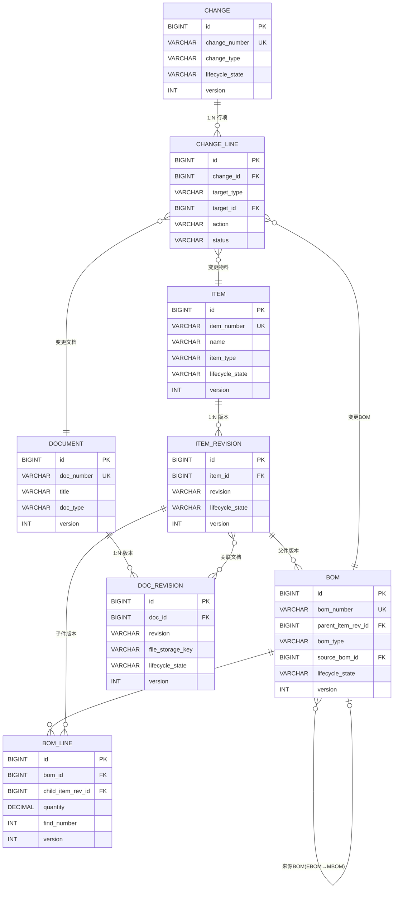

# PDM数据库设计与API

PDM（Product Data Management，产品数据管理）是PLM的核心子域，管理着Item（物料）、BOM（物料清单）、Document（文档）、Change（变更）等核心数据对象。本文从数据库表结构设计、ER关系、API接口到实战SQL，为开发者提供完整的PDM数据层设计参考。

## 1. 核心表结构设计

### 1.1 ITEM - 物料主表

```sql
CREATE TABLE item (
    id                  BIGINT PRIMARY KEY AUTO_INCREMENT COMMENT '主键ID',
    item_number         VARCHAR(64) NOT NULL UNIQUE COMMENT '物料编号（业务主键）',
    name                VARCHAR(256) NOT NULL COMMENT '物料名称',
    description         VARCHAR(1024) COMMENT '物料描述',
    item_type           VARCHAR(32) NOT NULL COMMENT '物料类型(PART/ASSEMBLY/DOCUMENT/VIRTUAL)',
    category_id         BIGINT COMMENT '分类ID，关联item_category',
    unit_of_measure     VARCHAR(16) COMMENT '计量单位(EA/KG/M/L)',
    source              VARCHAR(16) NOT NULL DEFAULT 'MAKE' COMMENT '来源类型(MAKE/BUY/PURCHASE)',
    make_buy            VARCHAR(8) COMMENT '自制/采购(M/B/MB)',
    is_phantom          TINYINT(1) DEFAULT 0 COMMENT '是否虚拟件(0否/1是)',
    is_configurable     TINYINT(1) DEFAULT 0 COMMENT '是否可配置(0否/1是)',
    lifecycle_state     VARCHAR(32) NOT NULL DEFAULT 'PRELIMINARY' COMMENT '生命周期状态',
    owner               VARCHAR(64) COMMENT '负责人',
    create_time         DATETIME NOT NULL DEFAULT CURRENT_TIMESTAMP COMMENT '创建时间',
    update_time         DATETIME NOT NULL DEFAULT CURRENT_TIMESTAMP ON UPDATE CURRENT_TIMESTAMP COMMENT '更新时间',
    version             INT NOT NULL DEFAULT 0 COMMENT '乐观锁版本号',
    tenant_id           BIGINT NOT NULL COMMENT '租户ID',
    INDEX idx_item_type (item_type),
    INDEX idx_category (category_id),
    INDEX idx_lifecycle (lifecycle_state),
    INDEX idx_tenant (tenant_id)
) COMMENT='物料主表';
```

### 1.2 ITEM_REVISION - 物料版本表

```sql
CREATE TABLE item_revision (
    id                  BIGINT PRIMARY KEY AUTO_INCREMENT COMMENT '主键ID',
    item_id             BIGINT NOT NULL COMMENT '物料ID，关联item.id',
    revision            VARCHAR(16) NOT NULL COMMENT '版本号(A/B/C...)',
    revision_note       VARCHAR(512) COMMENT '版本说明',
    lifecycle_state     VARCHAR(32) NOT NULL DEFAULT 'IN_WORK' COMMENT '版本生命周期状态',
    released_by         VARCHAR(64) COMMENT '发布人',
    released_at         DATETIME COMMENT '发布时间',
    effectivity         JSON COMMENT '生效规则({"type":"DATE|SERIAL|LOT","from":"...","to":"..."})',
    create_time         DATETIME NOT NULL DEFAULT CURRENT_TIMESTAMP COMMENT '创建时间',
    update_time         DATETIME NOT NULL DEFAULT CURRENT_TIMESTAMP ON UPDATE CURRENT_TIMESTAMP COMMENT '更新时间',
    version             INT NOT NULL DEFAULT 0 COMMENT '乐观锁版本号',
    UNIQUE KEY uk_item_rev (item_id, revision),
    INDEX idx_lifecycle (lifecycle_state)
) COMMENT='物料版本表';
```

### 1.3 BOM - BOM头表

```sql
CREATE TABLE bom (
    id                  BIGINT PRIMARY KEY AUTO_INCREMENT COMMENT '主键ID',
    bom_number          VARCHAR(64) NOT NULL UNIQUE COMMENT 'BOM编号',
    parent_item_rev_id  BIGINT NOT NULL COMMENT '父件版本ID，关联item_revision.id',
    bom_type            VARCHAR(16) NOT NULL COMMENT 'BOM类型(EBOM/MBOM/BBOM/SBOM)',
    lifecycle_state     VARCHAR(32) NOT NULL DEFAULT 'IN_WORK' COMMENT '生命周期状态',
    source_bom_id       BIGINT COMMENT '来源BOM ID（MBOM来源于哪个EBOM）',
    description         VARCHAR(512) COMMENT 'BOM描述',
    create_time         DATETIME NOT NULL DEFAULT CURRENT_TIMESTAMP COMMENT '创建时间',
    update_time         DATETIME NOT NULL DEFAULT CURRENT_TIMESTAMP ON UPDATE CURRENT_TIMESTAMP COMMENT '更新时间',
    version             INT NOT NULL DEFAULT 0 COMMENT '乐观锁版本号',
    UNIQUE KEY uk_parent_type (parent_item_rev_id, bom_type),
    INDEX idx_bom_type (bom_type),
    INDEX idx_lifecycle (lifecycle_state)
) COMMENT='BOM头表';
```

### 1.4 BOM_LINE - BOM行表

```sql
CREATE TABLE bom_line (
    id                  BIGINT PRIMARY KEY AUTO_INCREMENT COMMENT '主键ID',
    bom_id              BIGINT NOT NULL COMMENT 'BOM头ID，关联bom.id',
    child_item_rev_id   BIGINT NOT NULL COMMENT '子件版本ID，关联item_revision.id',
    quantity            DECIMAL(16,4) NOT NULL DEFAULT 1 COMMENT '数量',
    unit                VARCHAR(16) COMMENT '单位',
    find_number         INT COMMENT '查找号（装配顺序）',
    line_type           VARCHAR(16) DEFAULT 'NORMAL' COMMENT '行类型(NORMAL/REFERENCE/PHANTOM)',
    ref_desig           VARCHAR(256) COMMENT '参考位号',
    effectivity         JSON COMMENT '生效规则',
    sort_order          INT NOT NULL DEFAULT 0 COMMENT '排序号',
    create_time         DATETIME NOT NULL DEFAULT CURRENT_TIMESTAMP COMMENT '创建时间',
    version             INT NOT NULL DEFAULT 0 COMMENT '乐观锁版本号',
    INDEX idx_bom (bom_id),
    INDEX idx_child (child_item_rev_id)
) COMMENT='BOM行表';
```

### 1.5 DOCUMENT / DOC_REVISION - 文档表

```sql
CREATE TABLE document (
    id                  BIGINT PRIMARY KEY AUTO_INCREMENT COMMENT '主键ID',
    doc_number          VARCHAR(64) NOT NULL UNIQUE COMMENT '文档编号',
    title               VARCHAR(256) NOT NULL COMMENT '文档标题',
    doc_type            VARCHAR(32) NOT NULL COMMENT '文档类型(DRAWING/SPEC/SOP/TEST_REPORT)',
    category_id         BIGINT COMMENT '分类ID',
    lifecycle_state     VARCHAR(32) NOT NULL DEFAULT 'DRAFT' COMMENT '生命周期状态',
    owner               VARCHAR(64) COMMENT '负责人',
    create_time         DATETIME NOT NULL DEFAULT CURRENT_TIMESTAMP COMMENT '创建时间',
    update_time         DATETIME NOT NULL DEFAULT CURRENT_TIMESTAMP ON UPDATE CURRENT_TIMESTAMP COMMENT '更新时间',
    version             INT NOT NULL DEFAULT 0 COMMENT '乐观锁版本号',
    tenant_id           BIGINT NOT NULL COMMENT '租户ID'
) COMMENT='文档主表';

CREATE TABLE doc_revision (
    id                  BIGINT PRIMARY KEY AUTO_INCREMENT COMMENT '主键ID',
    doc_id              BIGINT NOT NULL COMMENT '文档ID，关联document.id',
    revision            VARCHAR(16) NOT NULL COMMENT '版本号',
    file_storage_key    VARCHAR(256) NOT NULL COMMENT '文件存储Key（OSS/S3）',
    file_name           VARCHAR(256) NOT NULL COMMENT '原始文件名',
    file_size           BIGINT COMMENT '文件大小(字节)',
    file_hash           VARCHAR(64) COMMENT '文件SHA256哈希',
    format              VARCHAR(32) COMMENT '文件格式(PDF/DWG/STEP/DOCX)',
    lifecycle_state     VARCHAR(32) NOT NULL DEFAULT 'IN_WORK' COMMENT '版本生命周期状态',
    checkout_by         VARCHAR(64) COMMENT '检出人',
    checkout_at         DATETIME COMMENT '检出时间',
    create_time         DATETIME NOT NULL DEFAULT CURRENT_TIMESTAMP COMMENT '创建时间',
    version             INT NOT NULL DEFAULT 0 COMMENT '乐观锁版本号',
    UNIQUE KEY uk_doc_rev (doc_id, revision)
) COMMENT='文档版本表';
```

### 1.6 CHANGE / CHANGE_LINE - 变更表

```sql
CREATE TABLE change (
    id                  BIGINT PRIMARY KEY AUTO_INCREMENT COMMENT '主键ID',
    change_number       VARCHAR(64) NOT NULL UNIQUE COMMENT '变更编号',
    change_type         VARCHAR(16) NOT NULL COMMENT '变更类型(ECN/ECO/ECR/DEV)',
    title               VARCHAR(256) NOT NULL COMMENT '变更标题',
    description         TEXT COMMENT '变更描述',
    reason              TEXT COMMENT '变更原因',
    priority            VARCHAR(16) DEFAULT 'MEDIUM' COMMENT '优先级(LOW/MEDIUM/HIGH/CRITICAL)',
    lifecycle_state     VARCHAR(32) NOT NULL DEFAULT 'SUBMITTED' COMMENT '状态',
    submitter           VARCHAR(64) COMMENT '提交人',
    assignee            VARCHAR(64) COMMENT '当前处理人',
    planned_eff_date    DATE COMMENT '计划生效日期',
    create_time         DATETIME NOT NULL DEFAULT CURRENT_TIMESTAMP COMMENT '创建时间',
    update_time         DATETIME NOT NULL DEFAULT CURRENT_TIMESTAMP ON UPDATE CURRENT_TIMESTAMP COMMENT '更新时间',
    version             INT NOT NULL DEFAULT 0 COMMENT '乐观锁版本号',
    tenant_id           BIGINT NOT NULL COMMENT '租户ID'
) COMMENT='变更主表';

CREATE TABLE change_line (
    id                  BIGINT PRIMARY KEY AUTO_INCREMENT COMMENT '主键ID',
    change_id           BIGINT NOT NULL COMMENT '变更ID，关联change.id',
    target_type         VARCHAR(32) NOT NULL COMMENT '对象类型(ITEM/BOM/DOCUMENT/PROCESS)',
    target_id           BIGINT NOT NULL COMMENT '对象ID',
    target_rev_id       BIGINT COMMENT '对象版本ID',
    action              VARCHAR(32) NOT NULL COMMENT '操作类型(CREATE/UPDATE/DELETE/REVISE)',
    before_snapshot     JSON COMMENT '变更前快照',
    after_snapshot      JSON COMMENT '变更后快照',
    status              VARCHAR(16) DEFAULT 'PENDING' COMMENT '行状态(PENDING/APPLIED/ROLLED_BACK)',
    INDEX idx_change (change_id),
    INDEX idx_target (target_type, target_id)
) COMMENT='变更行表';
```

## 2. 表关系ER图



## 3. 核心API设计

### 3.1 Item CRUD

**创建物料**：`POST /api/v1/items`

```json
// Request
{
    "itemNumber": "PART-2024-001",
    "name": "外壳组件-A",
    "description": "铝合金外壳，表面阳极氧化处理",
    "itemType": "ASSEMBLY",
    "categoryId": 1001,
    "unitOfMeasure": "EA",
    "source": "MAKE",
    "makeBuy": "M"
}

// Response 201
{
    "id": 20001,
    "itemNumber": "PART-2024-001",
    "name": "外壳组件-A",
    "itemType": "ASSEMBLY",
    "lifecycleState": "PRELIMINARY",
    "revision": "A",
    "version": 0,
    "createTime": "2024-01-15T10:30:00Z"
}
```

**查询物料详情**：`GET /api/v1/items/{itemNumber}`

```json
// Response 200
{
    "id": 20001,
    "itemNumber": "PART-2024-001",
    "name": "外壳组件-A",
    "description": "铝合金外壳，表面阳极氧化处理",
    "itemType": "ASSEMBLY",
    "category": { "id": 1001, "name": "结构件", "path": "/产品/结构件/" },
    "unitOfMeasure": "EA",
    "source": "MAKE",
    "lifecycleState": "RELEASED",
    "revisions": [
        { "revision": "A", "state": "RELEASED", "releasedAt": "2024-02-01T08:00:00Z" },
        { "revision": "B", "state": "IN_WORK" }
    ],
    "version": 3
}
```

### 3.2 创建BOM结构

**创建BOM**：`POST /api/v1/boms`

```json
// Request
{
    "parentItemNumber": "PART-2024-001",
    "parentRevision": "A",
    "bomType": "EBOM",
    "lines": [
        {
            "childItemNumber": "PART-2024-010",
            "childRevision": "A",
            "quantity": 2.0,
            "unit": "EA",
            "findNumber": 10,
            "refDesig": "U1,U2"
        },
        {
            "childItemNumber": "PART-2024-011",
            "childRevision": "A",
            "quantity": 4.0,
            "unit": "EA",
            "findNumber": 20,
            "refDesig": "S1-S4"
        }
    ]
}

// Response 201
{
    "id": 30001,
    "bomNumber": "BOM-2024-001",
    "parentItemNumber": "PART-2024-001",
    "parentRevision": "A",
    "bomType": "EBOM",
    "lifecycleState": "IN_WORK",
    "lineCount": 2,
    "version": 0
}
```

### 3.3 文档检入检出

**检出文档**：`POST /api/v1/documents/{docNumber}/revisions/{revision}/checkout`

```json
// Response 200
{
    "docNumber": "DWG-2024-001",
    "revision": "A",
    "checkoutBy": "zhang.san",
    "checkoutAt": "2024-03-10T14:20:00Z",
    "fileStorageKey": "pdm/docs/DWG-2024-001_A_v3.step",
    "downloadUrl": "https://oss.example.com/pdm/docs/DWG-2024-001_A_v3.step?token=xxx"
}
```

**检入文档**：`POST /api/v1/documents/{docNumber}/revisions/{revision}/checkin`

```json
// Request (multipart/form-data)
// file: (binary)
// comment: "更新了配合尺寸公差"

// Response 200
{
    "docNumber": "DWG-2024-001",
    "revision": "A",
    "checkoutBy": null,
    "newFileVersion": 4,
    "fileHash": "a1b2c3d4e5f6...",
    "fileSize": 2048576
}
```

### 3.4 版本升级

**升级版本**：`POST /api/v1/items/{itemNumber}/revise`

```json
// Request
{
    "revisionNote": "增加散热鳍片设计",
    "copyBom": true,
    "copyDocuments": true
}

// Response 201
{
    "itemNumber": "PART-2024-001",
    "newRevision": "B",
    "previousRevision": "A",
    "lifecycleState": "IN_WORK",
    "copiedBom": true,
    "copiedDocuments": true
}
```

## 4. BOM递归查询SQL

BOM是树形结构，实际开发中经常需要递归查询完整BOM树或查找所有使用某物料的上层BOM。

### 4.1 展开完整BOM树（自顶向下）

```sql
WITH RECURSIVE bom_tree AS (
    -- 基础：BOM顶层行
    SELECT
        bl.id,
        bl.bom_id,
        bl.child_item_rev_id,
        bl.quantity,
        bl.find_number,
        bl.ref_desig,
        1 AS level,
        CAST(bl.id AS CHAR(1024)) AS path,
        CAST(ir.revision AS CHAR(1024)) AS rev_path
    FROM bom_line bl
    JOIN item_revision ir ON bl.child_item_rev_id = ir.id
    WHERE bl.bom_id = :bomId

    UNION ALL

    -- 递归：展开子BOM
    SELECT
        child_bl.id,
        child_bl.bom_id,
        child_bl.child_item_rev_id,
        child_bl.quantity,
        child_bl.find_number,
        child_bl.ref_desig,
        bt.level + 1,
        CONCAT(bt.path, '>', child_bl.id),
        CONCAT(bt.rev_path, '>', child_ir.revision)
    FROM bom_tree bt
    JOIN bom b ON b.parent_item_rev_id = bt.child_item_rev_id
                  AND b.lifecycle_state = 'RELEASED'
    JOIN bom_line child_bl ON child_bl.bom_id = b.id
    JOIN item_revision child_ir ON child_bl.child_item_rev_id = child_ir.id
    WHERE bt.level < 20  -- 防止无限递归
)
SELECT
    bt.level,
    i.item_number,
    i.name,
    ir.revision,
    bt.quantity,
    bt.find_number,
    bt.ref_desig,
    bt.path
FROM bom_tree bt
JOIN item_revision ir ON bt.child_item_rev_id = ir.id
JOIN item i ON ir.item_id = i.id
ORDER BY bt.path;
```

### 4.2 Where-Used查询（自底向上）

```sql
WITH RECURSIVE where_used AS (
    -- 基础：直接引用
    SELECT
        bl.bom_id,
        bl.child_item_rev_id,
        b.parent_item_rev_id,
        1 AS level
    FROM bom_line bl
    JOIN bom b ON bl.bom_id = b.id
    WHERE bl.child_item_rev_id IN (
        SELECT ir.id FROM item_revision ir
        JOIN item i ON ir.item_id = i.id
        WHERE i.item_number = :itemNumber
    )

    UNION ALL

    -- 递归：向上查找
    SELECT
        parent_bom.id,
        parent_bom.parent_item_rev_id,
        pu.parent_item_rev_id,
        pu.level + 1
    FROM where_used pu
    JOIN bom_line parent_bl ON parent_bl.child_item_rev_id = pu.parent_item_rev_id
    JOIN bom parent_bom ON parent_bl.bom_id = parent_bom.id
    WHERE pu.level < 15
)
SELECT DISTINCT
    i.item_number,
    i.name,
    ir.revision,
    wu.level AS usage_level
FROM where_used wu
JOIN item_revision ir ON wu.parent_item_rev_id = ir.id
JOIN item i ON ir.item_id = i.id
ORDER BY wu.level;
```

## 5. 并发控制：乐观锁

PDM数据的高并发修改场景（多人同时编辑BOM）必须使用乐观锁：

```java
@Entity
@Data
public class Bom {
    @Id
    @GeneratedValue(strategy = GenerationType.IDENTITY)
    private Long id;

    @Version
    private Integer version;  // JPA乐观锁版本号

    // ... 其他字段
}

// 更新时自动处理版本冲突
@Service
public class BomService {

    @Transactional
    public Bom updateBom(Long bomId, BomUpdateRequest request) {
        Bom bom = bomRepo.findById(bomId)
            .orElseThrow(() -> new NotFoundException("BOM不存在"));

        // JPA @Version会自动检查版本号
        // 若版本不匹配，抛出OptimisticLockException
        bom.setLifecycleState(request.getState());
        return bomRepo.save(bom);
    }
}

// 全局异常处理
@RestControllerAdvice
public class GlobalExceptionHandler {

    @ExceptionHandler(OptimisticLockException.class)
    @ResponseStatus(HttpStatus.CONFLICT)
    public ErrorResponse handleOptimisticLock(OptimisticLockException ex) {
        return new ErrorResponse(
            "DATA_CONFLICT",
            "数据已被其他用户修改，请刷新后重试"
        );
    }
}
```

## 6. 开发者实战Tips

1. **BOM层级深度控制**：在BOM_LINE上增加`level`冗余字段，查询时避免全表递归，设定最大层级（如20层）防止循环引用
2. **版本号生成策略**：A→B→C...Z→AA→AB，使用类似Excel列名的算法生成，避免手动维护
3. **文件存储不要用数据库**：文档内容存储在OSS/S3，数据库只存Key，通过预签名URL实现下载
4. **检出锁粒度**：文档级检出锁即可，不需要行级锁；BOM编辑建议行级锁（每个BOM_LINE独立锁），减少冲突
5. **变更快照设计**：CHANGE_LINE的before/after_snapshot使用JSON类型存储，包含关键字段差异（不是全量），便于对比展示
6. **索引策略**：BOM_LINE是查询热点表，`(bom_id, sort_order)`联合索引和BOM树上`(child_item_rev_id)`索引缺一不可
7. **软删除 vs 硬删除**：PDM数据原则上一律软删除（加`deleted`字段），变更历史必须完整保留，硬删除会破坏数据完整性
8. **大BOM分页**：BOM行超过500行时，API返回应支持分页，避免一次性加载导致前端卡顿
