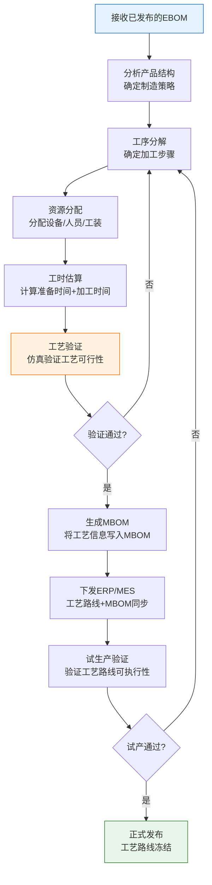
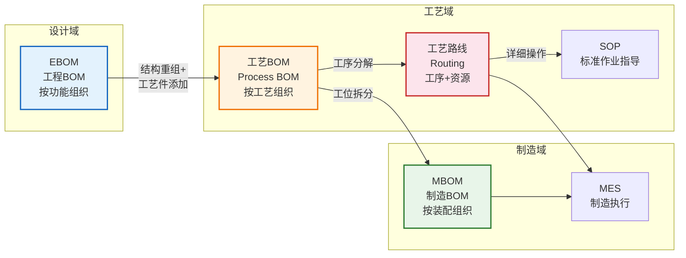
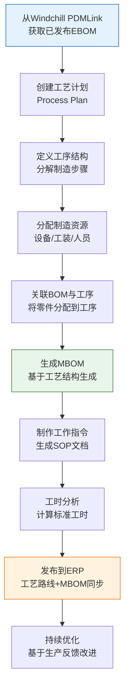

# 工艺路线管理

工艺路线（Routing）是连接设计与制造的桥梁，它定义了产品"如何制造"——从原材料到成品的工序序列、资源分配和工时估算。工艺路线管理的质量直接决定了制造效率和产品一致性。

## 1. 工艺路线定义

工艺路线是描述产品制造过程的核心数据对象，包含三个关键要素：

| 要素 | 说明 | 示例 |
|------|------|------|
| **工序序列** | 制造步骤的有序排列 | OP10粗车→OP20精车→OP30铣削→OP40磨削 |
| **资源分配** | 每道工序所需的人、机、料 | OP10：数控车床C-01、操作工2人 |
| **工时估算** | 每道工序的标准时间 | OP10：准备15min、加工45min |

### 工艺路线与BOM的关系

```
MBOM（制造什么）         工艺路线（怎么制造）
┌──────────────┐         ┌──────────────────┐
│ 发动机总成    │    →    │ OP10 缸体加工      │
│  ├── 缸体    │────────→│ OP20 缸盖加工      │
│  ├── 缸盖    │────────→│ OP30 曲轴加工      │
│  ├── 曲轴    │────────→│ OP40 活塞组装      │
│  └── 活塞组件 │────────→│ OP50 总成装配      │
└──────────────┘         └──────────────────┘
```

## 2. 工艺规划流程



## 3. 工艺卡片与SOP

### 工艺卡片

工艺卡片是每道工序的详细操作指导，包含以下信息：

| 信息类别 | 包含内容 | 示例 |
|---------|---------|------|
| 基本信息 | 工序号、工序名称、工作中心 | OP10 粗车缸体 / WC-CNC-01 |
| 加工对象 | 零件号、毛坯规格、材料 | PRT-CYL-001 HT250铸铁 |
| 设备工装 | 机床、夹具、刀具 | 数控车床CK6150、三爪卡盘 |
| 加工参数 | 转速、进给量、切削深度 | S800 F0.2 Ap2.0 |
| 质量要求 | 尺寸公差、表面粗糙度 | φ80±0.02 Ra1.6 |
| 工时定额 | 准备时间、加工时间 | 准备15min 加工45min |

### SOP标准作业指导书

SOP是面向操作工的标准化操作文档：

| SOP要素 | 说明 |
|---------|------|
| 作业名称 | 清晰描述作业内容 |
| 适用范围 | 适用的产品/工序 |
| 作业前准备 | 需要的物料、工具、安全装备 |
| 操作步骤 | 分步描述，配图说明 |
| 检查要点 | 关键质量检查项 |
| 安全注意事项 | 安全操作要求 |
| 异常处理 | 常见异常及处理方法 |

## 4. 工艺参数管理

工艺参数是影响产品质量的关键因素，需要严格管理：

| 参数类型 | 说明 | 管理方式 |
|---------|------|---------|
| **切削参数** | 转速、进给量、切削深度 | 按材料-刀具组合推荐 |
| **热处理参数** | 温度、保温时间、冷却方式 | 按工艺规范严格执行 |
| **焊接参数** | 电流、电压、焊接速度 | 按WPS规范执行 |
| **装配参数** | 拧紧力矩、配合间隙 | 按扭矩规范执行 |
| **检验参数** | 检测频率、抽样方案、判定标准 | 按检验规范执行 |

### 参数版本控制

```
焊接工艺参数 V1.0（2024-01）
├── 电流: 180-220A
├── 电压: 22-26V
└── 焊接速度: 300-400mm/min

变更 → 焊接工艺参数 V2.0（2024-06）
├── 电流: 190-230A ← 调整范围
├── 电压: 22-26V
└── 焊接速度: 280-380mm/min ← 调整范围
```

## 5. 工艺路线版本控制

工艺路线同样需要版本管理，与BOM版本紧密关联：

| 场景 | 工艺路线版本变化 | 触发条件 |
|------|----------------|---------|
| 零件版本升级 | 工艺路线必须同步更新 | ECN变更导致零件A→B |
| 工艺优化 | 工艺路线独立升级 | 工艺改进但不影响零件 |
| 设备更换 | 工艺路线调整资源 | 设备替换/产能调整 |
| 新增工序 | 工艺路线增加步骤 | 质量问题导致增加检测工序 |

### 版本有效性控制

```
工艺路线 REV-A: 适用于 VIN 001-500
工艺路线 REV-B: 适用于 VIN 501-999
工艺路线 REV-C: 适用于 VIN 1000+

当VIN=600时，系统自动选择 REV-B
```

## 6. 工艺能力评估

在制定工艺路线时，需要评估工厂的实际工艺能力：

| 评估维度 | 指标 | 说明 |
|---------|------|------|
| **设备能力** | 加工精度、加工范围 | 设备能否满足加工要求 |
| **产能评估** | 月产能、瓶颈工序 | 是否存在产能瓶颈 |
| **人员技能** | 操作资质、技能等级 | 操作工是否具备相应技能 |
| **质量水平** | 工序合格率、Cpk值 | 工艺能否保证质量稳定 |
| **成本评估** | 单件制造成本 | 工艺方案是否经济合理 |

## 7. 从EBOM到工艺BOM再到制造BOM的数据流



### 数据转化关键节点

| 转化节点 | 输入 | 输出 | 关键操作 |
|---------|------|------|---------|
| EBOM→工艺BOM | EBOM结构 | 工艺BOM+初步工艺路线 | 结构重组、工序分解 |
| 工艺BOM→MBOM | 工艺BOM+工艺路线 | MBOM | 工位拆分、投料时序 |
| MBOM→MES | MBOM+工艺路线+SOP | 工单+工序指令 | 数据格式转换、指令下发 |

## 8. 真实案例：Windchill MPMLink工艺规划流程

PTC Windchill的MPMLink（Manufacturing Process Management Link）是业界领先的工艺管理解决方案：

### MPMLink核心功能

| 功能模块 | 说明 | 核心价值 |
|---------|------|---------|
| **Process Plan Browser** | 工艺计划浏览器，可视化展示工艺结构 | 直观查看工艺层次 |
| **MPM Structure** | 制造工艺结构管理，管理工序与资源 | 工序-资源关联管理 |
| **Work Instructions** | 工作指令管理，生成SOP | 自动生成操作指导 |
| **Manufacturing Resource** | 制造资源管理，管理设备/工装/人员 | 资源能力与分配 |
| **Time Study** | 工时研究，分析与优化工时 | 工时定额管理 |

### MPMLink工艺规划流程



### MPMLink与Creo的深度集成

MPMLink与PTC Creo实现了深度集成：

1. **3D工艺规划**：直接在3D模型上标注工艺信息
2. **3D工作指令**：生成带3D动画的操作指导
3. **仿真验证**：工艺仿真验证工艺可行性
4. **变更同步**：Creo设计变更自动触发工艺更新

## 小结

- 工艺路线是连接设计与制造的桥梁，包含工序序列、资源分配和工时估算三大要素
- 工艺规划遵循"接收EBOM→工序分解→资源分配→工时估算→验证下发"的标准流程
- 工艺卡片和SOP是面向不同受众的工艺文档，各有侧重
- 从EBOM到工艺BOM再到MBOM的数据流是PLM工艺管理的核心脉络
- Windchill MPMLink提供了业界领先的工艺规划解决方案
