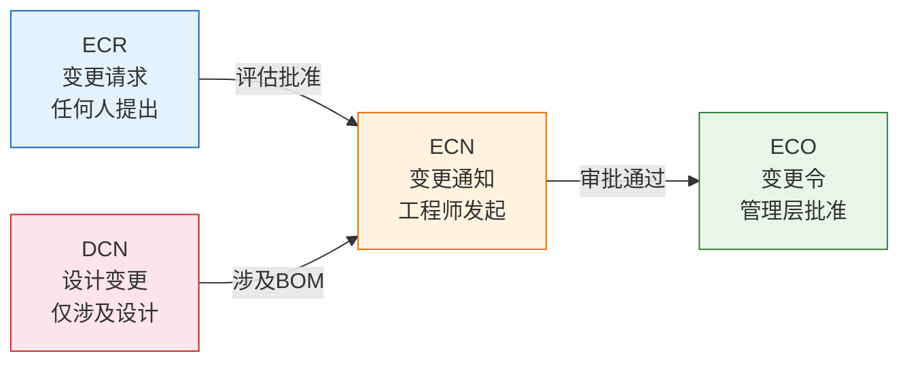
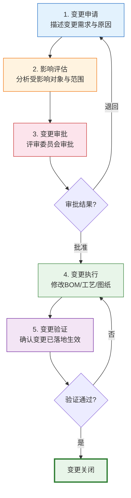
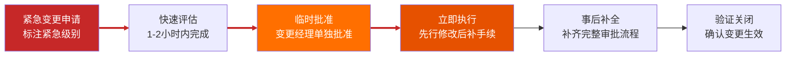
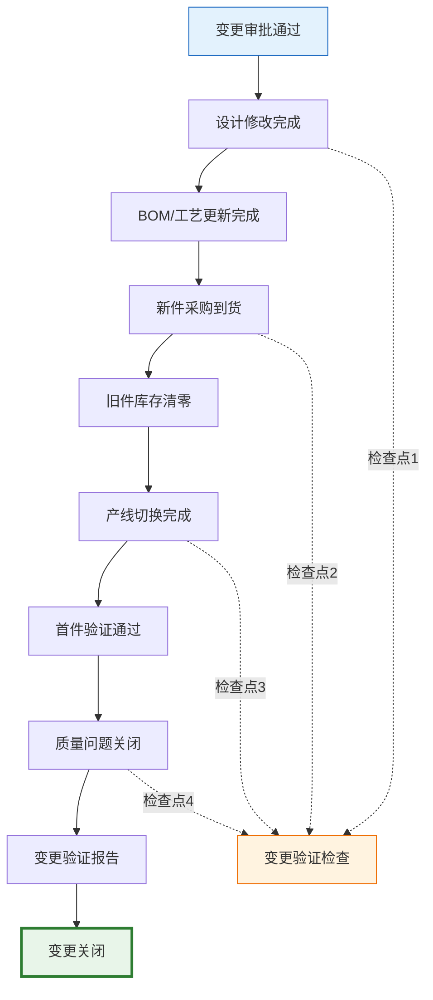

# 工程变更管理ECN/ECO

工程变更管理是PLM系统中保障产品数据一致性和可追溯性的核心机制。一次变更可能影响BOM结构、工艺路线、在制品处理、库存消耗等多个环节，因此必须建立严格的变更流程和影响分析机制。

## 1. 变更类型

PLM中的变更类型根据严重程度和影响范围划分为不同类别：

| 变更类型 | 全称 | 说明 | 影响范围 | 审批级别 |
|---------|------|------|---------|---------|
| **ECN** | Engineering Change Notice | 工程变更通知，记录变更需求 | 评估中，尚未确定 | 工程师级 |
| **ECO** | Engineering Change Order | 工程变更令，批准执行的变更 | 确定，需执行 | 管理层级 |
| **DCN** | Design Change Notice | 设计变更通知，仅涉及设计 | 图纸/3D模型 | 工程师级 |
| **ECR** | Engineering Change Request | 工程变更请求，变更建议 | 评估中 | 任何人可提 |

### 变更类型之间的关系



## 2. 变更流程

标准的工程变更流程包含五个阶段：



### 各阶段详解

**阶段1：变更申请**

| 字段 | 说明 | 是否必填 |
|------|------|---------|
| 变更原因 | 为什么需要变更 | 是 |
| 变更描述 | 具体要变更什么 | 是 |
| 紧急程度 | 普通/紧急/特急 | 是 |
| 申请人 | 谁提出的变更 | 自动 |
| 关联问题 | 关联的质量问题或客户投诉 | 视情况 |

**阶段2：影响评估**

评估变更可能影响的所有对象：

| 评估维度 | 评估内容 | 输出 |
|---------|---------|------|
| BOM影响 | 哪些BOM包含受影响零件 | 受影响BOM清单 |
| 工艺影响 | 哪些工艺路线需要调整 | 受影响工艺清单 |
| 在制品处理 | 已投产的产品如何处理 | 在制品处置方案 |
| 库存影响 | 现有库存如何消耗 | 库存消耗计划 |
| 成本影响 | 变更带来的成本变化 | 成本影响评估 |

**阶段3：变更审批**

审批委员会（CCB，Change Control Board）评审变更：

| 角色 | 职责 | 关注点 |
|------|------|--------|
| 变更经理 | 主持CCB会议 | 变更必要性 |
| 设计代表 | 评估技术可行性 | 设计方案合理性 |
| 工艺代表 | 评估制造可行性 | 工艺调整可行性 |
| 采购代表 | 评估供应链影响 | 物料可获取性 |
| 质量代表 | 评估质量风险 | 变更对质量的影响 |
| 财务代表 | 评估成本影响 | 变更成本可接受性 |

## 3. 变更影响分析

变更影响分析是变更管理中最关键的环节，必须全面评估变更的波及范围：

### 影响分析矩阵

| 受影响对象 | 分析维度 | 可能的影响 | 处理策略 |
|-----------|---------|-----------|---------|
| **BOM** | 哪些产品使用了该零件 | 多个产品的BOM需要同步更新 | Where-Used查询 |
| **工艺** | 零件变更是否影响工艺 | 工艺路线可能需要调整 | 工艺工程师评估 |
| **在制品** | 正在生产的产品 | 需要决定继续/返工/报废 | 在制品处置方案 |
| **库存** | 现有库存如何消耗 | 旧件库存消耗+新件采购 | 库存过渡计划 |
| **供应商** | 供应商能否供应新件 | 供应商可能需要重新认证 | 供应商通知 |
| **客户** | 客户是否需要通知 | 安全相关变更必须通知 | 客户通知评估 |

### Where-Used查询

Where-Used（使用位置查询）是变更影响分析的基础工具：

```
零件 PRT-STEER-SHAFT（转向轴）受变更影响

Where-Used 结果：
├── EBOM: 转向系统总成 (ASSY-STEER-001) Rev C
├── EBOM: 转向柱总成 (ASSY-STEER-COL) Rev B
├── MBOM: 工序OP20转向柱装配 Rev A
├── 采购订单: PO-2024-0156 (在途)
├── 生产工单: WO-2024-0892 (在制)
└── 库存: 仓库W03 有 200 件

变更影响：需要同时更新2个EBOM、1个MBOM，
处理1个在途订单和1个在制工单，消耗200件库存。
```

## 4. 变更与版本的关系

变更执行后，受影响对象的版本如何变化：

| 变更类型 | 版本变化 | 说明 |
|---------|---------|------|
| **重大变更** | A → B | 设计意图改变，可能影响互换性 |
| **一般变更** | Rev 1 → Rev 2 | 设计意图不变，细节修改 |
| **文档更新** | V1 → V2 | 文档随零件版本同步更新 |
| **工艺调整** | ROUT Rev A → B | 工艺路线独立版本管理 |

### 版本生效策略

| 策略 | 说明 | 适用场景 |
|------|------|---------|
| **立即生效** | 变更完成后立即替换旧版本 | 安全相关变更 |
| **库存消耗后生效** | 旧版库存消耗完毕后使用新版本 | 非关键件变更 |
| **按序列号生效** | 指定序列号后使用新版本 | 汽车行业常见 |
| **按日期生效** | 指定日期后使用新版本 | 定期切换 |

## 5. 紧急变更流程

紧急变更（Emergency Change）用于处理安全相关或产线停线等紧急情况：



### 紧急变更 vs 标准变更

| 维度 | 标准变更 | 紧急变更 |
|------|---------|---------|
| 审批 | CCB评审 | 变更经理单独审批 |
| 周期 | 1-4周 | 1-2小时 |
| 执行 | 审批后执行 | 先执行后补审 |
| 文档 | 完整文档 | 先执行后补文档 |
| 适用 | 一般变更 | 安全/停线紧急情况 |

## 6. 变更成本评估

变更不仅要考虑技术可行性，还要评估经济影响：

| 成本项 | 说明 | 计算方式 |
|--------|------|---------|
| **设计成本** | 重新设计的人力成本 | 工时 x 单价 |
| **验证成本** | 仿真/试验/试制成本 | 按验证方案估算 |
| **工装成本** | 模具/夹具修改或新制 | 按工装方案估算 |
| **库存损失** | 旧件报废或返工成本 | 库存数量 x 单件成本 |
| **在制品损失** | 在制品返工或报废 | 在制品数量 x 单件成本 |
| **切换成本** | 产线切换停机损失 | 停机时间 x 产线费率 |

## 7. 变更闭环管理

变更闭环管理确保变更真正落地生效，而不是止步于审批：



### 闭环验证检查项

| 检查项 | 验证内容 | 负责人 |
|--------|---------|--------|
| 设计修改 | CAD模型/图纸是否已更新 | 设计工程师 |
| BOM更新 | EBOM/MBOM是否已同步更新 | 数据管理员 |
| 工艺更新 | 工艺路线/SOP是否已更新 | 工艺工程师 |
| 采购到货 | 新件是否已到货 | 采购工程师 |
| 库存清零 | 旧件库存是否已消耗完毕 | 仓库管理员 |
| 产线切换 | 产线是否已切换到新件 | 生产主管 |
| 首件验证 | 首件是否通过质量检验 | 质量工程师 |

## 8. 真实案例：汽车行业ECN变更管理标准流程

某汽车企业的ECN变更管理流程如下：

### 变更发起

| 步骤 | 负责人 | 输出物 | SLA |
|------|--------|--------|-----|
| 变更申请提交 | 变更发起人 | ECR表单 | - |
| 变更分类 | 变更协调员 | ECN编号 | 1个工作日 |
| 影响评估 | 跨部门评估组 | 影响分析报告 | 3个工作日 |

### 变更审批

| 变更级别 | 审批层级 | 审批人 | SLA |
|---------|---------|--------|-----|
| 一级（安全相关） | 三级审批 | 总工程师 | 1个工作日 |
| 二级（功能变更） | 二级审批 | 部门经理 | 3个工作日 |
| 三级（一般变更） | 一级审批 | 主管工程师 | 5个工作日 |

### 变更执行

| 步骤 | 负责人 | 输出物 | SLA |
|------|--------|--------|-----|
| 设计修改 | 设计工程师 | 新版CAD/图纸 | 5个工作日 |
| BOM更新 | 数据管理员 | 新版BOM | 2个工作日 |
| 工艺更新 | 工艺工程师 | 新版工艺路线 | 5个工作日 |
| 供应商通知 | 采购工程师 | 供应商确认函 | 3个工作日 |
| 在制品处置 | 生产计划员 | 在制品处置方案 | 2个工作日 |

### 变更验证

| 验证项 | 验证方式 | 判定标准 |
|--------|---------|---------|
| 首件检验 | 三坐标测量 | 尺寸公差合格 |
| 功能测试 | 台架试验 | 功能指标达标 |
| 路试验证 | 整车路试 | 无异响/无故障 |
| 供应商PPAP | 生产件批准 | PPAP文件齐全 |

## 小结

- ECN/ECO/ECR/DCN四种变更类型覆盖从申请到执行的完整变更链路
- 标准变更流程五阶段：申请→评估→审批→执行→验证，缺一不可
- 变更影响分析（Where-Used查询）是变更管理的核心能力
- 紧急变更走快速通道，但必须事后补全完整流程
- 变更闭环管理确保变更真正落地，而非止步于审批
- 汽车行业的ECN变更管理是业界变更管理的标杆实践
