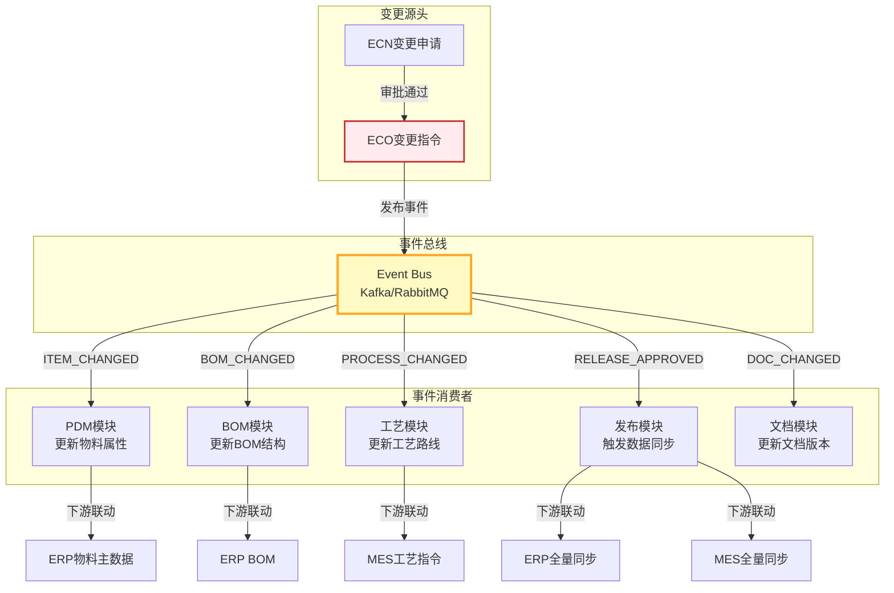
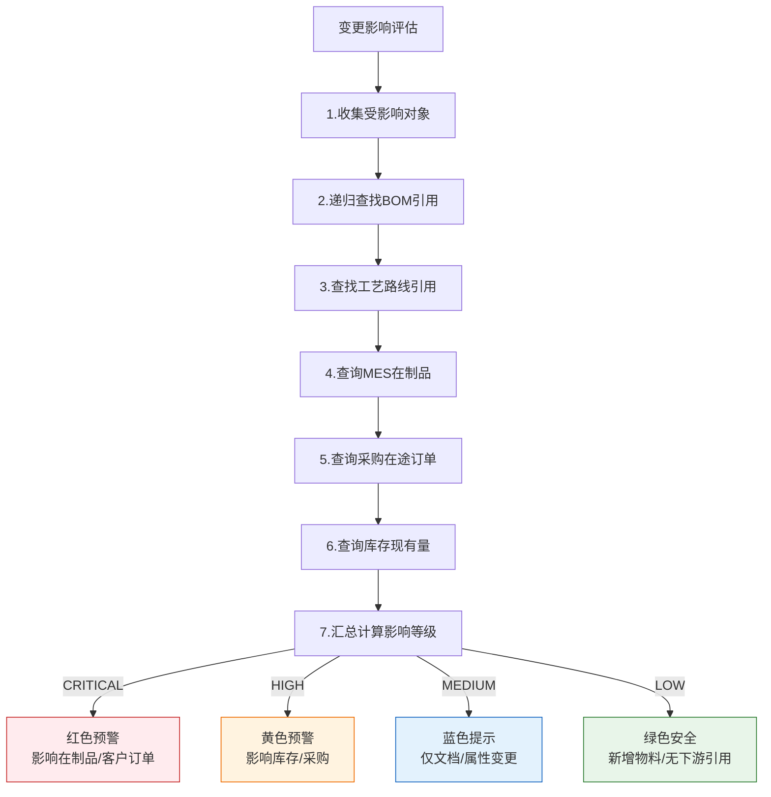
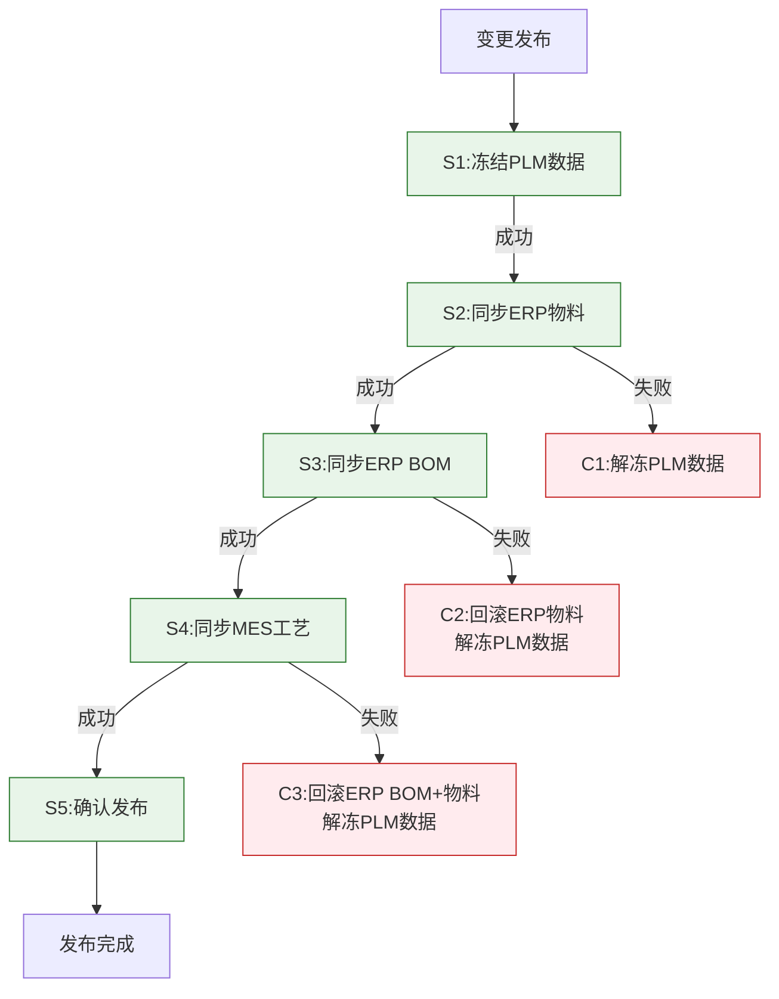

# 变更传播与事件驱动

在PLM系统中，一次工程变更绝不仅限于变更单本身——它会像石子投入湖面，引发层层涟漪，影响BOM、工艺、采购、在制品、MES工单等多个下游模块。如何让变更准确、完整、可靠地传播到所有受影响的模块，是PLM架构设计的核心挑战。本文从事件驱动架构的角度，深入解析变更传播的设计与实现。

## 1. 变更事件传播全景



## 2. 事件类型与负载定义

### 2.1 事件类型体系

| 事件类型 | 触发条件 | 消费者 | 优先级 | 说明 |
|---------|---------|--------|-------|------|
| `ITEM_CHANGED` | 物料属性变更审批通过 | PDM、ERP | HIGH | 物料基础数据变更 |
| `BOM_CHANGED` | BOM结构变更审批通过 | BOM、ERP | HIGH | BOM行项增删改 |
| `PROCESS_CHANGED` | 工艺路线变更审批通过 | 工艺模块、MES | MEDIUM | 工序/资源变更 |
| `DOC_CHANGED` | 文档版本变更审批通过 | 文档模块 | LOW | 图纸/规范变更 |
| `RELEASE_APPROVED` | 发布审批通过 | 发布模块、ERP、MES | CRITICAL | 数据正式发布 |
| `CHANGE_CANCELLED` | 变更被撤回 | 所有相关模块 | HIGH | 需要回滚操作 |

### 2.2 事件负载（Payload）结构定义

```json
{
    "eventId": "evt-20240315-001",
    "eventType": "BOM_CHANGED",
    "timestamp": "2024-03-15T10:30:00Z",
    "source": "change-management-service",
    "correlationId": "eco-2024-0088",
    "payload": {
        "changeNumber": "ECO-2024-0088",
        "changeType": "ECO",
        "affectedObjects": [
            {
                "objectType": "BOM",
                "objectId": 30001,
                "objectNumber": "BOM-2024-001",
                "action": "UPDATE",
                "beforeSnapshot": {
                    "lineCount": 5,
                    "lines": [
                        { "childItem": "PART-010", "quantity": 2.0 }
                    ]
                },
                "afterSnapshot": {
                    "lineCount": 6,
                    "lines": [
                        { "childItem": "PART-010", "quantity": 3.0 },
                        { "childItem": "PART-015", "quantity": 1.0 }
                    ]
                }
            }
        ],
        "effectiveDate": "2024-04-01",
        "changeReason": "客户要求增加防水垫圈"
    },
    "metadata": {
        "initiator": "zhang.san",
        "approvalChain": ["li.si", "wang.wu"],
        "approvedAt": "2024-03-15T10:25:00Z"
    }
}
```

### 2.3 事件负载设计原则

1. **自包含（Self-contained）**：消费者不需要回查源系统即可处理事件，负载中包含足够上下文
2. **幂等友好**：包含`correlationId`（变更单号）和`eventId`，消费者据此去重
3. **快照对比**：`beforeSnapshot`与`afterSnapshot`让消费者可以精确计算差异，而非全量替换
4. **生效规则内置**：`effectiveDate`告知消费者何时应用此变更，支持延迟生效

## 3. 消息队列选型

| 维度 | Kafka | RabbitMQ | 推荐 |
|------|-------|----------|------|
| **吞吐量** | 百万级/秒 | 万级/秒 | PLM场景Kafka更优 |
| **消息持久化** | 磁盘持久化，可回溯 | 可配置，默认内存 | 变更事件需可回溯 |
| **消费模式** | 拉取式（Pull） | 推送式（Push） | Pull更适合批处理 |
| **顺序保证** | 分区内有序 | 队列内有序 | 变更顺序很重要 |
| **生态集成** | Kafka Connect丰富 | 插件丰富 | 看企业技术栈 |
| **运维复杂度** | 较高（Zookeeper/KRaft） | 较低 | RabbitMQ上手快 |

**推荐方案**：变更事件使用Kafka（高吞吐+持久化+可回溯），轻量级通知（如邮件/IM推送）使用RabbitMQ。

### Kafka Topic设计

```
plm.change.events          -- 所有变更事件的主Topic（分区键：changeNumber）
plm.change.events.ITEM     -- 物料变更专用Topic（可选，按需拆分）
plm.change.events.BOM      -- BOM变更专用Topic
plm.release.events         -- 发布事件Topic
plm.sync.erp.commands      -- ERP同步命令Topic
plm.sync.mes.commands      -- MES同步命令Topic
```

分区策略：以`changeNumber`作为分区键，保证同一变更的所有事件有序。

## 4. 事件消费与幂等处理

### 4.1 幂等消费者设计

```java
@Component
@Slf4j
public class ChangeEventConsumer {

    @Autowired
    private ProcessedEventRepository processedEventRepo;

    @Autowired
    private BomService bomService;

    @Autowired
    private ProcessRouteService processRouteService;

    @KafkaListener(topics = "plm.change.events", groupId = "plm-bom-consumer")
    @Transactional
    public void onBomChanged(ConsumerRecord<String, String> record) {
        ChangeEventPayload event = JsonUtils.fromJson(record.value(), ChangeEventPayload.class);

        // 1. 幂等检查：已处理过的事件直接跳过
        if (processedEventRepo.existsByEventId(event.getEventId())) {
            log.info("事件已处理，跳过: eventId={}", event.getEventId());
            return;
        }

        try {
            // 2. 根据事件类型分发处理
            switch (event.getEventType()) {
                case "BOM_CHANGED":
                    handleBomChanged(event);
                    break;
                case "PROCESS_CHANGED":
                    handleProcessChanged(event);
                    break;
                case "RELEASE_APPROVED":
                    handleReleaseApproved(event);
                    break;
                default:
                    log.warn("未知事件类型: {}", event.getEventType());
            }

            // 3. 记录已处理事件
            ProcessedEvent pe = new ProcessedEvent();
            pe.setEventId(event.getEventId());
            pe.setEventType(event.getEventType());
            pe.setCorrelationId(event.getCorrelationId());
            pe.setProcessedAt(LocalDateTime.now());
            processedEventRepo.save(pe);

        } catch (Exception e) {
            log.error("事件处理失败: eventId={}, error={}", event.getEventId(), e.getMessage(), e);
            throw e; // 抛出异常触发Kafka重试
        }
    }

    private void handleBomChanged(ChangeEventPayload event) {
        for (AffectedObject obj : event.getPayload().getAffectedObjects()) {
            if ("BOM".equals(obj.getObjectType())) {
                bomService.applyChange(obj, event.getPayload().getEffectiveDate());
                // BOM变更可能触发工艺路线更新
                processRouteService.invalidateCache(obj.getObjectId());
            }
        }
    }
}
```

### 4.2 已处理事件表

```sql
CREATE TABLE processed_event (
    id              BIGINT PRIMARY KEY AUTO_INCREMENT,
    event_id        VARCHAR(128) NOT NULL UNIQUE COMMENT '事件唯一ID',
    event_type      VARCHAR(64) NOT NULL COMMENT '事件类型',
    correlation_id  VARCHAR(128) COMMENT '关联业务ID(如变更单号)',
    processed_at    DATETIME NOT NULL COMMENT '处理完成时间',
    consumer_group  VARCHAR(64) NOT NULL COMMENT '消费者组名',
    INDEX idx_correlation (correlation_id),
    INDEX idx_processed_at (processed_at)
) COMMENT='已处理事件记录表（幂等去重）';
```

## 5. 变更影响评估算法

变更审批通过前，需要评估变更的影响范围，帮助决策者判断变更的风险。

### 5.1 影响评估流程



### 5.2 影响评估实现

```java
@Service
public class ChangeImpactAssessor {

    public ImpactAssessment assess(ChangeOrder eco) {
        List<String> affectedItemIds = eco.getAffectedItems();
        ImpactAssessment result = new ImpactAssessment();

        // 1. 递归查找BOM引用（哪些上层产品使用了这些物料）
        List<BomReference> bomRefs = bomLineRepo.findAncestorsRecursive(affectedItemIds);
        result.setBomReferences(bomRefs);

        // 2. 查找工艺路线引用
        List<ProcessReference> procRefs = processRouteRepo.findByItems(affectedItemIds);
        result.setProcessReferences(procRefs);

        // 3. 查询MES在制品工单
        List<WorkOrderImpact> wipOrders = mesClient.queryActiveWorkOrders(affectedItemIds);
        result.setWipOrders(wipOrders);

        // 4. 查询采购在途
        List<PurchaseOrderImpact> poImpacts = erpClient.queryOpenPurchaseOrders(affectedItemIds);
        result.setPurchaseOrders(poImpacts);

        // 5. 计算影响等级
        result.setSeverity(calculateSeverity(result));

        return result;
    }

    private Severity calculateSeverity(ImpactAssessment result) {
        // 在制品工单影响 → CRITICAL
        if (!result.getWipOrders().isEmpty()) {
            return Severity.CRITICAL;
        }
        // 采购在途 + 库存 → HIGH
        if (!result.getPurchaseOrders().isEmpty() || !result.getBomReferences().isEmpty()) {
            return Severity.HIGH;
        }
        // 工艺引用 → MEDIUM
        if (!result.getProcessReferences().isEmpty()) {
            return Severity.MEDIUM;
        }
        return Severity.LOW;
    }
}
```

## 6. Spring Event框架实现

对于PLM内部模块间的事件传播（非跨服务），使用Spring的`ApplicationEventPublisher`更为轻量：

```java
// 1. 定义事件
@Getter
public class ChangeApprovedEvent extends ApplicationEvent {
    private final String changeNumber;
    private final String changeType;
    private final List<String> affectedItems;
    private final LocalDateTime approvedAt;

    public ChangeApprovedEvent(Object source, String changeNumber,
                                String changeType, List<String> affectedItems) {
        super(source);
        this.changeNumber = changeNumber;
        this.changeType = changeType;
        this.affectedItems = affectedItems;
        this.approvedAt = LocalDateTime.now();
    }
}

// 2. 发布事件
@Service
public class ChangeApprovalService {

    @Autowired
    private ApplicationEventPublisher eventPublisher;

    @Transactional
    public void approveChange(String changeNumber, String approver) {
        ChangeOrder eco = changeRepo.findByNumber(changeNumber);
        eco.approve(approver);
        changeRepo.save(eco);

        // 发布内部事件
        eventPublisher.publishEvent(
            new ChangeApprovedEvent(this, changeNumber,
                eco.getChangeType(), eco.getAffectedItemIds())
        );
    }
}

// 3. 消费事件 - BOM模块
@Component
@Slf4j
public class BomChangeListener {

    @EventListener
    @Async("changeEventExecutor")
    @Transactional(propagation = Propagation.REQUIRES_NEW)
    public void onChangeApproved(ChangeApprovedEvent event) {
        log.info("BOM模块收到变更审批事件: {}", event.getChangeNumber());
        bomService.applyChangeFromEco(event.getChangeNumber());
    }
}

// 4. 消费事件 - 工艺模块
@Component
@Slf4j
public class ProcessChangeListener {

    @EventListener
    @Async("changeEventExecutor")
    @Transactional(propagation = Propagation.REQUIRES_NEW)
    public void onChangeApproved(ChangeApprovedEvent event) {
        log.info("工艺模块收到变更审批事件: {}", event.getChangeNumber());
        processService.invalidateAffectedRoutes(event.getAffectedItems());
    }
}

// 5. 异步线程池配置
@Configuration
@EnableAsync
public class AsyncEventConfig {

    @Bean("changeEventExecutor")
    public Executor changeEventExecutor() {
        ThreadPoolTaskExecutor executor = new ThreadPoolTaskExecutor();
        executor.setCorePoolSize(4);
        executor.setMaxPoolSize(8);
        executor.setQueueCapacity(100);
        executor.setThreadNamePrefix("change-event-");
        executor.setRejectedExecutionHandler(new CallerRunsPolicy()); // 满载时同步执行
        executor.initialize();
        return executor;
    }
}
```

**关键设计点**：
- `@Async`使事件消费异步化，不阻塞主事务
- `REQUIRES_NEW`独立事务，消费者失败不影响发布者
- `CallerRunsPolicy`背压策略，队列满时由调用线程执行，避免事件丢失

## 7. 补偿事务设计

变更传播到外部系统时，可能出现部分成功部分失败的情况，需要补偿机制。

### 7.1 Saga编排模式



### 7.2 补偿事务实现

```java
@Service
@Slf4j
public class ChangeReleaseSaga {

    public ReleaseResult execute(ReleaseRequest request) {
        String sagaId = IdGenerator.nextId();
        SagaContext ctx = new SagaContext(sagaId, request);

        // Step 1: 冻结PLM数据
        try {
            releaseService.freezeData(request);
            ctx.markStepDone("FREEZE_PLM");
        } catch (Exception e) {
            return ReleaseResult.fail("PLM数据冻结失败: " + e.getMessage());
        }

        // Step 2: 同步ERP物料
        try {
            erpSyncService.syncMaterial(request);
            ctx.markStepDone("SYNC_ERP_MATERIAL");
        } catch (Exception e) {
            compensate(ctx); // 回滚已完成的步骤
            return ReleaseResult.fail("ERP物料同步失败: " + e.getMessage());
        }

        // Step 3: 同步ERP BOM
        try {
            erpSyncService.syncBom(request);
            ctx.markStepDone("SYNC_ERP_BOM");
        } catch (Exception e) {
            compensate(ctx);
            return ReleaseResult.fail("ERP BOM同步失败: " + e.getMessage());
        }

        // Step 4: 同步MES工艺
        try {
            mesSyncService.syncProcessRoute(request);
            ctx.markStepDone("SYNC_MES_PROCESS");
        } catch (Exception e) {
            compensate(ctx);
            return ReleaseResult.fail("MES工艺同步失败: " + e.getMessage());
        }

        // Step 5: 确认发布
        releaseService.confirmRelease(request);
        return ReleaseResult.success();
    }

    private void compensate(SagaContext ctx) {
        log.warn("开始补偿事务: sagaId={}", ctx.getSagaId());

        // 按完成步骤的逆序补偿
        if (ctx.isStepDone("SYNC_ERP_BOM")) {
            erpSyncService.rollbackBom(ctx.getRequest());
        }
        if (ctx.isStepDone("SYNC_ERP_MATERIAL")) {
            erpSyncService.rollbackMaterial(ctx.getRequest());
        }
        if (ctx.isStepDone("FREEZE_PLM")) {
            releaseService.unfreezeData(ctx.getRequest());
        }

        log.info("补偿事务完成: sagaId={}", ctx.getSagaId());
    }
}
```

## 8. 开发者实战Tips

1. **事件粒度选择**：粗粒度事件（一个变更一个事件）优于细粒度（每个字段变化一个事件），减少消费者复杂度，但payload要包含完整上下文
2. **事件版本化**：payload结构增加`schemaVersion`字段，消费者根据版本号选择解析逻辑，实现平滑升级
3. **死信队列处理**：Kafka消费失败的消息进入DLQ（Dead Letter Queue），运维人员可手动重放或修复
4. **变更传播监控**：建立变更传播看板，实时展示每个ECO在各模块的传播状态（待处理/处理中/已完成/失败）
5. **批量变更优化**：年度型变更可能一次影响数千个物料，需要批量事件合并（Batch Event），避免消息风暴
6. **补偿事务日志**：所有补偿操作必须记录日志（sagaId + step + action + result），便于故障排查和审计
7. **延迟生效**：变更不一定立即生效，支持`effectiveDate`字段，消费者在指定日期才应用变更，期间处于"已批准待生效"状态
8. **Spring Event vs MQ的选择**：PLM内部模块间用Spring Event（低延迟、事务绑定），跨服务集成用MQ（解耦、可靠、可回溯）
