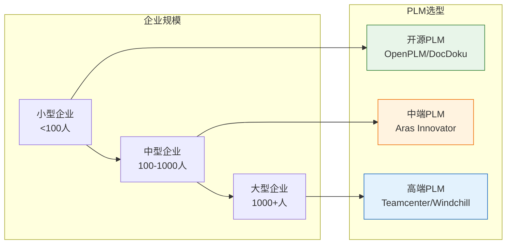
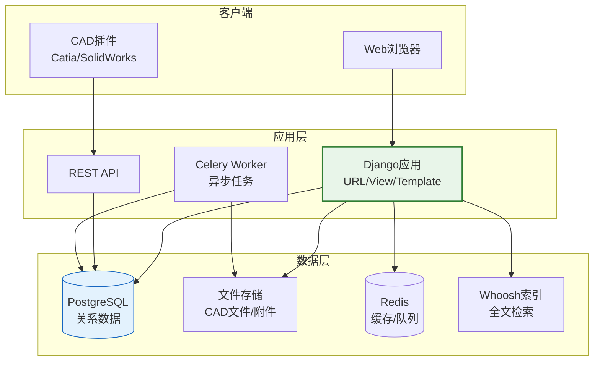
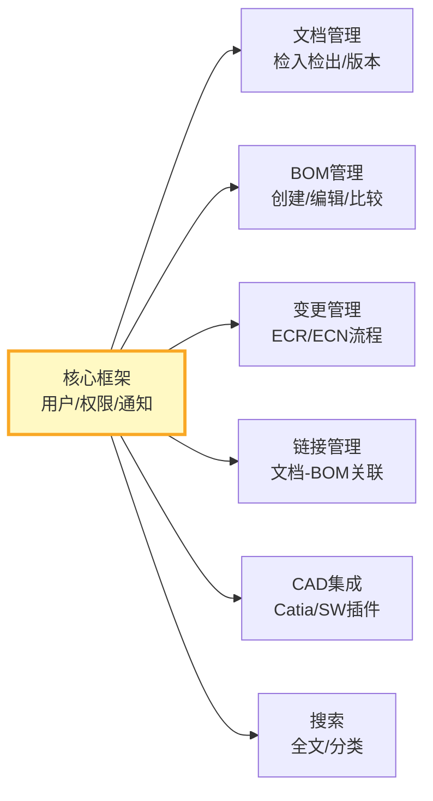

# 开源PLM项目解析

商业PLM系统动辄百万级的授权费用令中小企业望而却步，开源PLM提供了一种低成本的替代方案。本文深度解析OpenPLM和DocDokuPLM两个开源项目的架构设计、功能模块、适用场景及与商业PLM的差距。

## 1. 开源PLM现状

当前活跃的开源PLM项目：

| 项目 | 语言/框架 | 许可证 | 活跃度 | 星标数 | 核心定位 |
|------|----------|--------|--------|--------|---------|
| **OpenPLM** | Python/Django | LGPL | 中等 | 500+ | 企业级PLM |
| **DocDokuPLM** | Java/JSF | AGPL | 活跃 | 400+ | 文档协同PLM |

### 开源PLM的市场空间



## 2. OpenPLM架构分析

### 技术栈

| 层次 | 技术选型 | 说明 |
|------|---------|------|
| 前端 | HTML/CSS/JS + jQuery | 传统MVC渲染 |
| 后端 | Django 1.x | Python Web框架 |
| 数据库 | PostgreSQL | 关系型数据库 |
| 文件存储 | 本地文件系统 | 支持S3扩展 |
| 搜索 | Haystack + Whoosh | 全文检索 |
| 任务队列 | Celery + Redis | 异步任务处理 |

### 架构图



### 核心模块



### 功能模块详解

#### 文档管理

| 功能 | 支持情况 | 说明 |
|------|---------|------|
| 检入/检出 | 支持 | 基本版本控制 |
| 生命周期 | 支持 | Draft/Official/Deprecated |
| 签审流程 | 基础支持 | 简单的审批流程 |
| CAD预览 | 部分支持 | 2D图片预览，无3D |
| 全文搜索 | 支持 | 基于Whoosh |

#### BOM管理

| 功能 | 支持情况 | 说明 |
|------|---------|------|
| BOM创建 | 支持 | 多层级BOM |
| BOM编辑 | 支持 | 增删改操作 |
| BOM比较 | 支持 | 版本间差异比较 |
| 多视图 | 不支持 | 无EBOM/MBOM多视图 |
| 配置管理 | 不支持 | 无选配BOM |
| 替代料 | 不支持 | 无替代料管理 |

#### 变更管理

| 功能 | 支持情况 | 说明 |
|------|---------|------|
| ECR创建 | 支持 | 变更请求 |
| ECN流程 | 基础支持 | 简单审批流程 |
| 影响分析 | 不支持 | 无Where-Used查询 |
| 闭环验证 | 不支持 | 无闭环验证机制 |

## 3. DocDokuPLM架构分析

### 技术栈

| 层次 | 技术选型 | 说明 |
|------|---------|------|
| 前端 | JSF/PrimeFaces + JS | Java服务器端渲染 |
| 后端 | Java EE | 企业级Java |
| 数据库 | PostgreSQL/MySQL | 关系型数据库 |
| 文件存储 | 本地/S3 | 文件存储 |
| 搜索 | Lucene | 全文检索 |

### DocDokuPLM特色功能

| 功能 | 说明 | 与OpenPLM对比 |
|------|------|--------------|
| 文档协同 | 多人同时编辑文档批注 | OpenPLM无此功能 |
| 3D预览 | 支持3D模型在线预览 | OpenPLM仅2D预览 |
| 工作空间 | 项目级工作空间管理 | OpenPLM无此概念 |
| Web CAD | 纯Web端创建/编辑零件 | OpenPLM依赖桌面CAD |

## 4. 与商业PLM差距

| 能力维度 | 开源PLM | 商业PLM（Teamcenter/Windchill） | 差距评估 |
|---------|---------|-------------------------------|---------|
| **文档管理** | 基础版本控制、简单审批 | 完整生命周期、复杂签审、CAD深度集成 | 大 |
| **BOM管理** | 单视图BOM、基础编辑 | 多视图BOM、配置管理、替代料、比较 | 大 |
| **变更管理** | 简单ECR/ECN流程 | 完整ECN/ECO闭环、影响分析、Where-Used | 大 |
| **CAD集成** | 基础插件，2-3种CAD | 深度集成，支持10+种CAD、轻量化查看 | 很大 |
| **工艺管理** | 无 | 完整工艺路线、SOP、资源管理 | 很大 |
| **可视化** | 2D预览 | 3D轻量化查看、批注、测量、对比 | 很大 |
| **多站点** | 单站点 | 全球多站点协同 | 很大 |
| **性能** | 百级用户 | 十万级用户 | 大 |
| **合规性** | 无 | FDA/AS9100等行业合规 | 很大 |
| **生态** | 社区支持 | 全球实施伙伴、培训体系 | 大 |

## 5. 适用场景

### 适合开源PLM的场景

| 场景 | 说明 | 推荐方案 |
|------|------|---------|
| 中小制造企业 | 预算有限，核心需求是文档管理 | OpenPLM |
| 非关键产品线 | 大企业的非核心产品线，无需全功能PLM | DocDokuPLM |
| 教育培训 | 高校PLM教学与实验 | OpenPLM |
| 概念验证 | 企业PLM选型前的POC验证 | OpenPLM |
| 定制化需求 | 有特殊需求需要深度定制 | OpenPLM（Django易扩展） |

### 不适合开源PLM的场景

| 场景 | 原因 | 推荐方案 |
|------|------|---------|
| 汽车行业 | 需要多站点协同、JIT支持、行业合规 | Teamcenter/Windchill |
| 航空航天 | 需要AS9100合规、复杂配置管理 | Teamcenter/ENOVIA |
| 大规模部署 | 需要支持500+用户 | 商业PLM |
| 深度CAD集成 | 需要与多种CAD深度集成 | 商业PLM |
| 全球协同 | 需要多站点多语言协同 | 商业PLM |

## 6. 部署实践

### OpenPLM部署步骤

| 步骤 | 操作 | 说明 |
|------|------|------|
| 1 | 安装基础环境 | Python 3.x + PostgreSQL + Redis |
| 2 | 获取源码 | git clone OpenPLM仓库 |
| 3 | 安装依赖 | pip install -r requirements.txt |
| 4 | 初始化数据库 | python manage.py migrate |
| 5 | 创建管理员 | python manage.py createsuperuser |
| 6 | 启动服务 | python manage.py runserver |
| 7 | 配置Nginx | 反向代理+静态文件 |
| 8 | 配置Celery | 异步任务处理 |

### 生产环境推荐配置

| 组件 | 推荐配置 | 说明 |
|------|---------|------|
| 服务器 | 4核8G以上 | 应用服务器 |
| PostgreSQL | 2核4G以上 | 数据库服务器 |
| Redis | 1核2G | 缓存+队列 |
| 存储 | 100GB+ SSD | 文件存储 |
| 网络 | 100Mbps+ | CAD文件上传需要带宽 |

## 7. 二次开发指南

### OpenPLM二次开发

OpenPLM基于Django，二次开发相对容易：

| 开发任务 | 难度 | 说明 |
|---------|------|------|
| 添加文档属性 | 低 | Django Model添加字段 |
| 自定义审批流程 | 中 | 需要理解OpenPLM工作流框架 |
| 添加API接口 | 中 | Django REST Framework扩展 |
| CAD集成开发 | 高 | 需要开发CAD插件 |
| BOM多视图 | 高 | 需要重构BOM数据模型 |

### 关键扩展点

```python
# OpenPLM 扩展示例：添加自定义文档属性

from plmapp.models import Document

class CustomDocument(Document):
    # 添加自定义字段
    project_code = models.CharField(max_length=50, blank=True)
    customer = models.CharField(max_length=100, blank=True)

    class Meta:
        app_label = 'custom_plm'
```

## 小结

- 开源PLM（OpenPLM/DocDokuPLM）适合中小企业和非关键产品线
- OpenPLM基于Django+PostgreSQL，架构清晰，二次开发较容易
- 与商业PLM在CAD集成、BOM多视图、变更闭环等方面差距较大
- 开源PLM的核心价值在于低成本、可定制，而非功能全面
- 选型时需评估：企业规模、行业合规要求、CAD生态、预算约束
