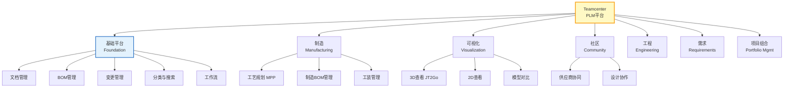
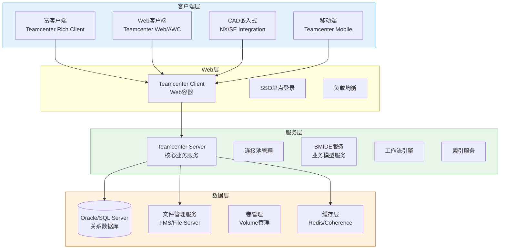
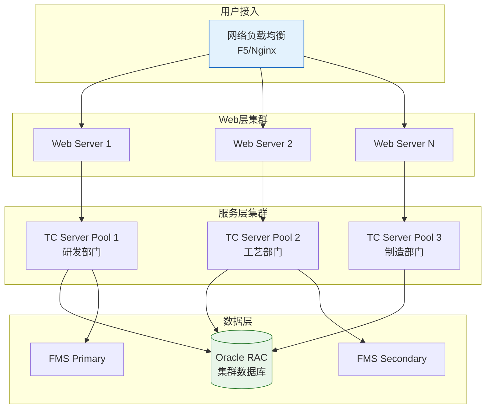
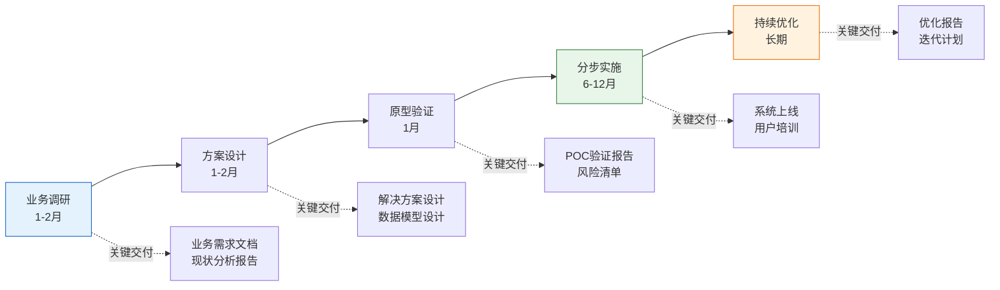

# Teamcenter架构解析

Siemens Teamcenter是全球市场占有率最高的PLM产品，广泛应用于汽车、航空航天、机械制造等行业。本文深度解析Teamcenter的产品家族、核心架构、业务建模、CAD集成及大规模部署的最佳实践。

## 1. Teamcenter产品家族

Teamcenter不是一个单一产品，而是一个由多个模块组成的产品家族：



### 产品模块对比

| 模块 | 功能范围 | 典型客户 | 附加授权 |
|------|---------|---------|---------|
| **Foundation** | 文档/BOM/变更/工作流/分类 | 所有客户 | 基础授权 |
| **Engineering** | CAD集成/多CAD/设计协同 | 有CAD深度集成需求 | 按CAD类型 |
| **Manufacturing** | 工艺规划/MBOM/工装 | 有工艺管理需求 | 制造授权 |
| **Visualization** | JT查看/批注/测量 | 需要轻量化查看 | 查看授权 |
| **Community** | 供应商协同/设计协作 | 有外部协同需求 | 协同授权 |
| **Requirements** | 需求管理/追溯 | 系统工程 | 需求授权 |
| **Portfolio Mgmt** | 项目/资源/组合管理 | 大型项目管理 | 项目授权 |

## 2. 核心架构

Teamcenter采用经典的企业级四层架构：



### 各层详细说明

| 层次 | 核心组件 | 职责 | 关键技术 |
|------|---------|------|---------|
| **客户端层** | Rich Client / AWC / CAD嵌入式 | 用户交互 | Eclipse RCP / React |
| **Web层** | Teamcenter Client + SSO + NLB | 请求路由、会话管理 | Apache/Tomcat |
| **服务层** | Teamcenter Server + BMIDE + WF | 业务逻辑处理 | C++/Java服务 |
| **数据层** | Oracle + FMS + Volume | 数据持久化与文件管理 | Oracle/SQL Server |

## 3. BMIDE业务建模器

BMIDE（Business Modeler Integrated Development Environment）是Teamcenter的核心业务建模工具：

### BMIDE的能力

| 建模维度 | 说明 | 典型操作 |
|---------|------|---------|
| **数据模型** | 定义业务对象及其属性 | 创建Item类型、添加自定义属性 |
| **关系模型** | 定义对象间的关系 | 创建自定义关联类型 |
| **规则模型** | 定义业务规则 | 命名规则、权限规则、校验规则 |
| **流程模型** | 定义业务流程 | 签审流程、变更流程 |
| **界面模型** | 定义用户界面 | 表单布局、属性页定义 |

### BMIDE工作流程

```
1. 在BMIDE中定义业务模型
   ├── 创建自定义Item类型
   ├── 添加自定义属性
   ├── 定义关联关系
   └── 配置界面布局

2. 导出模板文件（.zip）
   └── 包含所有模型定义

3. 部署到Teamcenter Server
   └── 导入模板，更新数据库schema

4. 验证与测试
   └── 在测试环境验证模型正确性

5. 迁移到生产环境
   └── 经过变更管理流程部署
```

### 常见自定义场景

| 场景 | BMIDE操作 | 说明 |
|------|----------|------|
| 添加物料分类 | 创建分类层级+属性 | 按企业分类标准建立物料分类树 |
| 自定义审批流程 | 定义流程模板+路由规则 | 适配企业现有审批制度 |
| 添加文档密级 | 扩展Document属性+权限规则 | 按安全要求控制文档访问 |
| 自定义BOM属性 | 扩展BOM Line属性 | 添加工艺相关属性 |

## 4. Teamcenter与NX/SolidEdge集成

Teamcenter与西门子自家的CAD产品实现了最深度的集成：

### NX集成

| 集成方式 | 说明 | 用户体验 |
|---------|------|---------|
| **嵌入式面板** | NX内嵌Teamcenter操作面板 | 设计师无需离开NX |
| **零检入/零检出** | 保存即检入，打开即检出 | 无感知的数据管理 |
| **装配映射** | NX装配结构自动映射为BOM | 一键生成EBOM |
| **属性同步** | NX属性与Teamcenter属性双向同步 | 属性只填一次 |
| **JT自动生成** | 检入时自动生成JT轻量化文件 | 无需手动转换 |
| **族表管理** | NX族表自动映射为Teamcenter变型件 | 族实例统一管理 |

### SolidEdge集成

| 集成方式 | 说明 |
|---------|------|
| **内置集成** | SolidEdge内置Teamcenter操作功能 |
| **文件管理** | 直接从Teamcenter打开/保存SolidEdge文件 |
| **BOM提取** | 从SolidEdge装配体提取BOM到Teamcenter |
| **属性映射** | SolidEdge属性映射到Teamcenter属性 |

### 第三方CAD集成

| CAD软件 | 集成方式 | 集成深度 |
|---------|---------|---------|
| Creo | 插件式集成 | 中等 |
| CATIA V5 | 插件式集成 | 中等 |
| SolidWorks | 插件式集成 | 基础 |
| AutoCAD | 拖拽式集成 | 基础 |

## 5. 数据模型自定义

Teamcenter的数据模型高度灵活，但自定义需遵循最佳实践：

### 自定义原则

| 原则 | 说明 | 原因 |
|------|------|------|
| 优先扩展而非新建 | 在现有Item类型上扩展属性 | 减少迁移风险，复用现有功能 |
| 属性分组 | 将相关属性组织到同一个属性组 | 便于管理和界面布局 |
| 命名规范 | 遵循统一的命名规范 | 可维护性 |
| 版本兼容 | 自定义需考虑升级兼容性 | 减少升级成本 |

### 自定义层次

```
Level 1: 属性扩展（最低风险）
├── 在现有Item类型上添加自定义属性
└── 示例：在Document上添加"密级"属性

Level 2: 类型扩展（中等风险）
├── 基于现有类型派生新的子类型
└── 示例：基于Item创建"外购件"类型

Level 3: 模型重构（高风险）
├── 修改核心数据模型结构
└── 示例：重构BOM模型以支持多视图
```

## 6. 性能优化

Teamcenter在大规模部署时的性能优化至关重要：

### 缓存策略

| 缓存层 | 技术 | 缓存内容 | 命中率目标 |
|--------|------|---------|-----------|
| 客户端缓存 | 本地文件缓存 | CAD文件/JT文件 | 70%+ |
| Web层缓存 | Redis/Coherence | 会话数据/查询结果 | 80%+ |
| 服务层缓存 | Teamcenter Server Cache | 元数据/权限数据 | 90%+ |
| 数据库缓存 | Oracle Buffer Cache | 热点数据块 | 95%+ |

### 索引优化

| 优化类型 | 说明 | 效果 |
|---------|------|------|
| 全文索引 | 基于Solr/Elasticsearch的全文检索 | 搜索响应从秒级降到毫秒级 |
| 分类索引 | 物料分类的索引优化 | 分类查询提速10x+ |
| Where-Used索引 | BOM使用位置的预计算索引 | Where-Used查询从分钟级降到秒级 |
| 属性索引 | 高频查询属性的索引 | 列表查询提速5x+ |

### 分布式部署



## 7. 大规模部署（10万+用户）

### 部署架构参考

| 组件 | 配置 | 数量 | 说明 |
|------|------|------|------|
| 负载均衡 | F5 BigIP | 2 | 主备高可用 |
| Web服务器 | 8核16G | 4-8 | 按并发用户数扩展 |
| TC Server | 16核32G | 8-16 | 按业务域划分Pool |
| Oracle RAC | 32核128G | 4节点 | 数据库集群 |
| FMS | 8核16G + SSD | 4 | 文件管理服务 |
| Redis | 8核32G | 3 | 缓存集群 |

### 大规模部署关键考量

| 维度 | 考量 | 解决方案 |
|------|------|---------|
| **可用性** | 单点故障风险 | 全链路高可用设计 |
| **数据量** | 亿级数据记录 | 分区表、归档策略 |
| **文件量** | 亿级CAD文件 | 分布式文件系统、CDN |
| **并发** | 万级并发用户 | 连接池、异步处理 |
| **备份** | 海量数据备份 | 增量备份、并行恢复 |
| **升级** | 不停机升级 | 滚动升级、灰度发布 |

## 8. 企业级最佳实践

### 实施方法论



### 关键成功因素

| 因素 | 说明 | 失败案例 |
|------|------|---------|
| **高管支持** | PLM是一把手工程 | 缺乏高层推动，项目沦为IT项目 |
| **数据治理** | 先治理再上线 | 数据混乱导致系统不可用 |
| **分步实施** | 先核心后扩展 | 一步到位导致项目失控 |
| **变革管理** | 用户习惯的变革 | 用户抵触，系统空转 |
| **主数据先行** | 物料/编码先统一 | 主数据不统一导致数据质量差 |

## 小结

- Teamcenter是模块化的产品家族，Foundation是基础，其他模块按需扩展
- 四层架构（客户端→Web→服务→数据）支持大规模企业级部署
- BMIDE是Teamcenter灵活性的核心，支持数据模型、流程、界面的全面自定义
- 与NX/SolidEdge的深度集成是Teamcenter的核心竞争优势
- 大规模部署需要缓存、索引、分布式架构的全方位性能优化
- 企业级PLM实施是一把手工程，数据治理和变革管理是关键成功因素
