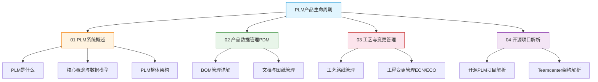

# PLM产品生命周期

**PLM（Product Lifecycle Management）** 是制造业数字化转型的核心基石，覆盖产品从概念创意到退役回收的全生命周期数据管理与流程协同。本教程系统讲解 PLM 的核心概念、数据模型、架构设计、工艺变更管理及开源/商业产品深度解析。

## 学习路线

## 参考产品

| 产品 | 厂商 | 定位 | 核心优势 | 适用行业 |
|------|------|------|----------|----------|
| **Siemens Teamcenter** | 西门子 | 企业级PLM平台 | 功能全面、CAD集成深度、大规模部署 | 汽车、航空航天、机械 |
| **PTC Windchill** | PTC | 中大型PLM | Creo原生集成、MPMLink工艺管理 | 离散制造、高科技电子 |
| **ENOVIA 3DEXPERIENCE** | 达索 | 3D体验平台 | CATIA原生集成、3D协同设计 | 航空航天、汽车、船舶 |
| **OpenPLM** | 开源社区 | 轻量PLM | Django架构、易二次开发、免费 | 中小制造企业、教育 |

## 章节目录

- [01 PLM系统概述](01_PLM系统概述/) — PLM定义、核心概念、整体架构
- [02 产品数据管理PDM](02_产品数据管理PDM/) — BOM管理、文档与图纸管理
- [03 工艺与变更管理](03_工艺与变更管理/) — 工艺路线、工程变更管理
- [04 开源项目解析](04_开源项目解析/) — 开源PLM与Teamcenter架构深度解析
