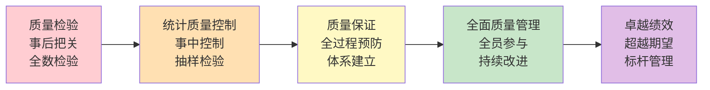
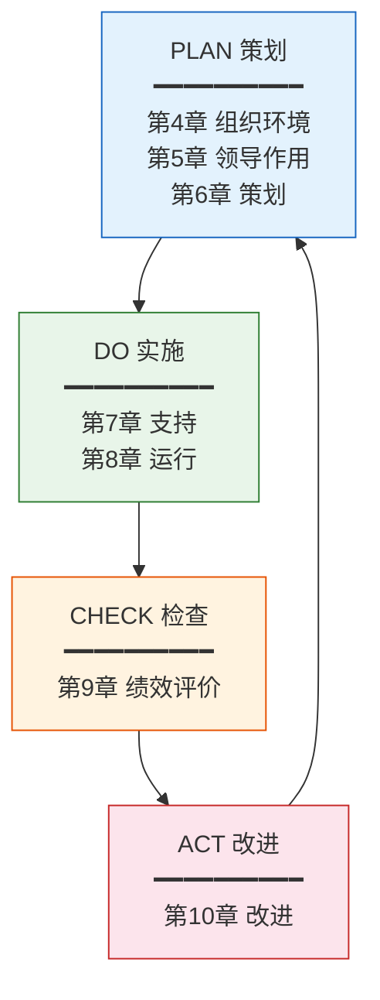
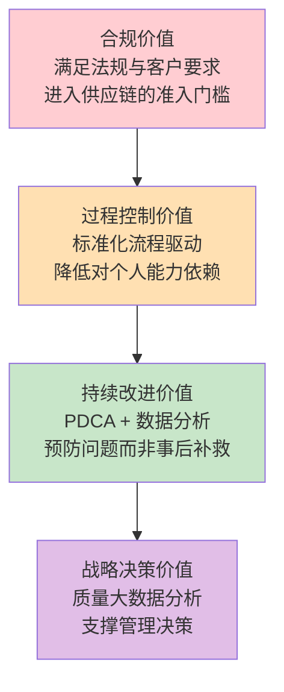
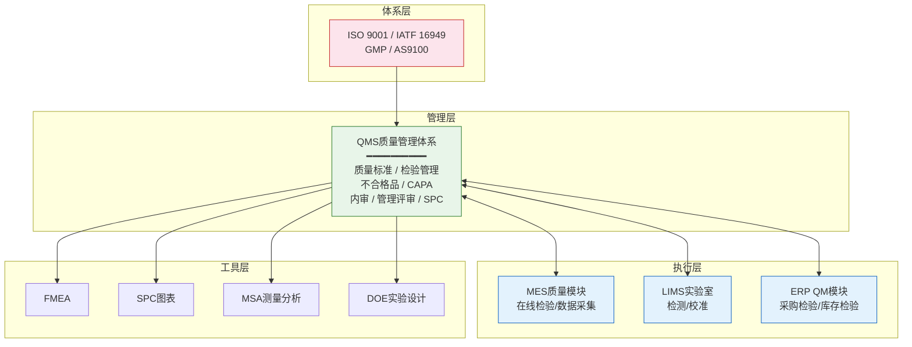

# QMS是什么

## QMS的定义

QMS（Quality Management System，质量管理体系）是在质量方面指挥和控制组织的管理体系。国际标准化组织ISO将其定义为："在质量方面指挥和控制组织的协调活动，通常包括制定质量方针和质量目标以及质量策划、质量控制、质量保证和质量改进"。QMS不是一个单纯的软件系统，而是一套涵盖组织架构、流程规范、技术工具与人员能力的完整管理框架。

在企业信息化语境下，QMS系统是指支撑质量管理体系运行的信息化平台，覆盖从质量标准制定、检验计划编制、检验执行记录、不合格品处置、纠正预防措施到质量分析与持续改进的全过程管理。

## QMS与MES质量模块的区别

QMS与MES中的质量模块经常被混淆，但两者在定位、范围和深度上存在本质差异：

| 对比维度 | QMS系统 | MES质量模块 |
|---------|---------|------------|
| 管理定位 | 体系级管理，覆盖质量全生命周期 | 执行级管控，聚焦生产过程质量 |
| 核心目标 | 建立和维持质量管理体系运行 | 实现生产过程中的在线质量管控 |
| 管理范围 | 跨部门、跨工厂、跨供应链 | 车间级、工序级 |
| 功能深度 | 体系文件/内审/管理评审/CAPA/SPC | 在线检验/数据采集/判定/报警 |
| 数据来源 | 人工录入+系统采集+外部检测报告 | 以设备/系统自动采集为主 |
| 合规驱动 | ISO 9001/IATF 16949/GMP等标准 | 客户规格/工艺标准 |
| 典型场景 | 体系审核、客户投诉处理、8D报告 | 首检/巡检/抽检、SPC在线监控 |

**简言之：MES是执行，QMS是体系。** MES质量模块回答"这个产品合不合格"，QMS回答"我们的质量体系是否有效运行、如何持续改进"。

## 质量管理的演进

质量管理经历了从被动检验到主动追求卓越的五个阶段演进：

1. **质量检验阶段**（20世纪初）：事后全数检验，挑出不合格品，本质是"把关"
2. **统计质量控制阶段**（20世纪30年代）：引入统计方法，从事后把关转向事中控制，代表人物休哈特发明控制图
3. **质量保证阶段**（20世纪50年代）：从控制制造过程扩展到全过程，建立质量体系，预防缺陷产生
4. **质量管理阶段**（20世纪80年代）：全面质量管理TQM，质量不仅是检验部门的事，而是全员参与
5. **卓越绩效阶段**（21世纪）：追求卓越，从满足标准到超越期望，以波多里奇奖为代表

## ISO 9001核心框架

ISO 9001:2015是当前应用最广泛的质量管理体系标准，全球超过100万家组织获得认证。其核心框架基于PDCA循环：

ISO 9001:2015的核心条款包括：

| 条款 | 标题 | 核心要求 |
|------|------|---------|
| 第4章 | 组织环境 | 理解组织及其环境、理解相关方需求、确定QMS范围、过程方法 |
| 第5章 | 领导作用 | 质量方针、岗位职责与权限、以顾客为关注焦点 |
| 第6章 | 策划 | 应对风险和机遇的措施、质量目标及策划、变更策划 |
| 第7章 | 支持 | 资源、能力、意识、沟通、文件化信息 |
| 第8章 | 运行 | 运行策划与控制、产品和服务要求、设计与开发、生产和服务提供、放行、不合格品 |
| 第9章 | 绩效评价 | 监视测量分析与评价、内部审核、管理评审 |
| 第10章 | 改进 | 总则、不合格与纠正措施、持续改进 |

## QMS的4层价值

QMS为制造企业创造的价值可以从四个层次来理解：

### 第1层：合规价值

满足法规和客户对质量管理体系的强制要求。在汽车、航空、医疗器械等行业，QMS认证是进入供应链的准入门槛。没有IATF 16949认证，就无法成为OEM的一级供应商。

### 第2层：过程控制价值

通过标准化的检验流程、不合格品处置流程和纠正预防机制，确保每个环节的质量受控。QMS将"经验驱动"的质量管理转化为"流程驱动"，降低对个人能力的依赖。

### 第3层：持续改进价值

基于PDCA循环和数据分析（SPC、8D、FMEA等工具），持续识别改进机会并推动优化。从"出了问题再解决"到"预防问题发生"，最终实现质量成本的持续降低。

### 第4层：战略决策价值

质量数据不再只是检验记录，而是支撑管理决策的战略资产。通过质量大数据分析，可以识别供应商质量趋势、产品可靠性瓶颈、客户满意度关联因素，为企业战略决策提供数据支撑。

## 制造业质量管理体系全景图

在现代制造企业中，QMS不是孤立存在的，而是与多个系统协同工作：

## 商业产品对比

| 产品 | 供应商 | 核心优势 | 典型行业 | 集成能力 |
|------|--------|---------|---------|---------|
| 海克斯康QMS | Hexagon | 三坐标测量机深度集成、AI辅助质量分析、SPC专业级 | 汽车、航空、精密制造 | CMM/三坐标、CAD、MES |
| 鼎捷QMS | 鼎捷软件 | 离散制造深度适配、ERP+MES+QMS一体化、中文友好 | 离散制造、电子组装 | 鼎捷ERP/MES |
| SAP QM | SAP | 与SAP ERP/PP/MM深度集成、流程行业适配、全球合规 | 流程行业、化工、食品 | SAP全生态 |
| Siemens QMS | 西门子 | Teamcenter PLM集成、APQP/PPAP专业化、汽车行业 | 汽车、机械制造 | Teamcenter PLM |

## 总结

QMS是制造业质量管理的体系级支撑，与MES质量模块形成"体系+执行"的协同关系。理解QMS的定义、演进历程、ISO 9001核心框架和四层价值模型，是深入学习QMS各功能模块的基础。下一章将深入QMS的核心业务概念与数据模型设计。
