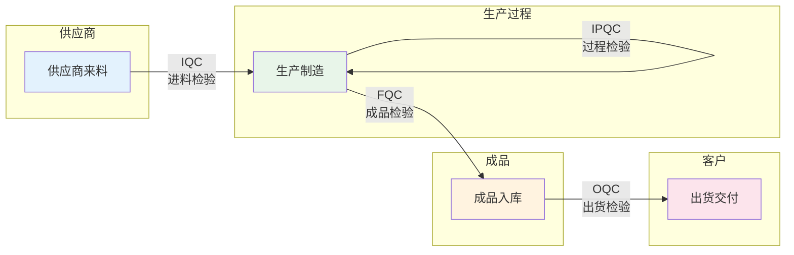
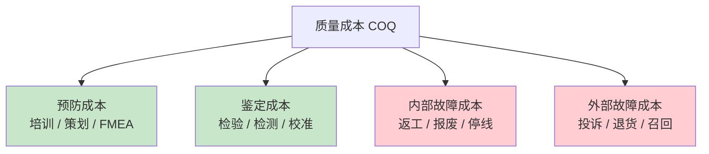
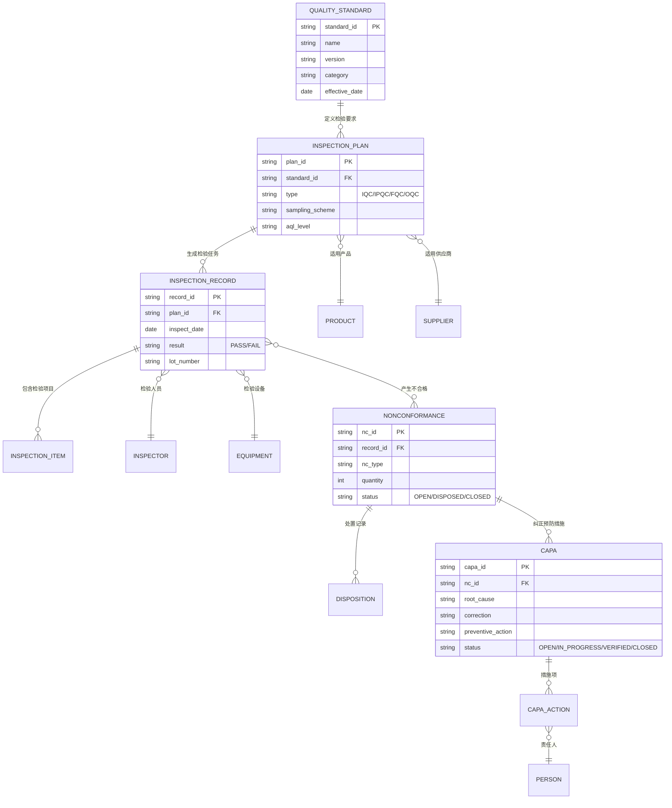

# 核心概念与数据模型

## 核心业务对象

QMS系统围绕以下核心业务对象构建，这些对象之间的关联构成了质量管理的完整数据链路：

| 核心对象 | 说明 | 关键属性 |
|---------|------|---------|
| 质量标准 | 定义产品/过程的检验要求与判定准则 | 标准编号、版本、适用范围、检验项目 |
| 检验计划 | 规定何时、何地、如何进行检验 | 计划类型、触发条件、抽样方案、检验项目 |
| 检验记录 | 记录每次检验的实际结果 | 检验日期、检验员、检验值、判定结果 |
| 不合格品 | 不满足质量要求的产品/物料记录 | 不合格类型、数量、发现环节、处置状态 |
| 纠正措施 | 针对不合格的系统性改进措施 | 措施描述、责任人、完成日期、验证结果 |

这些对象的关系可以概括为：**质量标准定义要求 → 检验计划执行要求 → 检验记录产生结果 → 不合格品触发处置 → 纠正措施实现改进**，形成完整的PDCA闭环。

## 检验类型体系

QMS中的检验按生产流程的阶段分为四大类型，每种类型服务于不同的质量管控目标：

### IQC — 进料检验

IQC（Incoming Quality Control）是对供应商来料进行的入库前检验，是质量管控的第一道防线。IQC的核心目标是在不良物料进入生产环节之前将其拦截，避免造成更大的损失。

- **检验时机**：供应商送货入库前
- **检验依据**：采购规格书、材料规范、供应商质量协议
- **抽样标准**：GB/T 2828.1（等同ISO 2859-1），AQL抽样方案
- **关注指标**：来料合格率、供应商PPM、批退率
- **处置方式**：接收 / 让步接收 / 退货 / 退货返工

### IPQC — 过程检验

IPQC（In-Process Quality Control）是生产过程中的巡回检验和关键工序检验，确保制造过程稳定受控。

- **检验时机**：生产过程中按频次或触发条件
- **检验方式**：首件检验、巡回检验、关键工序全检
- **检验依据**：工艺文件、控制计划、作业指导书
- **关注指标**：过程能力Cpk、直通率FPY、不良率
- **处置方式**：继续生产 / 停线整改 / 返工

### FQC — 成品检验

FQC（Final Quality Control）是对完工产品在入库前的最终检验，是出厂前的内部质量关卡。

- **检验时机**：产品完工入库前
- **检验方式**：全检或抽样检验
- **检验依据**：成品检验规范、产品标准
- **关注指标**：成品合格率、批合格率
- **处置方式**：入库 / 返工 / 报废

### OQC — 出货检验

OQC（Outgoing Quality Control）是对即将出货的产品进行的最终检验，确保交付客户的产品符合要求。

- **检验时机**：产品出货前
- **检验方式**：抽样检验
- **检验依据**：客户规格、出货检验规范
- **关注指标**：出货合格率、客户投诉率
- **处置方式**：出货 / 暂缓出货 / 返工

## 抽样方案

### AQL抽样体系

AQL（Acceptable Quality Limit，可接收质量限）是抽样检验的核心概念，定义了可以接收的批次最大不合格品率。GB/T 2828.1（等同ISO 2859-1）是最常用的抽样标准：

| 要素 | 说明 |
|------|------|
| 检验水平 | 一般检验水平I/II/III，特殊检验水平S-1~S-4 |
| AQL值 | 常用0.065/0.10/0.15/0.25/0.40/0.65/1.0/1.5/2.5/4.0/6.5 |
| 样本量字码 | 根据批量和检验水平查表确定 |
| 正常/加严/放宽 | 根据连续批次质量表现切换检验严格度 |
| 转移规则 | 连续5批合格→放宽；连续2批不合格→加严 |

### 抽样方案选择

| 场景 | 推荐方案 | 理由 |
|------|---------|------|
| 常规来料检验 | GB/T 2828.1 正常检验 | 平衡检验成本与风险 |
| 关键安全件 | 全检或AQL=0.065 | 安全风险高，不允许漏检 |
| 破坏性检验 | GB/T 2828.1 特殊水平S-1 | 减少破坏性检验的样本量 |
| 稳定供应商 | 放宽检验 | 历史质量稳定，降低检验成本 |

## 质量成本模型

质量成本（Cost of Quality, COQ）是衡量质量管理体系经济性的重要工具，分为四大类别：

| 成本类别 | 定义 | 典型项目 | 占比趋势 |
|---------|------|---------|---------|
| 预防成本 | 预防缺陷发生的投入 | 培训、质量策划、FMEA、APQP | 应增加 |
| 鉴定成本 | 检验和判定质量的投入 | 检验设备、检验人工、实验室检测 | 适度控制 |
| 内部故障成本 | 交付前发现缺陷的损失 | 返工、报废、停线、降级 | 应减少 |
| 外部故障成本 | 交付后发现缺陷的损失 | 客户投诉、退货、保修、召回 | 必须消除 |

**质量成本最优法则**：增加预防成本和鉴定成本的投入，可以大幅降低故障成本，从而实现总质量成本的最小化。实践经验表明，预防成本占比从5%提升到15%时，总质量成本可降低30%-50%。

## 数据模型ER图

QMS核心数据模型围绕"标准→计划→执行→处置→改进"的主线设计：

## 质量指标体系

QMS通过一套完整的质量指标体系来衡量和监控质量管理绩效：

| 指标 | 英文 | 计算公式 | 目标方向 |
|------|------|---------|---------|
| 良率 | Yield | (合格数/总生产数) × 100% | 越高越好 |
| 直通率 | First Pass Yield (FPY) | (一次合格数/总投入数) × 100% | 越高越好 |
| 百万缺陷率 | PPM | (缺陷数/总产量) × 1,000,000 | 越低越好 |
| 过程能力指数 | Cpk | min[(USL-μ)/3σ, (μ-LSL)/3σ] | ≥1.33 |
| 设备综合效率 | OEE | 可用率 × 性能率 × 良率 | ≥85% |
| 来料合格率 | IQC Pass Rate | (合格批次数/总检验批次数) × 100% | ≥98% |
| 客户投诉率 | Customer Complaint Rate | (投诉数/出货批次数) × 100% | ≤0.1% |

### Cpk过程能力详解

Cpk是衡量制造过程稳定性和能力的关键指标：

| Cpk值 | 过程能力等级 | 不良率(PPM) | 评价 |
|-------|------------|------------|------|
| < 1.0 | 不足 | > 2700 | 过程能力不足，必须改进 |
| 1.0 - 1.33 | 勉强 | 63 - 2700 | 需要持续监控 |
| 1.33 - 1.67 | 充足 | 0.6 - 63 | 可接受水平 |
| 1.67 - 2.0 | 优秀 | 0.002 - 0.6 | 精度较高 |
| > 2.0 | 卓越 | < 0.002 | 六西格玛水平 |

## 总结

QMS的核心概念围绕"标准→计划→执行→处置→改进"的数据链路构建，检验类型体系（IQC/IPQC/FQC/OQC）覆盖了从进料到出货的全过程质量管控。理解抽样方案、质量成本模型和核心质量指标，是设计QMS功能和进行质量数据分析的基础。下一章将深入QMS系统的整体架构设计。
