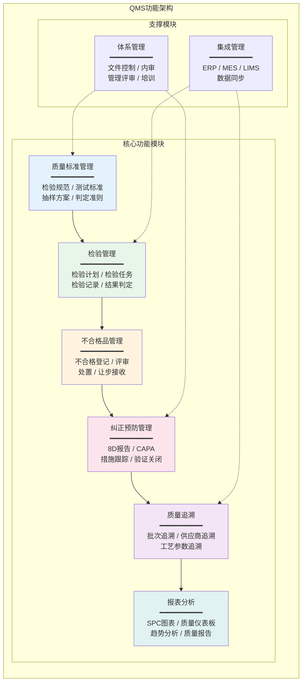
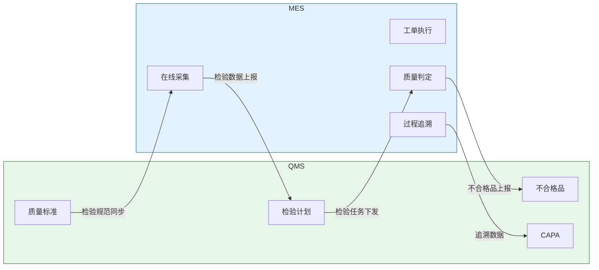
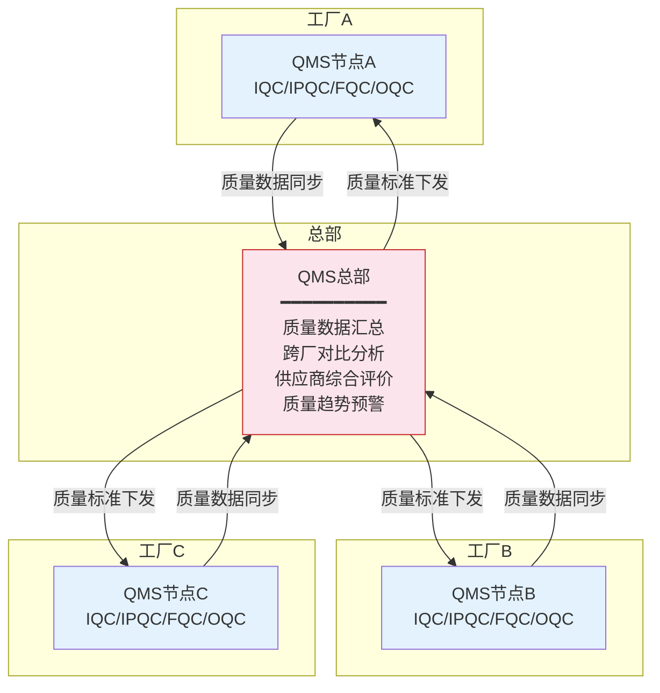

# QMS整体架构

## 功能架构

QMS系统的功能架构围绕质量管理全生命周期设计，包含六大核心功能模块和两大支撑模块：



### 各模块功能说明

| 功能模块 | 核心功能 | 关键特性 |
|---------|---------|---------|
| 质量标准管理 | 检验规范定义、测试标准维护、抽样方案配置 | 版本控制、审批流程、标准关联 |
| 检验管理 | 检验计划编制、检验任务派发、检验记录采集 | 多检验类型支持、移动端采集、自动判定 |
| 不合格品管理 | 不合格登记、评审处置、让步审批 | 隔离管理、处置流程、MRB评审 |
| 纠正预防管理 | 8D报告、CAPA跟踪、根本原因分析 | 闭环管理、超期预警、效果验证 |
| 质量追溯 | 批次追溯、供应商追溯、工艺参数关联 | 正反向追溯、时间线展示、关联分析 |
| 报表分析 | SPC图表、质量仪表板、趋势分析 | 实时监控、异常预警、多维分析 |

## 技术架构

QMS系统的技术架构通常采用分层设计，确保系统的可扩展性和可维护性：

```
┌─────────────────────────────────────────────────┐
│                  展示层                          │
│    Web端(Vue/React) │ 移动端(App/小程序) │ 大屏   │
├─────────────────────────────────────────────────┤
│                  网关层                          │
│    API Gateway / 负载均衡 / 认证鉴权 / 限流熔断    │
├─────────────────────────────────────────────────┤
│                  服务层                          │
│  质量标准服务 │ 检验服务 │ 不合格品服务 │ CAPA服务   │
│  追溯服务 │ 报表服务 │ 体系管理服务 │ 集成服务     │
├─────────────────────────────────────────────────┤
│                  中间件层                        │
│  消息队列 │ 分布式缓存 │ 任务调度 │ 搜索引擎       │
├─────────────────────────────────────────────────┤
│                  数据层                          │
│  关系数据库 │ 时序数据库 │ 对象存储 │ 数据仓库       │
└─────────────────────────────────────────────────┘
```

技术选型参考：

| 技术层 | 推荐方案 | 说明 |
|--------|---------|------|
| 前端框架 | Vue3 + TypeScript + Element Plus | 企业级组件库，中文友好 |
| 后端框架 | Spring Boot / Spring Cloud | 微服务架构，适合中大型企业 |
| 关系数据库 | PostgreSQL / MySQL | 业务数据存储 |
| 时序数据库 | TDengine / InfluxDB | 检验数据、SPC数据存储 |
| 消息队列 | RabbitMQ / Kafka | 异步任务、事件通知 |
| 缓存 | Redis | 热点数据缓存、分布式锁 |
| 搜索引擎 | Elasticsearch | 检验记录全文检索 |
| 报表引擎 | JasperReports / FineReport | 质量报告生成 |

## 与ERP集成

QMS与ERP的集成主要体现在QM（Quality Management）模块的交互：

| 集成场景 | 数据流向 | 集成方式 |
|---------|---------|---------|
| 采购检验 | ERP采购订单 → QMS检验计划 → 检验结果 → ERP库存决策 | 中间表/API |
| 生产检验 | ERP生产订单 → QMS检验任务 → 检验结果 → ERP报工 | 中间表/API |
| 库存检验 | ERP库存批次 → QMS检验任务 → 检验结果 → ERP库存状态 | 定时同步 |
| 质量成本 | QMS质量成本数据 → ERP成本中心 | 批量传输 |
| 供应商评价 | QMS供应商质量数据 → ERP供应商评估 | 定期汇总 |

**SAP QM集成示例**：SAP ECC/S4HANA中，QM模块与MM（物料管理）、PP（生产计划）、SD（销售分销）深度集成。采购收货时自动触发检验批（Inspection Lot），检验完成后自动更新库存状态和供应商评分。

## 与MES集成

QMS与MES的集成实现质量管控的"体系+执行"协同：



| 集成场景 | 说明 | 实时性 |
|---------|------|--------|
| 检验标准同步 | QMS质量标准同步到MES，指导在线检验判定 | 准实时 |
| 检验任务下发 | QMS检验计划自动生成MES质量检验任务 | 准实时 |
| 检验数据上报 | MES在线检验数据实时上报QMS | 实时 |
| SPC数据传输 | MES采集的SPC数据传输到QMS进行过程分析 | 实时 |
| 不合格品联动 | MES判定不合格自动通知QMS发起不合格品处理 | 实时 |

## 与LIMS集成

LIMS（实验室信息管理系统）与QMS的集成主要围绕实验室检测环节：

| 集成场景 | 数据流向 | 说明 |
|---------|---------|------|
| 检测委托 | QMS → LIMS | QMS发起检测委托单 |
| 检测结果 | LIMS → QMS | LIMS回传检测结果和报告 |
| 设备校准 | LIMS → QMS | 校准到期提醒和校准记录同步 |
| 方法标准 | QMS → LIMS | 检测方法标准同步到LIMS |

## 部署模式

| 部署模式 | 适用场景 | 优势 | 劣势 |
|---------|---------|------|------|
| 本地部署 | 大型制造企业、数据安全要求高 | 数据自主可控、定制灵活 | 初期投入高、运维成本大 |
| 公有云SaaS | 中小企业、快速上线 | 低成本、快速部署、免运维 | 定制性受限、数据在云端 |
| 混合部署 | 多工厂企业 | 核心数据本地、边缘节点上云 | 架构复杂、运维难度大 |
| 私有云 | 集团型企业 | 资源弹性、安全可控 | 需要云平台运维能力 |

## 多工厂质量数据汇总方案

对于多工厂企业，QMS需要实现跨工厂的质量数据汇总与分析：



多工厂部署的关键设计要点：

1. **标准统一**：总部统一制定质量标准和检验规范，下发到各工厂执行
2. **数据汇总**：各工厂按统一数据格式上报质量数据，总部进行汇总分析
3. **权限隔离**：各工厂只能访问本厂数据，总部可以查看所有工厂数据
4. **时区处理**：跨地区工厂需要统一时间基准或支持多时区
5. **网络策略**：工厂与总部之间通过专线或VPN连接，保证数据传输安全

## 总结

QMS系统以六大核心功能模块（质量标准、检验管理、不合格品管理、纠正预防、质量追溯、报表分析）为骨架，通过与ERP、MES、LIMS的深度集成实现质量数据的全面贯通。技术架构采用分层设计，支持本地部署、云SaaS和混合部署等多种模式。对于多工厂企业，需要特别关注标准统一、数据汇总和权限隔离的设计。下一章将进入质量体系与流程的深入解析。
