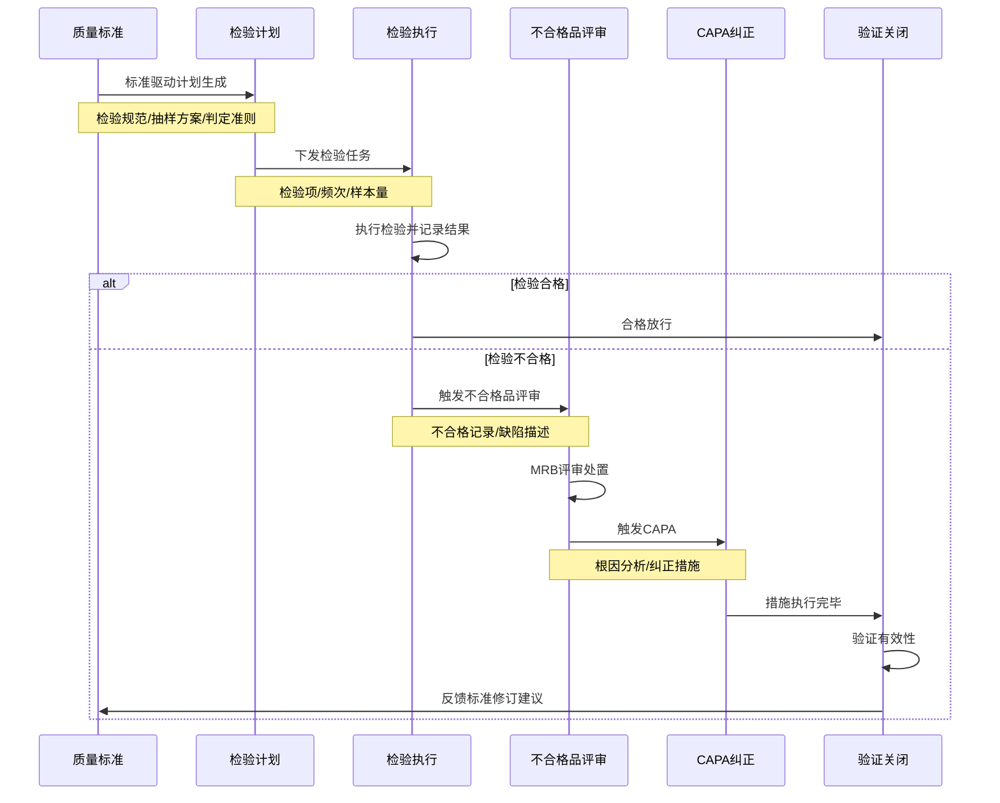
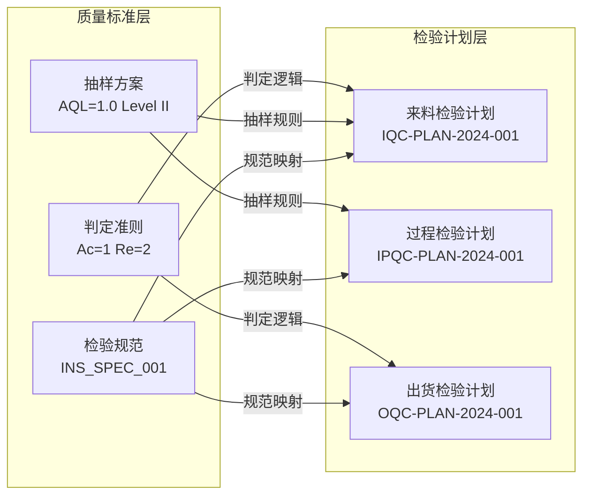
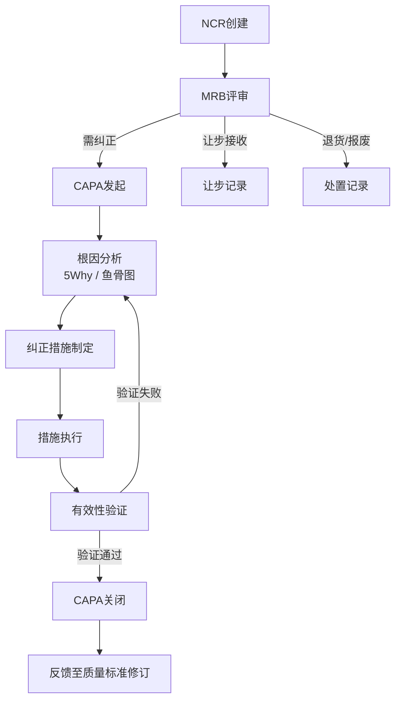
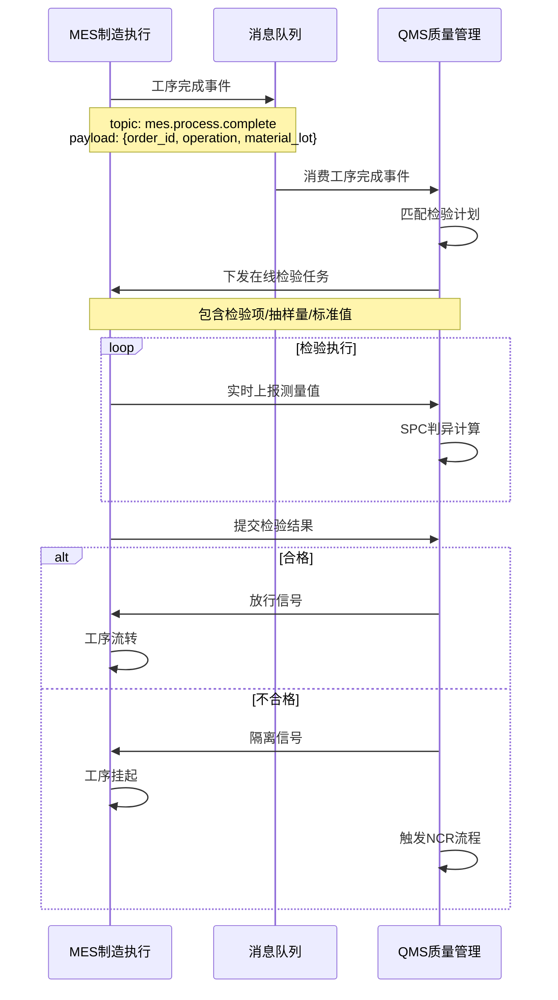
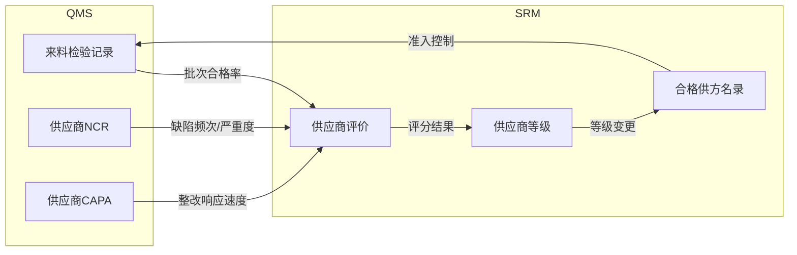
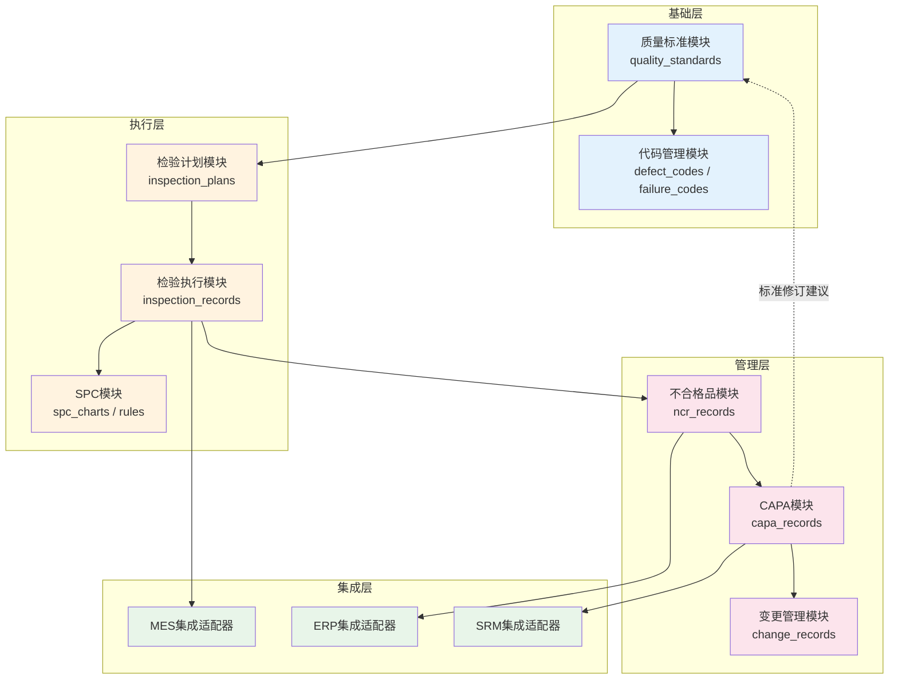

# QMS模块联动与数据流

## 质量闭环全景

QMS系统的核心价值在于构建从"标准定义"到"验证关闭"的完整质量闭环。数据在各模块间流转，每一步都为下一步提供输入，最终形成PDCA循环。以下是质量闭环的完整数据流：



## 模块接口定义

各模块之间的接口是数据流转的关键节点。下表定义了QMS内部模块间的完整接口关系：

| 源模块 | 目标模块 | 接口名称 | 传输数据 | 触发条件 |
|--------|----------|----------|----------|----------|
| 质量标准 | 检验计划 | 标准下发 | 检验规范ID、检验项列表、判定准则 | 标准发布/修订版本生效 |
| 检验计划 | 检验执行 | 任务派发 | 计划ID、检验项、样本量、频次 | 计划激活/定时触发 |
| 检验执行 | 不合格品 | 缺陷上报 | 检验记录ID、缺陷描述、不合格数量 | 判定结果=不合格 |
| 不合格品 | CAPA | 纠正发起 | NCR编号、缺陷分类、评审结论 | MRB决定需纠正 |
| CAPA | 质量标准 | 标准修订 | 措施描述、根因分析、修订建议 | CAPA验证关闭 |
| 检验执行 | SPC | 数据推送 | 测量值、样本组、时间戳 | 检验结果实时录入 |
| SPC | 不合格品 | 判异告警 | 控制图异常点、判异规则编号 | 触发Western Electric规则 |

## 质量标准驱动检验计划

质量标准是整个质量闭环的起点。标准定义了"检什么、怎么检、判定标准是什么"，检验计划根据标准自动生成：



**驱动逻辑伪代码：**

```python
def generate_inspection_plan(spec_id: str, material_group: str) -> InspectionPlan:
    """根据质量标准自动生成检验计划"""
    spec = QualitySpec.get(spec_id)

    plan = InspectionPlan(
        plan_id=generate_id("IP"),
        spec_id=spec_id,
        inspection_type=spec.inspection_type,  # IQC/IPQC/OQC
        items=[
            InspectionItem(
                characteristic=char.characteristic,
                method=char.method,
                sample_size=calculate_sample(
                    lot_size=spec.lot_size,
                    aql=spec.aql,
                    level=spec.inspection_level
                ),
                acceptance=char.acceptance_criteria.accept,
                rejection=char.acceptance_criteria.reject,
            )
            for char in spec.characteristics
        ],
        frequency=spec.frequency,
        status="ACTIVE"
    )
    plan.save()
    return plan
```

## 检验结果触发不合格品评审

当检验执行产生不合格结果时，系统自动触发不合格品评审流程。触发机制包含自动触发和人工触发两种模式：

```python
class InspectionResultHandler:
    """检验结果处理器 - 负责不合格品评审的自动触发"""

    def on_result_submitted(self, record: InspectionRecord):
        if record.judgment == "REJECT":
            # 自动创建NCR
            ncr = NCR.create(
                source_record_id=record.id,
                defect_description=record.defect_description,
                defect_quantity=record.defect_quantity,
                severity=self._classify_severity(record),
                auto_triggered=True
            )
            # 通知MRB评审委员会
            self._notify_mrb(ncr)
            # 隔离不合格品
            self._isolate_material(record.material_id, record.lot_id)

    def _classify_severity(self, record: InspectionRecord) -> str:
        """根据缺陷严重度分类"""
        critical_chars = ["尺寸超差", "功能失效", "安全项"]
        if any(c in record.defect_description for c in critical_chars):
            return "CRITICAL"
        elif record.defect_rate > 0.1:
            return "MAJOR"
        return "MINOR"
```

## 不合格品触发CAPA

不合格品评审完成后，若MRB决定需要采取纠正措施，系统自动生成CAPA任务：



**CAPA触发接口：**

```json
{
  "trigger_type": "NCR_MRB_DECISION",
  "source_ncr_id": "NCR-2024-0089",
  "capa_category": "CORRECTIVE",
  "root_cause_required": true,
  "due_date": "2024-04-15",
  "owner": "quality_engineer_01",
  "mrb_decision": {
    "disposition": "REWORK_WITH_CAPA",
    "severity": "MAJOR",
    "affected_quantity": 150,
    "defect_type": "尺寸超差"
  }
}
```

## CAPA验证关闭循环

CAPA验证关闭是质量闭环的最后一步，也是最重要的一步。验证不仅要确认措施已执行，还要确认措施确实有效：

```python
class CAPAVerificationService:
    """CAPA验证服务"""

    def verify_capa(self, capa_id: str, verification: VerificationData) -> VerificationResult:
        capa = CAPA.get(capa_id)

        # 1. 检查措施是否全部执行
        if not capa.all_actions_completed():
            return VerificationResult(status="FAILED", reason="纠正措施未全部执行")

        # 2. 检查有效性证据
        if not verification.effectiveness_evidence:
            return VerificationResult(status="FAILED", reason="缺少有效性证据")

        # 3. 统计验证 - 对比改善前后的数据
        before_data = self._get_inspection_data_before(capa.source_ncr_id)
        after_data = self._get_inspection_data_after(capa.effective_date)

        improvement = self._calculate_improvement(before_data, after_data)
        if improvement < capa.target_improvement:
            return VerificationResult(
                status="FAILED",
                reason=f"改善率{improvement:.1%}未达目标{capa.target_improvement:.1%}"
            )

        # 4. 验证通过 - 关闭CAPA
        capa.status = "CLOSED"
        capa.verification_result = "EFFECTIVE"
        capa.verified_by = verification.verifier
        capa.verified_date = datetime.now()
        capa.save()

        # 5. 反馈至质量标准
        if capa.standard_revision_suggested:
            self._suggest_standard_revision(capa)

        return VerificationResult(status="PASSED", improvement=improvement)
```

## 与MES联动：在线质检实时同步

QMS与MES的联动是制造企业质量管控的核心集成点，实现检验任务从派发到结果回传的实时同步：



**MES联动接口定义：**

| 接口 | 方向 | 协议 | 说明 |
|------|------|------|------|
| 工序完成通知 | MES→QMS | Kafka | 工序完工时自动推送，触发检验任务生成 |
| 检验任务下发 | QMS→MES | REST API | 向MES推送检验任务，MES工位展示检验项 |
| 测量值上报 | MES→QMS | WebSocket | 实时上报测量数据，QMS侧SPC实时计算 |
| 质量判定结果 | QMS→MES | REST API | 合格放行/不合格隔离，MES据此控制工序流转 |

## 与ERP联动：QM通知

QMS与ERP的质量管理模块(QM)联动，实现质量通知的创建与追踪：

```python
class ERPQMIntegration:
    """QMS与ERP QM模块集成"""

    def create_qm_notification(self, ncr: NCR) -> str:
        """将NCR同步为ERP QM通知"""
        payload = {
            "notification_type": "Q3",  # Q3=内部质量问题
            "priority": self._map_priority(ncr.severity),
            "material": ncr.material_code,
            "batch": ncr.lot_number,
            "defect_text": ncr.defect_description,
            "catalog_profile": "QM-001",
            "defect_items": [
                {
                    "defect_code": defect.code,
                    "defect_text": defect.description,
                    "quantity": defect.quantity,
                    "unit": defect.unit
                }
                for defect in ncr.defects
            ]
        }
        response = erp_client.post("/api/qm/notification", json=payload)
        return response.json()["notification_number"]

    def sync_capa_status(self, capa: CAPA):
        """CAPA状态变更同步至ERP"""
        erp_client.patch(
            f"/api/qm/notification/{capa.erp_notification_id}",
            json={
                "status": self._map_capa_status(capa.status),
                "tasks": [
                    {"task_id": t.id, "status": t.status, "completed_date": t.completed_date}
                    for t in capa.actions
                ]
            }
        )
```

## 与SRM联动：供应商质量评价

QMS与SRM的联动将来料质量数据纳入供应商评价体系，实现质量驱动的供应商管理：



**供应商质量评价指标计算：**

```python
def calculate_supplier_quality_score(supplier_id: str, period: DateRange) -> QualityScore:
    """计算供应商质量评分"""
    # 来料批次合格率 (权重40%)
    iqc_records = IQCRecord.filter(
        supplier_id=supplier_id,
        inspection_date__range=period
    )
    batch_pass_rate = iqc_records.filter(judgment="PASS").count() / iqc_records.count()

    # NCR频次与严重度 (权重30%)
    ncrs = NCR.filter(supplier_id=supplier_id, created_date__range=period)
    ncr_score = max(0, 100 - ncrs.count() * 10 - sum(n.severity_weight for n in ncrs))

    # CAPA响应速度 (权重20%)
    capas = CAPA.filter(supplier_id=supplier_id, created_date__range=period)
    avg_response_days = capas.aggregate(avg=Avg("response_days"))["avg"] or 0
    capa_score = max(0, 100 - avg_response_days * 5)

    # 质量改进趋势 (权重10%)
    improvement_trend = calculate_improvement_trend(supplier_id, period)

    total_score = (
        batch_pass_rate * 40 +
        ncr_score * 0.3 +
        capa_score * 0.2 +
        improvement_trend * 10
    )

    return QualityScore(
        supplier_id=supplier_id,
        period=period,
        total_score=total_score,
        grade="A" if total_score >= 90 else "B" if total_score >= 75 else "C" if total_score >= 60 else "D"
    )
```

## 开发者视角：模块依赖图

从开发者视角看QMS各模块的代码依赖关系和数据依赖关系：



## 开发者实战Tips

1. **事件驱动解耦**：QMS模块间采用事件驱动架构，通过消息队列(Kafka/RabbitMQ)实现异步通信。建议为每个状态变更事件定义明确的事件Schema，使用Schema Registry保证兼容性。

2. **幂等性设计**：检验结果推送、NCR触发等接口必须设计为幂等，避免网络重试导致重复创建。使用`source_id + event_type`作为幂等键。

3. **数据一致性**：QMS与MES/ERP存在跨系统数据同步，建议采用Outbox Pattern——先写本地事务表，再由CDC线程异步推送，确保数据不丢失。

4. **质量闭环超时告警**：为CAPA各阶段设置SLA，超时自动升级通知。建议使用定时任务扫描即将超时的CAPA，提前预警。

5. **版本化标准管理**：质量标准变更时，正在执行的检验计划应继续使用旧版本标准，新计划使用新版本。标准与计划之间通过版本号关联，避免中途变更导致判定不一致。
