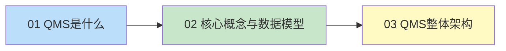

# QMS系统概述

本章节从QMS的基本定义出发，系统阐述QMS与MES质量模块的边界、核心数据模型与业务概念，以及QMS系统的整体功能架构与技术架构设计。

```mermaid
graph LR
    A[01 QMS是什么] --> B[02 核心概念与数据模型]
    B --> C[03 QMS整体架构]
    style A fill:#bbdefb
    style B fill:#c8e6c9
    style C fill:#fff9c4
```
