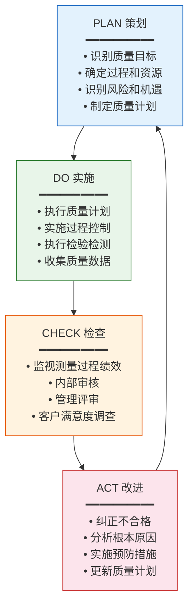
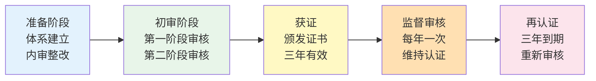

# ISO 9001与质量体系

## ISO 9001:2015核心条款解读

ISO 9001:2015是国际标准化组织发布的质量管理体系标准，采用高阶结构（HLS），共有10个章节。其中第4-10章是对组织的核心要求：

### 第4章：组织环境

组织需要理解其内外部环境，确定影响QMS的相关方需求，明确QMS的范围和过程。

- **外部环境**：法规、市场、技术、文化等宏观因素
- **内部环境**：组织架构、资源、文化、绩效等微观因素
- **相关方**：客户、供应商、员工、股东、监管机构
- **过程方法**：将QMS视为相互关联的过程系统，而非孤立条款

### 第5章：领导作用

最高管理者必须对QMS的有效性承担责任，这是ISO 9001:2015的重要变化——从"管理者代表"升级为"最高管理者直接负责"。

- **质量方针**：与组织战略方向一致，包含持续改进和满足要求的承诺
- **岗位职责**：确保各岗位的职责和权限得到分配和沟通
- **以顾客为关注焦点**：确保顾客要求得到确定和满足

### 第6章：策划

策划章节要求组织基于风险思维制定应对措施和质量目标。

- **风险和机遇**：识别可能影响QMS绩效的风险和机遇，制定应对措施
- **质量目标**：在相关职能、层次和过程上建立可测量的质量目标
- **变更策划**：有计划地进行变更，避免变更带来的负面影响

### 第7章：支持

支持章节涵盖资源、能力、意识、沟通和文件化信息。

- **资源**：基础设施、过程运行环境、监视测量资源、知识
- **能力**：确保从事影响质量工作的人员具备相应能力
- **意识**：人员知晓质量方针、自身贡献和偏离的后果
- **文件化信息**：QMS所需的文件化信息，包括创建、更新和控制

### 第8章：运行

运行章节覆盖从产品要求确定到交付后活动的全过程。

- **产品和服务要求**：客户要求评审、变更控制
- **设计和开发**：设计策划、输入、输出、评审、验证、确认、变更
- **生产和服务提供**：受控条件、标识和可追溯性、顾客/外部供方财产、防护、交付后活动
- **放行**：产品和服务放行的准则和权限
- **不合格品**：不合格的识别、隔离和处置

### 第9章：绩效评价

- **监视和测量**：客户满意度、QMS绩效、过程绩效
- **内部审核**：按策划间隔进行内审，确保QMS符合标准要求和组织自身要求
- **管理评审**：最高管理者按策划间隔评审QMS的适宜性、充分性和有效性

### 第10章：改进

- **不合格与纠正措施**：识别不合格、确定原因、采取措施、评审有效性
- **持续改进**：持续改进QMS的适宜性、充分性和有效性

## 质量手册与程序文件

ISO 9001:2015不再强制要求质量手册，但大多数组织仍保留质量手册作为QMS的纲领性文件。典型的质量体系文件架构如下：

| 层级 | 文件类型 | 说明 | 示例 |
|------|---------|------|------|
| 第1层 | 质量手册 | QMS的总体描述 | 质量方针、组织架构、过程关系 |
| 第2层 | 程序文件 | 规定"谁做、做什么、何时做" | 不合格品控制程序、纠正预防措施程序 |
| 第3层 | 作业指导书 | 规定"怎么做" | 检验作业指导书、设备操作规程 |
| 第4层 | 记录表单 | 证明活动已完成的证据 | 检验记录、内审检查表、CAPA记录 |

**QMS系统中的文件管理**：现代QMS系统将传统纸质文件管理数字化，实现文件创建→审批→发布→变更→废止的全生命周期管理，确保现场使用的始终是最新有效版本。

## 过程方法（PDCA）

ISO 9001:2015强调过程方法，即将活动作为相互关联、功能连贯的过程系统来理解和管理。PDCA循环是过程方法的核心工具：

PDCA在QMS各层级的应用：

| 应用层级 | PLAN | DO | CHECK | ACT |
|---------|------|-----|-------|-----|
| 战略层 | 质量方针与目标 | 体系推行 | 管理评审 | 战略调整 |
| 管理层 | 过程策划 | 过程执行 | 内审/绩效评估 | 纠正预防 |
| 操作层 | 检验计划 | 检验执行 | 结果判定 | 不合格处置 |

## 基于风险的思维

ISO 9001:2015将"预防措施"升级为"基于风险的思维"，要求组织在整个QMS中贯穿风险意识：

| 传统方式 | 基于风险的思维 |
|---------|-------------|
| 单独的"预防措施"条款 | 风险思维贯穿所有条款 |
| 事后预防 | 事前识别和策划 |
| 关注已发生的问题 | 关注可能发生的问题 |
| 被动应对 | 主动管理 |

**风险评价矩阵**：

| 可能性 \\ 严重度 | 低 | 中 | 高 |
|----------------|----|----|-----|
| 高 | 中等风险 | 高风险 | 极高风险 |
| 中 | 低风险 | 中等风险 | 高风险 |
| 低 | 可忽略 | 低风险 | 中等风险 |

## 文件化信息管理

### 记录控制

质量记录是证明QMS有效运行的客观证据，QMS系统需要实现：

- **创建**：按标准格式记录，确保完整性
- **保护**：防止未经授权的访问和修改
- **检索**：支持多维度快速检索
- **保存**：按法规要求的保存期限存储
- **处置**：到期记录的安全销毁

### 文件控制

- **版本管理**：每次变更产生新版本，旧版本归档
- **审批流程**：编制→审核→批准→发布
- **分发控制**：确保使用点获得最新有效版本
- **变更管理**：变更申请→影响评估→审批→实施→验证

## 内审与管理评审

### 内部审核

内审是组织自我检查QMS符合性和有效性的重要机制：

| 要素 | 要求 |
|------|------|
| 审核频次 | 按策划间隔，通常每年覆盖所有过程 |
| 审核员 | 独立于被审核活动，具备审核能力 |
| 审核方案 | 基于过程重要性和以往审核结果策划 |
| 审核发现 | 不符合项、观察项、良好实践 |
| 纠正措施 | 对不符合项采取纠正措施并验证有效性 |

### 管理评审

管理评审是最高管理者对QMS的系统性评价：

- **评审输入**：审核结果、客户反馈、过程绩效、不合格、纠正措施、以往评审跟踪、变更、改进机会
- **评审输出**：QMS改进决策、资源需求、质量目标调整

## 认证流程

ISO 9001认证通常经过以下阶段：

| 认证阶段 | 时间 | 审核内容 |
|---------|------|---------|
| 第一阶段审核 | 1-2天 | 文件审核、现场了解、审核策划 |
| 第二阶段审核 | 2-5天 | 全过程审核、符合性验证 |
| 监督审核（第1年） | 1-2天 | 部分过程审核 |
| 监督审核（第2年） | 1-2天 | 部分过程审核 |
| 再认证审核 | 2-5天 | 全面审核 |

## 真实案例：汽车行业IATF 16949附加要求

IATF 16949是在ISO 9001基础上增加了汽车行业特定要求的QMS标准，主要附加要求包括：

| 附加要求 | 说明 |
|---------|------|
| 过程审核（VDA 6.3） | 对制造过程进行系统审核 |
| 产品审核 | 对产品特性进行系统检验 |
| APQP/PPAP | 产品质量先期策划和生产件批准 |
| FMEA | 设计和过程失效模式与影响分析 |
| MSA | 测量系统分析 |
| SPC | 统计过程控制 |
| 客户特定要求 | 各OEM的附加质量要求（CSR） |
| 二方审核 | 客户对供应商的审核 |
| 供应商质量管理 | 供应商开发、评价、绩效监控 |
| 防错 | 系统性地识别和实施防错措施 |
| 保修管理 | 售后质量数据分析和改进 |
| 应急计划 | 供应链中断的应急方案 |

IATF 16949的核心工具链通常被称为"五大核心工具"：APQP、PPAP、FMEA、MSA、SPC，它们共同支撑汽车行业从产品设计到量产的质量保证体系。

## 总结

ISO 9001:2015是QMS的理论基础和合规框架，其核心思想是过程方法和基于风险的思维。PDCA循环贯穿QMS的所有层级，内审和管理评审是体系自我完善的机制。对于汽车等特殊行业，在ISO 9001基础上的行业附加要求（如IATF 16949的五大核心工具）进一步强化了质量保证体系。下一章将深入不合格品管理与CAPA的闭环流程。
